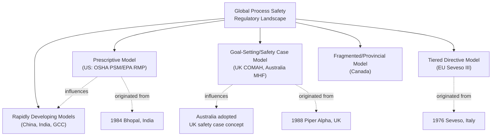

## International and Regional Regulatory Variations

### Overview

While the US (OSHA PSM/EPA RMP) and EU (Seveso III) frameworks anchor most process safety curricula, process safety regulation varies significantly across other major industrial regions in structure, enforcement philosophy, and scope. Multinational organizations operating facilities across jurisdictions must navigate materially different regulatory architectures — from UK's safety case regime to Australia's harmonized WHS laws to varying degrees of maturity across Asia-Pacific and other emerging industrial economies.

### United Kingdom: COMAH and the Safety Case Regime

**Key Points**

- The **Control of Major Accident Hazards Regulations (COMAH)**, currently COMAH 2015, implements Seveso III requirements in UK domestic law, having originated as the UK's Seveso transposition prior to Brexit and continuing to closely mirror Seveso III's structure as independent UK regulation post-EU exit.
- The UK's broader regulatory philosophy — extending beyond COMAH to offshore oil and gas — is characterized by the **"safety case" regime**, established following the Cullen Inquiry into the 1988 Piper Alpha disaster.
- Under the safety case approach, operators must proactively demonstrate — through a comprehensive documented safety case — that major hazards have been identified and risks reduced to **As Low As Reasonably Practicable (ALARP)**, rather than simply demonstrating compliance with prescriptive rules.
- The UK's **Health and Safety Executive (HSE)** administers both COMAH and offshore safety case regulation, providing a more unified regulatory structure than the US's split between OSHA (worker safety) and EPA (environmental/community).

### Australia: Harmonized Work Health and Safety (WHS) Laws

**Key Points**

- Australia operates under a **model Work Health and Safety Act**, developed to harmonize occupational safety regulation across states and territories, though implementation and enforcement remain the responsibility of individual state/territory regulators (e.g., SafeWork NSW, WorkSafe Victoria), resulting in some jurisdictional variation despite the harmonized model legislation.
- Major hazard facilities are regulated under jurisdiction-specific **Major Hazard Facility (MHF)** regulations, requiring a Safety Case broadly analogous in concept to the UK's safety case regime — reflecting significant UK regulatory influence on Australian process safety architecture.
- Offshore petroleum safety is regulated separately by the **National Offshore Petroleum Safety and Environmental Management Authority (NOPSEMA)**, itself established following review processes that drew on lessons from Piper Alpha and other major offshore incidents internationally. [Inference] The precise regulatory lineage connecting NOPSEMA's establishment to specific international incidents involves multiple contributing reviews and should be verified against NOPSEMA's own published regulatory history for precise attribution.

### Canada: Provincial and Federal Fragmentation

**Key Points**

- Occupational safety and process safety regulation in Canada is primarily a **provincial/territorial responsibility**, resulting in significant variation across jurisdictions (e.g., Alberta's Occupational Health and Safety Act versus Ontario's equivalent), with federal jurisdiction limited to specific sectors (interprovincial transportation, federally regulated industries).
- Unlike the US's unified OSHA PSM standard, Canada lacks a single nationwide process safety management regulation comparable in scope; process safety requirements are addressed through a combination of provincial OHS legislation, environmental regulation, and industry-specific requirements, with some provinces (e.g., Alberta, given its oil and gas sector concentration) having more developed process-safety-specific regulatory attention than others.
- **CSA Group** (Canadian Standards Association) standards play a role analogous to NFPA in the US — consensus technical standards frequently incorporated by reference into provincial regulation.

### Asia-Pacific: Variable Maturity and Rapid Development

**Key Points**

- **China** has significantly strengthened work safety regulation following a series of high-profile industrial incidents, including the 2015 Tianjin port explosions (involving improperly stored hazardous chemicals), leading to revisions of China's Work Safety Law and increased regulatory enforcement attention on hazardous chemical storage and handling.
- **Japan** regulates industrial safety through the **Industrial Safety and Health Act**, with process safety-specific requirements addressed through high-pressure gas and fire service laws for hazardous material handling, reflecting a more fragmented regulatory structure than the unified PSM/Seveso models.
- **India**, notably the site of the Bhopal disaster that catalyzed much of the global process safety regulatory response, regulates major accident hazards through the **Manufacture, Storage and Import of Hazardous Chemicals (MSIHC) Rules**, administered under the Environment Protection Act, alongside state-level factory safety legislation.
- [Inference] Regulatory maturity and enforcement consistency vary considerably across Asia-Pacific economies, with some jurisdictions still developing comprehensive process-safety-specific frameworks comparable to PSM/Seveso III, though specific current maturity assessments would require jurisdiction-by-jurisdiction verification against current published regulatory status.

### Middle East: Emerging Frameworks Amid Rapid Industrialization

**Key Points**

- Gulf Cooperation Council (GCC) countries, given substantial oil and gas and petrochemical industry concentration, have increasingly adopted process safety management requirements often modeled on or directly referencing OSHA PSM, CCPS RBPS, or API standards, reflecting the significant presence of US and international operators and standards influence in the region.
- Regulatory enforcement mechanisms and maturity vary by country; national oil companies in the region frequently adopt process safety management systems aligned with international standards (RBPS, API) as internal corporate policy, in some cases exceeding local regulatory minimums given international joint-venture partner requirements.

### Comparative Regulatory Architecture Table

| Region/Country | Primary Framework | Regulatory Philosophy | Key Distinguishing Feature |
| --- | --- | --- | --- |
| United States | OSHA PSM + EPA RMP | Prescriptive, element-based | Split worker/community-environment regulatory ownership |
| European Union | Seveso III Directive | Tiered, risk-based with mandated land-use planning | Explicit domino-effect and land-use provisions |
| United Kingdom | COMAH + Safety Case regime | Goal-setting, ALARP-based | Proactive operator-demonstrated safety case |
| Australia | Harmonized WHS + MHF regulations | Goal-setting, UK-influenced Safety Case model | State/territory implementation of national model law |
| Canada | Provincial OHS legislation | Fragmented, provincially fragmented | No unified national PSM-equivalent standard |
| China | Work Safety Law (post-Tianjin revisions) | Increasingly prescriptive, enforcement-focused | Rapid post-incident regulatory strengthening |
| India | MSIHC Rules + state factory legislation | Prescriptive, Bhopal-legacy-influenced | Site of the incident that catalyzed global PSM development |

### Multinational Compliance Challenges

**Key Points**

1. **Divergent documentation requirements** — a safety case (UK/Australia model) and a PHA-based compliance program (US model) require substantially different documentation structures, complicating standardized global process safety management system design.
2. **Varying threshold quantities and substance lists** — the same chemical inventory may trigger coverage under one jurisdiction's regulatory thresholds but not another's, requiring facility-by-facility applicability determination.
3. **Land-use and siting differences** — EU-style mandated land-use planning integration has no direct US equivalent, creating different siting risk profiles for multinational capital project planning.
4. **Enforcement consistency variation** — regulatory enforcement rigor and inspection frequency vary substantially across jurisdictions, meaning formal regulatory compliance alone provides inconsistent assurance of actual risk management quality across a multinational portfolio.
5. **Common industry response** — many multinational process industry companies adopt CCPS RBPS or equivalent internal corporate process safety management system standards globally, using them as a consistent baseline that meets or exceeds the most stringent applicable local regulatory requirement at each facility, rather than managing to the local regulatory minimum in each jurisdiction independently.

**Conclusion**

Process safety regulation, while sharing common conceptual roots in the same landmark disasters (Bhopal, Seveso, Piper Alpha), has evolved into materially different national and regional architectures — ranging from the US's prescriptive element-based model, to the UK/Australia goal-setting safety case approach, to the EU's tiered directive with mandated land-use integration, to more fragmented or rapidly developing frameworks elsewhere. Multinational organizations typically address this variation by adopting a global internal process safety management standard (often CCPS RBPS-based) that meets or exceeds the most stringent locally applicable regulatory requirement, rather than attempting to manage disparate local-minimum compliance independently across every operating jurisdiction.

**Related Topics**

- UK Safety Case Regime: Detailed Content and Demonstration Requirements
- Australia's Major Hazard Facility Regulations and NOPSEMA Offshore Framework
- China's Post-Tianjin Work Safety Law Reforms
- India's MSIHC Rules and Bhopal Regulatory Legacy
- Designing a Global Process Safety Management System for Multinational Operations
- ALARP vs. Prescriptive Compliance: Philosophical Comparison of Regulatory Models