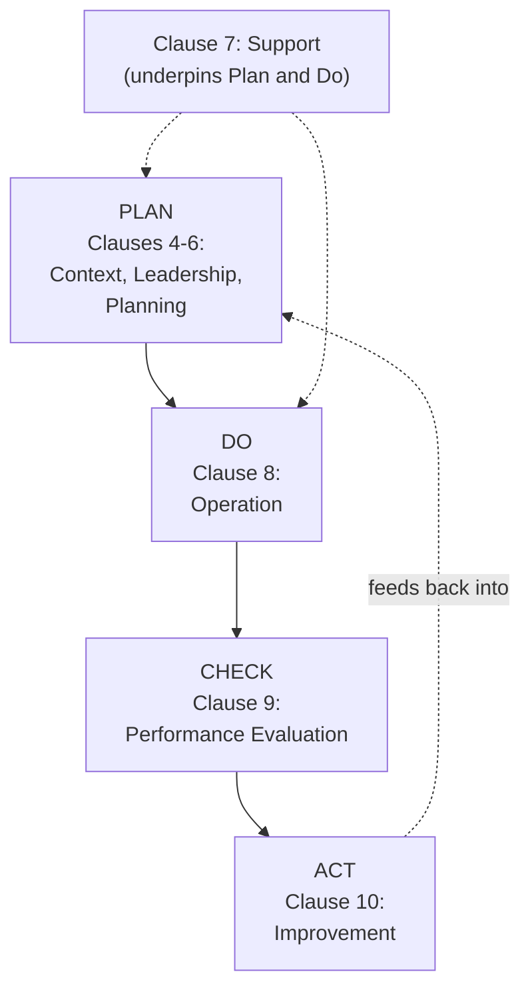
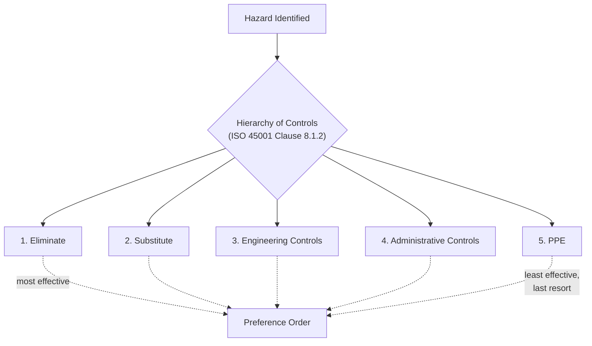

## Plan Do Check Act Cycle in ISO 45001

### Overview

ISO 45001:2018 (Occupational Health and Safety Management Systems — Requirements with Guidance for Use) is the international standard for OH&S management systems, having replaced OHSAS 18001. Its structure is explicitly built around the **Plan-Do-Check-Act (PDCA)** cycle, a continuous improvement model shared across ISO's high-level structure (also underlying ISO 9001 quality management and ISO 14001 environmental management), enabling integrated management system implementation across multiple ISO standards simultaneously.

### The PDCA Cycle Concept

**Key Points**

- Originally developed as a quality management concept (often attributed to Walter Shewhart and later popularized by W. Edwards Deming), PDCA provides an iterative four-stage cycle for continual improvement rather than a one-time implementation exercise.
- ISO 45001 maps its clause structure directly onto PDCA, meaning the standard's numbered clauses (4 through 10) correspond to specific cycle stages rather than being an arbitrary sequential list.
- The cycle is intended to repeat continuously: each iteration through Act feeds back into a refined Plan stage, producing ongoing OH&S performance improvement over time rather than a static, one-time-certified system.

### PLAN: Clauses 4, 5, and 6

#### Clause 4: Context of the Organization

**Key Points**

- Requires the organization to determine external and internal issues relevant to its purpose and affecting its ability to achieve intended OH&S outcomes.
- Requires identification of interested parties (workers, regulators, contractors, neighboring communities) and their relevant needs and expectations.
- Requires the organization to determine the scope of the OH&S management system, documented and available as information.

#### Clause 5: Leadership and Worker Participation

**Key Points**

- Places explicit accountability on top management, requiring demonstrated leadership and commitment — including taking overall responsibility and accountability for the prevention of work-related injury and ill health, not merely delegating OH&S to a designated function.
- Requires establishment of an **OH&S policy** appropriate to the organization's purpose, size, and context.
- Mandates **worker participation and consultation** — a structural requirement, not merely a recommended practice, requiring processes for non-managerial worker participation in hazard identification, incident investigation, and policy development.
- This clause represents a notable departure from OHSAS 18001, which addressed worker consultation less prescriptively; ISO 45001 explicitly requires removing or minimizing barriers to worker participation.

#### Clause 6: Planning

**Key Points**

- Requires the organization to determine risks and opportunities that need to be addressed to give assurance the OH&S management system can achieve its intended outcomes, prevent undesired effects, and achieve continual improvement.
- Requires a documented process for **hazard identification** and assessment of OH&S risks and other risks to the management system.
- Requires establishment of **OH&S objectives** at relevant functions and levels, along with documented plans to achieve them, including resources, responsibilities, timeframes, and evaluation methods.
- Requires planning for legal and other requirements applicable to the organization's hazards and OH&S risks.

### DO: Clauses 7 and 8

#### Clause 7: Support

**Key Points**

- Addresses resources, competence, awareness, communication, and documented information necessary to support the management system.
- Requires the organization to determine and provide resources needed for establishment, implementation, maintenance, and continual improvement of the OH&S management system.
- Requires competence determination for workers whose work affects OH&S performance, with documented evidence of competence.
- Requires internal and external communication processes relevant to the OH&S management system.

#### Clause 8: Operation

**Key Points**

- The core "doing" clause, addressing **operational planning and control** — establishing criteria for processes and implementing control of processes in accordance with those criteria.
- Requires a process for **eliminating hazards and reducing OH&S risks**, explicitly structured using the following hierarchy of controls (in descending order of preference):
  1. Eliminate the hazard
  2. Substitute with less hazardous processes, operations, materials, or equipment
  3. Use engineering controls and reorganization of work
  4. Use administrative controls, including training
  5. Use adequate personal protective equipment (PPE)
- Requires processes for **management of change**, addressing both permanent and temporary changes that impact OH&S performance — structurally similar in principle to process safety's MOC element, though scoped to occupational rather than process hazards.
- Requires **procurement** controls, ensuring OH&S requirements are addressed when procuring products, hazardous substances, raw materials, and services.
- Requires **contractor and outsourcing** controls, coordinating with contractors to identify hazards and assess/control risks arising from their activities.
- Requires **emergency preparedness and response** planning, including periodic testing.

### CHECK: Clause 9

#### Clause 9: Performance Evaluation

**Key Points**

- Requires the organization to determine what needs to be monitored and measured, methods for monitoring/measurement/analysis/evaluation, when this will be performed, and when results will be analyzed and evaluated.
- Requires evaluation of compliance with legal requirements and other requirements the organization subscribes to.
- Requires **internal audits** at planned intervals to provide information on whether the OH&S management system conforms to the organization's own requirements and this International Standard's requirements, and is effectively implemented and maintained.
- Requires **management review** at planned intervals, ensuring continuing suitability, adequacy, and effectiveness of the OH&S management system — directly feeding into the subsequent Act stage.

### ACT: Clause 10

#### Clause 10: Improvement

**Key Points**

- Requires the organization to determine opportunities for improvement and implement necessary actions to achieve intended outcomes of the OH&S management system.
- Requires a process for managing **incidents, nonconformities, and corrective action** — reacting to the incident/nonconformity, evaluating the need for action to eliminate root causes, implementing action needed, reviewing effectiveness, and making changes to the OH&S management system if necessary.
- Requires **continual improvement** of the suitability, adequacy, and effectiveness of the OH&S management system — explicitly closing the loop back into a revised Plan stage for the next PDCA iteration.

### ISO 45001 Clause Structure Mapped to PDCA

| PDCA Stage | ISO 45001 Clause | Content Focus |
| --- | --- | --- |
| Plan | 4. Context of the Organization | Internal/external issues, interested parties, scope |
| Plan | 5. Leadership and Worker Participation | Policy, roles, worker consultation |
| Plan | 6. Planning | Risk/opportunity determination, objectives |
| Do | 7. Support | Resources, competence, communication, documentation |
| Do | 8. Operation | Operational controls, hierarchy of controls, MOC, emergency preparedness |
| Check | 9. Performance Evaluation | Monitoring, audits, management review |
| Act | 10. Improvement | Incident/nonconformity management, continual improvement |

### Relationship to Process Safety Frameworks

**Key Points**

- ISO 45001's PDCA structure shares conceptual similarity with CCPS RBPS's four-pillar approach (Commit, Understand, Manage, Learn), though ISO 45001 is scoped specifically to occupational health and safety management systems, not process safety hazards — an organization handling PSM-covered processes typically maintains ISO 45001 (or equivalent) for occupational safety management alongside a separate process safety management system (RBPS or PSM-based) for process hazards.
- The hierarchy of controls embedded in Clause 8 is a widely-used hazard control concept also applied within process safety practice (e.g., inherently safer design's preference for elimination/substitution over add-on engineering and administrative controls), illustrating conceptual overlap even where the two management systems remain organizationally distinct.
- Organizations pursuing integrated management systems (combining ISO 45001, ISO 9001, and ISO 14001) benefit from PDCA's shared high-level structure across all three standards, enabling common audit cycles, documentation architecture, and management review processes.

### Certification Context

**Key Points**

- ISO 45001 is a certifiable standard — organizations may undergo third-party audit to achieve and maintain certification, though certification itself is voluntary unless contractually or customer-mandated.
- Replaced OHSAS 18001, with organizations previously certified to OHSAS 18001 having undergone a transition period to migrate to ISO 45001 certification following the standard's 2018 publication.

**Conclusion**

The Plan-Do-Check-Act cycle provides ISO 45001's foundational architecture, directly structuring the standard's clauses (4-6 for Plan, 7-8 for Do, 9 for Check, 10 for Act) around a continuous improvement philosophy rather than a static compliance checklist. This structure embeds worker participation, hierarchy-of-controls-based hazard management, and systematic performance evaluation into a repeating cycle explicitly designed to drive ongoing OH&S performance improvement, while its shared high-level structure with other ISO management system standards facilitates integrated management system implementation for organizations pursuing multiple certifications simultaneously.

**Related Topics**

- Hierarchy of Controls: Elimination Through PPE in Practice
- Worker Participation and Consultation Requirements Under ISO 45001
- ISO 45001 vs. OHSAS 18001: Key Structural Differences
- Integrated Management Systems: Combining ISO 45001, 9001, and 14001
- Management of Change Under ISO 45001 vs. Process Safety MOC
- Internal Audit and Management Review Cycles in OH&S Management Systems