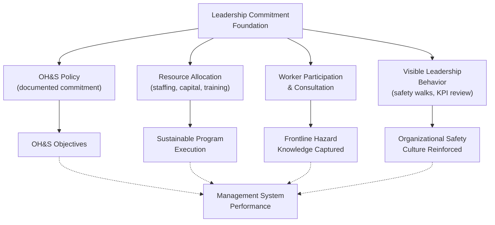

## Policy Development and Leadership Commitment

### Overview

An OH&S policy and demonstrated leadership commitment form the foundational layer upon which the entire management system rests — both in ISO 45001's Clause 5 requirements and in CCPS RBPS's "Commit to Process Safety" pillar. Without visible, sustained leadership engagement, technical program elements (procedures, audits, PHAs) tend to degrade over time, as illustrated repeatedly in major incident investigations where leadership disengagement from safety performance was identified as a contributing organizational factor.

### Why Leadership Commitment Is Foundational

**Key Points**

- Safety management systems are frequently described using a pyramid or foundation metaphor: technical elements (procedures, training, inspections) cannot function sustainably without leadership commitment providing resources, priority, and organizational accountability beneath them.
- [Inference] Investigations into incidents such as BP Texas City (2005) have been widely interpreted as identifying insufficient senior leadership engagement with process safety performance — as distinct from occupational safety performance, which the facility tracked closely — as a contributing organizational factor, though the specific analytical weight assigned to this factor varies across different published investigation reports.
- Leadership commitment is not a one-time declaration; both ISO 45001 and CCPS RBPS frame it as an ongoing, demonstrated behavior requiring visible action (resource allocation, personal involvement, response to safety concerns) rather than a signed policy document alone.

### OH&S Policy Requirements (ISO 45001 Clause 5.2)

**Key Points**

- The policy must be appropriate to the purpose, size, and context of the organization, and to the specific nature of its OH&S risks and opportunities.
- Must provide a framework for setting OH&S objectives.
- Must include a commitment to:
  - Provide safe and healthy working conditions for the prevention of work-related injury and ill health
  - Fulfil legal requirements and other applicable requirements
  - Eliminate hazards and reduce OH&S risks (per the hierarchy of controls)
  - Continual improvement of the OH&S management system
  - Consultation and participation of workers, and of workers' representatives where they exist

**Key Points**

- The policy must be documented, communicated within the organization, available to interested parties as appropriate, and relevant and appropriate.
- ISO 45001 explicitly requires the policy to be maintained as documented information — not merely stated verbally or informally — ensuring it can be audited and reviewed.

### Elements of Effective Leadership Commitment

#### Visible and Active Leadership

**Key Points**

- Top management must take overall responsibility and accountability for prevention of work-related injury and ill health, and for provision of safe and healthy workplaces and activities — a direct, non-delegable accountability under ISO 45001 Clause 5.1.
- Common demonstrated practices include: leadership participation in safety walks/observations, personal review of process safety and occupational safety performance indicators, visible response to reported hazards or near misses, and consistent prioritization of safety over production pressure in observable decision-making.
- [Inference] The specific behavioral practices most effective for demonstrating leadership commitment are described inconsistently across different industry guidance documents and academic safety culture literature; organizations should reference their own applicable standards (CCPS RBPS Process Safety Culture element, ISO 45001 Clause 5) rather than assuming a single universal checklist.

#### Resource Allocation

**Key Points**

- Genuine commitment requires providing resources needed for establishment, implementation, maintenance, and continual improvement of the management system (ISO 45001 Clause 7.1) — including staffing, capital investment in safety-critical equipment, and training budget.
- A recurring theme in incident investigations (Texas City, Deepwater Horizon) involves examination of whether cost-cutting or resource constraint decisions prior to the incident affected process safety-critical maintenance, staffing, or inspection activities.

#### Worker Participation and Consultation

**Key Points**

- ISO 45001 Clause 5.4 mandates processes for consultation and participation of non-managerial workers in developing, planning, implementing, evaluating, and improving the OH&S management system — not merely informing workers of decisions already made.
- Requires organizations to provide mechanisms, time, training, and resources necessary for worker participation, and to remove or minimize barriers to participation (e.g., language barriers, fear of reprisal, inaccessible meeting formats).
- CCPS RBPS parallels this with its distinct "Workforce Involvement" element under the Commit to Process Safety pillar, reflecting shared recognition that frontline operational knowledge is a critical input rather than a compliance formality.

#### Setting the Tone: Safety vs. Production Tension

**Key Points**

- A recurring failure pattern identified in major incident investigations involves organizational tolerance of shortcuts, deviations, or deferred maintenance under production or schedule pressure — a dynamic leadership commitment is specifically intended to counteract.
- Effective leadership commitment includes establishing and reinforcing clear expectations that safety-critical decisions (e.g., delaying startup pending PHA action item closure, shutting down for unplanned maintenance) will be supported even at production cost.
- CCPS explicitly frames "Process Safety Culture" as encompassing the organization's demonstrated priority for process safety relative to competing business objectives, particularly observable during periods of schedule or cost pressure.

### Policy Development Process

**Key Points**

1. **Context assessment** — review internal/external issues and interested party expectations (linking to ISO 45001 Clause 4) to ensure the policy reflects the organization's actual risk profile and stakeholder landscape.
2. **Draft policy statement** — typically developed collaboratively between senior leadership and OH&S/process safety professionals, incorporating required commitment elements (legal compliance, hazard elimination, worker participation, continual improvement).
3. **Worker and stakeholder input** — consultation with worker representatives during drafting, consistent with the participation principle the policy itself will commit the organization to.
4. **Leadership endorsement and signature** — formal top management approval, typically involving the most senior accountable executive (CEO, site manager, or equivalent), signaling personal accountability.
5. **Communication and accessibility** — distribution throughout the organization in accessible formats and languages, with mechanisms to confirm workforce awareness and understanding (not merely posting).
6. **Periodic review** — policy review at planned intervals (often aligned with management review cycles) to confirm continued relevance to organizational context and risk profile.

### Distinguishing Policy from Culture

**Key Points**

- A documented OH&S policy is a necessary but not sufficient condition for effective safety performance — the policy is the formal declaration, while safety culture is the lived, demonstrated set of organizational values and behaviors that determine whether the policy's commitments are actually honored in daily operational decisions.
- [Inference] This distinction is widely emphasized in process safety and OH&S literature as explaining why organizations with well-written policies can still experience significant safety failures if leadership behavior and organizational incentives do not align with the stated policy commitments; the precise mechanisms connecting policy to culture are, however, actively studied rather than definitively settled.

### Leadership Commitment Across Frameworks

| Framework | Leadership Element | Key Requirement |
| --- | --- | --- |
| ISO 45001 | Clause 5: Leadership and Worker Participation | Top management accountability, documented policy, worker consultation |
| CCPS RBPS | Pillar 1, Element 1: Process Safety Culture | Organizational values/behaviors prioritizing process safety |
| CCPS RBPS | Pillar 1, Element 4: Workforce Involvement | Structured mechanisms for worker input |
| OSHA PSM | Element 1: Employee Participation | Written plan for employee consultation |
| UK Safety Case Regime | Implicit throughout | Operator-demonstrated ALARP commitment |

**Conclusion**

Policy development and leadership commitment function as the structural foundation for both occupational safety (ISO 45001) and process safety (CCPS RBPS) management systems, requiring far more than a signed policy statement — genuine commitment demands sustained resource allocation, visible and active leadership behavior, structured worker participation, and consistent organizational prioritization of safety over competing production pressures. Recurring findings across major incident investigations consistently point back to gaps in this foundational layer, reinforcing why both major international standards frameworks treat leadership commitment not as a preliminary formality but as an ongoing, auditable, and continuously reinforced management system requirement.

**Related Topics**

- Process Safety Culture: Assessment and Improvement Methods
- Worker Participation Mechanisms: Committees, Observations, and Consultation
- Management Review Cycles and Leadership Accountability
- Balancing Production Pressure and Safety-Critical Decision-Making
- Policy Communication Strategies for Multilingual/Multi-Site Organizations
- Safety Culture Maturity Models and Assessment Tools