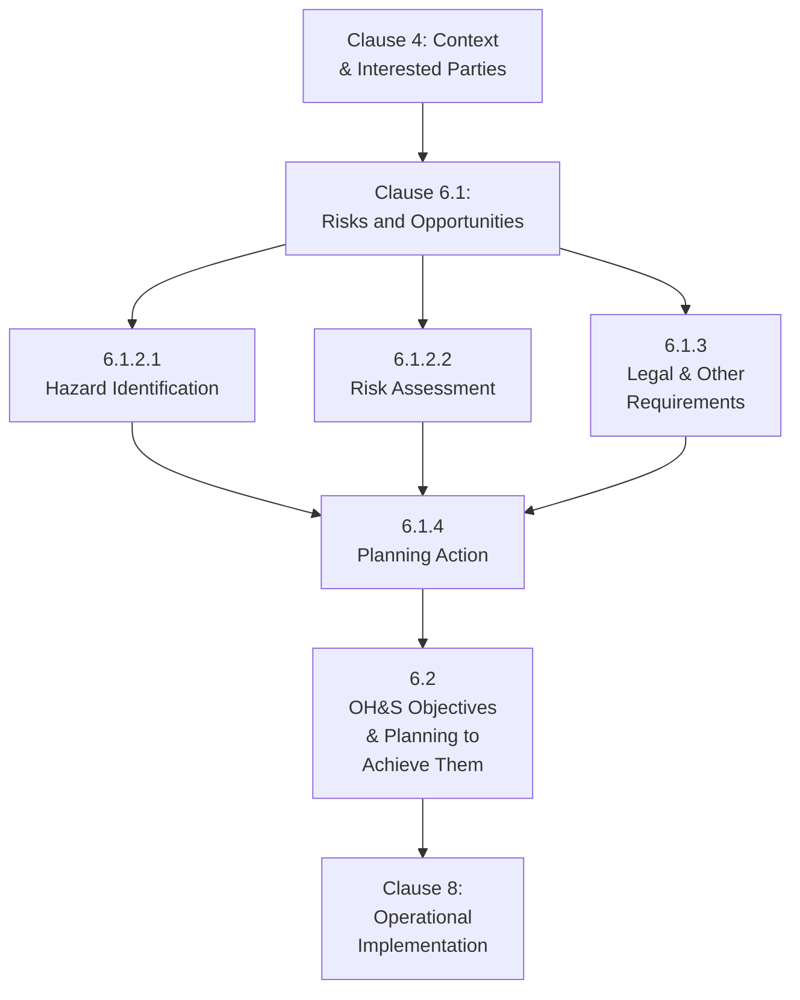

## Planning Objectives and Legal Requirements

### Overview

Clause 6 of ISO 45001 ("Planning") establishes the systematic process by which organizations identify risks and opportunities, determine legal and other requirements, and set measurable OH&S objectives — forming the connective structure between the organizational context/leadership commitment established in Clauses 4-5 and the operational controls implemented in Clause 8. This planning function is where high-level policy commitments translate into specific, resourced, trackable actions.

### Actions to Address Risks and Opportunities (Clause 6.1)

**Key Points**

- Requires the organization to consider the issues identified under Clause 4 (context), the requirements of interested parties, and the scope of the management system when planning the OH&S management system.
- Requires determination of risks and opportunities that need to be addressed to: give assurance the OH&S management system can achieve its intended outcomes, prevent or reduce undesired effects, and achieve continual improvement.
- Distinguishes between several categories of risk/opportunity the planning process must address:
  - **OH&S risks and opportunities** — arising from hazards to workers
  - **Other risks and opportunities** — related to the effectiveness of the management system itself (e.g., risks to achieving intended outcomes from organizational change, resourcing decisions)
  - **Legal requirements and other requirements** — applicable compliance obligations

### Hazard Identification (Clause 6.1.2.1)

**Key Points**

- Requires a proactive, ongoing process (not a one-time exercise) for hazard identification, accounting for:
  - Routine and non-routine activities and situations, including hazards arising from infrastructure, equipment, materials, and changing conditions
  - Human factors, including capabilities, limitations, and other human characteristics relevant to hazard identification
  - New or changed hazards arising from changes, or from proposed changes, in operations, processes, activities, or the OH&S management system itself
  - Past relevant incidents, internal or external to the organization, including emergencies and their causes
  - Emergency situations
  - People, including consideration of those with access to the workplace and their activities (workers, contractors, visitors, and others in the vicinity who could be affected)
  - How work is organized and social factors (workload, work hours, victimization, harassment, bullying)
  - Design of work areas, processes, installations, machinery/equipment, operating procedures, and work organization

### Assessment of OH&S Risks and Other Risks (Clause 6.1.2.2)

**Key Points**

- Requires the organization to assess OH&S risks from identified hazards, taking into account the effectiveness of existing controls.
- Requires assessment of other risks related to the establishment, implementation, operation, and maintenance of the OH&S management system.
- ISO 45001 does not prescribe a specific risk assessment methodology, allowing organizations to select methods appropriate to their context — ranging from simple qualitative risk matrices for lower-hazard workplaces to more sophisticated quantitative techniques for higher-hazard operations.

### Legal Requirements and Other Requirements (Clause 6.1.3)

**Key Points**

- Requires the organization to establish, implement, and maintain a process to determine and have access to up-to-date legal requirements and other requirements applicable to its hazards, OH&S risks, and OH&S management system.
- "Other requirements" extends beyond statutory law to include: agreements with employees/worker representatives, requirements of interest groups, voluntary principles/codes of practice, corporate/organizational requirements, and contractual requirements.
- Requires the organization to determine how these legal and other requirements apply to the organization and what needs to be communicated.
- Requires the organization to take these requirements into account when establishing, implementing, maintaining, and continually improving the OH&S management system.
- Documented information regarding legal and other requirements must be maintained and kept up to date, given that legal requirements themselves change over time.

### Planning Action (Clause 6.1.4)

**Key Points**

- Requires the organization to plan actions to: address identified risks and opportunities, address legal and other requirements, prepare for and respond to emergency situations, and achieve OH&S objectives.
- Requires the organization to plan how to integrate and implement these actions into its OH&S management system processes or other business processes, and how to evaluate the effectiveness of these actions.
- When planning these actions, organizations must consider the **hierarchy of controls** and how outputs from the management system are used.

### OH&S Objectives and Planning to Achieve Them (Clause 6.2)

**Key Points**

- Requires establishment of OH&S objectives at relevant functions and levels, to maintain and continually improve the OH&S management system and OH&S performance.
- Objectives must be:
  - Consistent with the OH&S policy
  - Measurable (if practicable) or capable of performance evaluation
  - Take into account applicable requirements
  - Take into account results of risk/opportunity assessment
  - Take into account results of consultation with workers
  - Be monitored
  - Be communicated
  - Be updated as appropriate

**Planning to Achieve Objectives (Clause 6.2.2)**

For each OH&S objective, the organization must determine:

- What will be done
- What resources will be required
- Who will be responsible
- When it will be completed
- How results will be evaluated, including indicators for monitoring
- How actions to achieve OH&S objectives will be integrated into business processes

### Connection to Process Safety Planning Equivalents

**Key Points**

- ISO 45001's Clause 6 planning process shares strong conceptual overlap with process safety's Process Hazard Analysis (PHA) and risk-based prioritization concepts within CCPS RBPS, though ISO 45001 addresses occupational hazards broadly while PHA methodologies (HAZOP, What-If, LOPA) are specifically calibrated to process hazard identification.
- The "legal and other requirements" determination process parallels the applicability determination organizations must conduct for OSHA PSM, EPA RMP, and equivalent international process safety regulations — determining which specific regulatory thresholds and requirements apply to a given facility or process.
- Organizations managing both occupational and process safety typically maintain separate but coordinated legal requirements registers — one tracking OH&S-specific compliance obligations (ISO 45001-aligned), another tracking process-safety-specific regulatory obligations (PSM/RMP/Seveso-aligned) — given the different regulatory bodies, inspection regimes, and technical content involved.

### Measurable Objectives: Practical Examples

**Key Points**

- Effective OH&S objectives are typically framed using specific, time-bound, and measurable criteria rather than generic aspirational statements. Illustrative structural examples (not organization-specific targets):
  - Reduce a specified injury rate category by a defined percentage within a defined period
  - Achieve a defined completion rate for safety training within a defined period
  - Close a defined percentage of hazard/near-miss reports within a defined response timeframe
  - Achieve a defined reduction in a specific hazard category's incident frequency

[Inference] Specific target-setting methodologies (e.g., SMART objectives — Specific, Measurable, Achievable, Relevant, Time-bound) are commonly referenced in OH&S management guidance as a practical framework for satisfying ISO 45001's objective-setting requirements, though ISO 45001 itself does not mandate this specific acronym-based methodology by name.

### Legal Requirements Register: Structural Components

| Component | Purpose |
| --- | --- |
| Requirement source | Statute, regulation, permit condition, industry standard, contractual obligation |
| Applicability determination | Which facility/process/activity the requirement applies to |
| Specific obligation | What must be done to comply |
| Responsible party | Who within the organization owns compliance |
| Compliance evidence | Documentation demonstrating the requirement is met |
| Review/update trigger | Process for capturing regulatory changes over time |

**Conclusion**

ISO 45001's planning clause establishes the systematic bridge between organizational context and leadership commitment on one side, and operational implementation on the other — requiring structured hazard identification, risk assessment, legal requirement determination, and measurable objective-setting, all integrated into planned, resourced, and evaluable actions. This planning discipline parallels process safety's PHA and applicability determination processes, and organizations managing both occupational and process safety obligations typically maintain coordinated but distinct planning and legal requirements tracking systems to address the different regulatory and technical demands of each discipline.

**Related Topics**

- Hazard Identification Methodologies for Occupational Risk Assessment
- Legal Requirements Registers: Design and Maintenance Practices
- SMART Objectives Framework for OH&S Target Setting
- Integrating OH&S and Process Safety Legal Compliance Tracking
- Risk Assessment Methodology Selection for Varying Hazard Complexity
- Hierarchy of Controls Application in Operational Action Planning