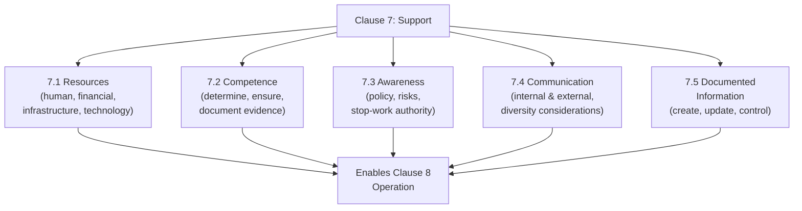

## Support Resources Competence and Communication

### Overview

Clause 7 of ISO 45001 ("Support") establishes the enabling infrastructure required for the OH&S management system to function — resources, competence, awareness, communication, and documented information. Positioned within the "Do" stage of the PDCA cycle alongside Clause 8 (Operation), Support functions as the underlying capability layer without which operational controls, planned objectives, and leadership commitments cannot be effectively executed.

### Resources (Clause 7.1)

**Key Points**

- Requires the organization to determine and provide the resources needed for establishment, implementation, maintenance, and continual improvement of the OH&S management system.
- Resources encompass human resources, natural resources (where relevant), infrastructure, technology, and financial resources — a deliberately broad scope reflecting that OH&S management system effectiveness depends on more than personnel alone.
- Resource adequacy is directly connected to leadership commitment (Clause 5): a policy commitment to hazard elimination and continual improvement is only meaningful if sufficient resources are allocated to implement it in practice.

### Competence (Clause 7.2)

**Key Points**

- Requires the organization to:
  - Determine necessary competence of workers that affects, or can affect, its OH&S performance
  - Ensure workers are competent (including the ability to identify hazards) on the basis of appropriate education, training, or experience
  - Where applicable, take actions to acquire and maintain necessary competence, and evaluate the effectiveness of actions taken
  - Retain appropriate documented information as evidence of competence
- Competence requirements apply not only to permanent employees but to contract workers, temporary workers, and others whose work activities affect the organization's OH&S performance — reflecting the multi-employer risk exposure common in both occupational and process safety contexts.
- [Inference] The standard's emphasis on documented competence evidence (rather than assumed competence based on job title or general experience) is widely interpreted in implementation guidance as a direct response to incident investigations where inadequate worker competence for specific safety-critical tasks was identified as a contributing factor, though ISO 45001 itself does not cite specific incidents as the basis for this requirement.

### Awareness (Clause 7.3)

**Key Points**

- Requires workers to be made aware of:
  - The OH&S policy and OH&S objectives
  - Their contribution to the effectiveness of the OH&S management system, including the benefits of improved OH&S performance
  - The implications and potential consequences of not conforming with OH&S management system requirements
  - Incidents and the outcomes of investigations relevant to them
  - Hazards, OH&S risks, and actions determined that are relevant to them
  - The ability to remove themselves from work situations they consider present an imminent and serious danger to life or health, and the arrangements for protecting them from undue consequences of doing so

**Key Points**

- The explicit "stop work authority" awareness requirement (the ability to remove oneself from imminent danger without reprisal) represents a structurally significant provision — it requires the organization not merely to permit workers to stop unsafe work, but to ensure workers are actively aware of this right and protected from negative consequences for exercising it.

### Communication (Clause 7.4)

**Key Points**

- Requires the organization to establish, implement, and maintain processes needed for internal and external communication relevant to the OH&S management system, including determining:
  - What will be communicated
  - When to communicate
  - With whom to communicate (internally across various levels/functions, and with contractors, visitors, and other interested parties as needed)
  - How to communicate
- Requires the organization to take into account diversity aspects (e.g., gender, language, culture, literacy, disability) when planning communication.
- Requires the organization to ensure the views of external interested parties are taken into account in establishing communication processes.
- Internal communication must include communication among various levels and functions of the organization, and must include mechanisms enabling workers to contribute to continual improvement.
- External communication must be established in accordance with the organization's communication processes and applicable legal and other requirements.

### Documented Information (Clause 7.5)

**Key Points**

- Requires the OH&S management system to include documented information required by ISO 45001 itself, plus documented information the organization determines is necessary for the effectiveness of the OH&S management system.
- Establishes requirements for **creating and updating** documented information: appropriate identification and description, appropriate format and media, and appropriate review and approval for suitability and adequacy.
- Establishes requirements for **control of documented information**: ensuring availability and suitability for use where and when needed, and adequate protection (from loss of confidentiality, improper use, or loss of integrity).
- Addresses control activities including distribution, access, retrieval, use, storage, preservation, control of changes, and retention/disposition.

### Interconnection Among Support Elements

**Key Points**

1. **Resources enable competence** — without adequate training budget and time allocation (a resource decision), competence requirements cannot be practically fulfilled.
2. **Competence enables meaningful awareness** — awareness of hazards and risks is only actionable if workers possess the underlying competence to recognize and respond to what they are made aware of.
3. **Communication carries awareness and competence-building content** — training delivery, hazard alerts, and incident investigation findings all flow through the communication processes established under 7.4.
4. **Documented information underpins all other elements** — competence records, communication logs, and resource allocation decisions require documented information control to remain auditable and consistent over time.

### Comparison to Process Safety Equivalent Elements

| ISO 45001 Support Element | CCPS RBPS Parallel | OSHA PSM Parallel |
| --- | --- | --- |
| 7.1 Resources | Implicit across all pillars (leadership-provided) | Not a standalone element; implicit throughout |
| 7.2 Competence | Process Safety Competency (Pillar 1) | Training (Element 5) |
| 7.3 Awareness | Process Safety Culture / Workforce Involvement | Employee Participation (Element 1) |
| 7.4 Communication | Stakeholder Outreach (external); Workforce Involvement (internal) | Not a standalone element; addressed within multiple elements |
| 7.5 Documented Information | Process Knowledge Management (Pillar 2) | Process Safety Information (Element 2) |

**Key Points**

- ISO 45001's Support clause and CCPS RBPS's structural elements address substantially overlapping ground — competence, communication, and documented information management — despite the two frameworks covering different hazard scopes (occupational vs. process), reflecting shared recognition that these enabling functions are foundational regardless of the specific hazard category being managed.
- Organizations managing both an ISO 45001-certified OH&S system and a PSM/RBPS-based process safety program often benefit from coordinating (though not necessarily merging) competence tracking, documentation control systems, and communication channels, given the substantial overlap in underlying infrastructure requirements even where content differs.

**Conclusion**

Clause 7's Support requirements establish the enabling infrastructure — resources, competence, awareness, communication, and documented information control — without which an OH&S management system's policy commitments and planned objectives cannot be translated into effective operational practice. The explicit inclusion of stop-work authority awareness and diversity-conscious communication planning reflects the standard's emphasis on genuine worker engagement rather than top-down compliance alone, while the substantial conceptual overlap with CCPS RBPS's competency and communication-related elements illustrates how these enabling functions transcend the specific occupational-versus-process-safety distinction, forming shared infrastructure requirements across both disciplines.

**Related Topics**

- Competence Determination and Evidence Documentation Practices
- Stop-Work Authority: Implementation and Cultural Reinforcement
- Diversity-Conscious Communication Planning for Multi-Site Organizations
- Documented Information Control Systems for Management Standards
- Coordinating Competence Tracking Across OH&S and Process Safety Programs
- Internal vs. External Communication Requirements Under ISO 45001