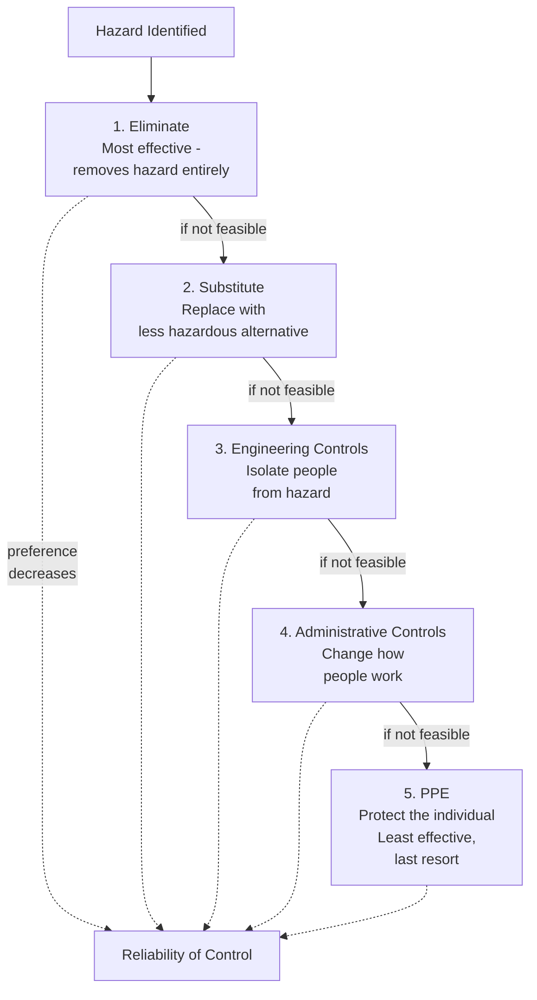

## Operational Planning and Control

### Overview

Clause 8 of ISO 45001 ("Operation") is the "Do" stage of the PDCA cycle where planned hazard controls, procedures, and management-of-change processes are actually executed. It translates the risk identification and objective-setting work of Clause 6 into concrete operational criteria, hazard elimination hierarchies, procurement controls, and emergency preparedness measures — representing the point where the management system directly touches day-to-day work activity.

### Operational Planning and Control (Clause 8.1.1)

**Key Points**

- Requires the organization to plan, implement, control, and maintain the processes needed to meet OH&S management system requirements and to implement actions determined in Clause 6, by:
  - Establishing criteria for the processes
  - Implementing control of the processes in accordance with the criteria
  - Maintaining and retaining documented information to the extent necessary to have confidence the processes have been carried out as planned, and to demonstrate conformity
- Requires adapting work to workers, rather than the reverse — a specific provision addressing ergonomic and human factors considerations in process/task design.
- In multi-employer workplaces, requires coordination of relevant parts of the OH&S management system with other organizations.

### Eliminating Hazards and Reducing OH&S Risks (Clause 8.1.2)

**Key Points**

- Requires establishing, implementing, and maintaining a process for eliminating hazards and reducing OH&S risks using the following hierarchy of controls:
  1. **Eliminate the hazard**
  2. **Substitute** with less hazardous processes, operations, materials, or equipment
  3. **Use engineering controls and reorganization of work**
  4. **Use administrative controls, including training**
  5. **Use adequate personal protective equipment (PPE)**
- This hierarchy is not a menu of equally valid options — it establishes an explicit preference order, with elimination as the most robust and durable control and PPE as the least reliable (since it depends on continued correct use, fit, and maintenance rather than removing or engineering out the hazard itself).

### Management of Change (Clause 8.1.3)

**Key Points**

- Requires a process for implementing and controlling planned temporary and permanent changes that impact OH&S performance, including:
  - New products, services, and processes, or changes to existing ones (including workplace locations and surroundings, work organization, working conditions, equipment, and workforce)
  - Changes to legal requirements and other requirements
  - Changes in knowledge or information about hazards and OH&S risks
  - Developments in knowledge and technology
- Requires the organization to review the consequences of unintended changes, taking action to mitigate any adverse effects as necessary.
- This MOC requirement structurally parallels process safety's Management of Change element (OSHA PSM Element 10, CCPS RBPS Element 13), though scoped to occupational hazards; organizations often coordinate — but typically do not merge — occupational MOC and process safety MOC processes, given differing technical review requirements and trigger criteria.

### Procurement (Clause 8.1.4)

**Procurement Generally (8.1.4.1)**

- Requires establishing, implementing, and maintaining a process to control the procurement of products and services to ensure conformity with the OH&S management system.

**Contractors (8.1.4.2)**

- Requires coordination of procurement processes with contractors to identify hazards and assess/control the OH&S risks arising from:
  - Contractors' activities and operations that impact the organization
  - The organization's activities and operations that impact contractors' workers
  - Contractors' activities and operations that impact other interested parties in the workplace
- Requires ensuring that requirements of the OH&S management system are met by contractors and their workers, using selection criteria for contractors that include OH&S criteria as appropriate.

**Outsourcing (8.1.4.3)**

- Requires ensuring that outsourced functions and processes are controlled, with the type and degree of control defined within the OH&S management system.

### Emergency Preparedness and Response (Clause 8.2)

**Key Points**

- Requires establishing, implementing, and maintaining processes needed to prepare for and respond to potential emergency situations, including:
  - Establishing a planned response, including provision of first aid
  - Providing relevant training for the planned response
  - Periodically testing and exercising the planned response capability
  - Evaluating performance and, as necessary, revising the planned response, including after testing and after the occurrence of emergency situations
  - Communicating and providing relevant information to all workers on their duties and responsibilities
  - Communicating relevant information to contractors, visitors, emergency response services, government authorities, and, as appropriate, the local community
  - Taking into account the needs and capabilities of all relevant interested parties and ensuring their involvement, as appropriate, in the development of the planned response
- Requires maintaining and retaining documented information on the process(es) and on the plans for responding to potential emergency situations.

### Operational Control Elements Comparison

| Sub-clause | Focus | Process Safety Parallel |
| --- | --- | --- |
| 8.1.1 | Operational planning and control | Operating Procedures (PSM Element 4) |
| 8.1.2 | Hierarchy of controls | Inherently Safer Design principles |
| 8.1.3 | Management of Change | Management of Change (PSM Element 10) |
| 8.1.4 | Procurement, contractors, outsourcing | Contractors (PSM Element 6) |
| 8.2 | Emergency preparedness and response | Emergency Planning and Response (PSM Element 12) |

**Key Points**

- Unlike OSHA PSM, which addresses these elements as separate, independently structured requirements, ISO 45001 nests them all within a single Clause 8, reflecting the standard's more compact, generalized structure applicable across all industries rather than a chemical-process-hazard-specific regulatory scheme.
- ISO 45001's hierarchy of controls provision (8.1.2) has a direct conceptual parallel in process safety's **Inherently Safer Design (ISD)** philosophy, both prioritizing hazard elimination/substitution over reliance on administrative controls or PPE — though ISD is typically applied at the process design stage, while ISO 45001's hierarchy applies broadly across all operational hazard control decisions.

### Practical Implementation Considerations

**Key Points**

1. **Operational criteria must be specific and measurable** — vague operational control descriptions ("follow safe practices") do not satisfy the standard's intent of establishing criteria against which conformity can be assessed.
2. **Documented information retention supports both compliance demonstration and continual improvement** — records of how operational processes were actually carried out feed into Clause 9 performance evaluation and Clause 10 improvement activities.
3. **MOC and procurement/contractor controls require cross-functional coordination** — a change affecting OH&S risk often intersects with procurement decisions (new equipment) and contractor management (installation work), requiring these Clause 8 sub-elements to function as a coordinated system rather than independent silos.
4. **Emergency preparedness testing must be genuinely exercised, not merely documented** — the explicit requirement to periodically test and exercise the planned response, and to revise it based on testing outcomes, distinguishes a functioning emergency program from a static emergency plan document.

**Conclusion**

Clause 8's Operation requirements translate ISO 45001's planning and support infrastructure into concrete operational practice — establishing operational criteria, applying the hierarchy of controls, managing change, controlling procurement and contractor risk, and maintaining tested emergency preparedness capability. Its hierarchy of controls provision shares clear conceptual lineage with process safety's inherently safer design philosophy, while its management of change and contractor requirements parallel (without duplicating) equivalent process safety elements under OSHA PSM and CCPS RBPS, illustrating the structural consistency of these core risk-management concepts across both occupational and process safety disciplines despite their different regulatory origins and hazard scopes.

**Related Topics**

- Hierarchy of Controls vs. Inherently Safer Design: Conceptual Comparison
- Management of Change Processes: Occupational vs. Process Safety Scope
- Contractor Selection Criteria Incorporating OH&S Performance
- Emergency Response Plan Testing and Exercise Methodologies
- Coordinating Multi-Employer OH&S Management System Requirements
- Documented Information Requirements for Operational Conformity Demonstration