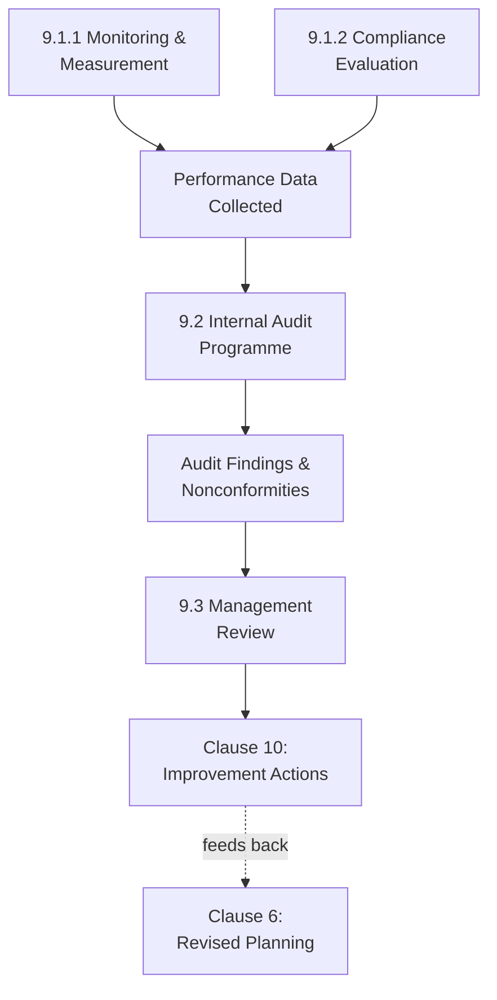

## Performance Evaluation and Internal Audit

### Overview

Clause 9 of ISO 45001 ("Performance Evaluation") constitutes the "Check" stage of the PDCA cycle, establishing the systematic mechanisms — monitoring, measurement, compliance evaluation, internal audit, and management review — by which an organization verifies whether its OH&S management system is actually functioning as intended, rather than merely assuming effectiveness based on documented procedures alone.

### Monitoring, Measurement, Analysis, and Performance Evaluation (Clause 9.1.1)

**Key Points**

- Requires the organization to establish, implement, and maintain a process for monitoring, measurement, analysis, and performance evaluation, determining:
  - What needs to be monitored and measured
  - The methods for monitoring, measurement, analysis, and performance evaluation, to ensure valid results
  - The criteria against which the organization will evaluate its OH&S performance
  - When monitoring and measuring will be performed
  - When the results will be analyzed, evaluated, and communicated
- Requires evaluation of OH&S performance and determination of the effectiveness of the OH&S management system.
- Requires ensuring monitoring and measuring equipment is calibrated or verified as applicable, and used and maintained as appropriate.

**Leading and Lagging Indicators**

**Key Points**

- ISO 45001 does not explicitly mandate a specific leading/lagging indicator taxonomy, but implementation practice widely incorporates this distinction — parallel to its established use in process safety performance measurement (API RP 754).
- **Lagging indicators** — injury/illness rates (TRIR, LTI), incident counts — measure outcomes after the fact.
- **Leading indicators** — near-miss reporting rates, safety observation completion, training completion rates, corrective action closure timeliness — measure the presence and health of safety-critical activities before an incident occurs.

### Evaluation of Compliance (Clause 9.1.2)

**Key Points**

- Requires the organization to establish, implement, and maintain a process for evaluating compliance with legal requirements and other requirements (as determined under Clause 6.1.3), including:
  - Determining the frequency and method(s) for evaluating compliance
  - Evaluating compliance and taking action if needed
  - Maintaining knowledge and understanding of compliance status
  - Retaining documented information on compliance evaluation results
- This compliance evaluation function directly connects to the legal requirements register established under Clause 6.1.3, converting a static list of applicable requirements into an active, periodically verified compliance status.

### Internal Audit (Clause 9.2)

**Purpose (9.2.1)**

- Requires internal audits at planned intervals to provide information on whether the OH&S management system:
  - Conforms to the organization's own requirements for its OH&S management system, including the OH&S policy and OH&S objectives
  - Conforms to the requirements of ISO 45001 itself
  - Is effectively implemented and maintained

**Internal Audit Programme (9.2.2)**

- Requires establishing, implementing, and maintaining an audit programme(s), including frequency, methods, responsibilities, consultation, planning requirements, and reporting, taking into consideration the importance of the processes concerned and the results of previous audits.
- Requires defining audit criteria and scope for each audit.
- Requires selecting auditors and conducting audits to ensure objectivity and the impartiality of the audit process.
- Requires ensuring results of audits are reported to relevant management, and to workers and, where they exist, workers' representatives, and other relevant interested parties.
- Requires taking action to address nonconformities and continually improve OH&S performance (linking directly to Clause 10).
- Requires retaining documented information as evidence of the implementation of the audit programme and audit results.

### Management Review (Clause 9.3)

**Key Points**

- Requires top management to review the organization's OH&S management system at planned intervals, to ensure its continuing suitability, adequacy, and effectiveness.
- The management review must consider:
  - Status of actions from previous management reviews
  - Changes in external and internal issues relevant to the OH&S management system
  - The extent to which OH&S policy and OH&S objectives have been met
  - Information on OH&S performance, including trends in: incidents, nonconformities and corrective actions, monitoring and measurement results, audit results, consultation and participation of workers, risks and opportunities
  - Adequacy of resources for maintaining an effective OH&S management system
  - Relevant communication(s) with interested parties
  - Opportunities for continual improvement
- Requires outputs of the management review to include decisions related to: continuing suitability, adequacy, and effectiveness of the OH&S management system; continual improvement opportunities; any need for changes to the OH&S management system; resources needed; actions if needed; opportunities to improve integration with other business processes; and any implications for the organization's strategic direction.
- Requires top management to communicate relevant outputs of management reviews to workers, and where they exist, workers' representatives.

### Internal Audit vs. Compliance Audit: Key Distinction

**Key Points**

- ISO 45001's internal audit (9.2) evaluates conformance to both the organization's own OH&S management system requirements and to ISO 45001's requirements — broader than a pure regulatory compliance audit.
- This differs somewhat from OSHA PSM's Compliance Audit element (1910.119(o)), which specifically evaluates compliance with the PSM standard's own provisions, though both functions share the same underlying purpose: independent, periodic verification that the management system is functioning as designed rather than merely documented as designed.
- Organizations with both ISO 45001 certification and PSM-covered processes typically maintain coordinated but distinct audit programs — an ISO 45001 internal audit cycle for the OH&S management system, and a separate 3-year PSM compliance audit cycle for process safety elements — given differing audit criteria, scope, and regulatory basis.

### Performance Evaluation Comparison Across Frameworks

| Element | ISO 45001 | OSHA PSM | CCPS RBPS |
| --- | --- | --- | --- |
| Ongoing monitoring | Clause 9.1.1 | Not a standalone element; implicit | Measurement and Metrics (Pillar 4) |
| Compliance evaluation | Clause 9.1.2 | Not standalone; implicit within audit | Compliance with Standards (Pillar 1) |
| Internal audit | Clause 9.2 | Compliance Audits, every 3 years | Auditing (Pillar 4) |
| Leadership review | Clause 9.3, Management Review | Not a standalone element | Management Review and Continuous Improvement (Pillar 4) |

**Key Points**

- CCPS RBPS's Pillar 4 ("Learn from Experience") structurally mirrors ISO 45001's Clause 9-10 Check-Act sequence closely, with explicit standalone elements for Measurement and Metrics, Auditing, and Management Review — reflecting convergent recognition across both occupational and process safety frameworks that structured performance evaluation and leadership review are essential, distinct management system functions rather than implicit byproducts of other activities.

### Common Implementation Pitfalls

**Key Points**

1. **Audit as compliance theater** — conducting internal audits primarily to generate a certification-ready paper trail, rather than genuinely surfacing and acting on nonconformities, undermines the Check stage's core purpose.
2. **Lagging-indicator overreliance** — organizations that monitor primarily injury/incident rates (lagging) without corresponding leading indicator tracking may not detect management system degradation until an incident has already occurred — the same "safety paradox" dynamic documented in process safety contexts like BP Texas City.
3. **Management review as formality** — treating management review as a scheduled meeting to rubber-stamp existing performance rather than a genuine decision-making forum undermines its intended function of driving resource allocation and strategic adjustment based on performance data.
4. **Disconnected audit-to-improvement linkage** — findings from internal audits that are documented but not systematically tracked to corrective action closure break the Check-to-Act feedback loop central to PDCA's continual improvement premise.

**Conclusion**

Clause 9's Performance Evaluation requirements provide the systematic verification mechanisms — monitoring and measurement, compliance evaluation, internal audit, and management review — through which an organization confirms whether its OH&S management system is genuinely effective rather than merely documented. Its structural parallel to CCPS RBPS's "Learn from Experience" pillar underscores a shared principle across occupational and process safety disciplines: that performance evaluation is a distinct, auditable management system function requiring dedicated processes, not an incidental byproduct of routine operations, and that its outputs must feed forward into Clause 10 improvement action to complete the PDCA cycle.

**Related Topics**

- Leading vs. Lagging Indicators in OH&S Performance Measurement
- Internal Audit Programme Design and Auditor Independence Requirements
- Management Review Best Practices: Avoiding Formality Without Substance
- Coordinating ISO 45001 Internal Audits with PSM Compliance Audits
- Compliance Evaluation Processes for Multi-Jurisdiction Legal Requirements
- Breaking the Safety Paradox Through Balanced Indicator Monitoring