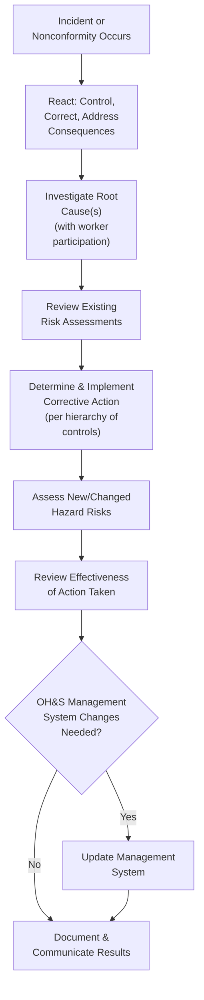

## Management Review and Continual Improvement

### Overview

Clause 10 of ISO 45001 ("Improvement") constitutes the "Act" stage of the PDCA cycle, closing the management system loop by converting incident findings, audit results, and performance evaluation outputs into corrective action and systematic continual improvement. Together with the management review process formally housed in Clause 9.3, this content forms the mechanism by which an OH&S management system evolves over successive cycles rather than remaining static after initial implementation.

### General Improvement Requirements (Clause 10.1)

**Key Points**

- Requires the organization to determine opportunities for improvement and implement necessary actions to achieve the intended outcomes of the OH&S management system.
- This general provision establishes improvement as an ongoing organizational obligation, not solely a reactive response triggered by incidents or nonconformities — proactive opportunity identification is explicitly in scope.

### Incident, Nonconformity, and Corrective Action (Clause 10.2)

**Key Points**

- Requires the organization to establish, implement, and maintain a process, including reporting, investigating, and taking action, to determine and manage incidents and nonconformities.
- When an incident or nonconformity occurs, the organization must:
  - React in a timely manner to the incident or nonconformity, and as applicable: take action to control and correct it, and deal with the consequences
  - Evaluate, with the participation of workers and involvement of other relevant interested parties, the need for action to eliminate the root cause(s) of the incident or nonconformity, in order to prevent recurrence, using investigation methods appropriate to the nature and magnitude of the incident or nonconformity
  - Review existing assessments of OH&S risks and other risks, as appropriate
  - Determine and implement any action needed, including corrective action, in accordance with the hierarchy of controls and change management
  - Assess OH&S risks that relate to new or changed hazards, prior to taking action
  - Review the effectiveness of any action taken, including corrective action
  - Make changes to the OH&S management system, if necessary
- Corrective actions must be appropriate to the effects or potential effects of the incidents or nonconformities encountered — proportionality between response magnitude and event significance is an explicit expectation.
- Requires retaining documented information as evidence of: the nature of incidents/nonconformities and any subsequent action taken; and the results of any action and corrective action, including their effectiveness.
- Requires communicating this documented information to relevant workers, and where they exist, workers' representatives, and other relevant interested parties.

### Root Cause Investigation and Worker Participation

**Key Points**

- ISO 45001 explicitly requires worker participation in root cause evaluation, not merely management-led investigation — reflecting the standard's broader emphasis on worker consultation throughout the management system (Clause 5.4).
- The requirement to use "investigation methods appropriate to the nature and magnitude" of the event allows proportional response — a minor near-miss may warrant a brief investigation, while a serious incident warrants formal root cause analysis methodology (e.g., fault tree analysis, 5-Whys, or fishbone/Ishikawa diagram techniques commonly used in both occupational and process safety investigation practice).
- This investigation requirement parallels OSHA PSM's Incident Investigation element (1910.119(m)), though PSM's investigation trigger and timeline requirements (48-hour investigation initiation) are specific to process safety incidents with catastrophic release potential, whereas ISO 45001's provision applies more broadly across all OH&S incidents and nonconformities.

### Continual Improvement (Clause 10.3)

**Key Points**

- Requires the organization to continually improve the suitability, adequacy, and effectiveness of the OH&S management system by:
  - Enhancing OH&S performance
  - Promoting a culture that supports an OH&S management system
  - Promoting the participation of workers in implementing actions for continual improvement
  - Communicating relevant results of continual improvement to workers, and where they exist, workers' representatives
  - Maintaining and retaining documented information as evidence of continual improvement
- This provision explicitly links continual improvement to culture-building, not solely to technical/procedural refinement — reinforcing the connection between Clause 5 leadership commitment and the ongoing improvement cycle.

### Relationship Between Clause 9.3 (Management Review) and Clause 10 (Improvement)

**Key Points**

- While Clause 9.3 (Management Review) formally sits within Performance Evaluation ("Check"), its outputs — decisions on system changes, resource needs, and improvement opportunities — feed directly into Clause 10's improvement actions, meaning these two clauses function as a tightly coupled Check-Act sequence in practice even though they are separately numbered.
- Management review inputs (audit results, incident trends, compliance evaluation findings, worker consultation outcomes) provide the aggregated, leadership-level view that individual Clause 10.2 corrective actions on specific incidents cannot provide alone — management review identifies systemic patterns across multiple individual corrective actions.
- The cycle is explicitly iterative: Clause 10's changes to the OH&S management system feed back into Clause 6 (Planning) for the next PDCA iteration, rather than terminating the process.

### Comparison to Process Safety Learning Elements

| ISO 45001 Element | CCPS RBPS Pillar 4 Parallel | OSHA PSM Parallel |
| --- | --- | --- |
| 10.2 Incident/Nonconformity/Corrective Action | Incident Investigation | Incident Investigation (Element 11) |
| 9.1.1 Monitoring (feeding 10.1) | Measurement and Metrics | Not standalone |
| 9.2 Internal Audit (feeding 10.1) | Auditing | Compliance Audits (Element 13) |
| 9.3 Management Review | Management Review and Continuous Improvement | Not standalone |
| 10.3 Continual Improvement | Management Review and Continuous Improvement | Not standalone |

**Key Points**

- CCPS RBPS's Pillar 4 ("Learn from Experience") consolidates incident investigation, metrics, auditing, and management review into a single organizing pillar explicitly framed around organizational learning — conceptually equivalent to ISO 45001's combined Clause 9-10 Check-Act sequence, but presented as a unified "learning" theme rather than split across separately numbered performance-evaluation and improvement clauses.
- Both frameworks share the core premise that incident investigation value lies not in the individual corrective action alone, but in the systemic learning captured through aggregated metrics, audit trends, and management review — preventing the "lessons learned but not institutionalized" failure pattern observed in various major incident investigations. [Inference] This failure pattern — where investigation recommendations from one incident fail to prevent similar recurring incidents — is widely discussed in process safety and OH&S literature, though its prevalence across organizations broadly is not something that can be precisely quantified from available sources.

### Practical Implementation Considerations

**Key Points**

1. **Distinguish correction from corrective action** — immediate correction addresses the immediate incident/nonconformity; corrective action addresses the root cause to prevent recurrence. ISO 45001 explicitly requires both, not merely the former.
2. **Worker participation must be substantive** — the standard's requirement for worker involvement in root cause evaluation is not satisfied by post-hoc notification of investigation findings alone.
3. **Documented evidence of effectiveness review** — organizations must not only implement corrective actions but document review of whether those actions actually proved effective, closing a feedback loop that is sometimes overlooked in less mature management systems.
4. **Continual improvement requires culture investment, not only procedural updates** — the explicit linkage to "promoting a culture that supports an OH&S management system" signals that continual improvement is not achieved through documentation revision alone.

**Conclusion**

Clause 10's Improvement requirements, working in close coordination with Clause 9.3's Management Review, complete ISO 45001's PDCA cycle by converting incident findings, nonconformities, and performance evaluation outputs into root-cause-based corrective action and genuine continual improvement. The standard's explicit emphasis on worker participation in root cause investigation and on culture-building as a component of continual improvement reflects the same underlying principle found in CCPS RBPS's "Learn from Experience" pillar: that organizational learning from incidents and performance data must be systematically captured and institutionalized, rather than addressed through isolated, one-off corrective actions that fail to prevent recurring failure patterns.

**Related Topics**

- Root Cause Analysis Methodologies: 5-Whys, Fishbone, and Fault Tree Techniques
- Distinguishing Correction from Corrective Action in Incident Response
- Worker Participation Requirements in Incident Investigation
- Closing the PDCA Loop: From Clause 10 Improvement Back to Clause 6 Planning
- Institutionalizing Lessons Learned Across Multi-Site Organizations
- CCPS RBPS Pillar 4 vs. ISO 45001 Clauses 9-10: Structural Comparison