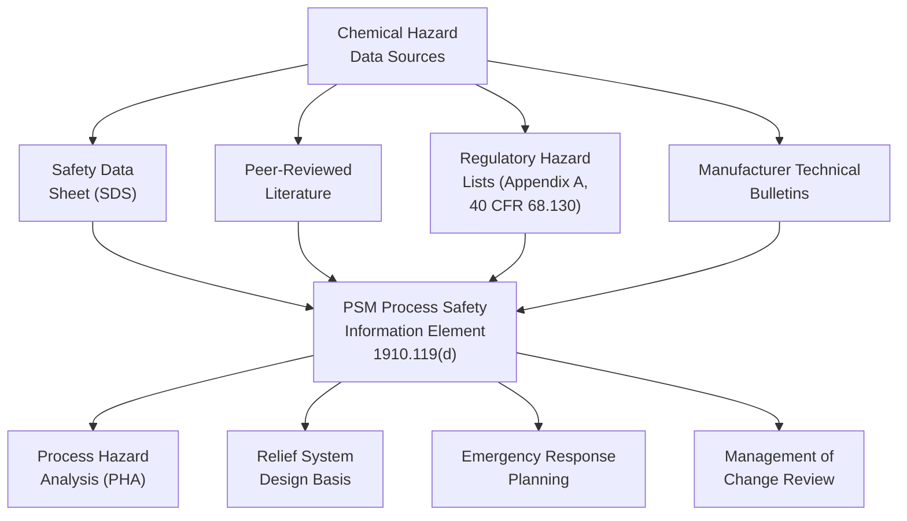

## Chemical Hazard Data and Safety Data Sheets

### Overview

Chemical hazard data — compiled formally through Safety Data Sheets (SDS) and related technical documentation — forms the foundational input to OSHA PSM's Process Safety Information element (1910.119(d)(1)) and to hazard communication requirements more broadly. Accurate, current, and complete chemical hazard data underpins nearly every downstream process safety activity: PHA facilitation, relief system design, emergency response planning, and compatibility assessment during Management of Change reviews.

### Safety Data Sheet (SDS) Structure

The SDS format is standardized internationally under the UN Globally Harmonized System (GHS), adopted by OSHA's 2012 Hazard Communication Standard update (1910.1200), replacing the earlier, non-standardized Material Safety Data Sheet (MSDS) format. The standardized 16-section format is:

| Section | Content |
| --- | --- |
| 1 | Identification (product identifier, manufacturer, emergency contact) |
| 2 | Hazard(s) identification (GHS classification, signal word, hazard/precautionary statements) |
| 3 | Composition/information on ingredients |
| 4 | First-aid measures |
| 5 | Fire-fighting measures |
| 6 | Accidental release measures |
| 7 | Handling and storage |
| 8 | Exposure controls/personal protection |
| 9 | Physical and chemical properties |
| 10 | Stability and reactivity |
| 11 | Toxicological information |
| 12 | Ecological information (non-mandatory under OSHA, but typically included) |
| 13 | Disposal considerations (non-mandatory under OSHA) |
| 14 | Transport information (non-mandatory under OSHA) |
| 15 | Regulatory information (non-mandatory under OSHA) |
| 16 | Other information, including date of preparation/revision |

**Key Points**

- Sections 12–15 are non-mandatory under OSHA's Hazard Communication Standard (reflecting jurisdictional overlap with EPA, DOT, and other agencies), but are typically included by manufacturers to satisfy international requirements simultaneously (many jurisdictions outside the US do mandate these sections).
- The standardized 16-section format enables predictable navigation across SDSs from different manufacturers — a significant improvement over the pre-2012 MSDS era, where formats varied considerably.

### GHS Classification System

**Key Points**

- The Globally Harmonized System classifies chemicals across three broad hazard categories: **physical hazards** (flammability, explosivity, oxidizing properties, corrosivity to metals), **health hazards** (acute toxicity, skin/eye irritation/corrosion, carcinogenicity, reproductive toxicity, and others), and **environmental hazards** (aquatic toxicity).
- Each hazard class is further divided into numbered categories (e.g., Flammable Liquids Category 1-4), with Category 1 generally representing the most severe hazard level within each class.
- GHS-standardized **pictograms** (red diamond-bordered symbols) provide immediate visual hazard communication: flame (flammability), exploding bomb (explosives/reactives), skull and crossbones (acute toxicity), corrosion (skin/metal corrosivity), health hazard (carcinogen/respiratory sensitizer/reproductive toxicity), gas cylinder (gases under pressure), exclamation mark (irritant/lower-severity health hazards), environment (aquatic toxicity, non-mandatory under OSHA).
- **Signal words** — "Danger" (more severe hazards) or "Warning" (less severe hazards) — provide a standardized severity indicator independent of the specific hazard class.

### PSM's Chemical Hazard Information Requirements (1910.119(d)(1))

**Key Points**

- OSHA PSM requires compilation of written chemical hazard information for each highly hazardous chemical in the process, including (at minimum):
  - Toxicity information
  - Permissible exposure limits
  - Physical data
  - Reactivity data
  - Corrosivity data
  - Thermal and chemical stability data
  - Hazardous effects of inadvertent mixing of different materials that could foreseeably occur
- SDSs may be used to comply with this requirement to the extent they contain the required information, though PSM's requirement is broader than a bare SDS in some respects — particularly the "hazardous effects of inadvertent mixing" provision, which requires process-specific reactive chemistry analysis that a generic SDS for an individual chemical cannot fully address.

### Reactive Chemistry Hazards: Beyond Single-Chemical SDS Data

**Key Points**

- A critical limitation of SDS-based chemical hazard data: SDSs address the hazards of a single substance in isolation, while many catastrophic process incidents (including Bhopal) involved unintended chemical reactions between substances that, individually, might present manageable hazard profiles.
- CCPS and other industry guidance emphasize the need for dedicated **reactive chemistry hazard evaluation**, going beyond individual chemical SDS review to assess process-specific mixing, contamination, and runaway reaction potential — often informed by calorimetry testing (e.g., Differential Scanning Calorimetry, Accelerating Rate Calorimetry) for processes involving exothermic reaction potential.
- [Inference] The extent to which organizations conduct dedicated reactive chemistry testing beyond SDS review varies considerably by process hazard category and organizational maturity; specific industry-wide practice benchmarks are not well-established in readily available sources.

### Permissible Exposure Limits and Occupational Exposure Data

**Key Points**

- SDS Section 8 (Exposure Controls/Personal Protection) typically references applicable exposure limits: OSHA Permissible Exposure Limits (PELs), ACGIH Threshold Limit Values (TLVs), and, where applicable, NIOSH Recommended Exposure Limits (RELs).
- [Inference] As noted in occupational hygiene literature, OSHA PELs are often criticized as outdated relative to current toxicological understanding, given that many were established decades ago and have not been comprehensively updated through subsequent rulemaking; ACGIH TLVs are more frequently updated but carry no independent regulatory force absent adoption by a jurisdiction.
- This gap between regulatory PELs and current scientific consensus on safe exposure levels is a recurring point of emphasis in industrial hygiene practice, particularly for facilities seeking to exceed minimum regulatory compliance in worker exposure protection.

### SDS Currency and Management of Change Implications

**Key Points**

- SDSs must be kept current; manufacturers are required to update SDSs when significant new information regarding hazards becomes available, and downstream users must ensure they possess current versions.
- Under PSM's Management of Change element (1910.119(l)), introduction of a new chemical or change in chemical supplier/formulation triggers a requirement to update Process Safety Information — including obtaining and reviewing the new or revised SDS — before the change is implemented, ensuring PHA and operating procedure assumptions remain accurate.
- A stale or missing SDS for a process chemical represents a foundational Process Safety Information gap that can undermine the validity of downstream PHA findings, relief system design assumptions, and emergency response planning — a recurring citation basis in OSHA PSM enforcement.

### SDS Access and Availability Requirements

**Key Points**

- Under Hazard Communication (1910.1200), employers must ensure SDSs are readily accessible to employees during each work shift, in their work area, without significant delay or barriers.
- Modern implementation frequently uses electronic SDS management systems, provided access is not impeded by network outages, device unavailability, or other practical barriers that could delay access during an emergency.
- PSM extends this accessibility principle to the broader Process Safety Information element, requiring not just SDS access but the compiled written chemical, process, and equipment hazard information to be available to the PHA team and other personnel who need it.

### Data Quality Considerations

**Key Points**

1. **Manufacturer-to-manufacturer variability** — SDSs for chemically similar or identical products from different manufacturers can vary in completeness and specificity, requiring critical review rather than passive acceptance.
2. **Mixture vs. pure substance data gaps** — SDSs for mixtures/formulated products sometimes provide less complete reactivity and stability data than SDSs for pure substances, given proprietary formulation confidentiality concerns.
3. **Translation and regional variation** — multinational operations must ensure SDS availability in languages and regulatory formats appropriate to each facility's jurisdiction, given that GHS implementation details vary somewhat by country/region despite the shared underlying classification framework.

**Conclusion**

Chemical hazard data, principally compiled through standardized GHS-format Safety Data Sheets, forms the essential informational foundation for process safety information compliance, PHA facilitation, and emergency response planning. However, effective process safety management requires recognizing SDS data's inherent limitation to single-substance hazard profiles — necessitating dedicated reactive chemistry evaluation for processes involving potential chemical interactions — and requires active management of SDS currency through Management of Change processes to ensure hazard data remains accurate as process chemistry, suppliers, or formulations evolve over a facility's operating life.

**Related Topics**

- GHS Classification Categories and Pictogram System in Detail
- Reactive Chemistry Hazard Evaluation and Calorimetry Testing Methods
- Management of Change Triggers for Process Safety Information Updates
- OSHA PELs vs. ACGIH TLVs: Regulatory vs. Consensus Exposure Limits
- Electronic SDS Management System Implementation Considerations
- Process Safety Information Compilation for Multi-Chemical Processes