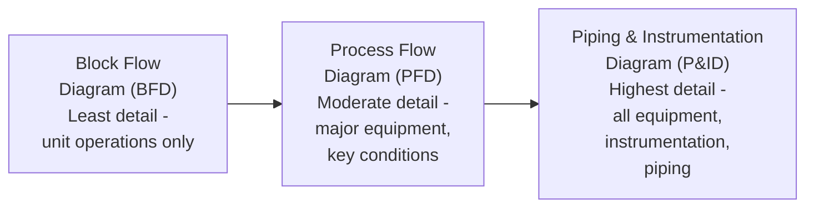
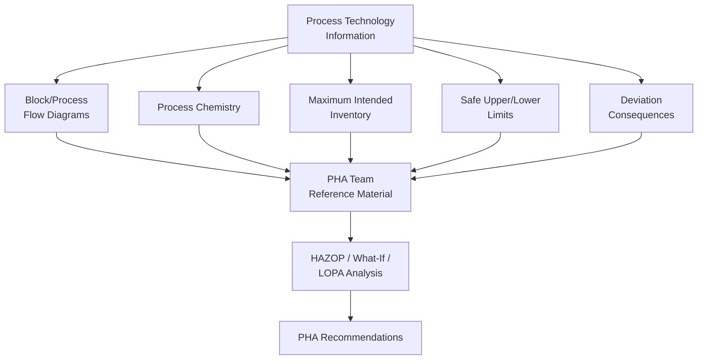

## Process Technology Information

### Overview

Process Technology Information constitutes the second major category of OSHA PSM's Process Safety Information element (1910.119(d)(2)), addressing the chemistry, design basis, and safe operating parameters of the process itself — distinct from the chemical-specific hazard data covered under chemical hazard information. This information provides the technical foundation against which Process Hazard Analysis teams evaluate deviations, operators understand safe operating boundaries, and engineers assess the impact of proposed changes.

### Regulatory Requirement (1910.119(d)(2))

**Key Points**

- OSHA PSM requires written process technology information addressing, at minimum:
  - A block flow diagram or simplified process flow diagram
  - Process chemistry
  - Maximum intended inventory
  - Safe upper and lower limits for items such as temperatures, pressures, flows, or compositions
  - An evaluation of the consequences of deviations, including those affecting the safety and health of employees
- Where the original technical information no longer exists, the employer may develop new process technology information based on current recognized and generally accepted good engineering practices (RAGAGEP), documenting that the information is accurate — a provision addressing aging facilities with incomplete historical documentation.

### Block Flow Diagrams vs. Process Flow Diagrams

**Block Flow Diagram (BFD)**

- A simplified schematic representation showing major process steps or unit operations as blocks connected by lines indicating material flow, without detailed equipment or instrumentation.
- Typically used for high-level process overview, initial hazard screening, and communication with audiences (management, regulators) who do not require full engineering detail.

**Process Flow Diagram (PFD)**

- A more detailed diagram showing major equipment items, primary process flow paths, key operating conditions (temperature, pressure, flow rates) at significant points, and major control loops.
- Provides greater technical detail than a BFD but less than a full Piping and Instrumentation Diagram (P&ID), which falls under the separate process equipment information requirement.

### Process Chemistry Documentation

**Key Points**

- Requires documentation of the chemical reactions occurring within the process, including primary reactions and any known or foreseeable side reactions.
- Distinct from, but closely related to, the chemical hazard information's "inadvertent mixing" provision — process chemistry documentation addresses the intended and expected chemistry of normal operation, informing the baseline against which deviation analysis and reactive hazard evaluation are conducted.
- For processes involving proprietary or licensed technology, process chemistry documentation may reference licensor-provided technical packages, though the operating facility retains responsibility for ensuring this information is current and accessible to its own PHA teams and operating personnel.

### Maximum Intended Inventory

**Key Points**

- Requires documentation of the maximum quantity of each hazardous material intended to be present in the process at any given time — a critical input for consequence analysis, since the magnitude of a potential release scenario is directly bounded by available inventory.
- This maximum intended inventory figure also determines regulatory applicability in many cases: whether a process exceeds OSHA PSM's threshold quantities (Appendix A) or EPA RMP's regulated substance thresholds (40 CFR 68.130) depends on documented maximum inventory, making accurate inventory documentation a threshold determination as well as a technical safety input.

### Safe Upper and Lower Limits

**Key Points**

- Requires documentation of safe operating limits for parameters including temperature, pressure, flow, and composition — establishing the boundaries within which the process is understood to operate safely, based on the underlying process chemistry and equipment design basis.
- These documented limits become the reference points against which:
  - Operating procedures establish normal operating ranges and required operator response to approaching limits
  - Alarm and interlock setpoints are established (with appropriate margin below the safe limit to allow corrective action time)
  - PHA teams evaluate the consequences of process deviations beyond these limits
- [Inference] Industry guidance commonly recommends that alarm setpoints be established with adequate margin relative to documented safe limits to allow time for operator or automated response before a safety-critical threshold is actually reached, though specific margin methodologies vary by facility and process risk level.

### Consequences of Deviation Evaluation

**Key Points**

- Requires an evaluation of the consequences of deviations from established safe operating limits, including consequences affecting employee safety and health.
- This deviation consequence evaluation directly feeds Process Hazard Analysis methodologies — particularly HAZOP, which systematically applies guide words (e.g., "more," "less," "no," "reverse") to process parameters and relies on documented deviation consequence understanding to evaluate the significance of each identified deviation scenario.
- Without documented deviation consequence information, PHA teams must reconstruct this understanding from first principles during the PHA session itself, reducing efficiency and potentially introducing gaps if process technology information was incomplete going into the analysis.

### Relationship to Process Hazard Analysis

### Currency and Management of Change Implications

**Key Points**

- Process technology information must remain current as the process evolves; PSM's Management of Change element requires evaluation of whether a proposed change affects any documented process technology information (safe limits, chemistry, maximum inventory) and requires updating this documentation prior to or concurrent with the change.
- A common PSM compliance deficiency involves process technology information that has not been updated to reflect operational changes implemented over a facility's lifetime — de-bottlenecking projects, catalyst changes, or feedstock modifications that alter safe operating limits or maximum inventory without corresponding documentation updates.
- Pre-Startup Safety Review (1910.119(i)) serves as a checkpoint verifying that process technology information has been appropriately updated before a new or modified process is introduced to hazardous materials.

### Distinguishing Process Technology Information from Process Equipment Information

**Key Points**

- OSHA PSM separates process technology information (1910.119(d)(2)) from process equipment information (1910.119(d)(3)) as distinct sub-elements within Process Safety Information, though both feed the same PHA and operational decision-making processes.
- **Process technology information** addresses *what the process does* — chemistry, flow, operating limits, deviation consequences.
- **Process equipment information** addresses *what the process is built from* — materials of construction, equipment design codes, electrical classification, relief system design basis, discussed separately as a distinct PSI sub-element.
- This distinction matters practically because the two information categories are typically maintained by different technical functions within an organization (process engineering for technology information; mechanical/equipment engineering for equipment information), requiring coordination to ensure both remain aligned during Management of Change reviews.

**Conclusion**

Process Technology Information provides the essential "how the process is intended to work" documentation — chemistry, flow diagrams, inventory limits, safe operating boundaries, and deviation consequences — that underpins effective Process Hazard Analysis and operational decision-making. Its currency directly depends on rigorous Management of Change discipline, since safe limits, chemistry documentation, and inventory figures are only valid reference points for PHA and operating procedures if they accurately reflect the process as currently configured and operated, not as originally designed years or decades earlier.

**Related Topics**

- Block Flow Diagrams vs. P&IDs: Appropriate Use for Different Audiences
- HAZOP Guide Words and Deviation Analysis Methodology
- Alarm Setpoint Margin Methodology Relative to Safe Operating Limits
- Management of Change Triggers for Process Technology Documentation Updates
- Process Equipment Information: Materials of Construction and Design Codes
- Pre-Startup Safety Review as a Process Technology Information Verification Checkpoint