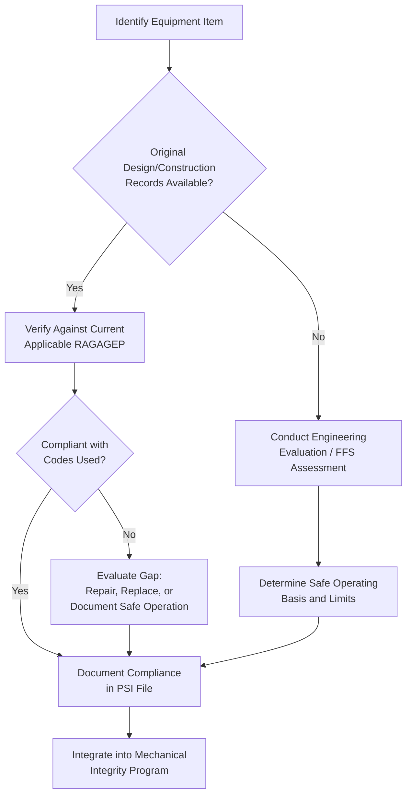

## Process Equipment Design and Engineering Standards

### Overview

Process Equipment Design and Engineering Standards form one of the three core pillars of Process Safety Information (PSI) under OSHA's Process Safety Management standard (29 CFR 1910.119), alongside hazards of the chemicals and technology of the process. This element requires employers to compile and maintain documentation demonstrating that process equipment is designed, fabricated, installed, and maintained in accordance with recognized and generally accepted good engineering practices (RAGAGEP).

### Regulatory Basis

**29 CFR 1910.119(d)(3)** requires the employer to document that equipment complies with recognized and generally accepted good engineering practices. Where existing equipment was designed and constructed in accordance with codes, standards, or practices that are no longer in general use, the employer must determine and document that the equipment is designed, maintained, inspected, tested, and operated in a safe manner.

**Key regulatory sub-elements:**

- 1910.119(d)(3)(i) — Compliance with RAGAGEP documentation requirement
- 1910.119(d)(3)(ii) — Determination and documentation for equipment predating current codes ("grandfathered" equipment)

### What RAGAGEP Encompasses

RAGAGEP is not a single document but a hierarchy of sources:

1. **Codes and standards from consensus organizations**
   - American Society of Mechanical Engineers (ASME) — Boiler and Pressure Vessel Code (BPVC), B31 Piping Codes
   - American Petroleum Institute (API) — API 510, 570, 653, 570, 750/754
   - National Fire Protection Association (NFPA) — NFPA 30, 68, 69, 70 (NEC), 85
   - International Society of Automation (ISA) — ISA 84 (Safety Instrumented Systems)
   - American National Standards Institute (ANSI)
   - American Institute of Chemical Engineers (AIChE) / Center for Chemical Process Safety (CCPS) guidelines
2. **Manufacturer's recommendations and specifications** — pump curves, vessel design specifications, instrument datasheets
3. **Internal, company-specific engineering standards** — provided they meet or exceed applicable consensus codes and are consistently documented and applied
4. **Prior industry practice** — for older equipment, historical codes in effect at time of design/construction may be acceptable if documented as safe for continued operation

### Core Engineering Standards by Equipment Category

#### Pressure Vessels and Tanks

| Standard | Scope | Key Requirements |
| --- | --- | --- |
| ASME BPVC Section VIII | Pressure vessel design/fabrication | Wall thickness, MAWP, relief device sizing |
| API 650 | Atmospheric storage tanks | Shell design, foundation, roof types |
| API 620 | Low-pressure storage tanks | Vacuum/pressure design for large-volume storage |
| API 510 | In-service pressure vessel inspection | Inspection intervals, corrosion rate calculations |

#### Piping Systems

| Standard | Scope |
| --- | --- |
| ASME B31.3 | Process piping design |
| ASME B31.1 | Power piping |
| API 570 | In-service piping inspection |

#### Relief and Venting Systems

- **API 520** (Parts I & II) — Sizing, selection, and installation of pressure-relieving devices
- **API 521** — Pressure-relieving and depressuring systems (overpressure scenario analysis)
- **NFPA 68** — Deflagration venting

#### Electrical Area Classification

- **NFPA 70 (NEC) Article 500-506** — Hazardous location classification
- **API RP 500 / API RP 505** — Classification of locations for petroleum facilities (Class I, Division vs. Zone systems)

#### Safety Instrumented Systems (SIS)

- **ISA 84.00.01 / IEC 61511** — SIL determination, SIF design, verification, and proof testing

### Documentation Package Contents

A complete PEDES documentation file for a given equipment item typically includes:

1. **Design basis documentation**
   - Design codes and editions used (with revision/year specified)
   - Design pressure, temperature, and material of construction (MOC)
   - Corrosion allowance calculations
2. **Fabrication and construction records**
   - Material certifications (mill test reports)
   - Weld procedure specifications (WPS) and welder qualifications
   - Non-destructive examination (NDE) records
   - Hydrostatic/pneumatic test records
3. **Nameplate and stamping data** — ASME "U" stamp, National Board registration number
4. **As-built drawings and specifications** — P&IDs, isometric drawings, general arrangement drawings
5. **Manufacturer's data reports** — ASME Form U-1 for pressure vessels

### Handling "Grandfathered" Equipment

For equipment designed and constructed before current codes existed, or where original documentation is unavailable, 1910.119(d)(3)(ii) requires the employer to:

1. Identify the equipment lacking full compliance documentation
2. Perform an engineering evaluation (often a fitness-for-service assessment per **API 579-1/ASME FFS-1**)
3. Document the basis for concluding the equipment is safe to operate
4. Establish ongoing inspection/testing intervals commensurate with the equipment's condition

$$t_{min} = \frac{PR}{SE - 0.6P}$$

Where $t_{min}$ is minimum required wall thickness, $P$ is design pressure, $R$ is inside radius, $S$ is allowable stress, and $E$ is the joint efficiency — this formula (per ASME BPVC Section VIII, Div. 1, UG-27) is frequently used when re-verifying older vessels against current allowable stress values as part of a grandfathering evaluation.

### Process Flow: Documentation Compliance Verification

### Interface with Other PSM Elements

Process Equipment Design and Engineering Standards documentation directly feeds into:

- **Mechanical Integrity (1910.119(j))** — Inspection/testing frequencies derive from the design codes referenced here
- **Process Hazard Analysis (1910.119(e))** — PHA teams reference design margins and relief system basis
- **Management of Change (1910.119(l))** — Any deviation from documented design standards triggers MOC review

### Common Compliance Gaps

- **Key Points**
  - Missing or incomplete manufacturer's data reports for legacy equipment
  - Failure to document the *specific edition/year* of the code used (codes are revised periodically; the applicable edition matters)
  - Internal standards that have not been formally benchmarked against current RAGAGEP
  - Equipment modified in the field without updating design documentation (an MOC failure that also breaks PEDES traceability)

[Inference] The frequency and depth of engineering evaluations for grandfathered equipment is highly facility- and jurisdiction-dependent, and specific practices should be confirmed against current OSHA interpretations, state-plan requirements, and insurer expectations.

### Example

A Batac City-scale analogy: consider a municipal LPG bulk storage installation. The design documentation package would need to demonstrate the storage vessel was fabricated per API 620/650 or ASME Section VIII, the relief valve was sized per API 520 against a fire-exposure scenario per API 521, and the electrical equipment in the vapor space classification zone meets NFPA 70/API RP 500 requirements — with each linked to a specific code edition and supported by fabrication/test records.

**Related Topics**

- Mechanical Integrity Program Elements (1910.119(j))
- Fitness-for-Service Assessment (API 579-1/ASME FFS-1)
- Pressure Relief Device Sizing and Testing (API 520/521)
- Electrical Area Classification Methodology
- Management of Change Procedures for Equipment Modifications
- Process Hazard Analysis Methodologies (HAZOP, What-If)