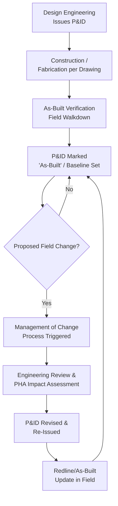

## Piping and Instrumentation Diagrams


### Overview

Piping and Instrumentation Diagrams (P&IDs) are a mandatory component of Process Safety Information under OSHA's PSM standard, 29 CFR 1910.119(d)(2)(i)(D). A P&ID is the schematic representation of the actual process, depicting all piping, equipment, instrumentation, and control systems in sufficient detail to understand the process's mechanical and control configuration. It is one of the most heavily referenced documents in a facility's PSM program because nearly every other element — PHA, MOC, MI, operating procedures — depends on it being current and accurate.

### Regulatory Basis

**29 CFR 1910.119(d)(2)** requires that PSI include information pertaining to the technology of the process, which must consist of, at minimum:

- (d)(2)(i)(D) — Piping and instrumentation diagrams (P&IDs)

Although the regulation cites P&IDs specifically as a required document, OSHA does not prescribe a drafting standard — facilities typically follow **ISA 5.1** (Instrumentation Symbols and Identification) as RAGAGEP for symbology and tagging conventions.

### Core Content Requirements

A compliant, PSM-quality P&ID must show:

1. **All process piping** — line sizes, specifications (material/schedule), and line numbers
2. **Equipment** — vessels, pumps, compressors, exchangers, drawn to reflect actual configuration (not necessarily to scale, but topologically accurate)
3. **Instrumentation** — all sensors, transmitters, controllers, and final control elements with ISA tag numbers
4. **Valves** — manual, control, relief, check, and isolation valves, correctly typed
5. **Safety devices** — pressure relief valves (PRVs), rupture disks, flame arrestors, with set points referenced
6. **Interlocks and control loops** — including Safety Instrumented Functions (SIFs) where applicable
7. **Flow direction arrows**
8. **Material Class boundaries / Piping Class breaks**
9. **Vents, drains, and sample points**
10. **Line list cross-reference numbers**

### ISA 5.1 Symbol Conventions

Instrument tags follow a standardized letter-code format: **[First-letter(s) = measured variable][Succeeding letters = function]-[Loop number]**

| Letter | Meaning (First Letter) | Letter | Meaning (Succeeding) |
| --- | --- | --- | --- |
| P | Pressure | I | Indicator |
| T | Temperature | C | Controller |
| F | Flow | T | Transmitter |
| L | Level | V | Valve |
| A | Analysis | S | Switch |
| P | Pressure | R | Recorder |

**Example tag:** `PIC-201` = Pressure Indicating Controller, loop 201

`LSH-105` = Level Switch High, loop 105

Instrument bubbles are drawn as circles; a horizontal line through the bubble denotes field-mounted vs. control-room-mounted instrumentation, per ISA 5.1 conventions.

### Line Numbering Convention (Typical Format)



```
[Line Size]-[Fluid Service Code]-[Sequential Number]-[Piping Class]-[Insulation Code]
```

Example: `6"-P-1042-A1S` = 6-inch process line, sequence 1042, piping class A1, steam-traced insulation.

### P&ID Symbol Reference (SVG Diagram)

<svg xmlns="http://www.w3.org/2000/svg" viewBox="0 0 900 420" font-family="Arial, sans-serif" font-size="13">
<text x="450" y="24" text-anchor="middle" font-size="16" font-weight="bold">Common P&amp;ID Symbols (svg_diagram)</text>

<rect x="40" y="60" width="60" height="90" rx="10" fill="none" stroke="#222" stroke-width="2" />
<text x="70" y="170" text-anchor="middle">Vessel</text>

<circle cx="220" cy="105" r="30" fill="none" stroke="#222" stroke-width="2" />
<path d="M 220 75 L 240 105 L 220 135 Z" fill="none" stroke="#222" stroke-width="2" />
<text x="220" y="170" text-anchor="middle">Centrifugal Pump</text>

<path d="M 340 90 L 370 120 L 340 150 Z" fill="none" stroke="#222" stroke-width="2" />
<path d="M 400 90 L 370 120 L 400 150 Z" fill="none" stroke="#222" stroke-width="2" />
<text x="370" y="170" text-anchor="middle">Gate Valve</text>

<path d="M 480 90 L 510 120 L 480 150 Z" fill="none" stroke="#222" stroke-width="2" />
<path d="M 540 90 L 510 120 L 540 150 Z" fill="none" stroke="#222" stroke-width="2" />
<line x1="510" y1="90" x2="510" y2="60" stroke="#222" stroke-width="2" />
<rect x="495" y="35" width="30" height="25" fill="none" stroke="#222" stroke-width="2" />
<text x="510" y="170" text-anchor="middle">Control Valve</text>

<path d="M 610 150 L 610 110 L 595 90 L 625 90 Z" fill="none" stroke="#222" stroke-width="2" />
<text x="610" y="170" text-anchor="middle">Relief Valve</text>

<circle cx="720" cy="110" r="24" fill="none" stroke="#222" stroke-width="2" />
<text x="720" y="115" text-anchor="middle" font-size="12">PIC</text>
<text x="720" y="170" text-anchor="middle">Field Instrument</text>

<circle cx="830" cy="110" r="24" fill="none" stroke="#222" stroke-width="2" />
<line x1="806" y1="110" x2="854" y2="110" stroke="#222" stroke-width="2" />
<text x="830" y="106" text-anchor="middle" font-size="12">TIC</text>
<text x="830" y="122" text-anchor="middle" font-size="12">301</text>
<text x="830" y="170" text-anchor="middle">DCS-Mounted</text>

<line x1="40" y1="230" x2="120" y2="230" stroke="#222" stroke-width="3" />
<text x="130" y="235">Process Line (major)</text>
<line x1="40" y1="260" x2="120" y2="260" stroke="#222" stroke-width="1" />
<text x="130" y="265">Instrument Signal Line</text>
<line x1="40" y1="290" x2="120" y2="290" stroke="#222" stroke-width="2" stroke-dasharray="6,4" />
<text x="130" y="295">Pneumatic Signal</text>
<line x1="40" y1="320" x2="120" y2="320" stroke="#222" stroke-width="1" stroke-dasharray="2,2" />
<text x="130" y="325">Electrical Signal</text>
<rect x="20" y="200" width="860" height="150" fill="none" stroke="#999" stroke-width="1" />
</svg>

### P&ID Lifecycle and Revision Control

P&IDs are living documents. PSM compliance hinges on the drawing accurately reflecting the *as-built, as-operated* condition of the process at all times.



### Field Verification / Walkdown Requirement

OSHA enforcement history and industry guidance (CCPS) emphasize that P&IDs must be periodically **field-verified** against actual installed equipment — a "walkdown" — because undocumented field changes are a leading root cause in major incidents (e.g., BP Texas City, 2005). Typical practice:

- Walkdowns performed on a defined interval (often tied to PHA revalidation cycle, e.g., every 5 years)
- Discrepancies logged and resolved through MOC before drawing is marked "verified"
- Redline markups converted to CAD updates and version-controlled

### Interface with Other PSM Elements

| PSM Element | P&ID Dependency |
| --- | --- |
| Process Hazard Analysis | PHA teams use P&IDs as the primary reference for node breakdown and deviation analysis |
| Management of Change | Any physical/process change must be reflected on the P&ID before/at MOC closure |
| Mechanical Integrity | Inspection scope (piping circuits, valve lists) is derived from P&ID line lists |
| Operating Procedures | SOPs reference line/valve tags exactly as shown on the P&ID |
| Incident Investigation | Root cause analysis relies on P&ID accuracy to reconstruct event sequence |

### Common Compliance Gaps

- **Key Points**
  - "Design intent" P&IDs never updated to as-built status after construction
  - Field modifications made without triggering MOC, leaving drawings out of sync
  - Inconsistent or missing ISA 5.1 tag conventions across legacy vs. new drawings
  - No formal periodic field-verification/walkdown program
  - Redlines accumulating in the field without timely incorporation into the controlled drawing set

[Inference] Specific walkdown intervals and redline-to-CAD turnaround expectations vary by company procedure and applicable state-plan OSHA interpretation; facilities should confirm current practice against their own PSM program documentation and any citation history.

### Example

For a chlorine gas scrubber system, the P&ID would show the scrubber vessel, the caustic circulation pump (`P-101`), a pH analyzer transmitter (`AIT-110`) feeding a controller (`AIC-110`) that modulates a caustic makeup control valve (`FCV-111`), a high-level switch (`LSH-105`) interlocked to trip the feed gas isolation valve, and a relief line routed to a vent scrubber — each element tagged, line-numbered, and cross-referenced to the facility's line list and instrument index.

**Related Topics**

- ISA 5.1 Instrumentation Symbols and Identification
- Management of Change (MOC) Procedures
- Process Hazard Analysis Node Definition Using P&IDs
- Line List and Instrument Index Development
- Field Walkdown and As-Built Verification Programs
- Safety Instrumented System (SIS) Documentation on P&IDs