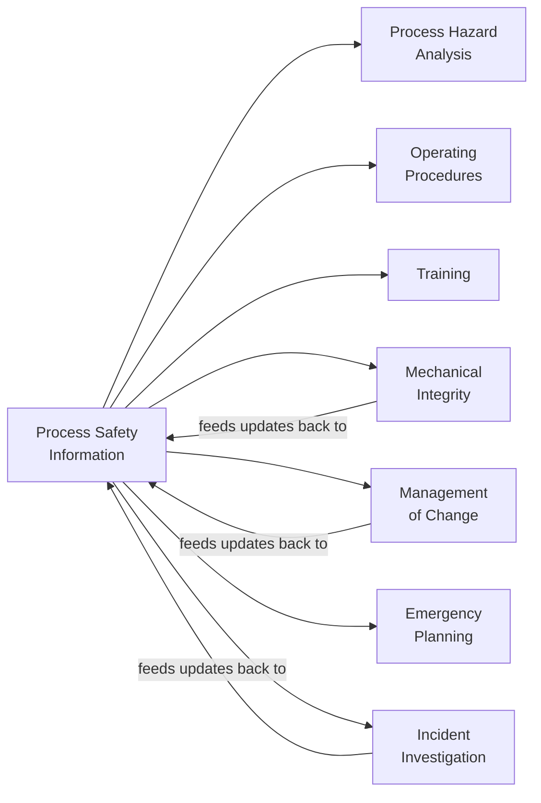
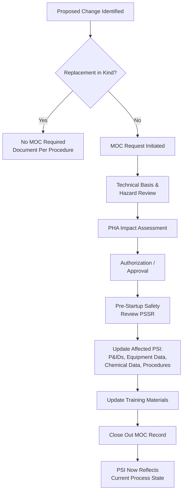

## Maintaining and Updating Process Safety Information

### Overview

Maintaining and Updating Process Safety Information (PSI) is the lifecycle-management discipline that keeps a facility's PSM documentation set — chemical hazard data, technology-of-process data, and equipment design data — accurate and current throughout the operating life of a process. Unlike the other PSI elements, which define *what* information must exist, this element governs the *ongoing integrity* of that information: without a disciplined update mechanism, PSI decays the moment the facility deviates from its original design, making it the connective tissue between PSI and virtually every other PSM element.

### Regulatory Basis

OSHA's PSM standard does not contain a single stand-alone subsection titled "maintaining PSI" — instead, the obligation is distributed and reinforced across several interlocking provisions:

- **29 CFR 1910.119(d)** — establishes the PSI compilation duty itself (written information on hazards, technology, and equipment), which by implication must remain a truthful, current record
- **29 CFR 1910.119(l)** — Management of Change (MOC): requires that any change to process chemicals, technology, equipment, or procedures (other than replacement-in-kind) trigger a review, and that "the information...updated accordingly" — this is the primary regulatory hook that operationalizes PSI updates
- **29 CFR 1910.119(m)** — Incident Investigation: findings/recommendations often necessitate PSI corrections
- **29 CFR 1910.119(e)(2)** and **(e)(6)** — PHA and its 5-year revalidation cycle rely on PSI being current at the time of analysis; stale PSI invalidates PHA findings
- **29 CFR 1910.119(j)** — Mechanical Integrity: inspection/test results feed back into equipment design documentation (e.g., updated corrosion rates, remaining life calculations)

OSHA's PSM directive (CPL 03-00-014, National Emphasis Program) and letters of interpretation have repeatedly affirmed that PSI accuracy is a "living" requirement — inspectors will cite an employer if PSI is found inconsistent with the actual, current state of the process, even absent a specific "update" clause.

### Why This Element Exists as Its Own Discipline

PSI is consumed by nearly every downstream PSM element. If it is not actively maintained, the entire program degrades silently:

Because PSI sits upstream of PHA, procedures, and training, an unmaintained PSI record propagates errors into every one of those elements — a failure mode frequently cited as a root or contributing cause in CSB investigations (e.g., West Fertilizer, Bayer CropScience, DuPont La Porte).

### Primary Update Triggers

| Trigger Event | PSI Elements Typically Affected |
| --- | --- |
| Management of Change (any covered change) | Equipment design docs, P&IDs, chemical inventory data |
| New chemical introduced to process | Safety Data Sheets, hazard data compilation |
| Equipment replacement (not in-kind) | Equipment design/engineering standards documentation |
| PHA revalidation findings | P&IDs, procedures, equipment data corrections |
| Mechanical Integrity inspection results | Corrosion rates, remaining wall thickness, fitness-for-service basis |
| Incident investigation recommendations | Any PSI element implicated in root cause |
| Regulatory/code revision affecting RAGAGEP basis | Equipment design standards documentation |
| Facility siting study update | Equipment layout, spacing documentation |

### The MOC-to-PSI Update Workflow

A critical control point is **Pre-Startup Safety Review (PSSR)** under 1910.119(i): PSSR explicitly requires confirmation that construction/equipment is in accordance with design specifications *and* that P&IDs and other PSI have been updated — making PSSR the final gate that prevents an un-updated PSI record from going into service.

### Document Control Requirements for PSI Maintenance

A robust PSI maintenance system requires formal document control practices, typically including:

1. **Version control** — revision numbers, dates, and change history on every PSI document (P&IDs, MSDS/SDS index, equipment files)
2. **Single source of truth** — designated master/controlled copies (paper or electronic) with distribution control to prevent obsolete copies remaining in use
3. **Defined ownership** — each PSI document type assigned a responsible engineer/custodian accountable for updates
4. **Periodic verification/audit** — field walkdowns (e.g., P&ID as-built verification) on a defined cycle, often tied to the PHA revalidation cycle (5 years) or more frequently for high-risk equipment
5. **Change traceability** — every PSI update traceable back to its triggering MOC, incident investigation, or inspection record

### Electronic Document Management Considerations

Modern PSM programs increasingly use electronic Document Management Systems (DMS) to enforce PSI currency — directly relevant architecture pattern:

- **Controlled-document workflow states**: Draft → Under Review → Approved/Published → Superseded
- **Linkage/traceability**: MOC records linked bidirectionally to the specific PSI documents they modify, so an auditor can trace forward (MOC → updated document) and backward (document → originating change record)
- **Access control**: read-only distribution of published/current revisions to field/operations users; edit rights restricted to document owners
- **Audit trail**: immutable log of who changed what, when, and under what authorization
- **Automated obsolescence handling**: superseded revisions retained for historical/investigation purposes but clearly marked non-current and removed from active-use views
- **Revalidation scheduling/reminders**: automated flags when a document approaches its periodic review due date

[Inference] The specific system architecture patterns above (workflow states, bidirectional MOC linkage, automated revalidation reminders) reflect common industry practice in PSM-oriented document management systems rather than an explicit OSHA-mandated software design; the regulation specifies the outcome (accurate, current PSI) not the tooling.

### Auditing PSI Currency

**29 CFR 1910.119(o)** (Compliance Audits, conducted at least every 3 years) explicitly includes verification that PSI is being properly maintained. Auditors typically check for:

- Consistency between P&IDs and field-verified equipment configuration
- Whether all MOC records from the audit period have corresponding PSI updates
- Whether SDS/hazard data reflects current chemical inventory
- Whether equipment design documentation reflects the current RAGAGEP basis, including any re-rating or fitness-for-service determinations
- Whether superseded documents have been properly retired from active circulation

### Common Compliance Gaps

- **Key Points**
  - MOC closed out administratively without the linked PSI documents actually being revised ("MOC completed on paper, drawings never touched")
  - No defined document owner, so updates fall through organizational cracks
  - Field redlines accumulate for months/years without formal incorporation into controlled drawings
  - PHA revalidation performed against outdated P&IDs, invalidating the hazard analysis
  - Electronic and paper copies diverge because distribution control was not enforced
  - Incident investigation recommendations tracked to closure operationally but never reflected in the underlying PSI record

### Example

A batac-dms-style scenario: an LGU facility replaces a corroded carbon-steel process line with a stainless-steel line of different schedule during a repair (not a strict replacement-in-kind due to the material change). This triggers MOC. The MOC technical review updates the piping specification; PSSR confirms the physical installation matches the new spec before startup; the P&ID line number annotation is revised to reflect the new material class; the line list and equipment design documentation are updated accordingly; and the MOC record is cross-referenced to each updated document so a future auditor can trace the change end-to-end.

**Next Steps**

- Pre-Startup Safety Review (PSSR) Requirements
- Management of Change (MOC) Procedure Design
- Compliance Audit Program Structure (1910.119(o))
- Document Control System Architecture for PSM
- PHA Revalidation Cycle and Its Dependency on Current PSI
- Incident Investigation Recommendation Tracking and Closure