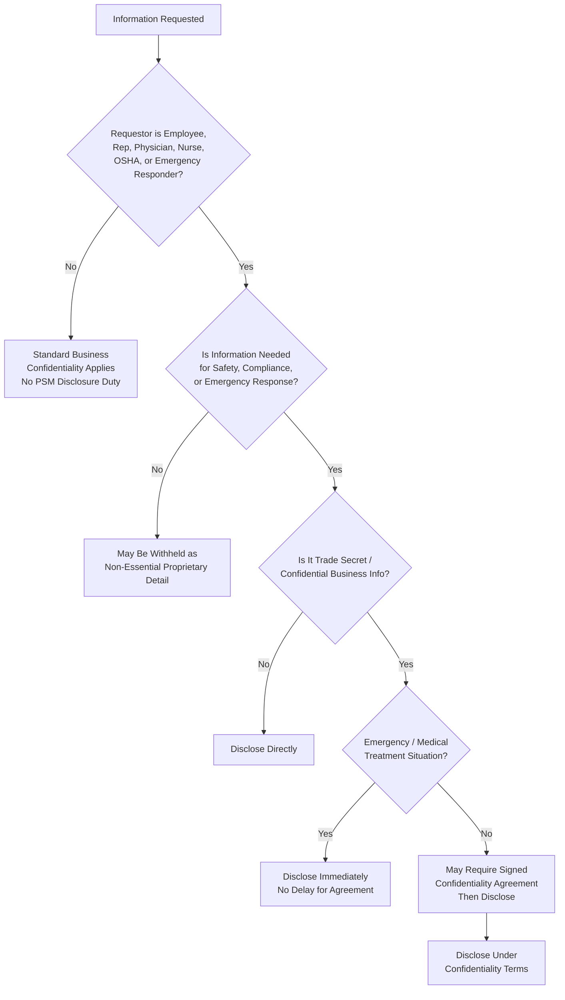

## Managing Trade Secrets and Confidential Information

### Overview

Managing Trade Secrets and Confidential Information addresses the tension between OSHA's PSM requirement to disclose complete Process Safety Information to employees, their representatives, and emergency responders, and an employer's legitimate interest in protecting proprietary chemical formulations, process technology, and other confidential business information. OSHA resolves this tension not by allowing withholding of safety-critical information, but by requiring disclosure while permitting employers to manage *how* trade secret information is handled and safeguarded.

### Regulatory Basis

**29 CFR 1910.119(f)(3)** governs trade secrets in the context of Operating Procedures, but the controlling and most frequently cited provision is:

**29 CFR 1910.119(d)(3)(iii)**, cross-referenced to **29 CFR 1910.1200(i)** (Hazard Communication Standard trade secret provisions), and most directly:

**29 CFR 1910.119(f)(3) and 1910.119(o)(4)** establish that:

- Employers **must** provide all information required under PSM (including trade secret information) to employees, their designated representatives, and to physicians/nurses providing medical treatment, **regardless of trade secret status**, when needed for compliance purposes
- Employers **may** require signed confidentiality agreements before disclosing trade secret information to those parties
- Trade secret status **does not exempt** an employer from disclosure to OSHA compliance officers during an inspection, or from disclosure needed for emergency response planning

The core principle: **trade secret protection governs confidentiality handling, not disclosure exemption.** Safety-relevant information cannot be withheld from those who need it to work safely or respond to an emergency; the employer's remedy for protecting proprietary interests is confidentiality agreements and controlled access, not concealment.

### Who Is Entitled to Trade Secret Information

| Party | Entitlement Basis | Confidentiality Agreement Permitted? |
| --- | --- | --- |
| Employees performing covered work | 1910.119(d), (f), (g) | Yes |
| Designated employee representatives | 1910.119(c)(1) | Yes |
| Treating physicians/nurses (emergency/exposure) | 1910.1200(i) cross-reference | Yes, but cannot delay emergency treatment |
| OSHA compliance officers | Inspection authority | No — must be provided; OSHA has its own confidentiality protections (18 U.S.C. § 1905, Trade Secrets Act) |
| Local Emergency Planning Committees (LEPC) / responders | EPCRA interface | Yes, subject to LEPC confidentiality handling |
| Contractors performing covered work | 1910.119(h) | Yes |

### Permissible Employer Safeguards

Employers may implement reasonable procedural safeguards without violating the disclosure obligation:

1. **Confidentiality/non-disclosure agreements** — may be required as a precondition of disclosure to employees or representatives, but cannot be used to deny disclosure outright
2. **Restricted document access controls** — need-to-know distribution of the most sensitive technical details (e.g., exact catalyst formulations) while still providing the safety-relevant hazard data (e.g., reactivity, toxicity, exposure limits) in full
3. **Redaction strategy for non-safety-critical proprietary detail** — e.g., withholding exact reagent ratios or proprietary process sequencing *while still disclosing* all hazard classifications, exposure limits, reactive hazards, and safe handling requirements
4. **Physical/electronic security controls** on documents containing trade secret PSI (access logging, restricted repositories)

**Critical constraint:** none of these safeguards may result in withholding information that employees need to safely perform their jobs or that emergency responders need to plan for and respond to a release. If a chemical identity itself is safety-critical (e.g., for medical treatment or firefighting tactics), it must be disclosed even if formally a trade secret — HazCom's emergency-disclosure override applies by cross-reference.

### Decision Flow: Determining Disclosure Obligations

### Interaction with Hazard Communication Standard (HCS)

Because 1910.119 incorporates 1910.1200(i) by reference for trade secret handling, the HCS trade secret framework directly governs PSM trade secret disputes:

- A manufacturer/employer withholding a specific chemical identity as trade secret on an SDS must still disclose it **immediately** to a treating physician or nurse in a medical emergency, and to a physician/nurse in a non-emergency **within a reasonable time** upon written request with standard non-disclosure terms
- If OSHA disputes a trade secret claim during enforcement, the employer bears the burden of substantiating the claim (following the same criteria used under HCS: information is not generally known, provides competitive advantage, and reasonable measures were taken to maintain secrecy)

### Documentation Practices for Trade Secret PSI Management

A well-structured program typically maintains:

1. **A trade secret inventory/register** — identifying which specific PSI elements are claimed as trade secret and the justification
2. **A standard confidentiality agreement template** — pre-approved by legal counsel, ready for execution by employees/representatives/physicians upon request
3. **A defined internal approval workflow** — for evaluating and granting trade secret disclosure requests without unreasonable delay
4. **Redacted vs. full-disclosure document versions** — where appropriate, maintaining a publicly/broadly accessible version (redacted of non-safety-critical proprietary detail) alongside a full version accessible under confidentiality agreement
5. **An emergency-override protocol** — ensuring on-shift supervisors/medical staff know they can and must disclose trade secret chemical identity immediately during a medical emergency, without waiting for legal sign-off

[Inference] The specific internal workflow structures described above (trade secret register, pre-approved NDA templates, emergency-override protocols) represent common industry-recommended practice for operationalizing the regulation's requirements; OSHA's text mandates the disclosure outcome and confidentiality-agreement mechanism but does not prescribe internal document architecture.

### Common Compliance Gaps

- **Key Points**
  - Using "trade secret" as a blanket justification to withhold entire PSI documents rather than only the specific proprietary elements
  - Requiring a signed confidentiality agreement *before* providing information in a genuine medical emergency (prohibited — emergency disclosure cannot be delayed)
  - No documented process for employees/representatives to actually request and receive trade secret information, leaving the right theoretical rather than practical
  - Failing to disclose trade secret chemical identity to OSHA during an inspection
  - Confusing "confidential business information" broadly with the narrower legal standard for a substantiated trade secret claim

### Example

A specialty chemical manufacturer uses a proprietary catalyst blend in a reactive process. The exact catalyst formulation and supplier are legitimately trade secret. However, the PSI made available to operators and emergency responders fully discloses the catalyst's reactivity hazards, thermal stability data, incompatible materials, and required PPE — only the precise proprietary composition ratio is withheld, and that detail is made available to a treating physician immediately upon a medical emergency without any agreement being a precondition.

**Related Topics**

- Hazard Communication Standard Trade Secret Provisions (1910.1200(i))
- Emergency Response Planning and Information Sharing (EPCRA/LEPC)
- Employee and Representative Access Rights Under PSM (1910.119(c))
- Confidentiality Agreement Drafting for Safety-Critical Disclosures
- OSHA Trade Secret Claim Substantiation Criteria
- Contractor Access to Process Safety Information (1910.119(h))