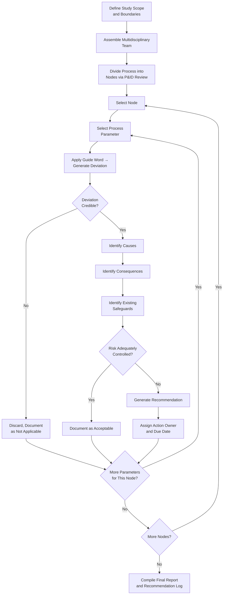

## Hazard and Operability Study HAZOP

### Overview

Hazard and Operability Study (HAZOP) is a structured, systematic technique for identifying potential hazards and operability problems in a process by applying a set of standardized guide words to process parameters at defined study nodes. Originally developed by ICI in the 1960s and formalized in **IEC 61882**, HAZOP is one of the most widely used Process Hazard Analysis (PHA) methodologies under OSHA's PSM standard, particularly favored for complex, continuous processes with significant interconnected instrumentation and control.

### Regulatory Basis

**29 CFR 1910.119(e)(2)** lists HAZOP explicitly as one of the acceptable PHA methodologies:

> "The employer shall use one or more of the following methodologies... What-If, Checklist, What-If/Checklist, Hazard and Operability Study (HAZOP), Failure Mode and Effects Analysis (FMEA), Fault Tree Analysis, or an appropriate equivalent methodology."

While OSHA does not mandate HAZOP specifically, it is the de facto standard for highly hazardous chemical processes with complex continuous operations, and is frequently selected to satisfy the PHA methodology requirement for such processes. **29 CFR 1910.119(e)(3)** specifies the minimum content the chosen methodology must address (hazards, prior incidents, engineering/administrative controls, consequences of failure, facility siting, human factors, and qualitative evaluation of range of effects).

### Core Methodology

HAZOP works by dividing the process into discrete **nodes** (sections of the P&ID with a consistent design intent — e.g., "feed line from Tank T-101 to Pump P-101"), then systematically applying **guide words** to each relevant **process parameter** at that node to generate **deviations**. Each deviation is examined for causes, consequences, existing safeguards, and the need for additional recommendations.

$$\text{Deviation} = \text{Guide Word} \times \text{Process Parameter}$$

### Standard Guide Words (IEC 61882)

| Guide Word | Meaning | Example Deviation |
| --- | --- | --- |
| NO / NOT | Complete negation of intent | No Flow |
| MORE | Quantitative increase | More Pressure |
| LESS | Quantitative decrease | Less Temperature |
| AS WELL AS | Qualitative increase (additional element) | More + Contamination |
| PART OF | Qualitative decrease (only part of intent) | Part of Composition |
| REVERSE | Logical opposite of intent | Reverse Flow |
| OTHER THAN | Complete substitution | Other Than Intended Material |
| EARLY / LATE | Timing deviation (relative to sequence) | Late Addition |
| BEFORE / AFTER | Sequence deviation | Step Performed Out of Order |

### Common Process Parameters

Flow, Pressure, Temperature, Level, Composition, Phase, Reaction, Addition, Mixing, Separation, Speed, Viscosity, Time/Sequence (for batch processes).

### HAZOP Deviation Matrix Example

| Guide Word | Parameter | Deviation | Possible Cause | Possible Consequence | Existing Safeguard |
| --- | --- | --- | --- | --- | --- |
| NO | Flow | No flow in feed line | Pump P-101 failure; valve closed | Reactor runs dry; possible dry-run damage; downstream starvation | Low-flow alarm FAL-101; pump trip interlock |
| MORE | Pressure | High pressure in reactor | Cooling water failure; runaway reaction | Vessel overpressure; PRV lift; potential rupture if PRV undersized | PSV-201 sized per API 520; high-pressure alarm |
| MORE | Temperature | High temperature in reactor | Loss of cooling; agitator failure | Runaway exothermic reaction | TIC-105 with high-temp trip; emergency cooling |
| REVERSE | Flow | Backflow from downstream | Check valve failure; pressure differential reversal | Contamination of feed system; potential reaction of incompatible materials | Check valve CV-110; procedure requiring verification |
| OTHER THAN | Composition | Wrong material charged | Operator error; mislabeled drum | Unintended reaction; off-spec product; potential hazardous byproduct | Material verification procedure; barcode scanning |

### HAZOP Study Workflow

### Team Composition Requirements

**29 CFR 1910.119(e)(4)** requires the PHA to be performed by a team with expertise in engineering and process operations, including at least one employee with experience and knowledge specific to the process being evaluated, and one member knowledgeable in the specific PHA methodology used (typically the HAZOP facilitator/leader).

Typical HAZOP team composition:

- **Facilitator/Team Leader** — trained and experienced in HAZOP methodology; drives the systematic guide-word application; remains impartial
- **Scribe/Recorder** — documents deviations, discussion, and recommendations in real time (often using dedicated HAZOP software)
- **Process/Design Engineer** — provides technical basis for the process design
- **Operations representative** — provides operating experience and practical insight into how the process actually runs
- **Maintenance representative** — provides equipment failure history and reliability insight
- **Instrumentation/Controls engineer** — for processes with complex control/interlock systems
- **Safety/PSM coordinator** — ensures regulatory completeness and links findings to the broader PSM program

### Node Selection Strategy

Effective node boundaries are typically drawn at points where:

- Process intent changes (e.g., transitions from feed to reaction to separation)
- A significant piece of equipment exists (vessel, pump, heat exchanger)
- Line size, specification, or piping class changes
- Batch step boundaries occur (for batch processes)

Overly large nodes risk missing hazards; overly granular nodes create excessive redundancy and study fatigue — node sizing is a facilitator judgment calibrated to process complexity.

### Risk Ranking Integration

Many HAZOP implementations incorporate a **risk matrix** (severity × likelihood) to prioritize recommendations, though this is a supplementary practice, not a core HAZOP requirement:

|  | Likelihood: Low | Likelihood: Medium | Likelihood: High |
| --- | --- | --- | --- |
| **Severity: Catastrophic** | Medium | High | High |
| **Severity: Serious** | Low | Medium | High |
| **Severity: Minor** | Low | Low | Medium |

[Inference] Specific risk matrix dimensions, scoring criteria, and color-coding conventions vary significantly by company procedure; OSHA's PSM standard requires qualitative evaluation of hazard range/effects but does not mandate a specific risk-ranking matrix format.

### Strengths and Limitations

**Key Points**

- **Strengths:** highly systematic and thorough; strong at identifying deviations from design intent; well-suited to continuous, complex, and highly instrumented processes; produces a structured, auditable record
- **Limitations:** time- and resource-intensive relative to What-If or Checklist methods; effectiveness heavily dependent on facilitator skill and P&ID accuracy (see Piping and Instrumentation Diagrams maintenance); can suffer from "guide-word fatigue" on long studies, reducing team engagement and thoroughness; less naturally suited to procedural/batch sequence hazards without supplementary techniques (e.g., combined with What-If for human-factors/sequence issues)

### Revalidation Requirement

**29 CFR 1910.119(e)(6)** requires PHAs (including HAZOPs) be revalidated at least every 5 years. Revalidation may be a full re-study or a "revalidation" methodology confirming the original study remains valid, but in either case depends critically on P&IDs and other PSI being current (see Maintaining and Updating Process Safety Information) — a HAZOP performed against outdated drawings produces findings of limited validity.

### Common Compliance Gaps

- Facilitator lacking formal HAZOP training or sufficient independence from the design team
- Nodes drawn against outdated or unverified P&IDs
- Recommendations generated but not tracked to resolution (a separate PSM requirement under 1910.119(e)(5))
- Team missing required operations-experienced member per 1910.119(e)(4)
- Guide words applied mechanically without genuine causal/consequence analysis ("checkbox HAZOP")

### Example

For a node covering the feed line into an exothermic batch reactor: applying **MORE + Flow** might reveal that an oversized feed valve opening too quickly could cause a runaway reaction rate before cooling capacity engages — leading to a recommendation for a flow-restricting orifice and a rate-of-addition interlock, cross-referenced to both the P&ID (updated per MOC) and the operating procedure's charging sequence.

**Related Topics**

- What-If and Checklist Analysis Methodologies
- Failure Mode and Effects Analysis (FMEA)
- Fault Tree Analysis and Quantitative Risk Assessment
- PHA Revalidation Requirements (1910.119(e)(6))
- Layer of Protection Analysis (LOPA) as a HAZOP Follow-On
- Recommendation Tracking and Resolution Systems