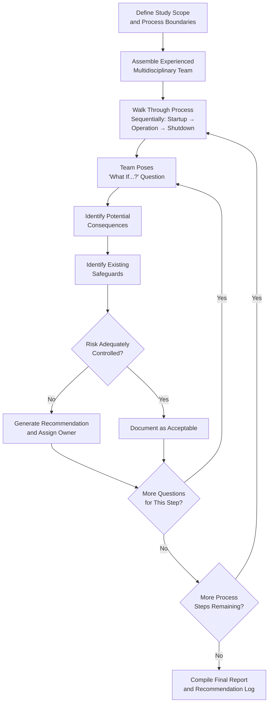
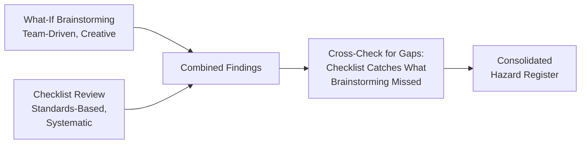

## What-If Analysis

### Overview

What-If Analysis is a structured brainstorming technique used as a Process Hazard Analysis (PHA) methodology in which an experienced team poses a series of exploratory "what if...?" questions about a process to identify hazards, consequences, and existing safeguards. It is less rigidly systematic than HAZOP, relying more heavily on team experience and creative questioning than on a fixed guide-word/parameter matrix, making it faster to execute but more dependent on the breadth and depth of team expertise.

### Regulatory Basis

**29 CFR 1910.119(e)(2)** explicitly lists What-If as an acceptable PHA methodology:

> "...What-If, Checklist, What-If/Checklist, Hazard and Operability Study (HAZOP), Failure Mode and Effects Analysis (FMEA), Fault Tree Analysis, or an appropriate equivalent methodology."

As with all PHA methodologies chosen under PSM, the study must still satisfy the substantive content requirements of **29 CFR 1910.119(e)(3)**: identification of hazards, review of prior incidents with catastrophic potential, engineering and administrative controls applicable to the hazards, consequences of control failure, facility siting, human factors, and a qualitative evaluation of the range of possible safety/health effects on employees.

### Core Methodology

Unlike HAZOP's mechanical application of guide words to parameters, What-If Analysis proceeds through open-ended, experience-driven questioning organized around a logical walk-through of the process — typically following the process flow from raw material receipt through to final product, or organized by operational phase (startup, normal operation, shutdown, maintenance).

**Typical question stems:**

- "What if the pump fails while the vessel is being filled?"
- "What if the wrong chemical is delivered to this tank?"
- "What if power is lost during the reaction?"
- "What if an operator opens the wrong valve?"
- "What if two incompatible materials are inadvertently mixed?"
- "What if the relief valve fails to lift?"

Each question is developed collaboratively; the team is encouraged to build on one another's questions rather than following a fixed template, which is the technique's principal strength (creative hazard discovery) and principal weakness (potential for gaps if the team lacks sufficiently broad expertise).

### What-If Analysis Workflow

### Standard Documentation Format

| What-If Question | Consequence | Existing Safeguards | Recommendation |
| --- | --- | --- | --- |
| What if the feed pump fails while charging the reactor? | Incomplete charge; possible off-ratio reaction if not detected | Flow indicator FI-101; batch recipe verification step | Add low-flow alarm with operator acknowledgment requirement |
| What if an operator opens the drain valve instead of the sample valve? | Uncontrolled release of process material; potential exposure | Valve tagging; standard operating procedure | Implement distinct valve handle color-coding; interlock drain valve during operation |
| What if cooling water supply is lost during an exothermic reaction? | Temperature excursion; potential runaway reaction | High-temperature alarm TAH-105; emergency cooling water backup | Verify backup cooling capacity is adequate via engineering calculation |
| What if a delivery truck offloads the wrong chemical into the storage tank? | Unintended reaction in storage; potential toxic gas generation | Unique fill connections (camlock keying); delivery verification checklist | Formalize pre-offload verification as a documented, signed step |
| What if the emergency shutdown system fails to activate on demand? | Loss of last line of defense during an upset | Periodic ESD testing per maintenance schedule | Increase ESD test frequency; add diagnostic self-test capability |

### The What-If/Checklist Hybrid Approach

OSHA and industry guidance frequently recommend combining What-If Analysis with a **Checklist** review — explicitly named as its own acceptable methodology ("What-If/Checklist") — to offset What-If's dependence on team creativity with the systematic completeness of a checklist derived from codes, standards, and lessons-learned databases.

Typical checklist sources feeding this hybrid approach include OSHA PSM guidance documents, NFPA/API code checklists, CCPS process safety checklists, and the facility's own incident/near-miss history.

### Team Composition Requirements

Per **29 CFR 1910.119(e)(4)**, the same team composition requirements apply regardless of methodology chosen: the team must have expertise in engineering and process operations, include at least one employee with specific experience and knowledge of the process being evaluated, and one member knowledgeable in the specific methodology (here, an experienced What-If facilitator).

Because What-If relies more heavily on tacit team knowledge than HAZOP's structured prompts, team composition breadth is disproportionately important — a narrow team increases the risk of significant hazard gaps.

### Strengths and Limitations

**Key Points**

- **Strengths:** faster and less resource-intensive than HAZOP for simpler or lower-complexity processes; flexible and adaptable to procedural, administrative, and human-factors hazards as easily as equipment hazards; well suited to batch, non-routine, or maintenance-activity analysis where a fixed guide-word approach is less natural
- **Limitations:** less systematic — completeness depends heavily on team experience and creativity, with no structural guarantee that all deviations have been considered; harder to demonstrate exhaustive coverage during an audit or after an incident compared to HAZOP's node-by-node matrix; documentation quality varies more by facilitator skill than in more rigid methodologies
- OSHA and CCPS guidance generally suggest What-If is best suited to less complex processes, or as a **complement** to HAZOP for the operational/procedural aspects of a process (startup, shutdown, and maintenance activities) even when HAZOP is the primary methodology for the core continuous process

### Selecting What-If vs. HAZOP

| Factor | Favors What-If | Favors HAZOP |
| --- | --- | --- |
| Process complexity | Simple to moderate | Highly complex, continuous |
| Instrumentation density | Low to moderate | High, heavily interlocked |
| Time/resource constraints | Tighter constraints | More resources available |
| Team experience depth | Very experienced, broad team | Adequate but less broad |
| Need for auditable, exhaustive coverage | Lower priority | High priority |
| Procedural/human-factors emphasis | Strong fit | Requires supplementation |

### Revalidation Requirement

As with all PHA methodologies, **29 CFR 1910.119(e)(6)** requires revalidation at least every 5 years. A What-If revalidation should reconfirm that previously identified consequences and safeguards remain valid against the current process configuration, drawing on current PSI (see Maintaining and Updating Process Safety Information).

### Common Compliance Gaps

- Team lacking sufficiently broad or deep operational experience, producing an incomplete hazard set
- No systematic walk-through structure, resulting in ad hoc, disorganized questioning that skips process phases (e.g., maintenance/turnaround scenarios overlooked)
- What-If used alone for a highly complex, densely instrumented process where HAZOP would be more appropriate RAGAGEP
- Recommendations generated but not tracked to resolution per the separate PSM tracking requirement (1910.119(e)(5))
- Checklist component of a What-If/Checklist study not actually cross-referenced against current codes/standards

### Example

During a What-If session on a batch chemical blending operation, a team member asks: "What if the agitator is started before the correct fill level is reached?" The team identifies a consequence of localized high-concentration splashing and potential seal damage, notes the existing safeguard (a low-level interlock preventing agitator start), and recommends adding an independent level verification step to the batch sheet as a redundant administrative control, given the interlock's single point of failure.

**Related Topics**

- Hazard and Operability Study (HAZOP)
- Checklist Analysis Methodology
- Failure Mode and Effects Analysis (FMEA)
- PHA Team Composition Requirements (1910.119(e)(4))
- PHA Recommendation Resolution and Tracking
- Human Factors Considerations in Process Hazard Analysis