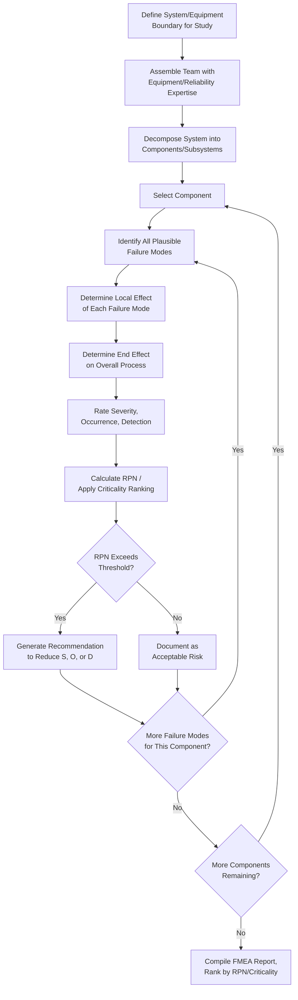

## Failure Mode and Effects Analysis

### Overview

Failure Mode and Effects Analysis (FMEA) is a bottom-up, inductive Process Hazard Analysis methodology that systematically evaluates individual components or equipment items to identify how each could fail, the effect of that failure on the system, and the significance of that failure. Originally developed for aerospace and later formalized for broader industrial use in **MIL-STD-1629A** and **IEC 60812**, FMEA differs fundamentally from HAZOP and What-If in that it is **equipment/component-centric** rather than deviation- or scenario-centric — it starts from "how can this part fail?" rather than "what if this parameter deviates?"

### Regulatory Basis

**29 CFR 1910.119(e)(2)** explicitly lists FMEA as an acceptable PHA methodology:

> "...What-If, Checklist, What-If/Checklist, Hazard and Operability Study (HAZOP), Failure Mode and Effects Analysis (FMEA), Fault Tree Analysis, or an appropriate equivalent methodology."

As with all PHA methodologies under PSM, an FMEA study must still satisfy **29 CFR 1910.119(e)(3)**'s substantive content requirements — hazard identification, prior incident review, applicable engineering/administrative controls, consequences of failure, facility siting, human factors, and qualitative evaluation of the range of possible effects on employees.

### Core Methodology

FMEA proceeds component-by-component (or subsystem-by-subsystem) through a defined equipment boundary, asking for each item:

1. **What are the possible failure modes of this component?** (e.g., pump: fails to start, fails to stop, seal leaks, bearing failure, cavitation)
2. **What are the local effects of each failure mode?** (immediate impact on the component/subsystem)
3. **What are the system-level (end) effects?** (impact on the overall process)
4. **What existing detection methods or safeguards exist?**
5. **How severe, how likely, and how detectable is this failure mode?**

$$\text{RPN} = S \times O \times D$$

Where $RPN$ is the Risk Priority Number, $S$ is severity, $O$ is occurrence (likelihood), and $D$ is detectability — the classic quantitative FMEA scoring approach, each factor typically rated on a 1–10 scale.

### Standard FMEA Worksheet Format

| Component | Failure Mode | Local Effect | End Effect | Severity (S) | Occurrence (O) | Detection (D) | RPN | Existing Controls | Recommendation |
| --- | --- | --- | --- | --- | --- | --- | --- | --- | --- |
| Feed Pump P-101 | Fails to start | No flow to reactor | Reaction starved; incomplete batch | 6 | 3 | 2 | 36 | Low-flow alarm FAL-101 | None — adequately controlled |
| Feed Pump P-101 | Mechanical seal leak | Process fluid leakage | Potential toxic/flammable release to atmosphere | 8 | 4 | 3 | 96 | Visual inspection rounds | Install seal-leak detection sensor with alarm |
| PRV-201 | Fails to lift at set pressure | No overpressure relief | Vessel overpressure; potential rupture | 10 | 2 | 6 | 120 | Annual PRV test per API 510/576 | Increase test frequency; add redundant PRV |
| TIC-105 (Temperature Controller) | Fails in "low output" state | Reactor overcools, then loses control on demand | Delayed reaction; potential runaway if compensated improperly | 5 | 3 | 5 | 75 | Operator monitoring via DCS trend | Add independent high/low temperature deviation alarm |
| Check Valve CV-110 | Fails to seat (stuck open) | Backflow permitted | Contamination of upstream system with incompatible material | 7 | 2 | 7 | 98 | None identified | Add second check valve in series; periodic function test |

### Severity, Occurrence, and Detection Rating Scales (Typical 1–10)

| Rating | Severity | Occurrence | Detection |
| --- | --- | --- | --- |
| 1–2 | Negligible effect | Remote (very unlikely) | Almost certain to detect |
| 3–4 | Minor effect | Low probability | High chance of detection |
| 5–6 | Moderate/serious effect | Moderate probability | Moderate chance of detection |
| 7–8 | Major/hazardous effect | High probability | Low chance of detection |
| 9–10 | Catastrophic, safety-critical | Very high/near-certain | Very low to no detection ("silent failure") |

[Inference] Specific 1–10 scale definitions vary by industry standard and company procedure (automotive AIAG-VDA scales differ somewhat from process-industry adaptations); the ranges above reflect common process-industry convention rather than a single universal OSHA-mandated scale.

### FMEA Workflow

### FMEA vs. FMECA

FMEA is often extended to **FMECA** (Failure Mode, Effects, and Criticality Analysis), which adds a formal criticality ranking (via RPN or a criticality matrix combining severity and occurrence) to prioritize corrective action resources — most process-industry PSM applications of "FMEA" in practice incorporate this criticality dimension.

### Team Composition Requirements

Per **29 CFR 1910.119(e)(4)**, the team must include engineering and process operations expertise, at least one employee with specific process experience, and a member knowledgeable in the FMEA methodology. Because FMEA is component-centric, teams typically weight more heavily toward:

- **Reliability/maintenance engineers** — equipment failure history and mode knowledge are central to FMEA's validity
- **Instrumentation/controls engineers** — for failure modes of sensors, transmitters, and logic solvers
- **Equipment vendors/OEM representatives** (where practical) — for detailed failure mode data on specialized equipment
- **Operations personnel** — for realistic assessment of detectability under actual operating conditions

### Strengths and Limitations

**Key Points**

- **Strengths:** highly effective at identifying single-point equipment failures and their propagating effects; produces a quantifiable, rankable output (RPN) useful for prioritizing maintenance, inspection, and design improvement resources; strong linkage to Mechanical Integrity program prioritization; well suited to equipment-heavy processes with well-characterized components
- **Limitations:** does not naturally capture multi-cause or combined-deviation scenarios the way HAZOP's parameter-based approach does; less effective at surfacing procedural/human-factors hazards; RPN scoring can be subjective and inconsistent across teams/facilitators without calibration; can become unwieldy for very large equipment counts unless scoped tightly; does not inherently address common-cause failures (a limitation often addressed by supplementing with Fault Tree Analysis)

### FMEA's Role Relative to Other PHA Methods

| Aspect | FMEA | HAZOP | What-If |
| --- | --- | --- | --- |
| Orientation | Bottom-up, component-driven | Deviation-driven via guide words | Scenario-driven via team experience |
| Best fit | Equipment-heavy, well-characterized systems | Complex continuous processes | Simpler processes, procedural review |
| Output | Ranked RPN/criticality list | Deviation-cause-consequence table | Question-consequence-safeguard table |
| Common-cause failure coverage | Weak (addressed by FTA) | Moderate | Depends on team |
| Quantification | Semi-quantitative (RPN) | Qualitative (typically) | Qualitative |

### Revalidation Requirement

As with all PHA methodologies, **29 CFR 1910.119(e)(6)** requires revalidation at least every 5 years. FMEA revalidation should reconfirm failure mode assumptions remain valid, incorporating updated failure-rate/reliability data accumulated through the Mechanical Integrity program (inspection results, actual failure history) since the prior study — making FMEA one of the PHA methodologies most directly enriched by good Mechanical Integrity recordkeeping.

### Common Compliance Gaps

- Component boundary scoped so broadly that the analysis becomes superficial, or so narrowly that systemic/interaction effects are missed
- RPN thresholds for "acceptable risk" not formally defined or consistently applied, leading to inconsistent recommendation generation
- Occurrence ratings based on generic industry failure-rate data rather than the facility's own actual equipment history
- No linkage between FMEA findings and Mechanical Integrity inspection/testing frequency adjustments
- High-RPN items identified but not tracked to resolution per the separate PSM tracking requirement (1910.119(e)(5))

### Example

For a high-pressure relief valve (PRV-201) protecting a reactor against runaway exotherm, FMEA identifies the failure mode "fails to lift at set pressure" with severity rated 10 (catastrophic — potential vessel rupture), occurrence rated 2 (low, given API 510/576 annual test history), and detection rated 6 (moderate — only detected during scheduled test or an actual overpressure event), yielding an RPN of 120. Given the high severity despite low occurrence, the team recommends installing a redundant PRV in a parallel configuration rather than relying on test frequency alone, since detectability between tests remains a genuine gap.

**Related Topics**

- Hazard and Operability Study (HAZOP)
- Fault Tree Analysis and Common-Cause Failure Assessment
- Mechanical Integrity Program and Equipment Reliability Data
- Risk Priority Number Calibration and Threshold Setting
- Layer of Protection Analysis (LOPA)
- Safety Instrumented System Reliability (ISA 84/IEC 61511)