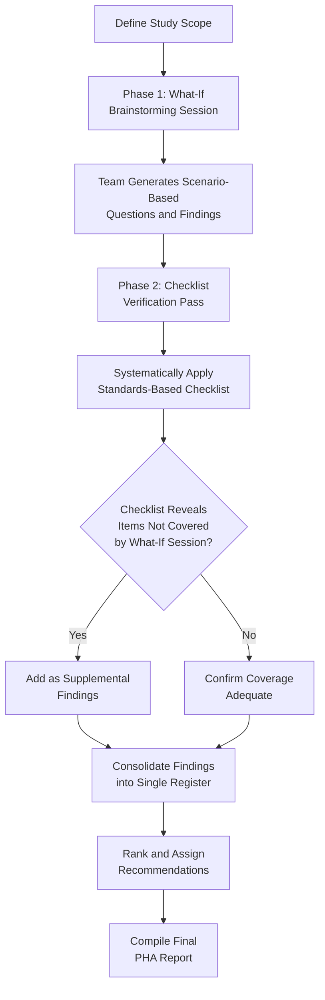

## Checklist and What-If Checklist Methods

### Overview

Checklist analysis and its hybrid variant, What-If/Checklist, are Process Hazard Analysis methodologies that use pre-developed, standards-based lists of hazard-related questions or criteria to systematically verify a process against known good practice. Where HAZOP is deviation-driven and What-If is experience-driven brainstorming, Checklist analysis is **reference-driven** — it evaluates the process against an established body of codified knowledge (codes, standards, past incidents, RAGAGEP) rather than generating hazards from first principles during the study itself.

### Regulatory Basis

**29 CFR 1910.119(e)(2)** explicitly lists both as acceptable PHA methodologies:

> "...What-If, Checklist, What-If/Checklist, Hazard and Operability Study (HAZOP), Failure Mode and Effects Analysis (FMEA), Fault Tree Analysis, or an appropriate equivalent methodology."

As with any PHA methodology selected under PSM, the study must still satisfy **29 CFR 1910.119(e)(3)**'s content requirements: hazard identification, prior incident review, engineering/administrative controls, consequences of control failure, facility siting, human factors, and qualitative evaluation of the range of possible effects on employees. A checklist alone is rarely sufficient to independently satisfy all of these dimensions, which is precisely why OSHA and industry guidance most often present it as the **What-If/Checklist hybrid** rather than a standalone method for covered processes of any real complexity.

### Pure Checklist Methodology

A pure Checklist study proceeds by walking a predefined, structured question set against the process, documenting compliance status for each item:

1. **Select or develop the checklist** — sourced from internal standards, industry codes (API, NFPA, ASME), OSHA guidance, CCPS publications, or the facility's own incident/near-miss history
2. **Assign a reviewer or small team** to work through each checklist item against the process design, P&IDs, and operating procedures
3. **Document compliance status** for each item: Yes / No / N/A / Partial, with supporting evidence or reference
4. **Flag non-compliant or partially compliant items** for corrective action
5. **Generate recommendations** for gaps identified

### Typical Checklist Categories for a PSM-Covered Process

| Category | Example Checklist Items |
| --- | --- |
| Pressure Relief | Are all vessels protected by a properly sized relief device per API 520/521? Is relief device testing current per API 576? |
| Electrical Classification | Does area classification match NFPA 70/API RP 500 for the materials present? |
| Fire Protection | Is fixed fire suppression provided per NFPA requirements for the hazard class? Are fire water flow rates adequate? |
| Emergency Isolation | Are remotely operated emergency isolation valves (EIVs) provided where required? |
| Ventilation | Is mechanical ventilation adequate for the area's hazard classification and anticipated release scenarios? |
| Static Electricity Control | Is bonding/grounding provided for flammable liquid transfer operations? |
| Material Compatibility | Are incompatible materials segregated per NFPA 400/facility hazardous materials matrix? |
| Human Factors | Are critical alarms distinguishable and prioritized to avoid operator overload? |
| Facility Siting | Are occupied buildings located outside blast/toxic release consequence zones per siting study? |

### What-If/Checklist Hybrid Methodology

The hybrid approach explicitly combines open-ended, experience-driven What-If questioning with the systematic completeness of a standards-based checklist, using each to offset the other's principal weakness:

This sequencing — What-If first, Checklist second as a completeness audit — is the most common industry practice, since it lets team creativity surface facility-specific or unusual hazards before the checklist "catches" anything systematically missed.

### Standard Documentation Format (Hybrid)

| Source | Item/Question | Finding | Compliance Status | Recommendation |
| --- | --- | --- | --- | --- |
| What-If | What if the wrong material is delivered to the storage tank? | Unique camlock fittings exist but delivery verification is verbal only | Partial | Formalize signed pre-offload verification checklist |
| Checklist – API 520/521 | Is the relief device sized for the worst-case fire exposure scenario? | Sizing calculation on file, current within 5-year review cycle | Compliant | None |
| Checklist – NFPA 70/API RP 500 | Does area electrical classification match current hazard inventory? | Classification study predates recent chemical addition via MOC | Non-Compliant | Update area classification study; verify installed equipment ratings |
| What-If | What if a contractor unfamiliar with the process performs hot work nearby? | Hot work permit system exists | Compliant | None |
| Checklist – CCPS Human Factors Checklist | Are critical alarms prioritized to prevent operator overload during upsets? | Alarm rationalization not yet performed on this unit | Non-Compliant | Schedule alarm rationalization study |

### Checklist Sourcing and Currency

The validity of any Checklist or What-If/Checklist study is entirely dependent on the currency and appropriateness of the checklist itself. Common sourcing hierarchy:

1. **Consensus industry checklists** — CCPS process safety checklists, API recommended practices checklists, NFPA compliance checklists
2. **Regulatory guidance-derived checklists** — built directly from OSHA PSM standard subsections and interpretation letters
3. **Company-specific standards checklists** — reflecting internal engineering standards that meet or exceed RAGAGEP
4. **Lessons-learned/incident-derived checklists** — items added following internal incident investigations or industry incidents (e.g., CSB case studies)

[Inference] A checklist that has not been reviewed/updated to reflect current codes, recent internal incidents, or recent process changes can silently understate hazards; OSHA does not mandate a specific checklist review interval, but tying checklist currency review to the PHA revalidation cycle (5 years) or MOC-triggered updates is common industry practice.

### Team Composition Requirements

Per **29 CFR 1910.119(e)(4)**, the same baseline team requirements apply: expertise in engineering and process operations, at least one employee with specific process experience, and a member knowledgeable in the methodology used. For Checklist-based studies specifically, an additional practical consideration is ensuring the facilitator/team has authority and familiarity to correctly interpret checklist items against the actual as-built process — a generic checklist applied by an unfamiliar team risks superficial "Yes/Compliant" answers without genuine verification.

### Strengths and Limitations

**Key Points**

- **Strengths (Checklist):** fast to execute; ensures baseline regulatory/code compliance is systematically verified; highly reproducible across studies and facilitators; excellent for less complex processes or as a completeness check on other methodologies
- **Limitations (Checklist alone):** cannot identify hazards not anticipated by the checklist's authors; provides limited insight into facility-specific or novel failure scenarios; risk of superficial "checkbox" verification without genuine engineering judgment; standalone Checklist use is generally discouraged by OSHA/CCPS guidance for complex or high-hazard covered processes precisely because of this coverage gap
- **Strengths (What-If/Checklist hybrid):** combines creative, scenario-based hazard discovery with systematic standards verification; checklist acts as a "safety net" catching gaps in team brainstorming; well-suited to processes of low-to-moderate complexity where full HAZOP resource investment may not be warranted
- **Limitations (hybrid):** still less exhaustively systematic than HAZOP's node-by-node deviation matrix for very complex, densely instrumented continuous processes; quality remains dependent on both team experience (What-If component) and checklist currency (Checklist component)

### Methodology Selection Comparison

| Factor | Pure Checklist | What-If/Checklist | HAZOP |
| --- | --- | --- | --- |
| Speed | Fastest | Moderate | Slowest |
| Systematic completeness for known hazards | High | High | High |
| Ability to surface novel/facility-specific hazards | Low | Moderate-High | High |
| Resource intensity | Low | Moderate | High |
| Best fit | Lower-complexity, well-precedented processes | Moderate-complexity processes | High-complexity, continuous, heavily instrumented processes |
| OSHA acceptance as standalone method for complex covered process | Generally discouraged alone | Common, acceptable | Widely preferred |

### Revalidation Requirement

As with all PHA methodologies, **29 CFR 1910.119(e)(6)** requires revalidation at least every 5 years. For Checklist and What-If/Checklist studies, revalidation should explicitly confirm the checklist itself has been updated to reflect any code revisions, MOC-driven process changes, and incident-derived lessons learned since the prior study — a step distinct from, and in addition to, reconfirming prior findings remain valid.

### Common Compliance Gaps

- Using a generic, off-the-shelf checklist not tailored or verified against the specific process and its actual hazard inventory
- Checklist items marked "Compliant" based on assumption rather than verified evidence (e.g., citing a design intent rather than confirmed as-built/field-verified status)
- Standalone Checklist used for a complex, highly hazardous covered process where HAZOP would be more appropriate RAGAGEP
- Checklist not updated following MOC-driven changes, resulting in verification against an outdated hazard basis
- What-If component conducted superficially, with the team treating the checklist pass as the "real" study and rushing the brainstorming phase

### Example

A moderate-complexity ammonia refrigeration system at a food processing facility is evaluated using a What-If/Checklist hybrid study. The What-If session surfaces a facility-specific concern — "what if a forklift strikes an exposed refrigerant line in the loading area?" — leading to a recommendation for bollard protection. The subsequent checklist pass, built from IIAR (International Institute of Ammonia Refrigeration) safety guidelines, systematically confirms relief valve discharge routing, machinery room ventilation rates, and ammonia detection/alarm setpoints against current IIAR criteria, catching a machinery room ventilation rate that had not kept pace with a prior capacity expansion.

**Related Topics**

- Hazard and Operability Study (HAZOP)
- What-If Analysis Methodology
- CCPS and API Standards-Based Checklist Development
- PHA Methodology Selection Criteria
- Facility Siting Studies and Checklist Integration
- PHA Revalidation Requirements (1910.119(e)(6))