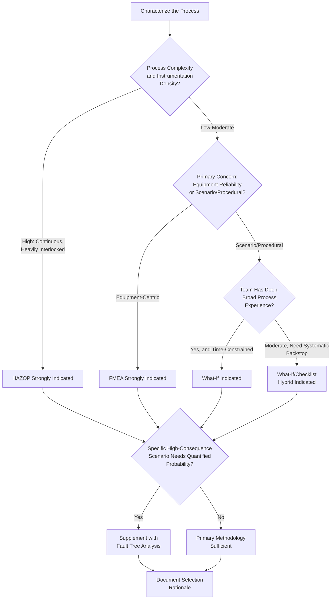

## Selecting the Appropriate PHA Methodology

### Overview

Selecting the Appropriate PHA Methodology is the decision-making discipline that precedes any Process Hazard Analysis study: determining which of OSHA's acceptable methodologies — or combination of methodologies — best fits a given process's complexity, hazard profile, and available resources. OSHA deliberately does not mandate a single method, instead requiring the employer to select one appropriate to the process, which places the burden of a defensible, documented selection rationale squarely on the employer.

### Regulatory Basis

**29 CFR 1910.119(e)(2)** establishes that the employer must use one or more of the enumerated methodologies "or an appropriate equivalent methodology":

> "What-If, Checklist, What-If/Checklist, Hazard and Operability Study (HAZOP), Failure Mode and Effects Analysis (FMEA), Fault Tree Analysis, or an appropriate equivalent methodology."

Whichever methodology (or combination) is selected, the study must still satisfy the mandatory content requirements of **29 CFR 1910.119(e)(3)** — hazard identification, prior incident history with catastrophic potential, applicable engineering and administrative controls, consequences of control failure, facility siting, human factors, and a qualitative evaluation of the range of possible safety and health effects on employees. Methodology selection therefore is not free-form: whatever is chosen must be *capable* of producing findings across all these dimensions, either on its own or through a documented hybrid approach.

### Methodology Comparison Matrix

| Methodology | Orientation | Best Fit | Resource Intensity | Systematic Completeness |
| --- | --- | --- | --- | --- |
| HAZOP | Deviation-driven (guide word × parameter) | Complex, continuous, heavily instrumented processes | High | Very High |
| What-If | Scenario-driven, experience-based brainstorming | Simple-to-moderate complexity; procedural/human-factors emphasis | Low-Moderate | Moderate (team-dependent) |
| Checklist | Standards/reference-driven | Lower-complexity, well-precedented processes; compliance verification | Low | High for known hazards, low for novel ones |
| What-If/Checklist | Hybrid: brainstorming + standards verification | Moderate-complexity processes | Moderate | High |
| FMEA | Component/equipment-centric, bottom-up | Equipment-heavy systems; reliability/MI prioritization | Moderate-High | High for single-point equipment failures |
| Fault Tree Analysis | Top-down, deductive, quantitative | High-consequence scenarios requiring probabilistic analysis; common-cause failure investigation | Very High | Very High for the specific top event analyzed |

### Selection Decision Framework

### Key Selection Factors

1. **Process complexity and instrumentation density** — the single strongest driver; highly interconnected continuous processes with dense control/interlock systems favor HAZOP's systematic node-by-node deviation coverage
2. **Batch vs. continuous operation** — batch processes with significant sequence/timing hazards often benefit from What-If or a HAZOP variant incorporating EARLY/LATE and BEFORE/AFTER guide words specifically calibrated for sequence deviations
3. **Equipment vs. process-parameter hazard dominance** — where the dominant risk driver is component reliability (e.g., a process with many single, critical pieces of rotating or pressure-containing equipment), FMEA's bottom-up structure may surface more actionable findings than a purely deviation-based approach
4. **Availability of quantitative risk criteria** — if the facility or regulator requires quantified probability/frequency estimates for specific high-consequence scenarios, Fault Tree Analysis (or a LOPA study built on PHA findings) becomes necessary regardless of the primary methodology chosen
5. **Team expertise depth and availability** — What-If's effectiveness is bounded by team experience; a facility with limited access to broadly experienced personnel should lean toward more structured methods (HAZOP, Checklist-supplemented approaches) that compensate for individual gaps in tacit knowledge
6. **Time and resource constraints** — HAZOP and FTA are resource-intensive; where legitimate resource constraints exist for a lower-hazard process, a well-executed What-If/Checklist hybrid may be both acceptable and more proportionate
7. **Regulatory/insurer expectations and precedent** — some jurisdictions, insurers, or corporate PSM programs establish minimum methodology expectations by process hazard category (e.g., mandating HAZOP for any process involving a specific toxic or highly reactive chemical above a threshold quantity)
8. **Prior incident and near-miss history** — a process with a documented history of specific failure types may warrant a methodology naturally suited to that failure category (e.g., recurring equipment failures favor FMEA; recurring procedural deviations favor What-If)

### Combining Methodologies

It is common and often advisable to use more than one methodology across a single process or facility, applying each where its strengths align with the specific subsystem being studied:

| Process Segment | Suggested Methodology | Rationale |
| --- | --- | --- |
| Core continuous reaction/separation train | HAZOP | High complexity, dense instrumentation |
| Batch charging/blending steps | What-If, or HAZOP with sequence guide words | Procedural/timing hazard emphasis |
| Rotating equipment (pumps, compressors) | FMEA | Component failure-mode focus |
| Overall facility siting and layout | Checklist | Standards-based (API RP 752/753) verification |
| Specific catastrophic scenario (e.g., full-bore rupture) requiring quantified frequency | Fault Tree Analysis | Probabilistic, common-cause analysis |

### Documenting the Selection Rationale

Because OSHA compliance officers will review methodology selection during an inspection, the rationale should be explicitly documented, typically including:

1. **Process characterization summary** — complexity, hazard inventory, quantity thresholds, instrumentation/control architecture
2. **Methodology(ies) selected** and the specific factors driving the choice (per the framework above)
3. **Any hybrid or supplemental methodology** applied to specific subsystems, with justification
4. **Facilitator/team qualifications** relevant to the chosen methodology
5. **Reference to any corporate or insurer PSM program standard** that establishes minimum methodology requirements for the process category

[Inference] OSHA has generally deferred to employer judgment on methodology selection provided the chosen method(s) can demonstrably satisfy 1910.119(e)(3)'s content requirements; enforcement scrutiny in practice tends to focus more on whether the required content elements were actually addressed than on which named methodology was used, though selecting an evidently mismatched, overly simplistic method for a highly complex or highly hazardous process (e.g., a bare Checklist for a densely instrumented continuous reactive process) has been a recognized citation risk area.

### Common Compliance Gaps

- **Key Points**
  - Methodology selected primarily for speed/cost without documented consideration of process complexity or hazard severity
  - No written rationale for the methodology choice, leaving the employer unable to defend the selection during an audit or inspection
  - Same generic methodology applied uniformly across an entire multi-process facility regardless of individual process complexity differences
  - Failure to supplement the primary methodology when a specific high-consequence scenario genuinely requires quantitative analysis (Fault Tree Analysis/LOPA)
  - Methodology mismatch discovered only after an incident investigation reveals the original PHA's chosen method could not plausibly have surfaced the causal scenario

### Example

A facility operating both a continuous, densely instrumented ammonia synthesis loop and a separate, simpler batch neutralization unit documents a bifurcated methodology selection: HAZOP for the synthesis loop given its complexity and interlock density, and a What-If/Checklist hybrid for the batch neutralization unit given its lower complexity and strong reliance on operator-executed sequential steps — with the selection rationale, team qualifications, and process characterization summary retained as part of the PHA documentation package for both studies.

**Related Topics**

- Hazard and Operability Study (HAZOP)
- What-If and Checklist Methodologies
- Failure Mode and Effects Analysis (FMEA)
- Fault Tree Analysis and Layer of Protection Analysis (LOPA)
- PHA Team Composition Requirements (1910.119(e)(4))
- Facility Siting Studies (API RP 752/753)