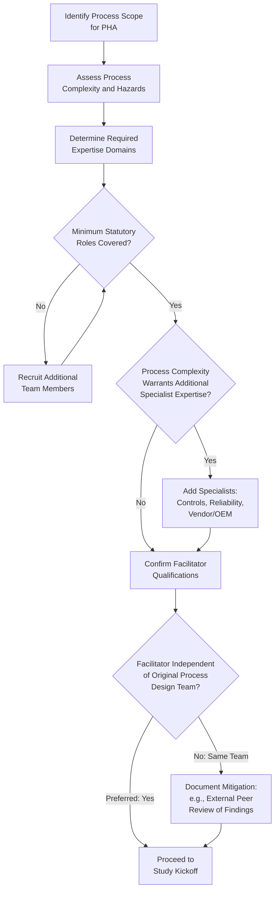

## PHA Team Composition and Facilitation

### Overview

PHA Team Composition and Facilitation addresses the human and organizational infrastructure required to conduct a valid Process Hazard Analysis under OSHA's PSM standard — who must be on the team, what expertise they must collectively bring, and how the study is led to produce a thorough, defensible result. Regardless of which methodology is selected (HAZOP, What-If, FMEA, etc.), OSHA's regulation treats team composition and facilitation quality as a distinct, mandatory compliance element, since a technically sound methodology applied by an unqualified or poorly facilitated team still produces an inadequate PHA.

### Regulatory Basis

**29 CFR 1910.119(e)(4)** is the controlling provision:

> "The employer shall establish a system to promptly address the team's findings and recommendations... The process hazard analysis shall be performed by a team with expertise in engineering and process operations, and the team shall include at least one employee who has experience and knowledge specific to the process being evaluated. Also, one member of the team must be knowledgeable in the specific process hazard analysis methodology being used."

This creates three distinct, non-negotiable minimum requirements:

1. **Collective expertise** in engineering and process operations (a team-level requirement, not necessarily each individual)
2. **At least one employee** with specific experience and knowledge of the process being analyzed
3. **At least one member** knowledgeable in the specific PHA methodology being used (typically the facilitator)

OSHA guidance and enforcement history treat these as minimums, not a complete team-design specification — a team satisfying only the literal minimum (e.g., two people) is technically compliant but frequently inadequate in practice for anything beyond the simplest processes.

### Core Team Roles

| Role | Function | Regulatory Basis |
| --- | --- | --- |
| Facilitator/Team Leader | Drives the systematic methodology; keeps discussion focused and productive; ensures all required content areas (e.reference: e(3)) are addressed | Satisfies "knowledgeable in methodology" requirement |
| Scribe/Recorder | Documents deviations/questions, discussion, consequences, safeguards, and recommendations in real time | Supports complete, auditable record |
| Process/Operations Representative | Provides hands-on, current operating knowledge specific to the process | Satisfies "specific experience and knowledge of process" requirement |
| Design/Process Engineer | Provides technical design basis, understands intended operating envelope | Supports "engineering expertise" requirement |
| Maintenance/Reliability Representative | Provides equipment failure history and practical maintenance insight | Strengthens engineering/operations expertise |
| Instrumentation/Controls Engineer | Essential for processes with complex interlocks, SIS, or dense automation | Supports engineering expertise for control-heavy processes |
| Safety/PSM Coordinator | Ensures regulatory completeness; links findings into broader PSM program (MOC, MI, training) | Programmatic integration, not a strict e(4) requirement but standard practice |
| Contractor/Vendor Representative (as needed) | Specialized equipment knowledge (e.g., proprietary reactor or packaged unit) | Supplements engineering expertise where internal knowledge is limited |

### Building a Defensible Team Composition

### Facilitator Qualifications and Role

The facilitator is the single most influential factor in PHA quality. Effective facilitation requires:

1. **Formal training in the specific methodology** (HAZOP, What-If, FMEA, etc.) — not merely familiarity, but demonstrated competency in applying it systematically
2. **Process independence where practical** — a facilitator without a personal stake in the original design is generally better positioned to challenge assumptions without bias; many organizations use a facilitator from outside the immediate process design team, or an external consultant, particularly for higher-hazard processes
3. **Group facilitation skill** — managing team dynamics, preventing dominant personalities from suppressing quieter but knowledgeable members, keeping pace appropriate to avoid both rushed superficiality and unproductive over-analysis ("guide-word fatigue")
4. **Working knowledge of the specific process type** — sufficient to ask informed follow-up questions and recognize when a team's answer is incomplete, without necessarily being the process expert themselves (that role belongs to the operations/engineering members)
5. **Documentation discipline** — ensuring the scribe captures findings in a form that will support later recommendation tracking, MOC linkage, and revalidation

[Inference] Facilitator independence from the original design team is widely regarded as a best practice for reducing confirmation bias, but 1910.119(e)(4) does not explicitly mandate independence — only that a team member be knowledgeable in the methodology. Organizations vary in how strictly they enforce this separation.

### Team Size Considerations

| Team Size | Typical Use Case | Trade-offs |
| --- | --- | --- |
| 3–4 members (minimum viable) | Simple processes; Checklist or straightforward What-If studies | Fast, low-cost; higher risk of expertise gaps |
| 5–7 members | Typical HAZOP for moderate-complexity continuous process | Balances thoroughness with manageable group dynamics |
| 8+ members | Highly complex, multi-unit, or novel-technology processes | Most thorough; harder to facilitate effectively; risk of disengagement among less-active members |

Facilitation research and CCPS guidance generally favor teams in the 5–7 range as an efficiency sweet spot — large enough for adequate expertise coverage, small enough to maintain individual engagement and avoid diminishing returns from group-process overhead.

### Managing Team Dynamics During the Study

**Key Points**

- Establish ground rules at kickoff: no blame-assignment for past decisions, all findings documented regardless of perceived likelihood, respectful disagreement encouraged
- Facilitator actively solicits input from quieter members, particularly operations/maintenance personnel who may defer to more senior engineering voices despite having critical frontline knowledge
- Time-box each node/topic to maintain momentum without artificially truncating genuine safety discussion
- Schedule adequate session length and breaks — PHA studies (especially HAZOP) are cognitively demanding; sustained sessions beyond 4–6 hours per day measurably degrade thoroughness and engagement
- Park unresolved technical disputes as follow-up action items rather than letting them stall the overall study pace

### Recommendation Documentation Standards

Whatever the team composition, the scribe's documentation must support the separate but directly connected requirement at **29 CFR 1910.119(e)(5)**: the employer must establish a system to promptly address team findings and recommendations, document resolutions and actions taken, and communicate them to affected personnel. Well-facilitated teams produce recommendations that are:

- **Specific and actionable** (not vague statements like "improve safety")
- **Clearly attributed** to a documented cause/consequence/safeguard chain
- **Assigned a responsible owner and target date** as part of the post-study resolution process (even though final assignment often occurs after the study itself)

### Interface with Other PSM Elements

| PSM Element | Team Composition/Facilitation Linkage |
| --- | --- |
| Management of Change | MOC technical reviews often draw on the same expertise pool as PHA teams; MOC-triggered "mini-PHAs" should follow similar composition principles |
| Mechanical Integrity | Maintenance/reliability team members bring MI inspection history directly into FMEA/HAZOP discussions |
| Training | Findings often generate training-content updates; operations team members help validate that recommendations are operationally realistic |
| Recommendation Resolution (e(5)) | Documentation quality from facilitation directly determines how efficiently findings can be tracked to closure |

### Common Compliance Gaps

- Team satisfying only the bare statutory minimum (two people) for a genuinely complex, high-hazard process, producing a study vulnerable to challenge as inadequate
- Facilitator lacking documented, current training in the specific methodology used
- No operations-experienced employee actually present for the *specific* process (a generalist operator from a different unit does not satisfy the "specific experience and knowledge" requirement)
- Facilitator also serving as the primary process design engineer with a personal stake in defending prior design decisions, without any independent review mechanism
- Sessions run at a pace or duration that visibly degrades engagement, evidenced by declining finding rates in later session hours
- Team composition and qualifications not documented as part of the PHA report, leaving the employer unable to demonstrate e(4) compliance during an audit

### Example

For a HAZOP of a batac-dms-scale municipal water treatment chlorination system, the facilitator (an external PSM consultant trained and experienced in HAZOP) leads a team including the treatment plant's shift supervisor (specific process experience), a mechanical engineer familiar with the chlorine feed system design, an instrumentation technician responsible for the chlorine residual analyzers and interlocks, and a maintenance lead with chlorine feed pump failure history — collectively satisfying both the engineering/operations expertise requirement and the methodology-knowledge requirement, with team qualifications documented in the final PHA report's front matter.

**Related Topics**

- Selecting the Appropriate PHA Methodology
- PHA Recommendation Resolution and Tracking (1910.119(e)(5))
- Management of Change Team and Review Requirements
- Mechanical Integrity Program and Equipment Reliability Data
- Human Factors Considerations in Process Hazard Analysis
- PHA Revalidation Requirements (1910.119(e)(6))