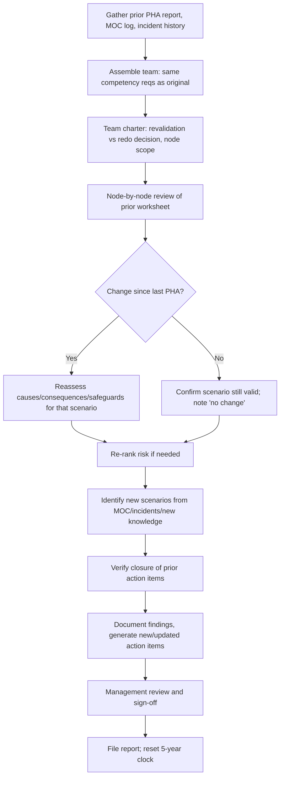

## PHA Revalidation and Update Cycles

### Overview

PHA revalidation is the systematic process of reviewing and updating a previously completed Process Hazard Analysis to confirm it remains valid, current, and reflective of the process as actually operated. Revalidation is distinct from an initial PHA in that it builds on existing analysis rather than starting from a blank study, but it must still be rigorous enough to catch hazards introduced by drift, modifications, incidents, and organizational changes since the last study.

### Regulatory Basis

**Key Points**

- OSHA PSM (29 CFR 1910.119(e)(6)): PHAs must be updated and revalidated at least every 5 years by a team meeting the same competency requirements as the original PHA team.
- EPA RMP (40 CFR 68.67): Parallel requirement for covered processes under the Risk Management Program.
- The 5-year clock runs from the completion date of the prior PHA/revalidation, not from the facility startup date.
- Revalidation applies to the process, not the document — if the process has been decommissioned, the requirement lapses; if it has changed significantly, a revalidation (or new PHA) is triggered regardless of the 5-year clock.

### Revalidation vs. Redo (Two Recognized Approaches)

CCPS and industry practice recognize two acceptable strategies:

1. **Revalidation ("update")** — The original PHA report, node breakdown, and prior findings are reviewed line-by-line by the team. Each existing scenario is reassessed for continued validity (has anything changed that affects causes, consequences, safeguards, or risk ranking?). New scenarios are added only where changes, incidents, or new knowledge indicate a gap.
2. **Redo ("full replacement")** — A completely new PHA is performed as if no prior study existed, discarding the old worksheet structure.

**Key Points**

- Revalidation is more common and efficient for stable, unchanged processes; a redo is favored when the original PHA quality is poor, the methodology has changed (e.g., moving from What-If to HAZOP), or the process has undergone extensive modification.
- A hybrid approach — full redo of high-risk/highly modified nodes, revalidation of stable nodes — is widely used in practice. [Inference: optimal split depends on facility-specific change volume; not universally standardized.]

### Triggers for Revalidation Outside the 5-Year Cycle

| Trigger | Rationale |
| --- | --- |
| Management of Change (MOC) affecting hazard basis | New equipment, chemistry, or control logic may invalidate existing scenarios |
| Incident investigation findings | Root causes may reveal PHA gaps requiring correction before the 5-year mark |
| Process incident with near-miss potential | Same logic — safeguard failure discovered in practice |
| New/changed regulations or RAGAGEP | Industry standards evolve (e.g., new API RP, revised NFPA code) |
| Significant staffing/organizational change | Loss of institutional knowledge on hazard basis |
| Audit findings (PSM compliance audit) | Audits under 1910.119(o) may flag PHA inadequacy |

### The Revalidation Process — Step-by-Step

### Documentation Requirements

**Key Points**

- Team membership and qualifications (must include at least one person expert in the process, per PSM team competency rules)
- Explicit resolution status of every prior recommendation (implemented, in progress, rejected with rationale)
- A clear statement of methodology used (revalidate vs. redo) and scope of nodes covered
- Updated P&IDs, procedures, and equipment lists referenced as of the revalidation date
- Date of completion, which becomes the new baseline for the next 5-year interval

**Example**

A facility's original HAZOP on a chlorine scrubber system identified a scenario: "Loss of caustic feed → scrubber breakthrough → chlorine release." At revalidation 5 years later:

- MOC records show the caustic pump was replaced with a variable-speed unit and a low-flow interlock was added.
- The team confirms the interlock is functioning as an independent safeguard, re-ranks the consequence severity as unchanged but likelihood reduced, and updates the safeguard list.
- No new scenario is required for this node; the change is documented as "reviewed, safeguard updated, no residual gap."

### Common Pitfalls

- Treating revalidation as a rubber-stamp exercise without re-examining whether prior risk rankings still hold
- Failing to reconcile the PHA against the actual as-built P&IDs (drift between MOC records and installed configuration)
- Not verifying closure of prior recommendations before certifying the revalidation complete
- Using a revalidation team that lacks the process-specific expertise required under 1910.119(e)(4)
- Missing the 5-year deadline due to unclear "clock start" tracking across multiple PHAs on different schedules at the same site

### Related Topics

- Management of Change (MOC) Program Design
- PHA Methodology Selection (HAZOP, What-If, FMEA, LOPA)
- PSM Compliance Auditing (1910.119(o))
- Recommendation Tracking and Closure Systems
- Recognized and Generally Accepted Good Engineering Practice (RAGAGEP)