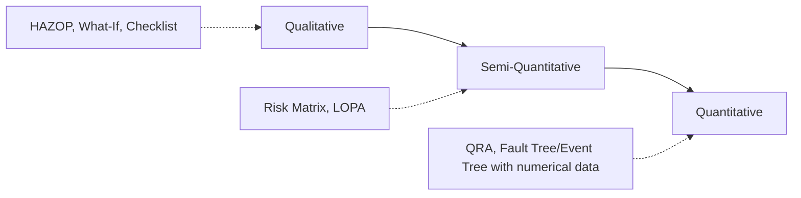

## Qualitative versus Quantitative Risk Assessment

### Overview

Risk assessment methodologies in process safety span a spectrum from purely qualitative (descriptive, judgment-based) to fully quantitative (numerical, probabilistic) approaches. Selecting the right point on this spectrum is a core PSM decision that affects resource allocation, defensibility of risk decisions, and the ability to prioritize among competing hazards.

### Defining the Spectrum

**Key Points**

- Qualitative: relies on descriptive categories (e.g., "high/medium/low" likelihood and severity) and team judgment; no numerical probability calculations.
- Semi-quantitative: introduces order-of-magnitude numerical estimates (e.g., LOPA's frequency/probability bands) without full statistical rigor.
- Quantitative: uses numerical failure rate data, fault tree/event tree logic, and consequence modeling to calculate risk in units such as individual risk per year or societal risk (F-N curves).

### Qualitative Risk Assessment

**Characteristics**

- Team-based, discussion-driven (e.g., HAZOP, What-If/Checklist, FMEA)
- Risk expressed in categorical terms via a risk matrix (severity × likelihood)
- Fast to execute, requires less specialized data
- Output is a prioritized list of scenarios and recommendations, not a numerical risk value

**Example**

A HAZOP team evaluates "High pressure in reactor" and rates it Severity = Major, Likelihood = Unlikely, yielding a risk ranking of "Medium" on a 5×5 matrix. No probability values are calculated — the ranking drives whether the scenario needs additional safeguards.

**Strengths**

- Efficient for screening large numbers of scenarios (typical PHA covers dozens to hundreds of nodes)
- Captures qualitative/systemic issues that are hard to quantify (procedural gaps, human factors)
- Lower cost, faster turnaround, accessible to multidisciplinary teams without specialized reliability engineering training

**Limitations**

- Risk matrix categories are subjective and can vary between teams or facilitators
- Poor resolution for comparing scenarios within the same risk category (two "Medium" risks may differ by an order of magnitude in actual risk)
- Difficult to aggregate or compare risk across a facility or industry on a consistent numerical basis

### Quantitative Risk Assessment (QRA)

**Characteristics**

- Numerical failure frequency data (from generic databases like OREDA, CCPS, or plant-specific history) combined with fault tree/event tree logic
- Consequence modeling (dispersion, fire/explosion effects) calculates physical harm zones
- Output expressed as individual risk (e.g., risk per year to a person at a specific location) or societal risk (F-N curve: frequency vs. number of fatalities)

**Key Points**

- Requires specialized software (e.g., PHAST, SAFETI, TNO effects models) and trained practitioners
- Data-intensive: failure rate quality directly drives result credibility — "garbage in, garbage out" is a well-known limitation [Inference: data uncertainty bands are often wider than the risk differences being compared, a recognized critique in the QRA literature].
- Commonly required by regulation in certain jurisdictions for land-use planning near major hazard facilities (e.g., UK COMAH, Seveso in EU) even where not explicitly mandated by OSHA PSM.

**Example**

A QRA on an LPG storage facility calculates that the individual risk of fatality at the site boundary is $3 \times 10^{-6}$ per year, which is compared against a tolerability criterion (e.g., $1 \times 10^{-5}$/year as an upper bound in many regulatory frameworks) to determine if the risk is acceptable, ALARP (as low as reasonably practicable), or intolerable.

**Strengths**

- Enables direct numerical comparison across dissimilar hazards (e.g., toxic release vs. explosion) on the same risk metric
- Supports land-use planning, insurance decisions, and cost-benefit analysis of risk-reduction measures
- Provides defensible, auditable numerical basis for regulatory submissions in QRA-mandated jurisdictions

**Limitations**

- High cost and time investment; typically reserved for high-consequence, high-profile facilities or specific high-risk scenarios
- Sensitive to failure rate data quality and modeling assumptions (weather data, population density estimates, consequence model selection)
- Can create false precision — a calculated risk of $2.3 \times 10^{-6}$/year implies more accuracy than the underlying data typically supports

### Semi-Quantitative Bridge: LOPA

Layer of Protection Analysis occupies the middle ground and is the most common bridge method in PSM practice:

| Aspect | Qualitative (HAZOP) | LOPA (Semi-Quant) | QRA (Full Quant) |
| --- | --- | --- | --- |
| Frequency basis | Categorical | Order-of-magnitude (e.g., $10^{-1}$ to $10^{-5}$/yr bands) | Precise numerical (fault tree derived) |
| Independent Protection Layers | Identified, not credited numerically | Explicitly credited with PFD values | Modeled in fault/event trees |
| Typical use | Screening all scenarios | Scenarios flagged as high-risk in HAZOP | Facility-wide or high-consequence scenario risk profiling |
| Effort per scenario | Low | Moderate | High |

### Decision Framework: When to Use Which

**Key Points**

- Start qualitative (HAZOP/What-If) for comprehensive hazard identification across the full process — this is universally required by PSM regardless of what follows.
- Escalate to LOPA for scenarios where the qualitative risk ranking is borderline or where SIS/SIL determination is needed (per IEC 61511).
- Escalate to full QRA only when: (a) regulation requires it, (b) consequences are catastrophic/offsite (toxic release, major fire/explosion potential), (c) major capital decisions hinge on precise risk comparison, or (d) land-use planning near the facility requires numerical risk contours.

**Illustration (svg_diagram)**

<svg xmlns="http://www.w3.org/2000/svg" viewBox="0 0 700 260">
<text x="350" y="25" text-anchor="middle" font-size="16" font-weight="bold">Risk Assessment Escalation Path (svg_diagram)</text>
<rect x="20" y="60" width="180" height="80" rx="8" fill="#dbeafe" stroke="#2563eb" />
<text x="110" y="95" text-anchor="middle" font-size="13" font-weight="bold">Qualitative</text>
<text x="110" y="115" text-anchor="middle" font-size="11">HAZOP / What-If</text>
<text x="110" y="130" text-anchor="middle" font-size="10">All scenarios screened</text>
<rect x="260" y="60" width="180" height="80" rx="8" fill="#fef3c7" stroke="#d97706" />
<text x="350" y="95" text-anchor="middle" font-size="13" font-weight="bold">Semi-Quantitative</text>
<text x="350" y="115" text-anchor="middle" font-size="11">LOPA</text>
<text x="350" y="130" text-anchor="middle" font-size="10">High-risk / SIL scenarios</text>
<rect x="500" y="60" width="180" height="80" rx="8" fill="#fee2e2" stroke="#dc2626" />
<text x="590" y="95" text-anchor="middle" font-size="13" font-weight="bold">Quantitative</text>
<text x="590" y="115" text-anchor="middle" font-size="11">QRA</text>
<text x="590" y="130" text-anchor="middle" font-size="10">Catastrophic/offsite risk</text>
<path d="M200 100 L260 100" stroke="#333" stroke-width="2" marker-end="url(#arrow)" />
<path d="M440 100 L500 100" stroke="#333" stroke-width="2" marker-end="url(#arrow)" />
<text x="350" y="190" text-anchor="middle" font-size="11" font-style="italic">Effort, cost, and data requirements increase left to right</text>

<text x="350" y="210" text-anchor="middle" font-size="11" font-style="italic">Resolution and defensibility of risk value also increase left to right</text>

</svg>

### Conclusion

Qualitative and quantitative risk assessment are not competing methods but complementary tiers of a single risk management framework. Effective PSM programs use qualitative methods for comprehensive, cost-effective hazard screening across the entire process and reserve quantitative rigor for the subset of scenarios where numerical precision materially changes a risk-based decision.

### Related Topics

- Layer of Protection Analysis (LOPA) Fundamentals
- Fault Tree and Event Tree Analysis
- Consequence Modeling (Dispersion, Fire, Explosion)
- SIL Determination per IEC 61511
- Risk Matrix Design and Calibration
- ALARP and Risk Tolerability Criteria