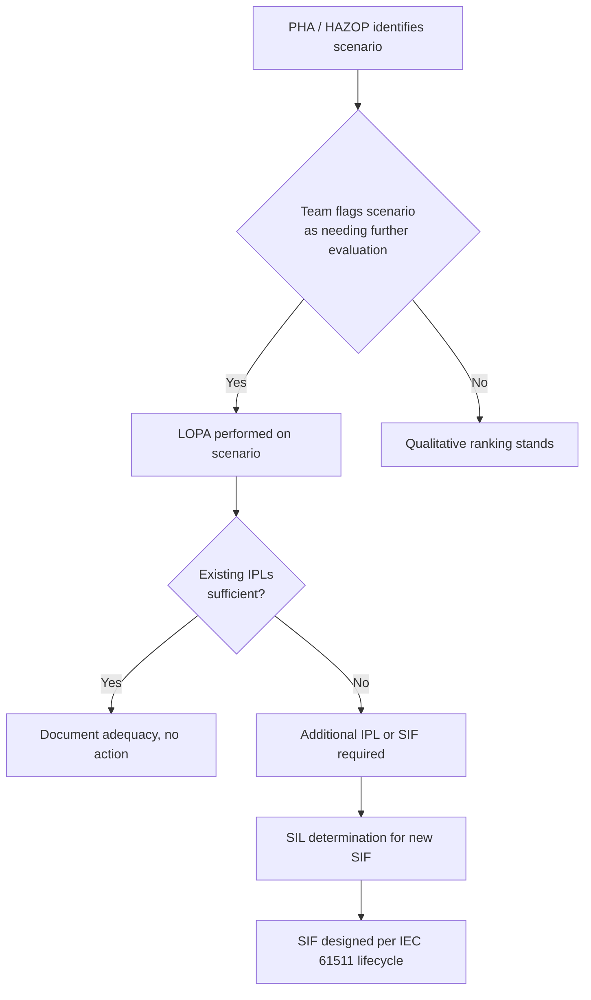

## Layers of Protection Analysis (LOPA)

### Overview

LOPA is a semi-quantitative risk assessment methodology that evaluates whether independent protection layers (IPLs) provide sufficient risk reduction for a given hazard scenario. It bridges the gap between qualitative PHA (HAZOP, What-If) and full quantitative risk assessment, using order-of-magnitude frequency and probability estimates rather than detailed fault tree calculations. LOPA is the most widely used method in industry for determining Safety Integrity Level (SIL) requirements for Safety Instrumented Functions (SIFs).

### Position in the PSM Workflow

### Core LOPA Methodology

**Key Points**

- LOPA evaluates one cause-consequence pair at a time (a single "scenario"), unlike HAZOP which considers multiple causes for a deviation collectively.
- The basic calculation compares the initiating event frequency, reduced by the probability of failure on demand (PFD) of each credited IPL, against a tolerable frequency criterion.
- Only independent, effective, and auditable protection layers can be credited as IPLs — this independence requirement is the analytical core of LOPA.

### The LOPA Calculation

The mitigated event frequency is calculated as:

$$f_{mitigated} = f_{initiating} \times \prod_{i=1}^{n} PFD_i$$

Where:

- $f_{initiating}$ = frequency of the initiating cause (events/year)
- $PFD_i$ = probability of failure on demand for each independent protection layer $i$
- $f_{mitigated}$ = resulting scenario frequency after credit for all IPLs

This is compared against a **tolerable risk criterion** ($f_{tolerable}$), typically company- or industry-specific (e.g., $1 \times 10^{-4}$ to $1 \times 10^{-5}$ per year for a scenario with potential for a single fatality). If $f_{mitigated} > f_{tolerable}$, additional risk reduction (often a new SIF) is required.

### Independent Protection Layers (IPLs)

**Criteria for Crediting an IPL**

| Criterion | Requirement |
| --- | --- |
| Independence | Must be independent of the initiating event and of other credited IPLs |
| Effectiveness | Must reduce risk by at least a factor of 10 (PFD ≤ 0.1) to be creditable as a distinct layer |
| Auditability | Must be capable of being inspected, tested, and maintained with documented evidence |
| Specificity | Must be designed/rated specifically to detect and respond to the scenario under evaluation |

**Typical IPLs and Order-of-Magnitude PFD Values**

| Protection Layer | Typical PFD | Notes |
| --- | --- | --- |
| Basic Process Control System (BPCS) | 0.1 | Only creditable if not the initiating cause |
| Alarm with defined operator response | 0.1 | Requires adequate response time and independent alarm path |
| Safety Instrumented Function (SIL 1) | 0.1–0.01 | Per IEC 61511 SIL verification |
| Safety Instrumented Function (SIL 2) | 0.01–0.001 |  |
| Relief valve (mechanical) | 0.01 | Independent of BPCS/control failures |
| Physical containment (dike, bund) | 0.01 | Consequence mitigation, not prevention |
| Human intervention (non-alarm, procedural) | ~0.1–1 (often not credited or credited conservatively) | [Inference: often excluded or heavily discounted due to reliability concerns — company-specific] |

**Non-IPLs (Common Errors)**

- Operator response to the same alarm used to detect the initiating event (not independent)
- Preventive maintenance programs (a program, not a barrier at time of demand)
- Administrative controls/procedures with no independent verification (often excluded or given very conservative credit)

### Worked Example

**Scenario**: Runaway reaction in a batch reactor due to loss of cooling water flow.

- Initiating event: Cooling water pump failure — frequency = $0.1$/year (industry data)
- IPL 1: BPCS low-flow alarm with operator response (independent of pump) — PFD = 0.1
- IPL 2: High-temperature SIS trip on reactor (SIL 1 rated) — PFD = 0.05
- No other credited IPLs

$$f_{mitigated} = 0.1 \times 0.1 \times 0.05 = 5 \times 10^{-4} \text{ events/year}$$

If the company's tolerable frequency criterion for a single-fatality consequence is $1 \times 10^{-4}$/year, this scenario **fails** the criterion ($5 \times 10^{-4} > 1 \times 10^{-4}$) and requires additional risk reduction — typically a higher-integrity SIF or an additional independent layer.

### LOPA Worksheet Structure

A standard LOPA worksheet captures, per scenario:

1. Scenario number and description (cause + consequence pair)
2. Consequence description and severity category
3. Initiating event and frequency
4. Enabling conditions/conditional modifiers (e.g., probability of ignition, occupancy factor)
5. List of IPLs with individual PFDs
6. Intermediate and final mitigated event frequency
7. Tolerable risk criterion (target)
8. Gap analysis and required additional risk reduction (if any)
9. Action items (e.g., "Add SIL 2 SIF" or "Increase PFD credit via testing")

### Relationship to SIL Determination

**Key Points**

- LOPA is one of several accepted SIL determination methods under IEC 61511 (others include risk graphs and risk matrices).
- The "gap" between mitigated frequency and tolerable frequency directly indicates the required PFD (and hence SIL) for a new or upgraded SIF.
- LOPA output feeds into the Safety Requirements Specification (SRS) for the SIF, which then proceeds through the full safety lifecycle (design, verification, validation, proof testing).

### Conditional Modifiers

Some scenarios include additional probability factors beyond IPLs:

- **Probability of ignition** (for flammable release scenarios) — e.g., 0.1–1.0 depending on material and location
- **Probability of personnel presence/occupancy** — e.g., fraction of time a person is in the affected zone
- **Probability of a specific outcome given exposure** (e.g., fatality given exposure to toxic concentration)

These are multiplied into the frequency calculation similarly to IPLs but represent scenario conditions rather than protection barriers.

### Strengths and Limitations

**Strengths**

- Faster and less resource-intensive than full QRA/fault tree analysis
- Provides a defensible, semi-quantitative basis for SIL determination
- Standardized order-of-magnitude approach improves consistency across facilities and teams (per CCPS guidelines)

**Limitations**

- Order-of-magnitude approximations lose precision compared to full quantitative fault tree methods
- Results are sensitive to company-specific PFD assumptions and tolerable risk criteria, which vary across organizations
- Can be prone to "IPL creep" — teams over-crediting weak or non-independent layers to avoid costly additional safeguards; this requires disciplined facilitation and peer review [Inference: widely cited as a practical implementation risk in CCPS LOPA guidance, not a universal outcome].

### Conclusion

LOPA provides a structured, repeatable bridge between qualitative hazard identification and quantitative risk numbers, and is the dominant industry method for justifying and sizing Safety Instrumented Functions. Its value depends heavily on rigorous, conservative application of IPL independence and effectiveness criteria.

### Related Topics

- Safety Instrumented Systems and IEC 61511 Lifecycle
- SIL Verification and PFD Calculation Methods
- Independent Protection Layer (IPL) Auditing
- Qualitative versus Quantitative Risk Assessment
- Consequence Severity Categorization
- Human Factors in Alarm Response Reliability