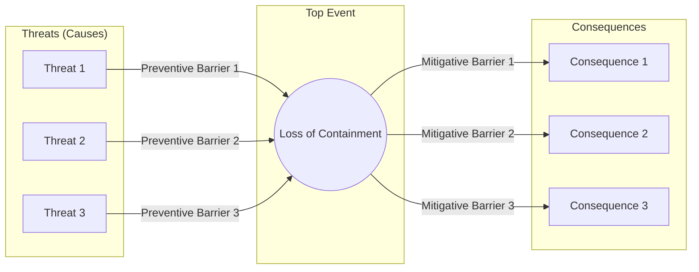

## Bow-Tie Analysis

### Overview

Bow-Tie Analysis is a visual risk assessment methodology that combines the logic of a fault tree (causes leading to a hazard) with an event tree (consequences following from that hazard), joined at a central "top event" or "hazardous event." The resulting diagram resembles a bow-tie shape, making the relationship between threats, barriers, the top event, and consequences intuitively visible to both technical and non-technical audiences.

### Structure of a Bow-Tie Diagram

**Key Points**

- **Top event**: the central hazardous event (e.g., "loss of containment," "runaway reaction") — the point at which control has been lost but consequences have not yet occurred.
- **Threats**: the causes on the left side that could lead to the top event, each connected via a distinct causal pathway.
- **Consequences**: the outcomes on the right side that could result once the top event occurs.
- **Preventive barriers**: controls positioned between threats and the top event, intended to stop the top event from occurring.
- **Mitigative barriers**: controls positioned between the top event and consequences, intended to reduce the severity of outcomes once the top event has occurred.
- **Escalation factors**: conditions that can defeat or degrade a barrier's effectiveness (shown as smaller "sub-bow-ties" attached to a barrier).

### Barriers in Detail

**Key Points**

- Each barrier should ideally be independent, effective, and auditable — the same underlying criteria used in LOPA for IPLs.
- Barriers are categorized by function: hardware (relief valves, SIS), procedural (operating procedures, permits), and human/organizational (training, competency).
- Escalation factor controls are barriers that protect the integrity of another barrier (e.g., a maintenance/testing program that keeps a relief valve functional is an escalation factor control for that relief valve).

**Example**

For the threat "External corrosion leads to pipe wall thinning" on the left side of a bow-tie for "Loss of containment of flammable liquid":

- Preventive barriers: corrosion inspection program, protective coating, cathodic protection
- Escalation factor: "Inspection program not followed" — with its own escalation factor control: "Inspection compliance audit"

On the right side, for the consequence "Pool fire":

- Mitigative barriers: fire and gas detection, emergency isolation (ESD), fixed fire suppression, emergency response plan

### Relationship to Other PSM Tools

| Tool | Relationship to Bow-Tie |
| --- | --- |
| HAZOP/PHA | Often the source of threats and consequences populated into the bow-tie; bow-tie is a visualization/organization layer on top of PHA findings |
| LOPA | Preventive/mitigative barriers in a bow-tie may correspond to IPLs credited in a LOPA study, but bow-tie does not inherently include numerical PFD calculations |
| Fault Tree Analysis | The left half of the bow-tie is conceptually a simplified fault tree |
| Event Tree Analysis | The right half of the bow-tie is conceptually a simplified event tree |
| Safety Case / Major Accident Prevention | Bow-ties are commonly used to visually demonstrate barrier management for major accident hazards, particularly in high-hazard industries under regulatory regimes like the UK COMAH or Australian safety case frameworks |

**Key Points**

- Bow-tie is primarily a **communication and barrier-management tool**, not a probabilistic calculation method — it does not, by itself, quantify risk numerically the way LOPA or QRA do.
- Some software implementations (e.g., BowTieXP) allow numerical PFD/frequency data to be layered onto a bow-tie, effectively converting it into a semi-quantitative tool similar to LOPA, but this is an extension rather than the core method. [Inference: numerical extensions vary by vendor/software and are not part of the original bow-tie concept.]

### Building a Bow-Tie: Step-by-Step

1. Define the top event clearly and specifically (avoid overly broad definitions like "accident")
2. Identify all credible threats that could independently lead to the top event
3. Identify all credible consequences that could result from the top event
4. For each threat, identify preventive barriers between the threat and the top event
5. For each consequence, identify mitigative barriers between the top event and the consequence
6. Identify escalation factors that could defeat each barrier, and escalation factor controls that protect barrier integrity
7. Assign barrier ownership (the role/position responsible for maintaining each barrier's effectiveness)
8. Validate the diagram against PHA/incident history to ensure completeness

### Strengths

- Highly intuitive visual format — accessible to operators, management, and auditors without specialized risk engineering training
- Explicitly separates prevention from mitigation, clarifying which barriers act before versus after loss of control
- Effective tool for demonstrating barrier ownership and accountability in major accident hazard management programs
- Useful for incident investigation: an incident can be mapped onto an existing bow-tie to show exactly which barriers failed

### Limitations

- Does not inherently quantify risk; without numerical extension, it cannot rank scenarios by frequency or compare risk magnitudes the way LOPA/QRA can
- Can oversimplify complex causal relationships that a full fault tree would capture with logic gates (AND/OR conditions) — bow-ties typically show additive, independent pathways rather than combinatorial logic
- Diagram can become visually cluttered and lose value if too many threats, consequences, or barriers are included on a single top event
- Quality is highly dependent on the facilitation team's completeness in identifying threats, consequences, and barriers — gaps are not always evident from the diagram alone

### Example Application

**Top event**: Loss of containment of chlorine gas from storage tank

**Threats** (left side): Overfilling, external corrosion, valve failure, mechanical impact, overpressure from external fire

**Preventive barriers**: High-level alarm and trip, corrosion monitoring program, valve inspection/testing, vehicle barriers, pressure relief system

**Consequences** (right side): Toxic gas cloud affecting nearby community, toxic exposure to on-site personnel, environmental contamination

**Mitigative barriers**: Gas detection and alarm system, emergency shutdown/isolation, water curtain/scrubber system, community emergency notification system, personal protective equipment and shelter-in-place procedures

### Conclusion

Bow-Tie Analysis serves as a powerful barrier-management and communication tool that visually connects causes and consequences through a defined top event, complementing rather than replacing quantitative methods like LOPA and QRA. Its greatest value lies in clarifying barrier ownership, supporting incident investigation, and communicating major hazard risk to broad audiences.

### Related Topics

- Layers of Protection Analysis (LOPA)
- Fault Tree and Event Tree Analysis
- Safety Case Development for Major Accident Hazards
- Barrier Management Programs
- Incident Investigation and Root Cause Analysis
- Escalation Factor Identification and Control