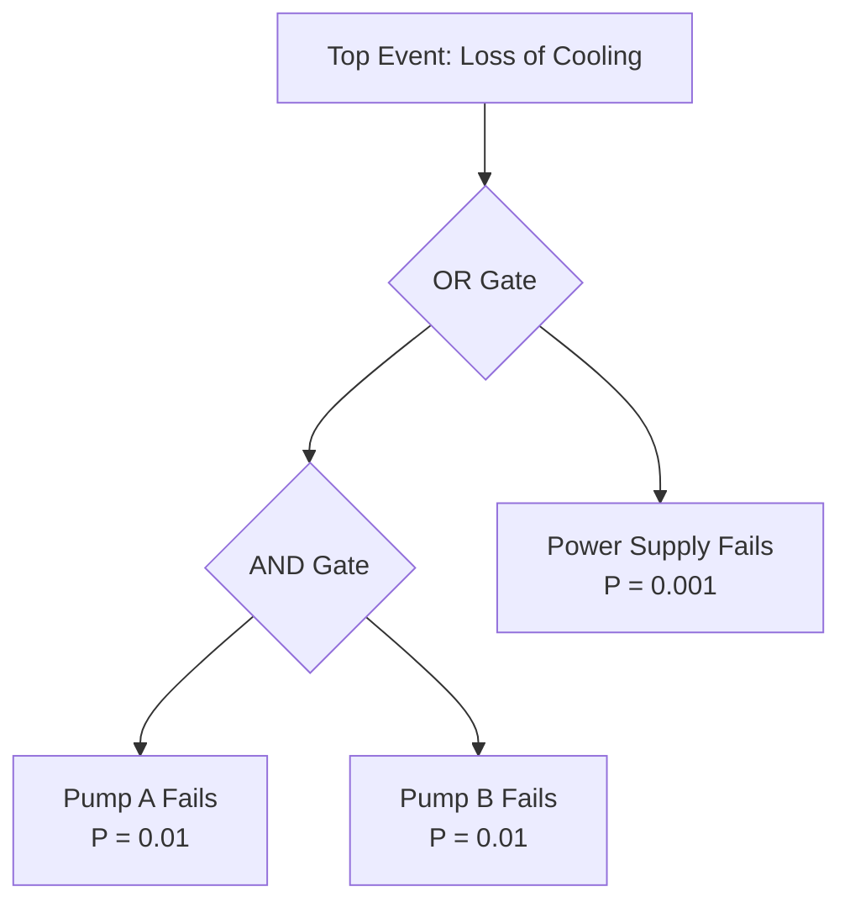
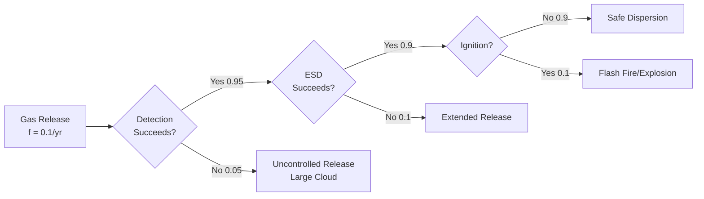
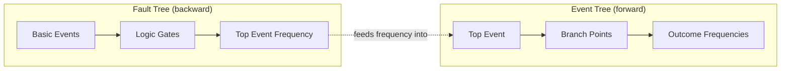

## Fault Tree and Event Tree Analysis

### Overview

Fault Tree Analysis (FTA) and Event Tree Analysis (ETA) are complementary quantitative/logical modeling techniques used to analyze how combinations of failures lead to a hazardous event (FTA) and how that event can propagate to different outcomes depending on the success or failure of subsequent safeguards (ETA). Together they form the analytical backbone underlying bow-tie diagrams and full Quantitative Risk Assessments (QRA).

### Fault Tree Analysis (FTA)

**Concept**

FTA is a **deductive, top-down** method that starts with an undesired top event and works backward to identify all combinations of basic equipment failures, human errors, and external events that could cause it, using Boolean logic gates.

**Key Points**

- Top-down deductive logic: begins with "what could cause this failure?" rather than "what happens if this component fails?" (which is the inductive direction used in FMEA)
- Uses standardized logic gate symbols to combine events
- Produces "minimal cut sets" — the smallest combinations of basic events that, if they all occur, cause the top event
- Can be evaluated qualitatively (cut set identification) or quantitatively (probability calculation)

**Logic Gates**

| Gate | Symbol Function | Logic |
| --- | --- | --- |
| AND gate | Output occurs only if ALL inputs occur | $P_{out} = P_1 \times P_2 \times ... \times P_n$ |
| OR gate | Output occurs if ANY input occurs | $P_{out} = 1 - \prod_{i=1}^{n}(1 - P_i)$ (for independent events) |
| Basic event | Undeveloped, elementary failure (component failure, human error) | Terminal node with assigned probability |
| Intermediate event | Result of a gate, feeding into another gate | Pass-through node |

**Worked Example**

Top event: "Loss of cooling to reactor"

Causes (simplified):

- Pump A fails AND Pump B (backup) fails → AND gate, since both must fail
- OR: Power supply fails (affects both pumps simultaneously)

Calculation:

$$P_{AND1} = P_{PA} \times P_{PB} = 0.01 \times 0.01 = 1 \times 10^{-4}$$

$$P_{TOP} = 1 - (1 - P_{AND1})(1 - P_{PS}) = 1 - (1 - 1\times10^{-4})(1 - 1\times10^{-3}) \approx 1.1 \times 10^{-3}$$

**Minimal Cut Sets**: {Pump A fails, Pump B fails} and {Power supply fails} — these are the two independent combinations that each independently cause the top event.

### Event Tree Analysis (ETA)

**Concept**

ETA is an **inductive, forward-looking** method that starts with an initiating event and branches forward through a sequence of safeguard successes/failures (each modeled as a binary branch point) to enumerate all possible outcome sequences and their frequencies.

**Key Points**

- Each branch point (node) represents a safeguard or intervening event, with "success" (upper branch) and "failure" (lower branch) paths
- Outcome frequency for each path = initiating event frequency × product of branch probabilities along that path
- Directly complements FTA: FTA quantifies the frequency of the initiating/top event; ETA quantifies what happens after it

**Worked Example**

Initiating event: Flammable gas release, frequency = 0.1/year

Safeguards (in sequence): (1) Gas detection & alarm, (2) Emergency shutdown/isolation, (3) Ignition does not occur

Frequency of outcome C4 (Flash Fire/Explosion following successful detection and ESD):

$$f_{C4} = 0.1 \times 0.95 \times 0.9 \times 0.1 = 8.55 \times 10^{-3} \text{ events/year}$$

Each terminal branch produces a distinct outcome frequency, and the set of all outcomes and frequencies forms the basis for consequence severity mapping in a full QRA.

### FTA vs. ETA — Side-by-Side Comparison

| Aspect | Fault Tree Analysis | Event Tree Analysis |
| --- | --- | --- |
| Direction | Backward (deductive) — top event to causes | Forward (inductive) — initiating event to outcomes |
| Question answered | "What combinations of failures cause this event?" | "What happens after this event occurs?" |
| Logic structure | Boolean gates (AND/OR) | Sequential binary branch points |
| Output | Minimal cut sets, top event probability | Outcome frequencies for each consequence path |
| Position relative to top event | Left side / "before" | Right side / "after" |
| Relationship to bow-tie | Corresponds to the preventive (left) side | Corresponds to the mitigative (right) side |

### Combined Use: Fault Tree + Event Tree in QRA

**Key Points**

- In a full QRA, FTA is often used to calculate the frequency of the initiating event or top event (e.g., frequency of a specific loss-of-containment scenario from equipment failure data).
- That calculated frequency then becomes the starting frequency for an ETA, which branches through subsequent safeguards to calculate frequencies for each final consequence (safe dispersion, flash fire, explosion, toxic exposure, etc.).
- This combined FTA→ETA structure is mathematically equivalent to the two halves of a bow-tie diagram, but with full numerical rigor rather than the qualitative/visual bow-tie representation.

### Data Sources for Quantification

- Generic industry failure rate databases: OREDA (Offshore Reliability Data), CCPS Process Equipment Reliability Database, IEEE 500
- Manufacturer-supplied component reliability data (e.g., valve failure rates, sensor MTBF)
- Plant-specific historical failure/maintenance data (preferred when statistically sufficient sample size exists)
- Human error probability databases (e.g., THERP, SPAR-H) for human-initiated branch/basic events

**Key Points**

- Data source selection significantly affects result credibility; generic databases provide broad applicability but may not reflect plant-specific conditions or maintenance practices. [Inference: the appropriate blend of generic vs. plant-specific data is a judgment call guided by data availability and statistical significance, not a fixed rule.]

### Strengths and Limitations

**Strengths**

- Rigorous, mathematically traceable logic — auditable and reproducible given the same input data and structure
- FTA identifies minimal cut sets, directly highlighting the most risk-significant combinations of failures for targeted risk reduction
- ETA explicitly enumerates all outcome pathways, useful for consequence severity distribution analysis

**Limitations**

- Time- and expertise-intensive; typically reserved for high-consequence or regulatorily-mandated QRA studies rather than routine PHA
- Results are highly sensitive to failure rate data quality and independence assumptions between basic events (common-cause failures must be explicitly modeled or results will be non-conservative)
- Complex trees can become difficult to construct, validate, and communicate to non-specialist stakeholders without a simplified visual layer (such as a bow-tie summary)

### Conclusion

Fault Tree and Event Tree Analysis provide the rigorous logical and mathematical foundation for quantitative process risk assessment, with FTA answering "how could this happen" and ETA answering "what happens next." Their combined application underlies full QRA studies and gives structural meaning to the more visual, simplified bow-tie representation used for communication and barrier management.

### Related Topics

- Bow-Tie Analysis
- Layers of Protection Analysis (LOPA)
- Qualitative versus Quantitative Risk Assessment
- Common-Cause Failure Analysis
- Failure Rate Data Sources and Reliability Databases
- Consequence Modeling for QRA