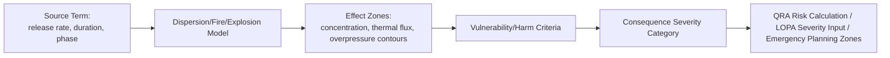

## Consequence Modeling and Dispersion Analysis

### Overview

Consequence modeling predicts the physical effects of a loss-of-containment event — toxic gas dispersion, fire, explosion — in terms of the spatial extent and magnitude of harm to people, assets, and the environment. Dispersion analysis specifically models how a released material travels and dilutes in the atmosphere. These models translate a hazard scenario's physical parameters into quantitative effect zones that feed directly into QRA, LOPA severity categorization, and emergency response planning.

### Role in the Risk Assessment Chain

### Step 1: Source Term Determination

**Key Points**

- The source term defines what is released, how fast, in what phase, and for how long — this is the critical input that drives all downstream modeling accuracy.
- Release scenarios are typically categorized as: continuous (steady leak from a hole/crack), instantaneous (catastrophic vessel/pipe failure), or time-varying (blowdown following isolation).
- Key source term parameters: mass/volume release rate, release duration, physical state (gas, liquid, two-phase flash), temperature and pressure at release, hole size (often modeled using representative hole sizes: small ~6mm, medium ~25mm, large/full-bore rupture).

**Example**

A pressurized liquid propane release from a 25mm hole at 15 bar and 25°C would typically flash partially to vapor upon release (due to pressure drop below the vapor pressure), producing a two-phase jet — this flash fraction calculation is a standard first step before dispersion modeling can proceed.

### Step 2: Dispersion Modeling

**Model Categories**

| Model Type | Application | Examples |
| --- | --- | --- |
| Gaussian plume/puff | Neutrally buoyant gases, passive dispersion | Simple screening tools, early regulatory models |
| Dense gas (heavy gas) | Gases denser than air (e.g., chlorine, LPG vapor, refrigerated ammonia) that slump and spread laterally near ground level | DEGADIS, SLAB, PHAST dense gas module |
| Jet dispersion | High-momentum releases where initial jet mechanics dominate near-field behavior before transitioning to passive dispersion | Integrated into PHAST, TRACE, FRED |
| CFD (Computational Fluid Dynamics) | Complex geometry (congested plant layouts, obstacles affecting flow) requiring detailed spatial resolution | FLACS, ANSYS Fluent (for explosion/dispersion in congested areas) |

**Key Points**

- Dense gas behavior is a critical distinction: many industrially significant toxic and flammable gases (chlorine, ammonia, LPG, hydrogen sulfide when cold) are denser than air at release conditions and require dense-gas models rather than simple Gaussian dispersion, which would underestimate near-ground concentrations.
- Atmospheric stability class (Pasquill-Gifford categories A–F) and wind speed are essential meteorological inputs — stable atmospheric conditions (class F, low wind) generally produce narrower but longer-traveling plumes with less dilution, often representing worst-case scenarios for toxic exposure.
- Most commercial software (PHAST, SAFETI, ALOHA, TRACE) automates the source term-to-dispersion pipeline, though the underlying physics and required inputs remain as described above. [Note: specific commercial software behavior may vary by version; verify against current vendor documentation for critical applications.]

### Step 3: Fire and Explosion Modeling

**Fire Types and Models**

| Fire Type | Scenario | Effect Metric |
| --- | --- | --- |
| Jet fire | Pressurized release ignites immediately at point of release | Thermal radiation flux (kW/m²) as function of distance |
| Pool fire | Liquid spill ignites, burns as a pool | Thermal radiation flux, flame height/tilt |
| Flash fire | Delayed ignition of a dispersed flammable cloud, burns back through the cloud without significant overpressure | Extent typically approximated by the cloud's lower flammability limit (LFL) contour |
| BLEVE (Boiling Liquid Expanding Vapor Explosion) | Catastrophic vessel failure under fire exposure, releasing superheated liquid that flashes explosively | Thermal radiation (fireball) plus blast overpressure |
| Vapor Cloud Explosion (VCE) | Delayed ignition of a flammable cloud in a congested/confined area, producing significant overpressure | Blast overpressure (psi or kPa) as function of distance |

**Key Points**

- VCE severity is strongly influenced by congestion and confinement in the cloud's path — the same cloud size can produce vastly different overpressures depending on plant layout, which is why CFD-based explosion modeling (e.g., FLACS) is often used for congested process areas rather than simplified TNT-equivalent methods.
- The TNT-equivalent method and multi-energy/Baker-Strehlow-Tang methods are common simplified approaches for VCE overpressure estimation when full CFD is not warranted, though they are generally considered less accurate for congested geometries. [Inference: relative accuracy comparisons are drawn from CCPS guidance and are scenario-dependent rather than absolute.]

### Step 4: Vulnerability and Harm Criteria

**Toxic Exposure Criteria**

| Criterion | Definition |
| --- | --- |
| IDLH (Immediately Dangerous to Life or Health) | NIOSH-defined concentration threshold for emergency planning |
| ERPG-2/3 (Emergency Response Planning Guidelines) | AIHA-defined concentration thresholds for impairment (ERPG-2) or life-threatening effects (ERPG-3) |
| AEGL (Acute Exposure Guideline Levels) | EPA-defined tiered thresholds (AEGL-1/2/3) by exposure duration |
| Probit functions | Statistical dose-response relationships correlating concentration × time to probability of fatality, used in QRA for continuous risk calculation rather than threshold pass/fail |

**Thermal and Overpressure Criteria**

| Effect | Typical Threshold (illustrative) |
| --- | --- |
| Thermal radiation — pain threshold | ~1.6 kW/m² |
| Thermal radiation — potentially lethal (prolonged exposure) | ~12.5 kW/m² |
| Overpressure — window breakage | ~1 psi (~7 kPa) |
| Overpressure — building damage | ~3–5 psi |
| Overpressure — potentially lethal (lung damage) | ~15+ psi |

[Unverified: exact threshold values vary by regulatory jurisdiction and reference source (e.g., CCPS, TNO Green Book, API RP 752/753) — values shown are illustrative order-of-magnitude figures and must be confirmed against the specific standard governing the assessment.]

### Worked Example: Toxic Release Consequence Assessment

**Scenario**: Chlorine release from a 25mm hole in a liquid line at 8 bar.

1. **Source term**: Liquid chlorine flashes on release; two-phase jet calculation determines mass release rate ≈ 5 kg/s and flash fraction ≈ 20%.
2. **Dispersion**: Chlorine vapor is denser than air; dense-gas model (e.g., PHAST UDM) selected. Weather case: F-stability, 1.5 m/s wind (conservative/worst-case for concentration at distance).
3. **Effect zones calculated**:
   - ERPG-3 contour (life-threatening) extends to ~800m downwind
   - ERPG-2 contour (impairment) extends to ~2,200m downwind
4. **Vulnerability assessment**: Overlay population density/occupancy data on the ERPG contours to estimate number of people potentially affected at each severity level.
5. **Output feeds into**: QRA individual/societal risk calculation, or into LOPA as the basis for consequence severity category (e.g., "Category 4 — potential for offsite fatality") that determines the required frequency criterion for that scenario.

### Common Modeling Pitfalls

- Using a simple Gaussian (neutrally buoyant) model for a dense gas, which underestimates near-field ground-level concentrations
- Neglecting flash fraction/aerosol formation in pressurized liquid releases, underestimating the airborne (vs. pooling) mass fraction
- Selecting non-conservative weather data (e.g., default "average" conditions) instead of running the required range of stability classes to identify reasonable worst-case conditions
- Ignoring congestion/confinement effects in VCE modeling by defaulting to simplified TNT-equivalent methods for geometries where CFD is warranted
- Conflating consequence severity categories across different toxic/thermal/overpressure endpoints without a consistent basis for comparison

### Regulatory and Standards Context

- **EPA RMP** requires worst-case and alternative release scenario consequence modeling for covered processes (40 CFR 68 Subpart B)
- **API RP 752/753** provide guidance on building siting consequence criteria for toxic, fire, and explosion hazards
- **CCPS Guidelines for Consequence Analysis of Chemical Releases** is a widely referenced industry methodology reference
- Software commonly used: DNV PHAST/SAFETI, ALOHA (EPA/NOAA, free tool for screening-level analysis), TRACE, FLACS (for CFD explosion modeling)

### Conclusion

Consequence modeling and dispersion analysis translate a hazard scenario's physical release characteristics into quantifiable effect zones, forming the essential bridge between a scenario's technical description and its risk significance. Model selection — particularly the distinction between passive and dense-gas dispersion, and simplified versus CFD-based explosion modeling — has a first-order effect on result accuracy and must be matched to the specific material and geometry involved.

### Related Topics

- Fault Tree and Event Tree Analysis
- Layers of Protection Analysis (LOPA)
- Emergency Planning Zones and Community Right-to-Know
- Facility Siting and Building Occupancy (API RP 752/753)
- Vapor Cloud Explosion Modeling and Congestion Assessment
- Worst-Case and Alternative Release Scenario Analysis (EPA RMP)