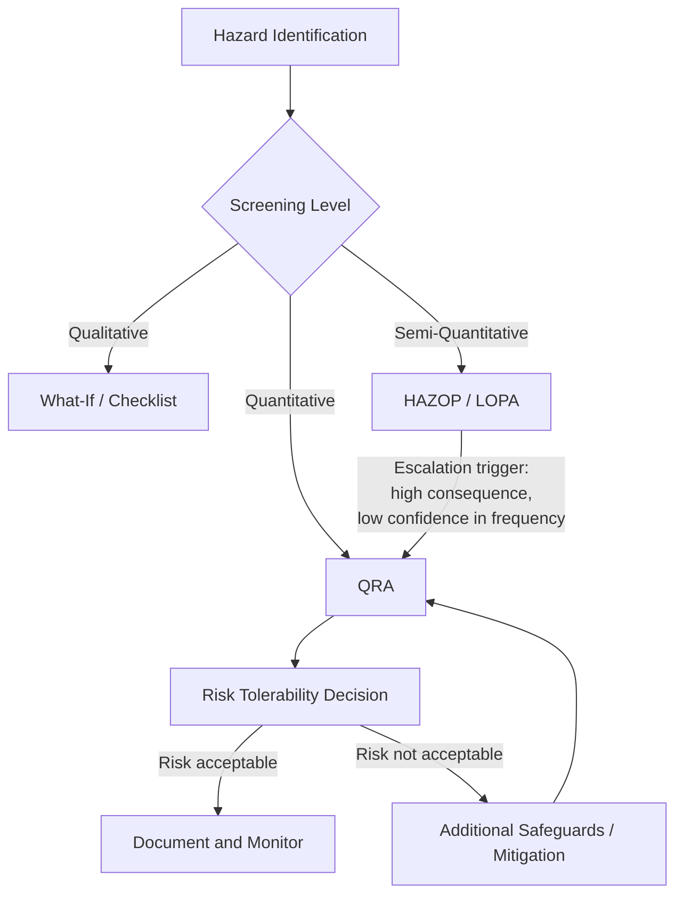
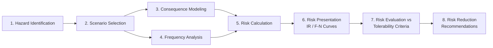
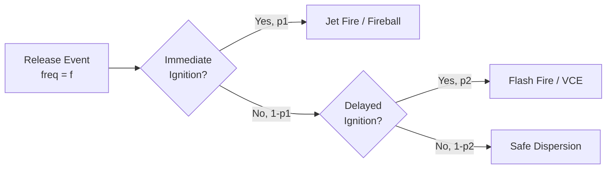
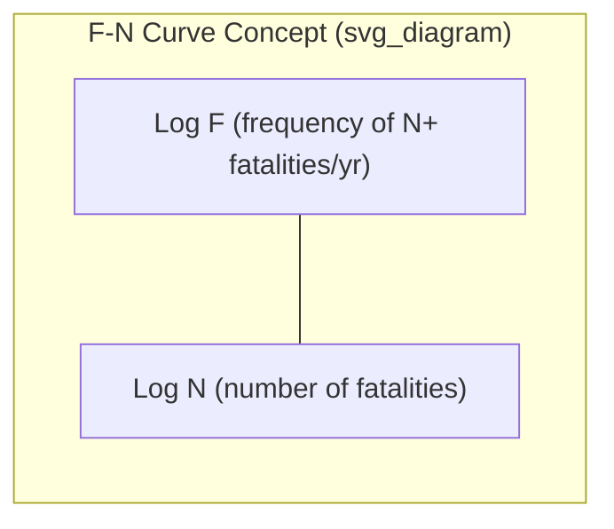

## Quantitative Risk Assessment (QRA)

### Definition and Purpose

Quantitative Risk Assessment (QRA) is a systematic methodology that estimates risk in numerical terms — typically expressed as frequency (events per year) and consequence (fatalities, injuries, financial loss, or area of impact) — to support decision-making in process safety. Unlike qualitative methods (e.g., What-If, HAZOP) that rank risk categorically (High/Medium/Low), QRA produces defensible numerical estimates that can be compared directly against risk tolerance criteria.

**Key Points**

- QRA answers three core questions: What can go wrong? How likely is it? What are the consequences?
- Results are typically expressed as Individual Risk (IR) and Societal Risk (SR/F-N curves)
- Used heavily in high-hazard industries: oil & gas, chemical processing, LNG, nuclear, and pipeline transport
- [Inference] Regulatory mandates for QRA vary significantly by jurisdiction; some require it explicitly (e.g., Seveso III in the EU for certain establishments), while others use it as a supporting tool within broader PSM frameworks like OSHA PSM (29 CFR 1910.119), which does not explicitly mandate QRA but permits it as a hazard evaluation technique.

### Position Within the Risk Assessment Hierarchy

QRA is generally the most resource-intensive tier, reserved for scenarios where:

- Consequences are severe (multiple fatalities, major offsite impact)
- Layer of Protection Analysis (LOPA) results are borderline or the decision has high capital cost implications
- Regulatory or stakeholder requirements demand numerical risk figures
- Land-use planning decisions near hazardous facilities are being made

### Core Methodology / Workflow

#### 1. Hazard Identification

Draws from HAZOP, What-If, or historical incident data to identify Loss of Containment (LOC) scenarios: pipe ruptures, vessel failures, gasket leaks, relief valve discharges, etc.

#### 2. Scenario Selection and Categorization

Not every conceivable leak size is modeled. Standard practice bins release scenarios by hole size:

- Small leak (e.g., 6mm / 1/4")
- Medium leak (e.g., 25–50mm)
- Large leak / rupture (full-bore failure)

Each scenario is paired with representative process conditions (pressure, temperature, inventory).

#### 3. Consequence Modeling

Physical effect models estimate the outcome of a release:

| Consequence Type | Modeling Approach | Typical Output |
| --- | --- | --- |
| Toxic release | Dispersion modeling (Gaussian plume, dense gas) | Concentration contours (ppm) vs. distance |
| Fire (jet fire, pool fire, flash fire) | Thermal radiation modeling | Heat flux (kW/m²) contours |
| Explosion (VCE) | TNT equivalent, TNO Multi-Energy, Baker-Strehlow | Overpressure (psi/bar) contours |
| BLEVE | Fireball radius/duration correlations | Radiation dose, fireball diameter |

**Example**

For a propane release, a jet fire consequence model might estimate that a heat flux of 37.5 kW/m² (potentially fatal within seconds) extends to 45 meters from the release point, while 12.5 kW/m² (sufficient to ignite wood, injure exposed skin) extends to 95 meters.

Dispersion and radiation calculations commonly use tools such as PHAST, ALOHA, SAFETI, or EFFECTS. [Unverified] Specific software output values depend on input meteorological data, terrain assumptions, and model version, so results should be treated as scenario-specific estimates rather than universal constants.

#### 4. Frequency Analysis

Estimates how often each scenario occurs, per year, using:

- **Generic failure rate databases**: OREDA, UK HSE HCRD, PERD, EGIG (pipelines)
- **Fault Tree Analysis (FTA)**: for complex initiating event combinations
- **Event Tree Analysis (ETA)**: for modeling post-release outcomes (ignition, no ignition, immediate vs. delayed ignition)

Event tree branch probabilities are multiplied along each path to yield the frequency of each specific outcome:

$$f_{outcome} = f_{release} \times p_{branch1} \times p_{branch2} \times \ldots \times p_{branchN}$$

#### 5. Risk Calculation

Individual Risk at a specific location is the summation, across all scenarios $i$, of the frequency of that scenario multiplied by the probability of fatality at that location given the scenario occurs:

$$IR_{location} = \sum_{i=1}^{n} f_i \times P_{f,i}$$

Where $f_i$ is the frequency of scenario $i$ (events/year) and $P_{f,i}$ is the probability of fatality (vulnerability) at that location given scenario $i$ occurs, often derived from a probit function.

**Probit functions** convert a physical effect dose (e.g., thermal dose, toxic dose) into a probability of fatality:

$$Pr = a + b \cdot \ln(V)$$

Where $Pr$ is the probit value, $V$ is the causative variable (e.g., dose = concentration^n × time for toxics), and $a$, $b$ are substance/effect-specific constants. The probit value is then converted to a fatality probability via the standard normal cumulative distribution.

#### 6. Risk Presentation

**Individual Risk (IR) Contours**

Plotted as concentric contour lines around a facility on a site plan, each representing a constant annual fatality risk level (e.g., $1\times10^{-6}$/yr, $1\times10^{-5}$/yr) for a hypothetical person continuously present at that location.

**Societal Risk (F-N Curves)**

Plots cumulative frequency ($F$) of events causing $N$ or more fatalities, on a log-log scale, accounting for actual population distribution around the facility.

Below is an SVG representation of a typical F-N curve with tolerability regions:

<svg xmlns="http://www.w3.org/2000/svg" viewBox="0 0 500 380">
<text x="250" y="20" font-size="14" text-anchor="middle" font-weight="bold">F-N Curve Tolerability Regions (svg_diagram)</text>
<line x1="60" y1="320" x2="460" y2="320" stroke="black" stroke-width="1.5" />
<line x1="60" y1="320" x2="60" y2="40" stroke="black" stroke-width="1.5" />
<text x="260" y="355" font-size="12" text-anchor="middle">Number of Fatalities, N (log scale)</text>
<text x="20" y="180" font-size="12" text-anchor="middle" transform="rotate(-90 20 180)">Cumulative Frequency, F (log scale)</text>
<polygon points="60,40 460,40 460,150 60,320" fill="#e74c3c" fill-opacity="0.25" />
<text x="150" y="90" font-size="12" fill="#c0392b">Intolerable Region</text>
<polygon points="60,320 460,150 460,260 60,320" fill="#f1c40f" fill-opacity="0.3" />
<text x="250" y="230" font-size="12" fill="#7d6608">ALARP Region</text>
<polygon points="60,320 460,260 460,320" fill="#2ecc71" fill-opacity="0.35" />
<text x="330" y="305" font-size="12" fill="#196f3d">Broadly Acceptable</text>
<line x1="60" y1="40" x2="460" y2="150" stroke="black" stroke-width="2" stroke-dasharray="5,3" />
<line x1="60" y1="320" x2="460" y2="260" stroke="black" stroke-width="2" stroke-dasharray="5,3" />
<line x1="150" y1="180" x2="420" y2="220" stroke="#2980b9" stroke-width="2.5" />
<circle cx="150" cy="180" r="3" fill="#2980b9" />
<circle cx="420" cy="220" r="3" fill="#2980b9" />
<text x="380" y="205" font-size="11" fill="#2980b9">Predicted F-N</text>
</svg>

#### 7. Risk Tolerability Criteria

[Inference] Numerical tolerability thresholds are not universal — they are set by national regulators or company standards and vary by jurisdiction. Commonly cited reference points include:

| Risk Level | Typical IR Threshold (per year) | Interpretation |
| --- | --- | --- |
| Intolerable | > $1\times10^{-3}$ to $1\times10^{-4}$ | Risk must be reduced regardless of cost |
| ALARP (As Low As Reasonably Practicable) | $1\times10^{-4}$ to $1\times10^{-6}$ | Reduce further unless cost is grossly disproportionate to benefit |
| Broadly Acceptable | < $1\times10^{-6}$ | No further reduction generally required |

These figures are illustrative benchmarks drawn from frameworks such as the UK HSE's Reducing Risks, Protecting People (R2P2); actual applicable limits should be confirmed against the governing regulatory framework for the specific jurisdiction and facility type.

#### 8. Risk Reduction and ALARP Demonstration

Where risk falls in the ALARP region, a Cost-Benefit Analysis (CBA) is typically performed, comparing the cost of additional safeguards against the risk reduction achieved, often using a metric such as the Implied Cost of Averting a Fatality (ICAF):

$$ICAF = \frac{\text{Annualized Cost of Safeguard}}{\text{Reduction in Fatality Frequency (per year)}}$$

### Relationship to LOPA

QRA and LOPA are complementary, not competing, tools:

| Aspect | LOPA | QRA |
| --- | --- | --- |
| Rigor | Order-of-magnitude, semi-quantitative | Fully quantitative |
| Scenario scope | One cause-consequence pair at a time | Facility-wide, multiple scenarios aggregated |
| Consequence modeling | Simplified severity categories | Detailed physical effect modeling |
| Resource intensity | Low-moderate | High |
| Typical trigger | Screening tool from HAZOP | Escalation from LOPA, or regulatory/land-use requirement |

[Inference] In many industry programs, LOPA is used as the primary safeguard-adequacy tool for individual scenarios, with full QRA reserved for facility-level siting studies, quantitative land-use planning, or where LOPA's simplifying assumptions are judged insufficient for the consequence severity involved.

### Key Software Tools

- **PHAST** (DNV) — consequence modeling, dispersion, fire, explosion
- **SAFETI** (DNV) — integrated QRA platform (frequency + consequence + risk mapping)
- **ALOHA** (EPA/NOAA) — free dispersion modeling tool, common for emergency planning
- **EFFECTS** (TNO) — consequence modeling
- **FRED** (Shell) — fire and explosion consequence data
- [Unverified] Software selection and specific coefficient sets can materially change output magnitudes; QRA practitioners typically validate model choice and inputs against company/regulatory guidance before relying on absolute numerical results for decision-making.

### Data Quality and Uncertainty Considerations

**Key Points**

- Generic failure frequency data (e.g., from OREDA or HCRD) represents industry averages and may not reflect facility-specific conditions, maintenance quality, or age of equipment
- Uncertainty compounds across the frequency-consequence-vulnerability chain; results are often presented with sensitivity analysis or uncertainty bands rather than single-point values
- Weather/atmospheric stability class assumptions significantly affect dispersion distances — a single "representative" weather condition is a simplification
- [Speculation] Some practitioners argue that presenting QRA results as precise numerical values (e.g., "$3.2\times10^{-5}$/yr") can convey false precision to decision-makers unfamiliar with the underlying uncertainty; risk communication practices vary by organization.

### Common Pitfalls

- Treating QRA output as a precise prediction rather than a risk-informed decision aid
- Failing to update the QRA when process conditions, inventory, or layout change materially
- Over-reliance on generic failure data without facility-specific validation
- Omitting escalation scenarios (domino effects, knock-on fires) that can dominate societal risk

**Related Topics**

- Layer of Protection Analysis (LOPA)
- Consequence Modeling (Dispersion, Fire, Explosion)
- Fault Tree Analysis (FTA) and Event Tree Analysis (ETA)
- ALARP Demonstration and Cost-Benefit Analysis
- Land-Use Planning around Major Hazard Facilities
- Domino Effect / Escalation Analysis
- Human Reliability Analysis (HRA) in QRA context
- Seveso III Directive and Comparable Regulatory Frameworks