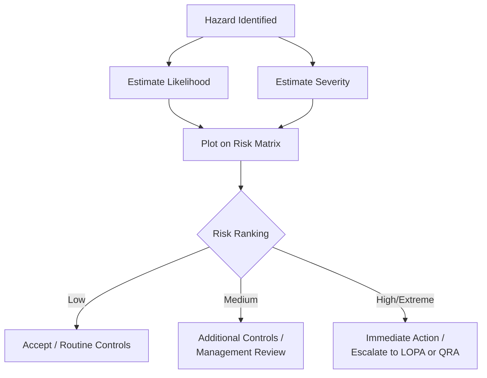
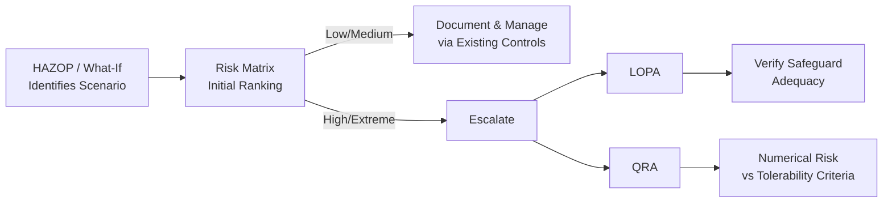

## Risk Matrices and Risk Ranking Criteria

### Definition and Purpose

A risk matrix is a qualitative-to-semi-quantitative tool that ranks risk by plotting the **likelihood** of a hazardous event against the **severity of its consequences**, producing a categorical risk level (e.g., Low, Medium, High, Extreme) used to prioritize action. Risk ranking criteria are the pre-defined, documented scales and rules that make the matrix consistent and repeatable across an organization.

**Key Points**

- Risk matrices are the most widely used risk screening tool in PSM programs because they are fast, intuitive, and require no specialized calculation
- They convert two independent judgments (likelihood, severity) into a single, actionable risk ranking
- Used extensively as the scoring mechanism within HAZOP, What-If, JSA, and incident investigation follow-up
- [Inference] While extremely common, risk matrices are generally understood in the process safety community as a screening/prioritization tool rather than a substitute for detailed quantitative analysis (e.g., QRA) when consequences are severe or frequency estimates are highly uncertain.

### Position in the Risk Assessment Toolkit

### Core Components

#### 1. Likelihood Scale

Defines discrete bands describing how often an event is expected to occur. Bands may be qualitative (descriptive) or anchored to numerical frequency ranges.

| Level | Descriptor | Typical Frequency Anchor (illustrative) |
| --- | --- | --- |
| 1 | Rare | < 1 in 10,000 years, or "has not occurred in industry" |
| 2 | Unlikely | 1 in 1,000–10,000 years |
| 3 | Possible | 1 in 100–1,000 years, or "has occurred in industry" |
| 4 | Likely | 1 in 10–100 years, or "has occurred at this site" |
| 5 | Almost Certain | > 1 in 10 years, or "occurs multiple times per year" |

[Inference] Numerical frequency anchors shown above are illustrative examples of the style companies use; actual anchor values are company- or facility-specific and should be calibrated to the operation's own historical data and industry benchmarks rather than adopted verbatim.

#### 2. Severity/Consequence Scale

Defines discrete bands across one or more consequence categories — typically Safety/Health, Environmental, Financial/Asset, and Reputational — so a single event can be scored consistently regardless of which category dominates.

| Level | Descriptor | Safety Example | Environmental Example | Financial Example (illustrative) |
| --- | --- | --- | --- | --- |
| 1 | Negligible | First aid only | No reportable release | < $10,000 |
| 2 | Minor | Medical treatment/restricted work | Small onsite release, contained | $10,000–$100,000 |
| 3 | Moderate | Lost-time injury | Reportable offsite release, minor impact | $100,000–$1M |
| 4 | Major | Single fatality or permanent disability | Significant environmental damage, long recovery | $1M–$10M |
| 5 | Catastrophic | Multiple fatalities | Severe, widespread, long-term environmental damage | > $10M |

Note the escaped dollar signs above (`\$`) to prevent unintended LaTeX rendering in Markdown/MathJax environments.

#### 3. The Matrix Grid

Likelihood and severity scores are combined — typically by plotting their intersection on a grid rather than simple multiplication, since risk matrices are ordinal rankings, not true numerical products, although some organizations do use a multiplicative score (Risk = Likelihood × Severity) as a tiebreaker or secondary sort.

Below is an SVG representation of a standard 5×5 risk matrix:

<svg xmlns="http://www.w3.org/2000/svg" viewBox="0 0 560 420">
<text x="280" y="20" font-size="14" text-anchor="middle" font-weight="bold">5x5 Risk Matrix (svg_diagram)</text>
<text x="280" y="405" font-size="12" text-anchor="middle">Severity →</text>
<text x="15" y="200" font-size="12" text-anchor="middle" transform="rotate(-90 15 200)">Likelihood ↑</text>
<g font-size="11" text-anchor="middle">
<rect x="80" y="60" width="90" height="60" fill="#2ecc71" />
<rect x="170" y="60" width="90" height="60" fill="#2ecc71" />
<rect x="260" y="60" width="90" height="60" fill="#f1c40f" />
<rect x="350" y="60" width="90" height="60" fill="#e67e22" />
<rect x="440" y="60" width="90" height="60" fill="#e74c3c" />
<rect x="80" y="120" width="90" height="60" fill="#2ecc71" />
<rect x="170" y="120" width="90" height="60" fill="#f1c40f" />
<rect x="260" y="120" width="90" height="60" fill="#f1c40f" />
<rect x="350" y="120" width="90" height="60" fill="#e74c3c" />
<rect x="440" y="120" width="90" height="60" fill="#e74c3c" />
<rect x="80" y="180" width="90" height="60" fill="#2ecc71" />
<rect x="170" y="180" width="90" height="60" fill="#f1c40f" />
<rect x="260" y="180" width="90" height="60" fill="#e67e22" />
<rect x="350" y="180" width="90" height="60" fill="#e74c3c" />
<rect x="440" y="180" width="90" height="60" fill="#e74c3c" />
<rect x="80" y="240" width="90" height="60" fill="#f1c40f" />
<rect x="170" y="240" width="90" height="60" fill="#e67e22" />
<rect x="260" y="240" width="90" height="60" fill="#e74c3c" />
<rect x="350" y="240" width="90" height="60" fill="#e74c3c" />
<rect x="440" y="240" width="90" height="60" fill="#e74c3c" />
<rect x="80" y="300" width="90" height="60" fill="#f1c40f" />
<rect x="170" y="300" width="90" height="60" fill="#e67e22" />
<rect x="260" y="300" width="90" height="60" fill="#e74c3c" />
<rect x="350" y="300" width="90" height="60" fill="#e74c3c" />
<rect x="440" y="300" width="90" height="60" fill="#e74c3c" />
</g>
<g font-size="11" text-anchor="middle" fill="#1a1a1a">
<text x="125" y="35">1-Negligible</text>
<text x="215" y="35">2-Minor</text>
<text x="305" y="35">3-Moderate</text>
<text x="395" y="35">4-Major</text>
<text x="485" y="35">5-Catastrophic</text>
</g>
<g font-size="11" text-anchor="end" fill="#1a1a1a">
<text x="75" y="94">5-Almost Certain</text>
<text x="75" y="154">4-Likely</text>
<text x="75" y="214">3-Possible</text>
<text x="75" y="274">2-Unlikely</text>
<text x="75" y="334">1-Rare</text>
</g>
</svg>

#### 4. Risk Ranking Bands and Associated Actions

Each color/band on the matrix maps to a required organizational response with defined timescales and approval authority:

| Band | Color | Typical Required Action | Typical Authority Level |
| --- | --- | --- | --- |
| Low | Green | Manage via routine procedures | Supervisor |
| Medium | Yellow | Implement additional controls; monitor | Area/Plant Manager |
| High | Orange | Reduce risk before proceeding; management review | Site Manager / PSM Lead |
| Extreme | Red | Stop activity; immediate escalation; senior management/corporate involvement | Plant Manager / Corporate |

**Example**

A HAZOP team identifies a deviation "More Pressure" on a reactor that could lead to vessel rupture. The team judges likelihood as "Unlikely" (2) — no history at this site but has occurred in industry — and severity as "Catastrophic" (5) — potential for multiple fatalities. Plotting (2,5) on the matrix above lands in the red/Extreme band, mandating immediate escalation, likely triggering a LOPA or QRA study rather than accepting the qualitative ranking alone.

### Design Considerations for Building a Risk Matrix

**Key Points**

- **Number of levels**: 4×4 and 5×5 are most common; finer granularity (6×6+) can create false precision and inter-rater disagreement
- **Category weighting**: Using the worst-case category (safety, environmental, financial) as the governing score, rather than averaging across categories, is a common convention to avoid diluting a severe safety consequence with a minor financial one
- **Avoiding the "risk = frequency × severity" trap**: [Speculation] Some practitioners caution that treating the matrix score as a literal multiplication (e.g., 2×5=10 being "less risky" than 3×4=12) can produce ordinal-to-cardinal errors, since the underlying likelihood/severity scales are typically not on true ratio scales
- **Calibration workshops**: Cross-functional calibration sessions (engineering, operations, HSE) are used to align on what "Possible" or "Major" actually means in the specific facility context, reducing rater-to-rater inconsistency

### Common Pitfalls

- **Risk matrix resonance/compression**: Poorly designed matrices can cluster too many disparate risks into the same band (e.g., everything lands "Medium"), reducing discriminating power — a phenomenon documented in risk analysis literature (notably discussed by Cox, 2008, in *Risk Analysis*) regarding the mathematical limitations of ordinal risk matrices
- **Anchoring bias**: Teams may unconsciously downgrade likelihood scores for events that "haven't happened here yet," ignoring industry-wide occurrence data
- **Inconsistent application across sites**: Without calibration, the same scenario can be scored differently by different teams, undermining portfolio-level risk comparisons
- **Using the matrix as a final decision tool for catastrophic-consequence scenarios**: High-severity/low-frequency scenarios (e.g., major toxic release) are better served by escalation to LOPA or QRA, since matrix bands are too coarse to distinguish, for example, a $10^{-4}$/yr event from a $10^{-6}$/yr event — both may land in the same "Rare" likelihood band despite a 100x difference in actual frequency

### Relationship to Other PSM Tools

| Tool | Output Type | Relationship to Risk Matrix |
| --- | --- | --- |
| HAZOP | Deviation list | Risk matrix scores each HAZOP finding |
| Risk Matrix | Categorical band | Screens findings for escalation |
| LOPA | Order-of-magnitude frequency | Used when matrix flags High/Extreme and a semi-quantitative check is warranted |
| QRA | Numerical IR/F-N | Used when matrix flags Extreme and full quantitative rigor is warranted |

### Documentation and Governance

**Key Points**

- Risk ranking criteria should be a formally controlled document (often part of the PSM/HSE Management System), reviewed periodically for currency
- Matrix definitions (likelihood/severity anchors) should be facility- or company-specific, not generic, to reflect actual operational context and risk appetite
- Version control matters: changing matrix definitions over time can make historical risk register comparisons invalid unless re-scored under the new criteria

**Related Topics**

- Hazard and Operability Study (HAZOP)
- Layer of Protection Analysis (LOPA)
- Quantitative Risk Assessment (QRA)
- ALARP (As Low As Reasonably Practicable) Principle
- Risk Registers and Portfolio Risk Management
- Bow-Tie Analysis
- Human Factors in Risk Judgment / Calibration Workshops