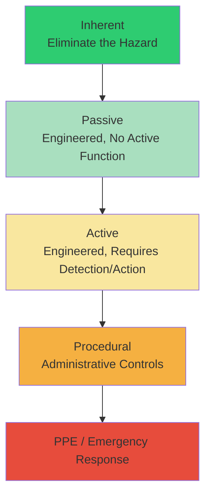
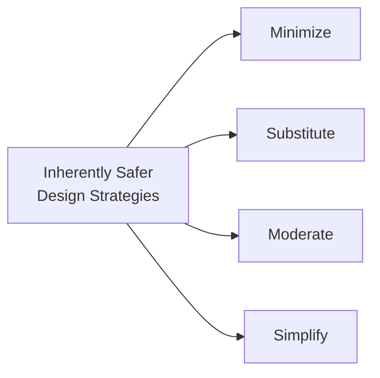
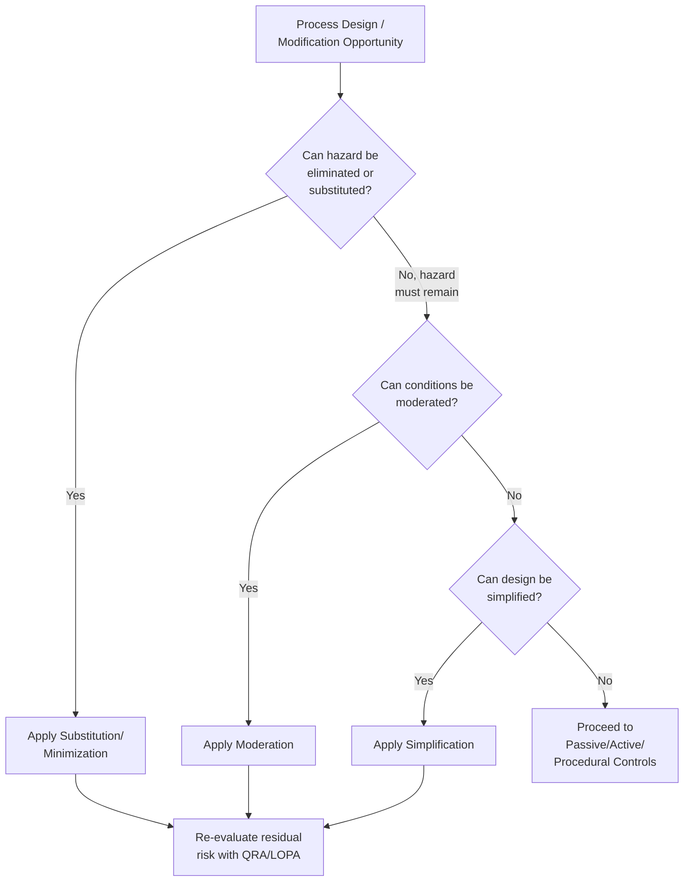

## Principles of Inherently Safer Design

### Definition and Purpose

Inherently Safer Design (ISD) is a design philosophy that seeks to eliminate or reduce hazards at their source — through material selection, process chemistry, and equipment design — rather than managing hazards after they exist through added-on controls (alarms, interlocks, procedures, PPE). The foundational principle, often attributed to Trevor Kletz, is captured in the phrase "what you don't have, can't leak."

**Key Points**

- ISD addresses hazard *magnitude*, not just the probability of an incident
- Fundamentally different from "add-on" or "engineered" safety, which reduces likelihood/consequence of an existing hazard rather than removing it
- Sits at the top of the hazard control hierarchy — most durable and least dependent on ongoing human/mechanical performance
- [Inference] While ISD is broadly endorsed across the process safety community (CCPS, HSE, AIChE), full elimination of hazards is often not achievable in practice; ISD is typically applied as a spectrum of "more inherently safe" vs "less inherently safe" options rather than a binary achieved/not-achieved state.

### Position in the Hierarchy of Controls

Reliability and durability generally decrease moving down this hierarchy: inherent measures do not depend on a device functioning correctly or a person taking correct action at the right time, whereas procedural controls and PPE depend entirely on consistent human performance.

### The Four Core Strategies

ISD strategies are conventionally grouped into four categories, most widely codified by CCPS (Center for Chemical Process Safety):

#### 1. Minimize (Intensification)

Reduce the quantity of hazardous material present in the process at any one time.

**Key Points**

- Reduces the maximum credible consequence of a loss-of-containment event by limiting available inventory
- Achieved through process intensification: smaller reactors, continuous processing instead of batch, reduced intermediate storage
- [Inference] Minimization is often the most broadly applicable ISD strategy because it can typically be pursued incrementally (e.g., reducing tank farm inventory) without requiring a full re-engineering of process chemistry.

**Example**

Replacing a large bulk chlorine storage tank feeding a water treatment plant with an on-site sodium hypochlorite generation system minimizes the chlorine inventory from tons to effectively zero, eliminating the large-release scenario entirely (this example also overlaps with Substitution).

#### 2. Substitute

Replace a hazardous material or reaction pathway with a less hazardous alternative.

**Key Points**

- Targets the intrinsic hazard properties of the material itself (toxicity, flammability, reactivity, explosivity)
- Often the most impactful strategy but can be the most difficult to retrofit into an existing process, since it may require re-validating an entire chemistry or supply chain
- Substitution decisions must consider whether the replacement introduces new hazards (e.g., an alternative solvent with lower toxicity but higher flammability) — a full life-cycle and trade-off comparison is standard practice

**Example**

Replacing methyl isocyanate (MIC) intermediate storage in pesticide manufacturing with an in-situ, on-demand generation-and-consumption process (as widely discussed in post-Bhopal ISD literature) removes the large-inventory MIC hazard rather than merely controlling it with better interlocks and vent scrubbers.

#### 3. Moderate (Attenuate)

Use the material or process under less hazardous conditions rather than eliminating it.

**Key Points**

- Reduces the energy or hazard potential available for release, without removing the hazardous material itself
- Approaches include: diluting a concentrated hazardous material, operating at lower temperature/pressure, refrigerating a liquefied gas to reduce vapor pressure, using a less concentrated or granulated form of a solid hazard

**Example**

Storing ammonia refrigerated at atmospheric pressure and near its boiling point (-33°C), rather than as a pressurized liquid at ambient temperature, moderates the consequence of a vessel failure — a refrigerated release evaporates more slowly and disperses differently than a flashing pressurized release, generally reducing initial vapor cloud formation rate.

#### 4. Simplify

Design facilities and processes to eliminate unnecessary complexity, reducing opportunities for operating error and equipment failure.

**Key Points**

- Complexity itself is treated as a hazard driver, since more components, more interconnections, and more operator decision points increase the number of ways a system can fail
- Approaches include: eliminating unnecessary valves/piping, designing piping so incorrect connections are physically impossible (e.g., non-interchangeable fittings), using gravity feed instead of pumped transfer where feasible, designing equipment that fails to a safe state

**Example**

Using differently sized or incompatible hose couplings for different chemical unloading stations (so a tanker delivering material A physically cannot connect to the fill line for material B) simplifies the human task of correct material routing by removing the possibility of a wrong-connection error, rather than relying solely on procedures and labeling.

### Additional Recognized Sub-Principles

Beyond the core four, CCPS and related literature identify supporting concepts that reinforce ISD strategies:

| Sub-Principle | Description |
| --- | --- |
| Limitation of Effects | Design equipment/layout so that if a release occurs, its effects are physically contained or limited (e.g., diking, but note this overlaps with passive engineered controls, not pure ISD) |
| Avoiding Knock-on Effects (Domino Prevention) | Physical separation/layout choices that prevent one failure from escalating into adjacent equipment |
| Making Incorrect Assembly Impossible | Error-proofing (poka-yoke) design so equipment cannot be physically misassembled or misconnected |
| Making Status Clear | Passive design cues (e.g., transparent sections of pipe, sight glasses) so system state is visually apparent without relying on instrumentation |

### The ISD Decision-Making Process

[Inference] This decision sequence reflects the general ISD philosophy of exhausting inherent options before relying on engineered or procedural layers, though the actual order of evaluation in practice is often iterative and constrained by economics, existing infrastructure, and technical feasibility rather than a strict linear sequence.

### When ISD Should Be Applied

**Key Points**

- Highest leverage and lowest cost during **conceptual and early design phases**, when process chemistry and plot layout are not yet fixed
- Retrofitting ISD into an existing operating facility is possible but typically far more constrained and costly than designing it in from the start
- ISD reviews are commonly incorporated at defined project stage-gates (e.g., during Process Hazard Analysis at the conceptual design stage, and again before detailed engineering is finalized)
- Facility siting, plant layout, and management-of-change (MOC) processes are natural points to re-apply ISD thinking throughout a facility's lifecycle, not solely at initial design

### Trade-offs and Limitations

**Key Points**

- ISD options can conflict with each other or with other design objectives (e.g., substituting to a less flammable but more toxic material; minimizing inventory but requiring more frequent hazardous deliveries, which increases transportation risk)
- Economic and technical feasibility constraints often limit how far ISD can be pushed in an existing process
- [Speculation] Some practitioners note that overly aggressive process intensification can, in certain cases, reduce operational flexibility or increase sensitivity to process upsets, illustrating that ISD decisions generally require a documented trade-off analysis rather than an assumption that "more inherent" is unconditionally better in every dimension
- ISD does not eliminate the need for engineered and procedural safeguards for residual hazards that cannot be inherently designed out

### Common Pitfalls

- Treating ISD as a one-time design review rather than a continuous consideration through MOC and capital project stage-gates
- Failing to conduct trade-off analysis when a substitution introduces a different but non-trivial hazard
- Underestimating retrofit cost/complexity and defaulting to added-on controls when an inherent option was technically feasible with early planning
- Confusing "passive engineered" controls (e.g., dikes, blast walls) with true inherent measures — passive controls manage consequences of an existing hazard, they do not eliminate the hazard itself

**Related Topics**

- Hierarchy of Controls in Process Safety
- Process Hazard Analysis (PHA) at Conceptual Design Stage
- Layer of Protection Analysis (LOPA)
- Facility Siting and Plant Layout
- Management of Change (MOC)
- CCPS Guidelines for Engineering Design for Process Safety
- Domino Effect / Escalation Prevention