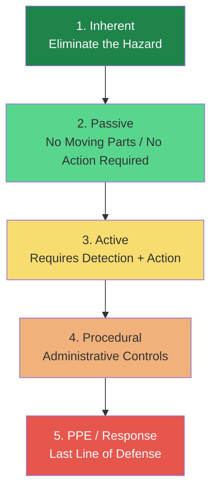
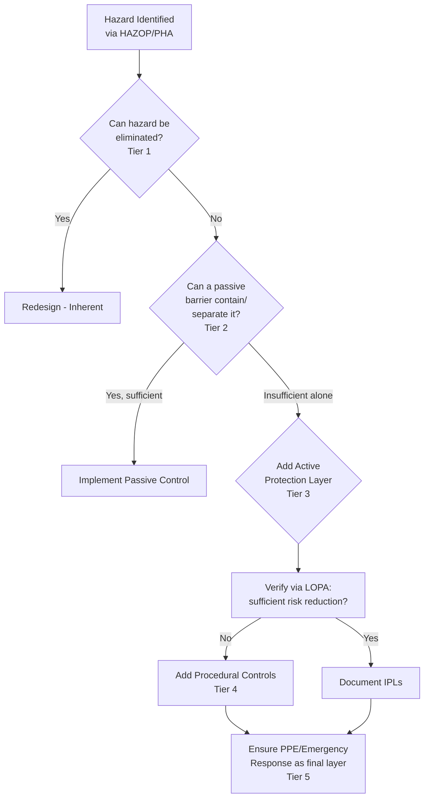

## Hierarchy of Controls

### Definition and Purpose

The Hierarchy of Controls (HoC) is a framework for classifying and prioritizing risk-reduction measures by their inherent reliability and independence from human/mechanical performance. It provides a structured decision order for selecting safeguards: measures higher in the hierarchy are preferred because they remain effective without requiring an active response, correct human decision, or functioning device at the moment of demand.

**Key Points**

- Originated broadly in industrial hygiene/occupational safety (widely codified by NIOSH) and adapted specifically for process safety by CCPS
- The governing principle: prefer controls that do not depend on someone doing the right thing at the right time
- Used to guide both new design decisions and the selection of additional safeguards identified during PHA/HAZOP or LOPA
- [Inference] While the conceptual ordering (inherent > passive > active > procedural > PPE) is consistently presented across CCPS and NIOSH sources, the exact number of named tiers and terminology varies somewhat between the general occupational-safety version of the hierarchy and the process-safety-specific version; this reference follows the process-safety-oriented five-tier structure.

### The Five Tiers

#### Tier 1: Inherent

Eliminates or reduces the hazard at its source through material, chemistry, or process design choices (Minimize, Substitute, Moderate, Simplify). Does not require any device or human action to function because the hazard itself is reduced or removed.

**Example**: Replacing a flammable heat-transfer fluid with a non-flammable alternative removes the fire hazard from that system entirely, rather than adding fire detection to manage it.

#### Tier 2: Passive

Reduces hazard consequence or likelihood through design features that require no external power, no human intervention, and no active detection/actuation to function — they work by their physical presence and configuration.

**Key Points**

- Passive measures are highly reliable specifically because they have no moving parts and no dependency on sensors, logic solvers, or operator response
- Common in process safety as physical containment or separation

**Example**: A dike/bund wall around a storage tank passively contains a spill regardless of whether any alarm sounds or any operator responds. A blast-resistant control room wall passively protects occupants without needing to "activate."

#### Tier 3: Active

Requires a sequence of detect → decide/process → act to function. This includes instrumented protective functions and mechanical safety devices that must sense a condition and then respond.

**Key Points**

- Reliability depends on the availability and correct functioning of sensors, logic solvers, and final elements — commonly quantified via Safety Integrity Level (SIL) in a Safety Instrumented System (SIS)
- Includes Basic Process Control System (BPCS) alarms, Safety Instrumented Functions (SIFs), relief valves, and rupture disks
- [Inference] Active controls are generally treated in Layer of Protection Analysis (LOPA) as Independent Protection Layers (IPLs) with quantified Probability of Failure on Demand (PFD), reflecting the fact that, unlike inherent or passive measures, their reliability must be actively engineered and periodically tested/verified.

**Example**: A high-pressure sensor that trips a shutdown valve when pressure exceeds a setpoint is an active safeguard — it depends on the sensor detecting correctly, the logic solver processing correctly, and the valve actuating correctly, each of which carries an associated failure probability.

#### Tier 4: Procedural / Administrative

Relies on documented work practices, procedures, training, and human decision-making to reduce risk, rather than physical or engineered barriers.

**Key Points**

- Includes standard operating procedures (SOPs), permit-to-work systems, lockout/tagout (LOTO), operator rounds/checks, and safety training
- Generally considered less reliable than engineered tiers because effectiveness depends on consistent human performance under varying conditions (fatigue, workload, distraction, competing priorities)
- [Inference] Procedural controls remain necessary even in highly engineered facilities, since some tasks (e.g., isolation verification before maintenance) cannot currently be fully replaced by passive or active engineering alone; the hierarchy does not suggest eliminating procedures, only avoiding over-reliance on them as the primary safeguard against a high-consequence hazard.

**Example**: A written procedure requiring two independent verifications of line isolation before opening a flange on a hydrocarbon line is a procedural control — its effectiveness depends entirely on personnel correctly following each verification step.

#### Tier 5: Personal Protective Equipment (PPE) / Emergency Response

The last line of defense, protecting an individual after a hazardous release or event has already begun, or enabling response/mitigation after the fact.

**Key Points**

- Does not prevent the hazardous event — only reduces harm to the individual or supports post-event mitigation
- Includes respirators, chemical suits, emergency shutdown response teams, and fire brigades
- [Inference] PPE is broadly regarded across process safety guidance as the least reliable tier for hazard control specifically because it is the most dependent on correct human use, correct fit, adequate training, and functioning equipment at the exact moment of exposure — but it remains an essential final layer even in well-designed facilities.

### Comparative Reliability Summary

| Tier | Depends On | Typical Reliability Characteristic | PSM Example |
| --- | --- | --- | --- |
| Inherent | Nothing (hazard removed) | Not applicable — hazard doesn't exist | Substituting a flammable solvent |
| Passive | Physical configuration only | High; no components to fail on demand | Dike, blast wall, flame arrestor |
| Active | Sensor + logic + final element | Quantified via PFD/SIL; subject to component failure | SIS trip, relief valve |
| Procedural | Human performance | Variable; subject to human error rates | Permit-to-work, LOTO |
| PPE/Response | Individual use + timing | Lowest; dependent on availability, training, correct use at time of event | SCBA, emergency response team |

### Application Workflow in Practice

This reflects standard PSM practice: safeguards are layered (defense-in-depth), with lower tiers supplementing — not replacing — higher tiers whenever the hazard cannot be fully addressed by inherent or passive means alone.

### Relationship to LOPA and Independent Protection Layers (IPLs)

**Key Points**

- LOPA formally credits IPLs with quantified PFD values, and IPL credit is generally only given to Tier 2 (passive) and Tier 3 (active) safeguards that meet independence, specificity, and reliability criteria
- Procedural controls (Tier 4) are typically given little or no quantitative credit in LOPA, or a much lower credit factor, reflecting their comparatively higher failure probability [Inference — exact credit values are company/methodology-specific and should be confirmed against the governing LOPA guideline, such as CCPS's LOPA methodology]
- PPE (Tier 5) is generally not creditable as an IPL at all, since it does not prevent the consequence, it only mitigates harm to an exposed individual after the event

### Common Pitfalls

- **Over-reliance on lower tiers**: Designing a safety case primarily around procedures and PPE for a high-consequence hazard, when an inherent or passive option was technically and economically feasible
- **Conflating passive and active controls**: Treating a device that requires any activation logic (even simple mechanical activation, like a spring-loaded relief valve responding to pressure) as fully "passive" — most relief devices are considered active/mechanical protective layers, not passive, in rigorous LOPA classification, since they involve detection (pressure exceedance) and action (opening)
- **Stacking multiple procedural layers and assuming independence**: Two procedures relying on the same personnel, same shift, or same underlying assumption are not truly independent safeguards
- **Treating the hierarchy as strictly sequential rather than iterative**: In practice, a combination of tiers is almost always used together (defense-in-depth), rather than exhausting one tier before considering the next in a rigid order

**Related Topics**

- Principles of Inherently Safer Design
- Layer of Protection Analysis (LOPA) and Independent Protection Layers
- Safety Instrumented Systems (SIS) and Safety Integrity Level (SIL)
- Permit-to-Work and Lockout/Tagout (LOTO) Systems
- Defense-in-Depth Concept in Process Safety
- Human Factors and Human Error in Procedural Controls
- Emergency Response Planning