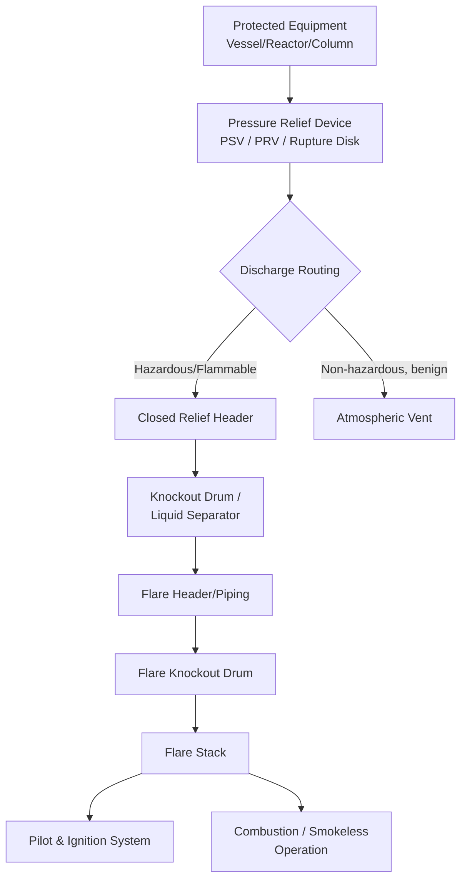
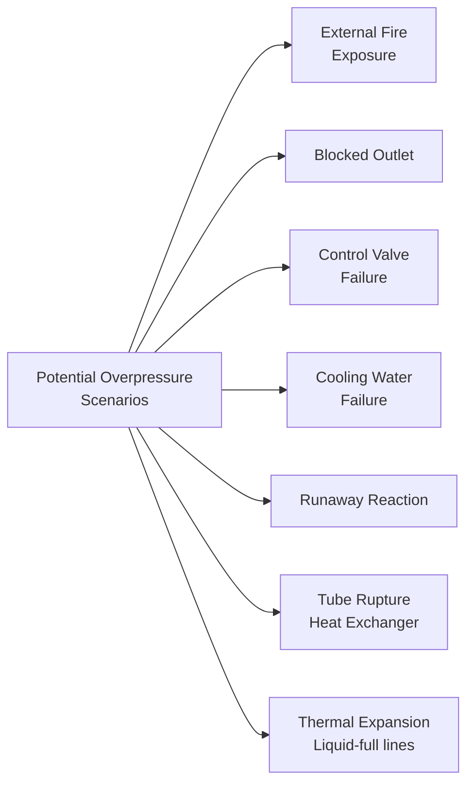

## Pressure Relief and Flare Systems

### Definition and Purpose

Pressure relief and flare systems are engineered active protective layers designed to prevent equipment overpressure by automatically venting excess pressure from a vessel or system, and safely collecting, transporting, and disposing of the released material — typically via combustion (flaring) or, for non-combustible/non-toxic streams, direct atmospheric venting.

**Key Points**

- Positioned as a Tier 3 (Active) safeguard in the Hierarchy of Controls — it detects an overpressure condition and mechanically responds
- Serves as a mechanical, largely passive-actuation last line of defense against vessel rupture, distinct from instrumented (electronic) protective systems like SIS trips
- Governed extensively by API Standard 520 (sizing/selection), API 521 (pressure-relieving and depressuring systems design), and ASME Section VIII (pressure vessel code requirements for relief device sizing)
- [Inference] Relief devices are generally the final mechanical safeguard against vessel failure; a properly functioning relief system is typically treated as preventing the "loss of primary containment via rupture" scenario, but it does not prevent the release event itself — it converts an uncontrolled catastrophic failure into a controlled (if still hazardous) release.

### System Architecture

### Types of Pressure Relief Devices

#### 1. Pressure Safety Valve (PSV) / Pressure Relief Valve (PRV)

Spring-loaded mechanical valves that open automatically when system pressure exceeds a preset setpoint, and reclose once pressure drops below a reseating pressure.

| Type | Characteristic | Typical Application |
| --- | --- | --- |
| Conventional (spring-loaded) | Opening pressure affected by downstream (back)pressure | Simple systems, low backpressure |
| Balanced Bellows | Bellows isolates spring from backpressure effects | Variable/high backpressure systems, corrosive service |
| Pilot-Operated | Uses process pressure via a pilot to hold main valve closed; opens sharply at setpoint | High-pressure systems, tight operating margins near setpoint |

**Key Points**

- Set pressure is generally established relative to the vessel's Maximum Allowable Working Pressure (MAWP), per ASME Section VIII requirements
- Reseat/blowdown behavior must be considered in flare header sizing, since valve chattering (rapid open-close cycling) can cause mechanical damage if the valve is undersized or backpressure is excessive

#### 2. Rupture Disk

A thin, precisely engineered membrane that bursts at a predetermined pressure differential, providing a full, unobstructed flow path.

**Key Points**

- Non-reclosing: once burst, the disk must be physically replaced — the vessel remains open to the relief path until manually restored
- Often used in series with a PSV (rupture disk upstream of the PSV) to protect the valve from corrosive or fouling process fluids, or as a sole overpressure device for very fast-developing events (e.g., runaway reaction) where a spring-loaded valve's opening speed is insufficient
- [Inference] The choice between PSV, rupture disk, or a combination depends on service conditions (corrosivity, fouling tendency, cycling frequency, and required response speed); specific selection guidance is detailed in API 520 Part I.

#### 3. Pressure/Vacuum (P/V) Relief Valves and Conservation Vents

Used primarily on low-pressure atmospheric or near-atmospheric storage tanks to relieve both overpressure (from filling/thermal expansion) and vacuum (from emptying/thermal contraction), preventing tank buckling under vacuum as well as overpressure rupture.

### Relief Load (Scenario) Determination

Sizing a relief device requires identifying the governing overpressure scenario and calculating the required relieving rate. Common scenarios evaluated per API 521 include:

**Key Points**

- Each scenario is evaluated independently, and the relief device is sized for the **single governing (worst-case, most conservative) scenario**, not the sum of all scenarios simultaneously
- Fire case sizing uses standardized heat input correlations based on wetted surface area (per API 521), which estimate the heat absorbed by the vessel from an external pool fire
- Multiple relief devices on a single vessel may be set at staggered pressures (e.g., a primary PSV plus a secondary set slightly higher) to handle different scenario severities

**Example**

For a distillation column with a governing scenario of "loss of overhead condenser cooling," the relief load is calculated as the vapor generation rate that would occur if all reboiler heat input continues while condensing duty drops to zero, converted to a required mass flow rate for PSV sizing per the orifice sizing equations in API 520 Part I.

### Relief Device Sizing (Conceptual Basis)

For gas/vapor service, the required PSV orifice area is derived from compressible flow equations that relate required relieving mass flow rate to orifice area, discharge coefficient, and upstream/backpressure conditions — the general form (per API 520) is:

$$A = \frac{W}{C \cdot K_d \cdot P_1 \cdot K_b \cdot K_c \sqrt{\frac{M}{T \cdot Z}}}$$

Where $A$ is required orifice area, $W$ is required relieving mass flow rate, $C$ is a gas-property-dependent coefficient, $K_d$ is the effective coefficient of discharge, $P_1$ is upstream relieving pressure, $K_b$ is a backpressure correction factor, $K_c$ is a combination correction factor (applicable when a rupture disk is installed upstream of the PSV), $M$ is molecular weight, $T$ is relieving temperature, and $Z$ is compressibility factor.

[Unverified] Exact coefficient definitions, unit conventions, and correction factor tables are specified in API 520 Part I and vary depending on whether flow is critical or subcritical; practitioners size relief devices using the current edition of API 520 rather than deriving coefficients independently, given the sensitivity of results to specific formula conventions.

### Flare System Components

#### 1. Relief/Flare Header

The piping network that collects discharge from multiple relief devices across a unit or facility and routes it to the flare. Header sizing must account for simultaneous relief scenarios (e.g., a total power failure causing multiple PSVs to lift at once) and must limit backpressure at each contributing PSV to within its allowable superimposed/built-up backpressure limits.

#### 2. Knockout Drum (KO Drum)

Separates entrained liquid droplets from the vapor/gas stream before it reaches the flare tip, preventing liquid carryover that would cause burning liquid droplets ("rain") to fall from the flare — a serious safety hazard.

**Key Points**

- Sized based on droplet settling velocity calculations (often using a modified Souders-Brown equation) to achieve required vapor-liquid separation
- Located as close to the flare stack base as practical, sometimes combined with the flare stack itself in a single vessel (knockout at the base of the stack)

#### 3. Flare Stack and Tip

Elevates the combustion point above grade to ensure adequate dispersion of combustion products and to maintain safe radiant heat levels at ground level.

| Flare Type | Description | Typical Application |
| --- | --- | --- |
| Elevated Flare | Stack-mounted, combustion occurs at height | Most refinery/chemical plant applications |
| Ground Flare | Combustion occurs near grade, often in an enclosed multi-burner arrangement | Lower-visibility requirements, noise/light reduction |
| Enclosed Ground Flare | Fully enclosed combustion chamber | Urban-adjacent facilities, stricter visible-flame/noise requirements |

**Key Points**

- Radiant heat intensity at grade is a key design constraint — flare stack height and tip design are set to keep heat flux at accessible areas below defined limits (commonly referenced design guidance targets on the order of 1.5–5 kW/m² at grade for areas with unlimited personnel exposure time, per API 521 guidance)
- Smokeless operation is typically achieved via steam-assisted, air-assisted, or pressure-assisted (multi-point) flare tip designs that improve air/fuel mixing at the combustion point

#### 4. Pilot and Ignition System

Continuously monitored pilot flames (typically 2–3 redundant pilots) ensure reliable ignition of the relief stream whenever it reaches the flare tip.

**Key Points**

- Pilot flame monitoring (thermocouple or optical) is itself a safety-critical instrumented function — loss of pilot detection typically triggers an alarm and automatic re-ignition attempt
- Purge gas (nitrogen or fuel gas) is continuously fed to the flare header at a minimum velocity to prevent air ingress into the header, which could create a flammable mixture inside the piping — a phenomenon addressed by maintaining positive purge per API 521 recommendations

#### 5. Seals (Liquid Seal / Molecular Seal)

Prevent flashback of flame into the flare header and prevent air infiltration into the system.

**Key Points**

- **Liquid seal drums**: use a liquid seal leg to physically block flame propagation back into the header
- **Molecular seals**: use the density difference of a lighter purge gas to create a buoyancy-based barrier against air infiltration, reducing purge gas consumption compared to velocity-based purging alone

### Illustration: Simplified Flare System Layout

<svg xmlns="http://www.w3.org/2000/svg" viewBox="0 0 600 380">
<text x="300" y="20" font-size="14" text-anchor="middle" font-weight="bold">Simplified Flare System Layout (svg_diagram)</text>
<rect x="30" y="60" width="70" height="90" fill="#aed6f1" stroke="#2874a6" stroke-width="1.5" />
<text x="65" y="105" font-size="10" text-anchor="middle">Vessel</text>
<rect x="55" y="45" width="20" height="18" fill="#f5b041" stroke="#b9770e" />
<text x="65" y="40" font-size="9" text-anchor="middle">PSV</text>
<line x1="75" y1="45" x2="75" y2="30" stroke="#333" stroke-width="2" />
<line x1="75" y1="30" x2="220" y2="30" stroke="#333" stroke-width="2" />
<line x1="220" y1="30" x2="220" y2="90" stroke="#333" stroke-width="2" />
<rect x="180" y="90" width="90" height="70" fill="#d5f5e3" stroke="#1e8449" stroke-width="1.5" />
<text x="225" y="130" font-size="10" text-anchor="middle">KO Drum</text>
<line x1="270" y1="120" x2="380" y2="120" stroke="#333" stroke-width="2" />
<rect x="370" y="60" width="30" height="200" fill="#fadbd8" stroke="#943126" stroke-width="1.5" />
<text x="385" y="270" font-size="9" text-anchor="middle">Flare Stack</text>
<polygon points="370,60 400,60 385,30" fill="#f39c12" />
<text x="385" y="20" font-size="9" text-anchor="middle" fill="#b9770e">Flame Tip</text>
<circle cx="405" cy="55" r="6" fill="#e74c3c" />
<text x="440" y="58" font-size="9">Pilot</text>
<rect x="330" y="150" width="30" height="40" fill="#aed6f1" stroke="#2874a6" />
<text x="345" y="200" font-size="8" text-anchor="middle">Seal Drum</text>
</svg>

### Operational and Design Considerations

**Key Points**

- **Backpressure limits**: The sum of superimposed backpressure (from other simultaneous relief flows into a shared header) plus built-up backpressure (from flow resistance of the relieving PSV's own discharge) must remain within the PSV's rated allowable backpressure — exceeding this can prevent the valve from opening fully or achieving rated flow
- **Two-phase flow considerations**: Runaway reaction relief scenarios (e.g., in reactive chemical processes) often require two-phase (vapor-liquid) relief sizing methodologies (such as the DIERS methodology), since two-phase flashing flow through a relief device behaves very differently from single-phase gas relief
- **Environmental/regulatory constraints**: Flaring is subject to emissions regulations (e.g., flare efficiency/destruction requirements, visible smoke limits, flow/composition monitoring requirements) that vary by jurisdiction — [Inference] specific numerical emissions or monitoring requirements should be confirmed against the applicable local environmental regulator rather than assumed universal.
- **Inspection and testing**: PSVs require periodic bench testing/recertification per a documented interval (often risk-based, informed by API 510/570 inspection codes and company mechanical integrity programs) to confirm the valve still opens at its certified set pressure

### Common Pitfalls

- Sizing a relief device only for the "obvious" scenario (e.g., fire case) while overlooking a more severe governing scenario such as blocked outlet or control valve failure
- Underestimating simultaneous relief loads during a facility-wide event (e.g., total power/utility failure causing multiple PSVs to lift concurrently), leading to excessive flare header backpressure
- Neglecting two-phase flow effects in reactive/runaway scenarios, which can substantially underestimate required relief area if sized using single-phase vapor assumptions alone
- Allowing liquid carryover into the flare tip due to undersized or poorly maintained knockout drums, creating a "raining fire" hazard at grade
- Deferring PSV testing/recertification, allowing set-point drift or valve sticking to go undetected until a real demand occurs

**Related Topics**

- Hierarchy of Controls (Active Protective Layers)
- Layer of Protection Analysis (LOPA) — Crediting Relief Systems as IPLs
- Safety Instrumented Systems (SIS) vs. Mechanical Relief Devices
- DIERS Methodology for Two-Phase Relief Sizing
- Facility Siting — Radiant Heat and Flare Placement
- Mechanical Integrity and Inspection Programs (API 510/570/576)
- Runaway Reaction Hazards in Reactive Chemical Processes