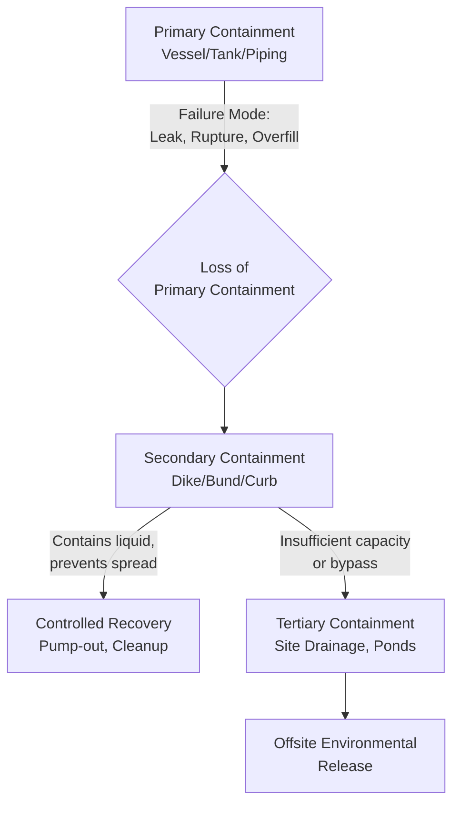
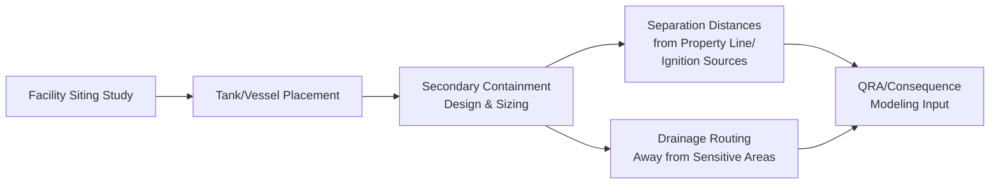

## Containment and Secondary Containment Design

### Definition and Purpose

Containment refers to the primary physical boundary that holds a hazardous material within a process system (vessels, piping, tanks). Secondary containment is a supplementary, typically passive engineered barrier designed to capture and hold a release if primary containment fails, preventing the material from spreading to soil, groundwater, waterways, or adjacent equipment/personnel areas.

**Key Points**

- Secondary containment sits at Tier 2 (Passive) in the Hierarchy of Controls — it functions by physical configuration alone, requiring no detection, power, or human action
- Distinguished from active mitigation (e.g., deluge systems, foam systems) which require detection and activation to function
- Governed by a mix of engineering codes (API 650/653 for tanks, NFPA 30 for flammable/combustible liquids) and environmental regulations (e.g., US EPA SPCC — Spill Prevention, Control, and Countermeasure rule, 40 CFR Part 112)
- [Inference] Specific regulatory containment volume requirements vary substantially by jurisdiction, material hazard class, and facility type; the sizing principles below reflect widely used industry conventions (notably NFPA 30 and API 650 Appendix I) rather than a single universal numerical standard.

### Position in the Containment Strategy

### Types of Secondary Containment Systems

#### 1. Dikes / Bunds

Earthen or concrete walls surrounding storage tanks, sized to hold a defined volume of released liquid.

**Key Points**

- **Sizing convention**: A single-tank dike is commonly sized to hold at least 100% of the largest tank's capacity plus allowance for precipitation (per NFPA 30 and API 650 Appendix I conventions); [Inference] exact percentage requirements and whether displacement of other tanks within the same dike must be subtracted vary by code edition and jurisdiction, so the governing local code/standard should be confirmed for a specific design.
- **Multi-tank dikes**: When multiple tanks share one dike, sizing is typically based on the largest tank's capacity, with the volume displaced by other tanks in the dike sometimes subtracted per applicable code provisions
- Wall material (earthen, concrete, steel) is selected based on chemical compatibility with the potential spilled material, since some materials can degrade earthen or concrete barriers over time

#### 2. Curbing and Spill Containment Pads

Localized raised edges or sloped pads around smaller vessels, drum storage areas, loading/unloading stations, and process equipment skids, directing any spill to a controlled sump or collection point rather than an open dike.

**Example**

A drum storage area for corrosive chemicals uses a chemically resistant containment pallet system rated to hold 110% of the largest single drum's volume (a common convention for small-quantity secondary containment), preventing floor-level spread if a drum fails.

#### 3. Double-Walled Tanks

An integrated design where the tank itself has an inner and outer shell, with the interstitial space serving as the secondary containment volume — commonly used for underground storage tanks (USTs) and some aboveground tank designs.

**Key Points**

- Often paired with interstitial space monitoring (pressure, vacuum, or liquid sensing) to detect inner shell failure before material reaches the outer environment — this monitoring function is an active control layered on top of the passive double-wall containment
- Reduces land footprint compared to a separate dike, since the containment is integral to the tank structure

#### 4. Containment Sumps and Trenches

Below-grade collection points, often connected via sloped floors or trench drains, that route spills from process areas to a controlled collection or treatment point rather than allowing sheet flow across a site.

**Key Points**

- Process area floor grading and trench design should route spills away from ignition sources, drains to sensitive receptors, and personnel egress paths
- Trenches carrying flammable liquids require specific design consideration (e.g., trench covers, flame arrestor considerations) since a trench can act as a pathway for vapor migration if not properly designed

### Illustration: Tank Dike Cross-Section

<svg xmlns="http://www.w3.org/2000/svg" viewBox="0 0 500 300">
<text x="250" y="20" font-size="14" text-anchor="middle" font-weight="bold">Tank Dike Secondary Containment (svg_diagram)</text>
<rect x="60" y="240" width="380" height="15" fill="#a9a9a9" />
<text x="250" y="290" font-size="10" text-anchor="middle">Ground Level</text>
<path d="M 90 240 L 90 160 L 410 160 L 410 240" fill="none" stroke="#5d4037" stroke-width="8" />
<text x="430" y="200" font-size="10">Dike Wall</text>
<circle cx="250" cy="150" r="70" fill="#aed6f1" stroke="#2874a6" stroke-width="2" />
<text x="250" y="115" font-size="10" text-anchor="middle">Storage Tank</text>
<line x1="90" y1="235" x2="410" y2="235" stroke="#3498db" stroke-width="4" stroke-dasharray="2,2" />
<text x="250" y="255" font-size="9" text-anchor="middle" fill="#2874a6">Contained Spill Volume</text>
<text x="130" y="145" font-size="9" text-anchor="middle">Freeboard for Precipitation</text>
</svg>

### Design Sizing Considerations

**Key Points**

- **Precipitation allowance**: Dike freeboard capacity must account for rainfall accumulation in outdoor installations, sized based on local design storm criteria (e.g., a 24-hour, 25-year storm event, per common regulatory conventions), in addition to the released liquid volume
- **Firewater accumulation**: If fire suppression (deluge, sprinklers, hose streams) may be applied within the diked area during an incident, the secondary containment must also accommodate the volume of firewater applied over the expected response duration — a frequently underestimated design load
- **Drainage valve management**: Dikes typically include a normally closed drain valve to allow controlled release of accumulated rainwater (after inspection for contamination); this valve must be a manually operated, normally closed design specifically to prevent inadvertent release of contained product
- **Chemical compatibility**: Containment liner/wall materials must be compatible with the range of materials that could realistically be stored or spilled in that area over the facility's life, including potential future service changes

### Relationship to Facility Siting and Layout

**Key Points**

- Secondary containment design is closely linked to facility siting: dike placement affects separation distances used in fire/explosion consequence modeling (e.g., a contained pool fire has a defined maximum area based on dike dimensions, which bounds the thermal radiation consequence calculation)
- Minimum separation distances between a diked tank and property lines, other equipment, or occupied buildings are typically governed by NFPA 30 or equivalent local codes, based on tank size and material flash point classification

### Common Pitfalls

- **Undersized dikes due to precipitation/firewater omission**: Sizing only for product volume without accounting for rainfall or firewater application volume, resulting in overtopping during an actual incident
- **Valve left open**: Drain valves left open after a maintenance or rainwater-release activity, defeating the containment function during a subsequent spill — this is frequently addressed through administrative controls (valve status checks) layered on the passive containment
- **Shared dikes without displacement consideration**: Failing to correctly account for tank displacement volumes in multi-tank dikes, leading to under-capacity relative to code requirements
- **Material incompatibility over time**: Concrete or earthen dikes degraded by long-term exposure to a spilled chemical, reducing containment integrity for subsequent events
- **Vapor hazard oversight**: Focusing solely on liquid containment while neglecting that a pooled flammable/toxic liquid within a dike still generates a vapor hazard and evaporation source, which requires separate consequence evaluation

**Related Topics**

- Hierarchy of Controls (Passive Engineered Safeguards)
- Facility Siting and Plant Layout
- Pressure Relief and Flare Systems
- Spill Prevention, Control, and Countermeasure (SPCC) Regulations
- Quantitative Risk Assessment (QRA) — Pool Fire Consequence Modeling
- Storage Tank Design Standards (API 650/653)
- Fire Water System Design and Deluge/Sprinkler Systems