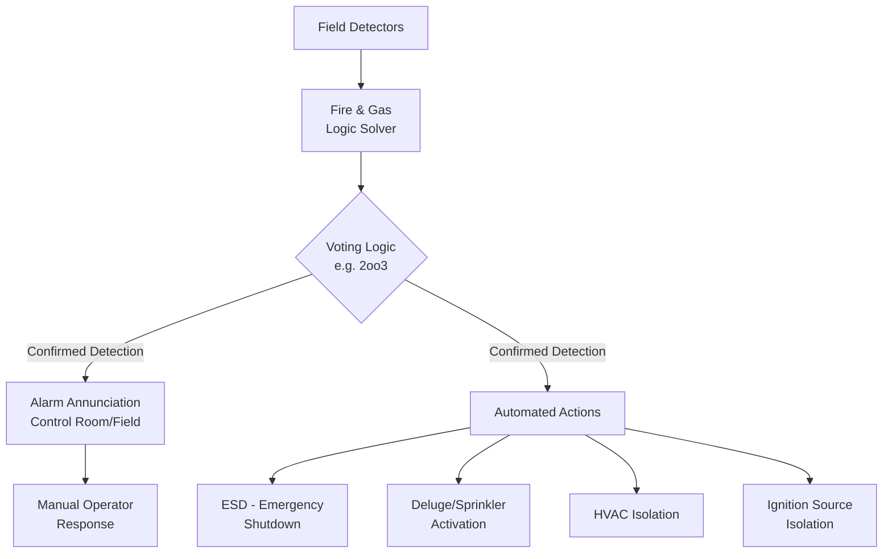
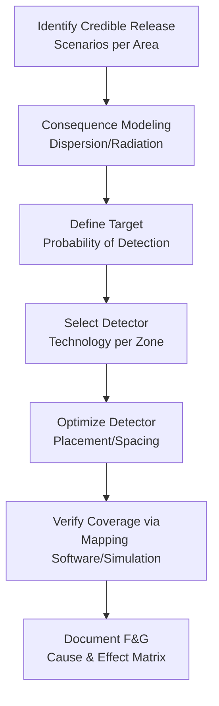
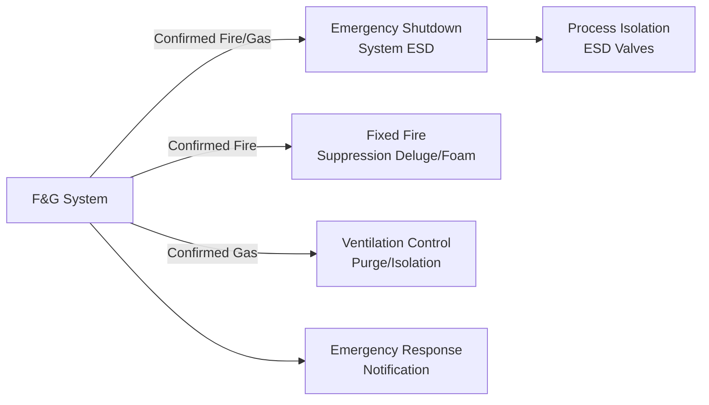

## Fire and Gas Detection Systems

### Definition and Purpose

Fire and Gas (F&G) detection systems are active protective layers that continuously monitor a facility for indications of fire, combustible gas accumulation, or toxic gas release, and initiate alarm and/or automated mitigative actions (shutdown, isolation, deluge activation, ventilation control) before a hazardous condition escalates to a major incident.

**Key Points**

- Positioned at Tier 3 (Active) in the Hierarchy of Controls — F&G systems require detection, logic processing, and an output action to be effective, distinguishing them from passive controls
- Distinct in function from Safety Instrumented Systems (SIS) that protect against *process* deviations (pressure, level, temperature); F&G systems specifically address *loss of containment consequences* (fire, gas cloud, toxic release) that have already begun
- Governed primarily by IEC 61511 (functional safety, when configured as a Safety Instrumented Function), ISA/IEC 62443 considerations for cybersecurity of the control system, and NFPA 72/70 for fire alarm wiring/installation practices, with facility-specific F&G mapping studies performed per methodologies described in ISA TR84.00.07
- [Inference] F&G systems are generally understood to be risk-reduction (mitigative) layers rather than prevention layers — they reduce the consequence/escalation of an event already underway rather than preventing the initiating loss of containment itself.

### System Architecture

### Categories of Detection

#### 1. Fire Detection

| Detector Type | Detection Principle | Typical Application |
| --- | --- | --- |
| Heat Detector | Fixed temperature or rate-of-rise thermal sensing | Enclosed equipment rooms, areas with predictable fire signature |
| Smoke Detector | Ionization or photoelectric particulate sensing | Control rooms, occupied buildings, HVAC ducts |
| Flame Detector (UV/IR/UV-IR/Multi-spectrum) | Optical detection of flame radiation signature | Open process areas, outdoor hydrocarbon processing units |
| Linear Heat Detection (cable) | Continuous temperature-sensitive cable along a monitored length | Cable trays, pipe racks, conveyor systems |

**Key Points**

- Flame detectors (UV/IR combination types) are the dominant technology in open outdoor process areas because they can detect hydrocarbon fires at a distance without requiring smoke/heat to reach a fixed point sensor location
- False alarm rejection is a major design driver: UV-only detectors are prone to false trips from welding arcs or lightning; IR-only detectors can be affected by solar radiation or hot equipment; multi-spectrum/UV-IR combination detectors are used specifically to reduce false alarm rates while maintaining sensitivity

#### 2. Gas Detection

| Detector Type | Detection Principle | Typical Target |
| --- | --- | --- |
| Catalytic (Pellistor) | Catalytic combustion of gas on a heated element, measuring resistance change | Combustible/flammable gases (% LEL) |
| Infrared (IR) Point | Absorption of specific IR wavelength by target gas | Hydrocarbons, CO2; works in oxygen-deficient/inert atmospheres unlike catalytic |
| Open-Path (Line-of-Sight) IR | IR beam across a path; detects any gas cloud crossing the beam | Large open areas, perimeter/fenceline monitoring |
| Electrochemical | Chemical reaction produces measurable current proportional to gas concentration | Toxic gases (H2S, CO, Cl2, etc.) |
| Ultrasonic (Acoustic) Leak Detection | Detects the ultrasonic sound signature of a pressurized gas leak | High-pressure gas systems; detects leaks even without wind carrying gas to a point detector |

**Key Points**

- Catalytic detectors can be "poisoned" (permanently desensitized) by exposure to silicones, sulfur compounds, and certain other substances — a known limitation that must be considered in detector selection for specific process environments
- Open-path detectors provide continuous coverage across a path length (e.g., 5–200m) rather than a single point, making them effective for perimeter or wide-area monitoring, but they cannot pinpoint the exact leak location along that path
- Ultrasonic gas leak detection responds to the leak itself (turbulent flow noise) rather than requiring the gas to physically reach the sensor, giving faster response for high-pressure releases regardless of wind direction — a relevant advantage over concentration-based detectors in outdoor, variable-wind environments [Inference: relative response-time advantage depends on specific leak/wind scenario and detector spacing, and is not a universal guarantee of faster detection in every case]

### F&G Mapping Methodology

**Key Points**

- F&G detector placement is not arbitrary — it is determined through a formal **F&G Mapping Study**, typically following the framework in ISA TR84.00.07, which uses consequence modeling (dispersion/fire modeling) to determine detector coverage needed to achieve a target probability of detection (PoD) for defined leak/fire scenarios
- The study defines detection "zones" based on credible release scenarios (hole sizes, materials, locations) and calculates optimal detector placement and spacing to maximize detection coverage against those scenarios
- Detector technology selection (point vs. open-path vs. acoustic) is often scenario-driven — e.g., open-path detectors may be selected for large outdoor process units, while point detectors are used in confined equipment enclosures

### Voting Logic and False Alarm Management

**Key Points**

- Single-detector alarms are typically configured for **alert only** (notify operator), while automated protective action (e.g., ESD trip, deluge activation) commonly requires **voting logic** — e.g., 2-out-of-3 (2oo3) detectors confirming the same condition — to reduce spurious trips from a single faulty or falsely-triggered detector
- [Inference] Specific voting architecture (1oo1, 1oo2, 2oo2, 2oo3) is selected based on a documented risk/reliability trade-off between spurious trip rate and probability of failure on demand, generally following IEC 61511 functional safety principles for the specific safety function; the appropriate architecture depends on the target SIL and the consequence of both false trips and missed detections for that specific application, so it should be established through the facility's formal SIL determination process rather than applied uniformly.
- Time-delay/confirmation logic (requiring sustained detection over a short period) is another common technique to filter transient false signals without requiring multi-detector voting

### Cause and Effect (C&E) Matrix

A Cause and Effect matrix documents, for each detection input (cause), which automated outputs (effects) are triggered — the core design deliverable linking F&G detection to protective action.

**Example (illustrative excerpt)**

| Detected Condition | Alarm | ESD Level 1 | Deluge Zone A | HVAC Isolation |
| --- | --- | --- | --- | --- |
| Single gas detector > 20% LEL | X |  |  |  |
| 2oo3 gas detectors > 20% LEL | X | X |  | X |
| 2oo3 gas detectors > 60% LEL | X | X | X | X |
| Single flame detector confirmed | X | X | X |  |

[Inference] Actual C&E logic, thresholds (e.g., %LEL setpoints), and voting requirements are facility- and hazard-specific, established through the facility's F&G mapping study and SIL determination; the table above illustrates the general structure of a C&E matrix rather than representing universal setpoint values.

### Illustration: Detector Coverage Concept

<svg viewBox="0 0 520 300" xmlns="http://www.w3.org/2000/svg">
<text x="260" y="20" font-size="14" text-anchor="middle" font-weight="bold">F&G Detector Coverage Zones (svg_diagram)</text>
<rect x="40" y="50" width="440" height="220" fill="#f8f9f9" stroke="#333" stroke-width="1.5"/>
<text x="70" y="70" font-size="9">Process Unit Boundary</text>
<rect x="150" y="120" width="80" height="60" fill="#d6dbdf" stroke="#333"/>
<text x="190" y="155" font-size="9" text-anchor="middle">Vessel</text>
<circle cx="190" cy="100" r="35" fill="#f39c12" fill-opacity="0.3" stroke="#b9770e" stroke-dasharray="3,2"/>
<text x="190" y="103" font-size="8" text-anchor="middle">Flame Det.</text>
<circle cx="130" cy="200" r="30" fill="#5dade2" fill-opacity="0.3" stroke="#2874a6" stroke-dasharray="3,2"/>
<text x="130" y="203" font-size="8" text-anchor="middle">Gas Det. 1</text>
<circle cx="280" cy="210" r="30" fill="#5dade2" fill-opacity="0.3" stroke="#2874a6" stroke-dasharray="3,2"/>
<text x="280" y="213" font-size="8" text-anchor="middle">Gas Det. 2</text>
<line x1="380" y1="90" x2="460" y2="240" stroke="#8e44ad" stroke-width="2" stroke-dasharray="6,3"/>
<text x="440" y="80" font-size="8" fill="#6c3483">Open-Path Beam</text>
</svg>

### Integration with Broader Safety Systems

**Key Points**

- F&G systems are frequently implemented on a logic solver that may be shared with, or kept independent from, the process SIS — [Inference] the choice between a shared platform and a fully independent F&G logic solver is a facility-specific engineering and functional-safety decision, generally influenced by considerations of common-cause failure risk and the desired independence between process protection and fire/gas mitigation functions.
- Detector maintenance/testing (bump testing for gas detectors, functional testing for flame/heat detectors) is essential to maintaining the system's actual reliability, since a detector's assumed PFD in the design basis depends on the assumed test interval and quality of testing being maintained in practice

### Common Pitfalls

- **Detector placement based on convention rather than mapping study**: Placing detectors at "standard" spacing without formal consequence-based mapping can leave gaps in coverage for the facility's actual credible release scenarios
- **Catalytic sensor poisoning going undetected**: Failing to account for known catalytic poisons present in the process environment, leading to a detector that reads normally but has lost sensitivity
- **Over-reliance on single-point detection for large or variable-wind outdoor areas**: Point detectors alone may miss a gas cloud that disperses around rather than through the monitored point, particularly under variable wind conditions
- **Excessive false alarms leading to alarm fatigue**: Poorly tuned voting logic or detector technology mismatched to the environment (e.g., UV-only detectors near welding activity) can lead operators to distrust or delay response to alarms
- **Inadequate testing/maintenance program**: Assuming a detector's designed reliability without a rigorous ongoing functional test regime undermines the actual achieved risk reduction versus the documented design basis

**Related Topics**

- Hierarchy of Controls (Active Protective Layers)
- Safety Instrumented Systems (SIS) and IEC 61511 Functional Safety
- Layer of Protection Analysis (LOPA) — Crediting F&G as a Mitigative Layer
- Consequence Modeling for Dispersion and Fire (QRA input)
- Emergency Shutdown (ESD) System Design
- Fixed Fire Suppression Systems (Deluge, Foam, Clean Agent)
- Alarm Management and Alarm Rationalization