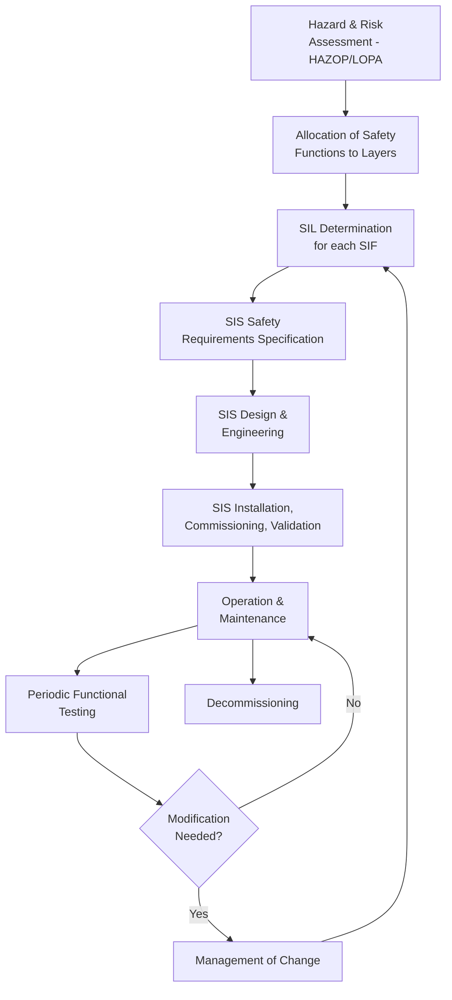
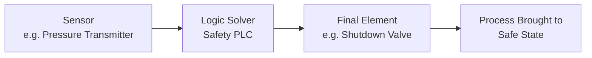
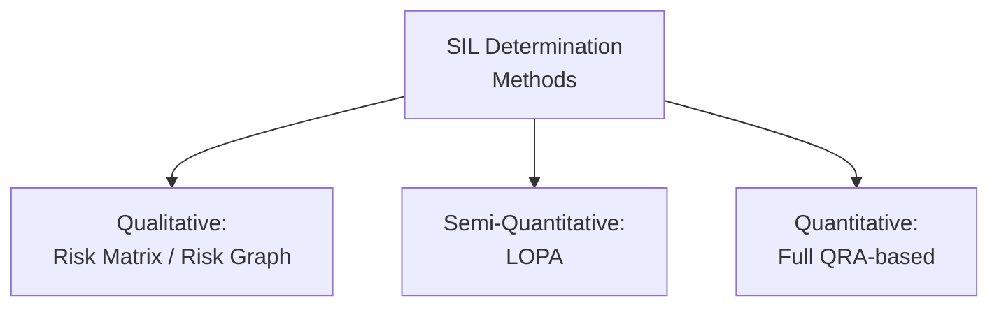

## Safety Instrumented Systems and SIL Determination

### Definition and Purpose

A Safety Instrumented System (SIS) is an independent, engineered system composed of sensors, logic solvers, and final elements designed to automatically detect a hazardous process condition and bring the process to a safe state before an unacceptable consequence occurs. Safety Integrity Level (SIL) is the quantified measure of a Safety Instrumented Function's (SIF) reliability — its ability to perform its safety function correctly when demanded.

**Key Points**

- Positioned at Tier 3 (Active) in the Hierarchy of Controls; unlike a mechanical PSV, a SIS relies on electronic/programmable detection, logic, and actuation
- Governed internationally by IEC 61511 (process industry sector application of the parent standard IEC 61508), and in North America historically referenced alongside ANSI/ISA 84.00.01
- A SIS is composed of one or more independent Safety Instrumented Functions (SIFs) — each SIF is a specific detect-decide-act loop protecting against one defined hazardous scenario
- [Inference] IEC 61511 is broadly adopted as the governing functional safety standard for the process industries, though specific national or company implementations may layer additional requirements on top of the base standard's minimum provisions.

### The Safety Lifecycle

**Key Points**

- The safety lifecycle is IEC 61511's structured framework covering a SIF from initial hazard identification through eventual decommissioning
- SIL determination occurs early (after hazard/risk assessment), but the safety lifecycle mandates periodic revalidation, particularly following any Management of Change (MOC) affecting the protected process

### SIS Architecture: Sensor–Logic Solver–Final Element

| Component | Function | Common Examples |
| --- | --- | --- |
| Sensor | Detects the process variable indicating a hazardous condition | Pressure/level/temperature transmitters, flow switches |
| Logic Solver | Processes sensor input against a safety logic (e.g., "IF pressure > X THEN trip") | Safety-certified PLC, relay logic, solid-state logic |
| Final Element | Physically executes the safety action | Shutdown/isolation valves (ESDV), motor trips, circuit breakers |

**Key Points**

- Each component contributes its own failure probability to the overall SIF's Probability of Failure on Demand (PFD); the SIF's total PFD is generally the sum (or combined probability) of the PFDs of its sensor, logic solver, and final element subsystems
- Redundancy (e.g., dual transmitters voted 1oo2, or triple-redundant logic solvers) is used at each component level to improve reliability where a single SIL target cannot be met by simplex (1oo1) architecture

### Safety Integrity Levels (SIL) Defined

SIL is expressed in terms of target PFD (for low-demand mode SIFs, the typical case in process industries) or Probability of Failure per Hour (PFH, for high/continuous-demand mode).

| SIL | PFD Range (Low Demand) | Risk Reduction Factor (RRF) | Typical Application |
| --- | --- | --- | --- |
| SIL 1 | $10^{-2}$ to $10^{-1}$ | 10 to 100 | Lower-consequence process trips |
| SIL 2 | $10^{-3}$ to $10^{-2}$ | 100 to 1,000 | Moderate-consequence protective functions |
| SIL 3 | $10^{-4}$ to $10^{-3}$ | 1,000 to 10,000 | High-consequence functions (major release, multiple fatality potential) |
| SIL 4 | $10^{-5}$ to $10^{-4}$ | 10,000 to 100,000 | [Inference] Rarely applied at the single-SIF level in the process industries; achieving SIL 4 with a single SIF is generally considered impractical, and such extreme risk reduction needs are typically addressed by combining multiple independent layers rather than a single SIL 4 SIF |

$$RRF = \frac{1}{PFD_{avg}}$$

**Key Points**

- SIL is a property of the *safety function* (the complete sensor-to-final-element loop for one specific hazard scenario), not a property of an individual device — a transmitter is not "SIL 2," it is *SIL 2 capable* when used correctly within a SIL 2 SIF architecture
- Low-demand mode (demand on the SIF less than once per year, and no more than twice the proof-test frequency) is the typical classification basis in process industry SIFs; PFD is the relevant metric in this mode
- High/continuous-demand mode SIFs use PFH instead, since the SIF is called upon so frequently (or continuously) that average unavailability is a more meaningful metric than probability per discrete demand

### SIL Determination Methods

#### 1. Risk Graph

A qualitative decision-tree method where the assessor answers a series of questions about consequence severity, occupancy/exposure, avoidance possibility, and demand frequency, following defined branches to arrive at a required SIL.

**Key Points**

- Faster than LOPA but more subjective, since each parameter is judged categorically rather than calculated numerically
- Commonly used for lower-complexity SIFs or as a first-pass screening tool before a more detailed LOPA

#### 2. Layer of Protection Analysis (LOPA)

The most widely used semi-quantitative method for SIL determination in the process industries. LOPA calculates the required risk reduction for a specific scenario by comparing the unmitigated consequence frequency to a tolerable frequency criterion, then subtracts the risk reduction already credited to other independent protection layers (IPLs) to determine the residual risk reduction the SIF itself must provide.

$$RRF_{required} = \frac{f_{initiating\;event} \times (\text{other applicable modifiers})}{f_{tolerable}}$$

The required PFD for the SIF is then:

$$PFD_{SIF,required} = \frac{1}{RRF_{required}}$$

This required PFD is mapped to the corresponding SIL band from the table above.

**Example**

An initiating event (control valve failure) occurs at a frequency of $0.1$/year. A tolerable consequence frequency criterion of $1\times10^{-5}$/year has been set for this scenario. If no other IPLs exist (other than the SIF itself, which is what is being sized), the required PFD is:

$$PFD_{required} = \frac{1\times10^{-5}}{0.1} = 1\times10^{-4}$$

A PFD of $1\times10^{-4}$ corresponds to the low end of SIL 3 (per the table above), meaning a SIL 3-rated SIF is required for this scenario absent other credited IPLs.

#### 3. Quantitative Methods (QRA-based)

For the highest-consequence or most complex scenarios, full QRA techniques (consequence modeling combined with detailed fault/event tree frequency analysis) may be used to determine the precise risk reduction needed, rather than the simplified order-of-magnitude approach used in LOPA.

### Verification: Meeting the Required SIL

Once a target SIL is set, the proposed SIF architecture must be verified to actually achieve that SIL through **SIL Verification** calculations, which combine:

**Key Points**

- **Hardware Fault Tolerance (HFT)**: The number of faults a subsystem can sustain and still perform its safety function (related to redundancy architecture, e.g., 1oo1, 1oo2, 2oo3)
- **Safe Failure Fraction (SFF)**: The proportion of a component's failures that are "safe" (fail to a safe state or are detected by diagnostics) versus "dangerous undetected" failures
- **Proof Test Interval**: How frequently the SIF is manually tested to reveal dangerous undetected failures; PFD calculations are highly sensitive to this interval — longer intervals between proof tests generally increase average PFD for a given failure rate
- **Common Cause Failure (CCF)**: Failures that simultaneously affect redundant channels (e.g., a shared power supply, common environmental exposure), which can undermine the reliability benefit expected from redundancy if not properly accounted for (commonly modeled via a beta factor in PFD calculations)

$$PFD_{avg} \approx \frac{\lambda_{DU} \times TI}{2}$$

Where $\lambda_{DU}$ is the dangerous undetected failure rate and $TI$ is the proof test interval — this simplified formula illustrates why proof test frequency is a primary lever for achieving a target SIL for a given hardware failure rate. [Unverified] Actual SIL verification calculations in practice use more detailed models (accounting for architecture, diagnostic coverage, and CCF beta factors) as specified in IEC 61508-6 / IEC 61511 methodology, and typically require certified reliability software or manufacturer-supplied SIL certification data (per IEC 61508) rather than this simplified approximation alone.

### Illustration: PFD vs. Proof Test Interval Concept

<svg xmlns="http://www.w3.org/2000/svg" viewBox="0 0 480 300">
<text x="240" y="20" font-size="14" text-anchor="middle" font-weight="bold">PFD Growth Between Proof Tests (svg_diagram)</text>
<line x1="50" y1="250" x2="440" y2="250" stroke="black" stroke-width="1.5" />
<line x1="50" y1="250" x2="50" y2="40" stroke="black" stroke-width="1.5" />
<text x="240" y="280" font-size="11" text-anchor="middle">Time</text>
<text x="20" y="145" font-size="11" text-anchor="middle" transform="rotate(-90 20 145)">PFD</text>
<line x1="50" y1="240" x2="150" y2="80" stroke="#c0392b" stroke-width="2" />
<line x1="150" y1="240" x2="150" y2="80" stroke="#999" stroke-width="1" stroke-dasharray="3,2" />
<line x1="150" y1="240" x2="250" y2="80" stroke="#c0392b" stroke-width="2" />
<line x1="250" y1="240" x2="250" y2="80" stroke="#999" stroke-width="1" stroke-dasharray="3,2" />
<line x1="250" y1="240" x2="350" y2="80" stroke="#c0392b" stroke-width="2" />
<line x1="350" y1="240" x2="350" y2="80" stroke="#999" stroke-width="1" stroke-dasharray="3,2" />
<text x="100" y="270" font-size="9" text-anchor="middle">Proof Test 1</text>
<text x="200" y="270" font-size="9" text-anchor="middle">Proof Test 2</text>
<text x="300" y="270" font-size="9" text-anchor="middle">Proof Test 3</text>
<line x1="50" y1="150" x2="440" y2="150" stroke="#2980b9" stroke-width="1" stroke-dasharray="6,3" />
<text x="400" y="140" font-size="9" fill="#2980b9">PFDavg</text>
</svg>

### SIS Independence and Separation from BPCS

**Key Points**

- IEC 61511 requires the SIS to be functionally and, where risk-justified, physically/architecturally independent from the Basic Process Control System (BPCS) — the same sensor and logic solver used for routine process control should generally not be relied upon as the sole means of achieving the safety function's claimed risk reduction
- Where independence between BPCS and SIS is not fully achieved, IPL credit for the SIS function in a LOPA may be reduced or disallowed, since a common-cause failure could defeat both control and protection simultaneously
- Alarms managed via the BPCS may still be credited as a separate, lower-reliability IPL (typically capped at a PFD around $10^{-1}$, i.e., RRF of 10, reflecting reliance on operator response) distinct from the automated SIS trip

### Common Pitfalls

- **SIL inflation**: Assigning conservative/high SIL targets without rigorous LOPA justification, leading to unnecessarily complex and costly redundant architecture
- **Neglecting proof test rigor**: Specifying a SIL 3 SIF on paper but failing to execute proof tests at the assumed interval or to a sufficient diagnostic coverage in practice, meaning the *achieved* SIL in operation may be lower than the *design* SIL
- **Common cause failure underestimation**: Assuming redundant channels are fully independent when they share a common power supply, environmental exposure, or maintenance technician error mode, overestimating actual achieved PFD
- **BPCS/SIS entanglement**: Using the same transmitter or logic solver for both control and protection functions without adequate independence justification, undermining IPL credit
- **Treating SIL determination as a one-time exercise**: Failing to revisit SIL requirements after a Management of Change that alters process conditions, consequence severity, or credited IPLs

**Related Topics**

- Layer of Protection Analysis (LOPA) and Independent Protection Layers
- Hierarchy of Controls (Active Protective Layers)
- Fire and Gas Detection Systems (Related Mitigative SIFs)
- Pressure Relief and Flare Systems (Comparison: Mechanical vs. Instrumented Protection)
- Management of Change (MOC) and Safety Lifecycle Revalidation
- Quantitative Risk Assessment (QRA) as an Alternative SIL Determination Basis
- Proof Testing and Mechanical Integrity Programs