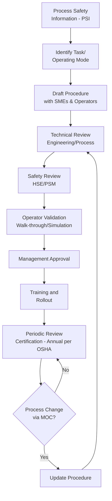
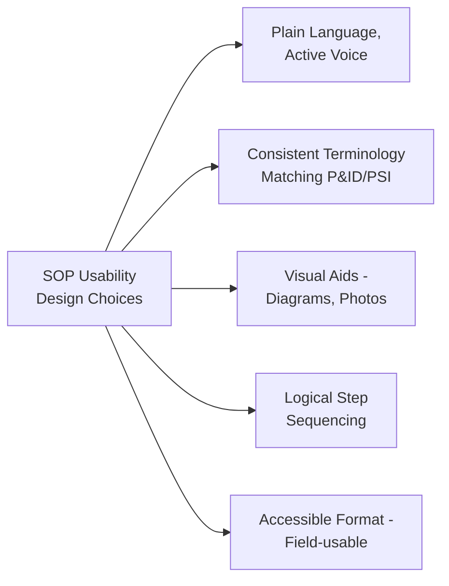
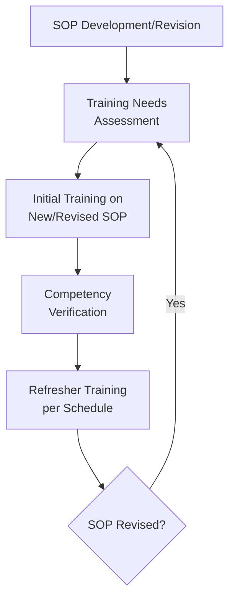

## Developing and Documenting Standard Operating Procedures

### Definition and Purpose

Standard Operating Procedures (SOPs) are formally documented, step-by-step instructions that define the correct and safe method for performing a specific operational task. Within PSM frameworks, SOPs are a Tier 4 (Procedural) safeguard in the Hierarchy of Controls — they codify the human actions required to operate a process safely, consistently, and in accordance with the facility's safe operating limits.

**Key Points**

- Explicitly required under OSHA PSM (29 CFR 1910.119(f)) as a core element, and similarly addressed under Seveso III and comparable international frameworks
- SOPs are the primary mechanism translating process design intent and safe operating limits into repeatable operator action
- Distinguished from Safe Work Practices (permits, LOTO, hot work), which govern non-routine or maintenance-related activities; SOPs primarily govern routine operating tasks (startup, normal operation, shutdown, emergency response)
- [Inference] While OSHA PSM specifies required content categories for operating procedures, the exact format, document structure, and level of granularity are generally left to the facility to determine appropriately for its own process complexity and workforce.

### Regulatory Content Requirements (OSHA PSM 1910.119(f))

**Key Points**

- OSHA PSM requires written operating procedures that provide clear instructions for safely conducting activities in each covered process, consistent with the process safety information, and addressing at minimum the following:

| Required Category | Content |
| --- | --- |
| Initial Startup | Steps to bring the process from a shutdown state to normal operation |
| Normal Operations | Steps for routine, steady-state operation |
| Temporary Operations | Steps for operating outside normal conditions when necessary (e.g., sampling, temporary bypass) |
| Emergency Shutdown | Conditions requiring emergency shutdown and the steps to safely execute it, including assignment of shutdown responsibility to qualified operators |
| Emergency Operations | Actions for operators to take during an emergency |
| Normal Shutdown | Steps for planned, controlled shutdown |
| Startup Following Turnaround/Emergency Shutdown | Steps for safely restarting after a maintenance turnaround or an emergency shutdown event |
| Operating Limits | Consequences of deviation and steps to correct/avoid deviation |
| Safety and Health Considerations | Hazards of the process, PPE requirements, precautions to prevent exposure, control measures if physical contact/exposure occurs |
| Safety Systems and Functions | Description of safety systems and their functions |

### The SOP Development Workflow

**Key Points**

- SOPs should be developed collaboratively between process/design engineers (who understand the "why" behind operating limits) and experienced operators (who understand practical execution and site-specific conditions)
- OSHA PSM requires that operating procedures be reviewed as often as necessary to assure they reflect current operating practice, and certified at least annually that they are current and accurate
- A key trigger for SOP revision is Management of Change (MOC) — any change to equipment, process conditions, or safe operating limits should cascade into a review of affected SOPs before the change is considered complete

### Structural Elements of a Well-Documented SOP

#### 1. Header/Identification Block

Document number, revision number/date, title, applicable unit/equipment, author, approver, and effective date — enabling document control and traceability.

#### 2. Purpose and Scope

Brief statement of what the procedure covers and, importantly, what it does *not* cover (to avoid ambiguity with adjacent procedures).

#### 3. Safety Precautions and Hazard Summary

A concise upfront summary of the key hazards associated with the task, required PPE, and any special precautions — placed prominently rather than buried within sequential steps.

#### 4. Prerequisites/Pre-Task Checks

Conditions that must be verified before beginning (e.g., permits in place, equipment isolated/de-isolated as appropriate, utilities available).

#### 5. Sequential Steps

Clear, numbered, single-action steps written in imperative voice ("Open valve XV-101," not "The valve should be opened").

**Key Points**

- Each step should represent a single discrete action to avoid ambiguity about sequencing or scope
- Critical steps (those where an error has significant safety consequence) should be visually distinguished (e.g., bolded, boxed, or flagged with a caution/warning callout) rather than presented identically to routine steps
- Reference to specific instrument tags, equipment numbers, and setpoints should match the P&ID and process safety information exactly, to prevent confusion during execution

**Example**

A poorly written step: *"Adjust the reactor temperature appropriately before proceeding."*

A properly written step: *"Adjust TIC-204 setpoint to 85°C ± 2°C. Confirm PV has stabilized within this range for at least 5 minutes before proceeding to Step 12."*

#### 6. Operating Limits and Deviation Consequences

Explicit statement of safe operating limits (not just setpoints) and the consequence of exceeding them, directly addressing the OSHA-required "consequences of deviation" content.

**Example**

| Parameter | Normal Range | Safe Operating Limit | Consequence of Deviation |
| --- | --- | --- | --- |
| Reactor Pressure | 8–10 bar | 12 bar (max) | Above 12 bar: PSV lift risk, potential vessel stress; immediately reduce feed rate and notify shift supervisor |

#### 7. Safety Systems Reference

Identification of relevant alarms, interlocks, and protective devices active during the procedure, so operators understand what automated protection exists and what response is expected if it activates.

#### 8. Sign-off/Verification Steps

For critical procedures (e.g., startup after turnaround), independent verification or supervisor sign-off at key hold points may be built directly into the document.

### Format and Usability Considerations

**Key Points**

- Procedures intended for field use (as opposed to office reference) benefit from durable, weather-resistant formats and concise checklist-style layouts rather than dense narrative paragraphs
- Embedding simplified diagrams or photographs of specific valves/equipment reduces reliance on the operator's memory or prior familiarity with the exact physical layout
- Terminology consistency across SOPs, P&IDs, and the process safety information is essential — using different names for the same valve/equipment across documents is a common source of operator confusion and error
- [Inference] Many organizations increasingly incorporate human factors principles (e.g., minimizing extraneous cognitive load, using consistent step formatting) into SOP design, though the specific human-factors methodology applied varies by company and is not itself a single universal regulatory requirement.

### Human Factors and Procedural Compliance

**Key Points**

- A procedure's existence does not guarantee compliance; human factors research broadly recognizes that overly long, poorly formatted, or outdated procedures tend to correlate with reduced adherence and increased reliance on operator memory/experience instead of the written document
- Involving operators directly in SOP drafting and validation (e.g., through tabletop walk-throughs or simulator validation before formal issue) is a widely used practice to improve both accuracy and eventual field compliance
- [Speculation] Some practitioners argue that excessive procedural detail for highly routine tasks can itself reduce compliance by encouraging operators to skip ahead or rely on memorized sequences rather than reading each step; the appropriate level of detail is generally treated as a judgment call balanced against task criticality and operator experience level, rather than a fixed rule.

### Relationship to Training

OSHA PSM 1910.119(g) requires training on operating procedures for both initial assignment and whenever a procedure is revised in a way that affects the employee's job tasks; SOPs and the training program are therefore tightly coupled elements rather than independent PSM requirements.

### Common Pitfalls

- **Outdated procedures not reflecting current equipment/process conditions**: Occurs when MOC does not systematically trigger SOP review, leaving a gap between actual and documented practice
- **"Shelf-ware" procedures**: Documents that technically satisfy the regulatory requirement for existence but are not actually used or trusted by operators in practice, often due to poor usability or inaccuracy
- **Vague or ambiguous steps**: Steps that describe an outcome without specifying the precise action, tag number, or setpoint, leaving room for operator interpretation and inconsistent execution
- **Missing deviation guidance**: Documenting normal-condition steps thoroughly while omitting clear guidance on what to do when a step doesn't go as expected (an "if X, then Y" branch)
- **Annual certification treated as a formality**: Signing off that a procedure is "current and accurate" without an actual technical review against the current process safety information and field conditions

**Related Topics**

- Management of Change (MOC) Process
- Process Safety Information (PSI) Requirements
- Training and Competency Verification Programs
- Safe Work Practices (Permit-to-Work, Hot Work, LOTO)
- Human Factors Engineering in Procedure Design
- Pre-Startup Safety Review (PSSR)
- Hierarchy of Controls (Procedural Tier)