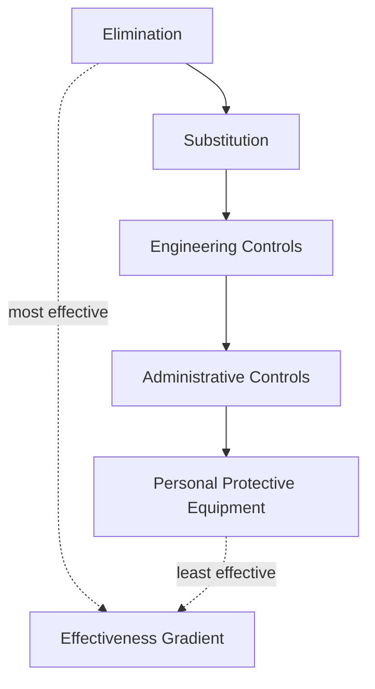
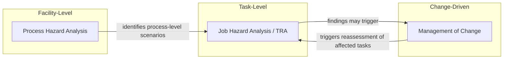
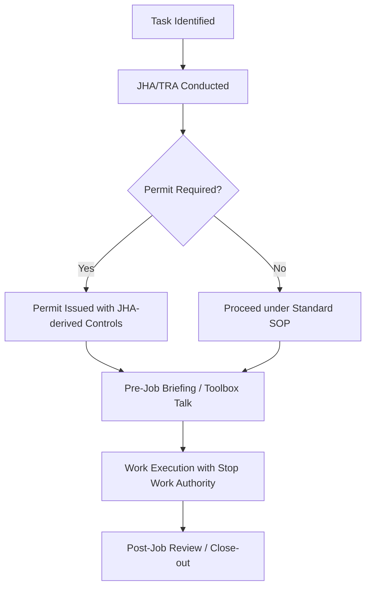

## Job Hazard Analysis and Task Risk Assessment

### Overview and Regulatory Context

Job Hazard Analysis (JHA), also called Job Safety Analysis (JSA) or Task Risk Assessment (TRA), is a systematic procedure that breaks a job into discrete steps to identify hazards associated with each step, then determines controls to eliminate or mitigate those hazards before work begins. Within Process Safety Management (PSM), JHA/TRA functions as a front-line, task-specific complement to broader facility-level Process Hazard Analysis (PHA) — PHA examines the process as a system, while JHA examines the specific human activity performed against or around that system.

OSHA does not mandate JHA by that exact name as a standalone standard, but it is functionally required through several PSM-linked provisions:

- **29 CFR 1910.119(f)** — Operating Procedures, which must address safe work practices applicable to task execution
- **29 CFR 1910.119(j)** — Mechanical Integrity, which relies on task-based risk identification for maintenance activities
- **29 CFR 1910.147** — Control of Hazardous Energy (Lockout/Tagout), which presumes hazard identification precedes energy isolation
- **29 CFR 1910.146** — Permit-Required Confined Spaces, where hazard assessment is an explicit permit prerequisite

API RP 750, CCPS guidelines, and ISO 45001 all treat JHA as a mandatory input to Permit-to-Work (PTW) systems, particularly for non-routine work such as hot work, confined space entry, excavation, and lifting operations.

### Core Terminology

| Term | Definition |
| --- | --- |
| Hazard | A source or situation with potential for harm (energy, substance, condition, activity) |
| Risk | The combination of likelihood of occurrence and severity of consequence |
| Task Step | A discrete, observable action within a job sequence |
| Control | A measure that eliminates, reduces, or manages a hazard's risk |
| Residual Risk | Risk remaining after controls are applied |
| ALARP | As Low As Reasonably Practicable — the target state for residual risk |

### The JHA/TRA Process

#### Step 1: Task Selection and Prioritization

Not every task warrants a formal JHA. Prioritization typically uses these criteria:

- Injury/illness frequency or severity history for the task type
- Potential for severe consequences (fatality, multiple injuries, major loss)
- Non-routine or infrequent tasks where familiarity is low
- New processes, equipment, or procedures
- Tasks involving PSM-covered highly hazardous chemicals (HHCs)
- Regulatory or permit-triggering activities (confined space, hot work, LOTO, excavation, critical lifts)

#### Step 2: Task Breakdown

The job is decomposed into sequential steps — typically 8 to 15 steps for a well-scoped task. Steps should be:

- Observable and discrete (not "perform maintenance" but "remove bolts from flange")
- In the actual order of execution
- Derived from direct observation or SME interview, not assumption

A step count that is too low (fewer than 4) usually indicates the task is poorly scoped or too broad; too many (over 20) usually indicates the task should be split into multiple JHAs.

#### Step 3: Hazard Identification per Step

For each task step, hazards are systematically identified across categories:

| Hazard Category | Examples |
| --- | --- |
| Mechanical | Pinch points, rotating equipment, stored mechanical energy |
| Chemical | Exposure to HHCs, toxic gas release, corrosive contact |
| Energy | Electrical, pneumatic, hydraulic, thermal, gravitational |
| Ergonomic | Repetitive motion, awkward posture, manual lifting |
| Environmental | Confined space atmosphere, heat/cold stress, noise |
| Fire/Explosion | Flammable atmosphere, ignition sources, static discharge |
| Biological | Exposure to pathogens (less common in PSM contexts) |

Common identification techniques include direct observation of the task being performed, walkthroughs with the work crew, review of incident/near-miss history for similar tasks, and structured prompts such as "what if" questioning at each step.

#### Step 4: Risk Assessment (Task Risk Assessment / TRA)

Once hazards are identified, each is rated using a risk matrix combining likelihood and severity. A typical 5x5 matrix:

| Likelihood ↓ / Severity → | Negligible | Minor | Moderate | Major | Catastrophic |
| --- | --- | --- | --- | --- | --- |
| Rare | Low | Low | Low | Medium | Medium |
| Unlikely | Low | Low | Medium | Medium | High |
| Possible | Low | Medium | Medium | High | High |
| Likely | Medium | Medium | High | High | Extreme |
| Almost Certain | Medium | High | High | Extreme | Extreme |

Risk ranking is calculated as:

$$R = L \times S$$

where $R$ is risk score, $L$ is likelihood rating, and $S$ is severity rating. This is a screening tool, not a precise quantitative measure — facilities calibrate the matrix boundaries against their own risk tolerance criteria, typically defined in a Risk Assessment Matrix (RAM) governance document.

#### Step 5: Control Determination — The Hierarchy of Controls

Controls are selected by working down the hierarchy, preferring higher-order controls over reliance on the worker:

| Level | Description | Example |
| --- | --- | --- |
| Elimination | Remove the hazard entirely | Redesign task to avoid entry into confined space |
| Substitution | Replace with a lower-hazard alternative | Use non-flammable solvent |
| Engineering | Isolate people from the hazard | Fixed guarding, interlocks, ventilation |
| Administrative | Change how work is done | Procedures, permits, training, signage |
| PPE | Protect the individual | Respirators, fall protection, gloves |

A JHA that lists only PPE as the control for a high-risk step is generally considered deficient — reviewers should probe whether higher-order controls were genuinely considered and ruled out, with the rationale documented.

#### Step 6: Residual Risk Verification

After controls are applied, the risk is re-scored to confirm it falls within acceptable tolerance (ALARP or lower). If residual risk remains unacceptable, the task requires additional controls, re-sequencing, or escalation to a formal PHA/MOC review before proceeding.

#### Step 7: Documentation and Sign-off

A completed JHA/TRA record typically contains:

- Task description, location, equipment involved
- Date, JHA team members, and their roles
- Step-by-step breakdown with hazards, risk ratings, and controls
- Residual risk rating
- Required PPE and permits
- Supervisor and worker crew sign-off (often required before work start, functioning as a pre-job briefing record)
- Review/expiration date

### JHA Documentation Table Template

| Step # | Task Step | Hazard | Initial Risk (L×S) | Control Measures | Residual Risk | Responsible Party |
| --- | --- | --- | --- | --- | --- | --- |
| 1 | Isolate energy source | Electrical shock | High (4×4) | LOTO per procedure XYZ, verify zero energy state | Low (1×2) | Electrician |
| 2 | Open equipment access panel | Stored mechanical energy | Medium (2×3) | Confirm de-energization, use insulated tools | Low (1×2) | Technician |

### Worked Example: Confined Space Vessel Entry for Internal Inspection

**Example**

Task: Enter a nitrogen-purged process vessel for internal visual inspection following a turnaround shutdown.

| Step | Hazard | Initial Risk | Control | Residual Risk |
| --- | --- | --- | --- | --- |
| 1. Isolate and blind vessel | Inadvertent process fluid ingress | High | Double block and bleed, blind installation, LOTO | Low |
| 2. Purge and ventilate | Oxygen deficiency, residual flammable vapor | High | Forced ventilation, continuous atmospheric monitoring (O₂, LEL, toxics) | Medium |
| 3. Atmospheric testing before entry | Undetected toxic/flammable atmosphere | High | Calibrated gas detector, test at multiple vessel levels | Low |
| 4. Entry through manway | Fall, engulfment, entanglement | Medium | Attendant stationed outside, retrieval system, harness | Low |
| 5. Internal inspection work | Continued atmospheric change, communication loss | Medium | Continuous monitoring, radio/voice contact, rescue plan on standby | Low |
| 6. Egress | Fatigue-related fall, rapid exit hazards | Low | Controlled exit procedure, attendant assistance | Low |

This example integrates directly with the confined space entry permit required under 29 CFR 1910.146 — the JHA output becomes an input to permit conditions, not a parallel or redundant document.

### JHA vs. PHA vs. MOC — Distinguishing Scope

- **PHA** examines the process system as a whole (e.g., HAZOP, What-If, FMEA) and is periodic (typically every 5 years under PSM)
- **JHA/TRA** examines a specific human task and is performed per-job or per-shift for non-routine work
- **MOC** governs changes to process, equipment, or procedure and should trigger a JHA review if the change affects task execution

A common program gap is treating JHA as fully independent of PHA findings. Mature programs cross-reference PHA-identified scenarios into JHA hazard libraries so that task-level assessments do not "rediscover" hazards already characterized at the process level. [Inference — the degree of cross-referencing formality varies significantly by organization and is not uniformly mandated.]

### Common Quality Failure Modes

- **Genericization**: Reusing a generic JHA template across dissimilar tasks without site-specific or day-specific hazard review (e.g., not accounting for weather, adjacent simultaneous operations, or equipment condition on the day of work)
- **PPE-only control bias**: Defaulting to PPE without genuinely evaluating engineering or administrative alternatives
- **Crew non-involvement**: JHA prepared by supervision alone without input from the workers performing the task, reducing both accuracy and buy-in
- **Static documents**: JHA not revisited when task conditions change mid-shift (simultaneous operations, unexpected findings, weather shifts)
- **Missing Stop Work linkage**: No clear provision empowering any crew member to halt work if actual conditions diverge from the JHA's assumptions

### Integration with Permit-to-Work Systems

JHA output typically feeds forward into PTW documentation:

### Simultaneous Operations (SIMOPS) Consideration

When multiple tasks occur concurrently in overlapping physical or hazard zones, individual JHAs may understate risk because they assess tasks in isolation. A SIMOPS review layer cross-checks concurrent JHAs for interaction hazards — for example, hot work occurring near a vent point identified as a hazard in an adjacent vessel-opening JHA. This is a frequently under-implemented control in facilities that treat JHA as a purely task-isolated exercise.

**Related Topics**

- Permit-to-Work (PTW) System Design and Governance
- Confined Space Entry Program Requirements (29 CFR 1910.146)
- Lockout/Tagout (Control of Hazardous Energy) Procedures
- Hierarchy of Controls in Depth
- Simultaneous Operations (SIMOPS) Risk Management
- Process Hazard Analysis (PHA) Methodologies: HAZOP, What-If, FMEA
- Management of Change (MOC) Procedures
- Stop Work Authority Programs
- Pre-Job Briefing and Toolbox Talk Facilitation
- Incident Investigation and Root Cause Analysis Feedback into JHA Libraries