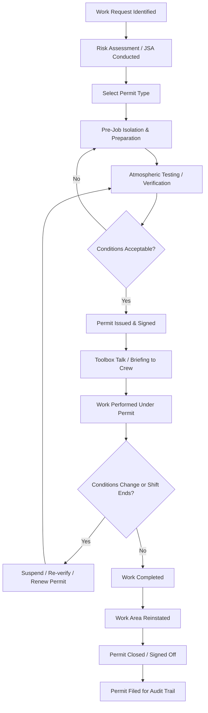

## Permit to Work Systems

### Overview and Purpose

A Permit to Work (PTW) system is a formal, documented management control used to authorize, regulate, and supervise specific categories of work that carry elevated risk, particularly work not covered by routine operating procedures. The permit serves as written confirmation that hazards have been identified, control measures are in place, and the job has been authorized by a competent person before work begins.

PTW systems are a core element of Process Safety Management (PSM), addressing OSHA 29 CFR 1910.119(f) (Operating Procedures) and, more directly, safe work practice requirements referenced under (f)(4), which mandates procedures for hot work, lockout/tagout, confined space entry, opening process equipment or piping, and control over entrance of contractors.

**Key Points**

- The permit is a communication and control tool, not merely paperwork
- It formally transfers responsibility and establishes accountability between the issuer (area owner/operator) and the receiver (work performer)
- It is time-bound, task-specific, and location-specific — it authorizes one job, in one place, for a defined period
- It does not replace hazard analysis; it documents and enforces the outcome of that analysis

### Regulatory and Standards Basis

- **OSHA 29 CFR 1910.119(f)(4)** — Requires written safe work practices to control hazards during operations such as lockout/tagout, confined space entry, opening process equipment/piping, and line-breaking, and control of entrance into a covered process area by contractors.
- **OSHA 29 CFR 1910.146** — Permit-Required Confined Spaces (the most detailed federal permit requirement).
- **OSHA 29 CFR 1910.147** — The Control of Hazardous Energy (Lockout/Tagout), often integrated with or referenced by the PTW.
- **OSHA 29 CFR 1910.252 / .253 / .254** — Welding, cutting, and brazing (basis for hot work permits).
- **API RP 2201** — Safe Hot Tapping Practices.
- **API RP 754** — Process safety performance indicators, indirectly relevant via near-miss/incident tracking tied to permit failures.
- **CCPS (Center for Chemical Process Safety) guidelines** — Recommend PTW as one of the 20 elements of Risk Based Process Safety (RBPS), under "Safe Work Practices."
- **UK HSE HSG250** — "Guidance on Permit-to-Work Systems," widely referenced internationally even outside the UK for PTW design principles.

[Inference] Many jurisdictions outside the U.S. (UK, EU, Middle East, Asia-Pacific) have more explicit statutory PTW requirements than U.S. OSHA, which regulates primarily through the safe work practice and confined space standards rather than a single consolidated "PTW regulation."

### Core Principles of an Effective PTW System

1. **Hazard identification before authorization** — A competent person assesses the work area and task-specific hazards prior to permit issuance.
2. **Isolation and verification** — Energy sources, process connections, and hazardous materials are isolated and verified (not merely assumed) before work starts.
3. **Clear accountability** — Named individuals: permit issuer, permit receiver/holder, and often an area authority or safety officer, each with defined duties.
4. **Time limitation** — Permits are valid for a fixed shift or duration and must be renewed, re-verified, or closed at expiry.
5. **Communication** — Permit conditions are briefed to all workers involved, including simultaneous operations (SIMOPS) coordination.
6. **Traceability and auditability** — Permits are logged, retained, and available for audit and incident investigation.
7. **Single point of control** — One authorized issuer per work area prevents conflicting authorizations.

### Common Types of Work Permits

| Permit Type | Typical Trigger | Key Controls |
| --- | --- | --- |
| Hot Work Permit | Welding, cutting, grinding, open flame, spark-producing tools | Fire watch, combustible gas testing, fire extinguishing equipment, removal of combustibles |
| Cold Work Permit | General maintenance with no ignition source | Basic hazard review, PPE confirmation |
| Confined Space Entry Permit | Entry into vessels, tanks, sewers, pits | Atmospheric testing (O2, LEL, toxics), ventilation, attendant, rescue plan |
| Excavation Permit | Digging, trenching | Utility locates, shoring/sloping, soil classification |
| Electrical Work Permit / Energized Work Permit | Work on or near live electrical equipment | Arc flash assessment, LOTO, PPE category |
| Line Breaking / Line Opening Permit | Opening process piping or equipment | Depressurization, draining, double block and bleed, isolation verification |
| Radiography/Radiation Work Permit | Use of radioactive sources (NDT) | Exclusion zones, dosimetry, shielding |
| Lifting/Crane Permit | Critical or heavy lifts | Lift plan, rigging inspection, exclusion zones |
| Working at Height Permit | Elevated work, scaffolding | Fall protection, scaffold inspection tags |

### Roles and Responsibilities

- **Permit Issuer (Area Authority/Operations)** — Verifies the work area, confirms isolations, sets conditions, signs to authorize, and retains overall control of the work area.
- **Permit Receiver/Holder (Performing Authority)** — Typically the maintenance/contractor supervisor; ensures the crew understands and complies with permit conditions, stops work if conditions change.
- **Gas Tester/Competent Person** — Conducts and logs atmospheric testing where required.
- **Safety Officer/HSE Representative** — Reviews high-risk permits, may co-sign for confined space, hot work in hazardous areas, or radiography.
- **Standby Person/Attendant** — Required for confined space entry; monitors entrants and initiates emergency response.

### The Permit Lifecycle

### Isolation Hierarchy (Referenced Within Permits)

Permits for line breaking, confined space entry, or hot work frequently invoke an isolation hierarchy to ensure hazardous energy or material cannot re-enter the work area:

$$\text{Isolation Integrity} = \min(\text{Mechanical Isolation}, \text{Electrical Isolation}, \text{Verification Method})$$

[Inference] This is a conceptual, not a literal engineering formula — it illustrates that overall isolation reliability is limited by the weakest individual isolation method used (e.g., a single block valve without a spectacle blind is weaker than double block and bleed).

Common isolation methods, in increasing order of reliability:

1. Single valve closure (weakest — subject to failure/leak-through)
2. Double block and bleed
3. Spectacle blind or blank insertion (strongest for line breaking)
4. Physical disconnection/spool removal
5. Lockout/Tagout of electrical and mechanical energy sources

### Example: Confined Space Entry Permit Workflow

**Example**

A contractor must enter a process vessel to inspect internals after a turnaround shutdown.

1. Maintenance requests entry; operations confirms the vessel is isolated (blinded, drained, purged).
2. Competent person tests atmosphere: O2 (target 20.9%), LEL (<10%), H2S (<10 ppm), CO (<25 ppm).
3. Results are logged directly on the permit with time-stamps.
4. Ventilation is set up; continuous or periodic monitoring is specified based on risk.
5. An attendant is posted outside; communication method (radio, tag line) is defined.
6. Rescue plan is confirmed (non-entry rescue preferred over entry rescue).
7. Permit is signed by issuer and receiver; validity limited to the shift.
8. On shift change, atmosphere is re-tested and the permit re-validated or a new permit issued.
9. Upon completion, the vessel is inspected for tools/debris, and the permit is formally closed.

### Simultaneous Operations (SIMOPS) Considerations

When multiple permits are active in overlapping areas (e.g., hot work near a confined space entry, or crane lifts near live process lines), a SIMOPS review or permit compatibility check is required. Many PTW systems use a **permit compatibility matrix** or **conflict check board** to prevent incompatible activities (e.g., hot work above an open manway) from proceeding concurrently.

**Example — Simplified Compatibility Check (svg_diagram)**

<svg xmlns="http://www.w3.org/2000/svg" viewBox="0 0 640 260" width="100%" height="auto">
<text x="20" y="25" font-size="16" font-weight="bold">Permit Compatibility Matrix (svg_diagram)</text>
<rect x="20" y="45" width="150" height="30" fill="#e0e0e0" stroke="#333" />
<text x="30" y="65" font-size="12" />
<rect x="170" y="45" width="150" height="30" fill="#e0e0e0" stroke="#333" />
<text x="200" y="65" font-size="12" font-weight="bold">Hot Work</text>
<rect x="320" y="45" width="150" height="30" fill="#e0e0e0" stroke="#333" />
<text x="345" y="65" font-size="12" font-weight="bold">Confined Space</text>
<rect x="470" y="45" width="150" height="30" fill="#e0e0e0" stroke="#333" />
<text x="495" y="65" font-size="12" font-weight="bold">Line Break</text>
<rect x="20" y="75" width="150" height="30" fill="#e0e0e0" stroke="#333" />
<text x="30" y="95" font-size="12" font-weight="bold">Hot Work</text>
<rect x="170" y="75" width="150" height="30" fill="#f4b6b6" stroke="#333" />
<text x="215" y="95" font-size="12">N/A</text>
<rect x="320" y="75" width="150" height="30" fill="#f4b6b6" stroke="#333" />
<text x="360" y="95" font-size="12">Conflict</text>
<rect x="470" y="75" width="150" height="30" fill="#f4b6b6" stroke="#333" />
<text x="505" y="95" font-size="12">Conflict</text>
<rect x="20" y="105" width="150" height="30" fill="#e0e0e0" stroke="#333" />
<text x="30" y="125" font-size="12" font-weight="bold">Confined Space</text>
<rect x="170" y="105" width="150" height="30" fill="#f4b6b6" stroke="#333" />
<text x="200" y="125" font-size="12">Conflict</text>
<rect x="320" y="105" width="150" height="30" fill="#f4b6b6" stroke="#333" />
<text x="365" y="125" font-size="12">N/A</text>
<rect x="470" y="105" width="150" height="30" fill="#c8e6c9" stroke="#333" />
<text x="495" y="125" font-size="12">Case-by-case</text>
<rect x="20" y="135" width="150" height="30" fill="#e0e0e0" stroke="#333" />
<text x="30" y="155" font-size="12" font-weight="bold">Line Break</text>
<rect x="170" y="135" width="150" height="30" fill="#f4b6b6" stroke="#333" />
<text x="200" y="155" font-size="12">Conflict</text>
<rect x="320" y="135" width="150" height="30" fill="#c8e6c9" stroke="#333" />
<text x="345" y="155" font-size="12">Case-by-case</text>
<rect x="470" y="135" width="150" height="30" fill="#f4b6b6" stroke="#333" />
<text x="515" y="155" font-size="12">N/A</text>

<text x="20" y="185" font-size="11" fill="#555">Red = generally incompatible without additional controls; Green = requires supervisor review; matrices vary by facility.</text>

</svg>

### Digital and Electronic PTW Systems

Many facilities have migrated from paper-based permits to Electronic Permit to Work (ePTW) systems, which integrate with:

- **Isolation management databases** (tracking every lock, tag, and blind)
- **Gas testing equipment** (automatic upload of readings, preventing manual falsification)
- **Mobile/tablet issuance** for field verification with geolocation and photo evidence
- **Real-time dashboards** showing all active permits, overlapping work, and expirations

[Unverified] Specific vendor product names and feature sets change frequently; organizations evaluating ePTW platforms should verify current capabilities directly with vendors and confirm compatibility with existing DCS/asset management systems, as behavior and integration depth vary by implementation.

**Benefits of ePTW:**

- Reduces duplicate/conflicting permits through automated compatibility checks
- Improves audit trail integrity (time-stamped, non-erasable records)
- Enables trend analysis for near-miss and permit-related incident data (supporting CCPS/API 754 leading indicators)

**Limitations:**

- Requires reliable connectivity in field/plant areas
- Can create false confidence if isolation verification is not physically confirmed in the field
- Training burden during transition from paper systems

### Common Failure Modes in PTW Systems

- **Permit fatigue/normalization of deviance** — Repetitive routine work leads to shortcuts, such as pre-signing permits or skipping re-verification at shift change.
- **Inadequate isolation verification** — Relying on a closed valve without a physical break or blind, especially for line-breaking work.
- **Poor communication at shift handover** — Incoming shift unaware of active permits or changed conditions.
- **Permit scope creep** — Work expanding beyond what the permit authorized (e.g., "while we're in there" additional tasks) without re-assessment.
- **Simultaneous operations conflicts** — Hot work and confined space entry, or crane lifts near live lines, proceeding without a compatibility check.
- **Missing or expired competency/training records** for permit issuers and receivers.

[Inference] Historical major incident investigations (e.g., Piper Alpha, 1988; several refinery incidents documented by the U.S. Chemical Safety Board) have repeatedly identified permit system breakdowns — particularly simultaneous permits on the same equipment and inadequate shift handover — as root or contributing causes, which is why SIMOPS control and shift handover discipline are now standard PTW requirements.

### Auditing and Performance Monitoring

Facilities typically audit PTW systems using both **leading and lagging indicators**:

- **Leading indicators**: percentage of permits with complete pre-job risk assessments, field verification audit scores, permit issuer/receiver competency currency, number of field spot-checks conducted.
- **Lagging indicators**: permit-related incidents/near-misses, number of permits closed without proper sign-off, stop-work events triggered by permit non-compliance.

### Integration with Other PSM Elements

PTW systems do not function in isolation; they interface directly with:

- **Process Hazard Analysis (PHA)** — Provides baseline hazard data referenced during job-specific risk assessment.
- **Management of Change (MOC)** — Temporary changes made under a permit (e.g., temporary bypass) must trigger MOC review if they alter safe operating limits.
- **Mechanical Integrity (MI)** — Line-break and confined space permits often originate from MI inspection/repair schedules.
- **Contractor Management** — PTW is a primary mechanism for controlling contractor entrance and activity per 1910.119(f)(4).
- **Emergency Planning** — Active permit logs inform emergency response teams of personnel locations during an incident (e.g., muster/headcount reconciliation).

### Conclusion

Permit to Work systems translate hazard analysis into disciplined, auditable field control, ensuring that non-routine and high-risk work is authorized only after hazards are identified and mitigated. Their effectiveness depends less on the paperwork itself and more on rigorous field verification, clear accountability, and resistance to procedural shortcuts, particularly during repetitive or time-pressured operations.

**Related Topics**

- Lockout/Tagout (LOTO) Programs
- Confined Space Entry Procedures
- Hot Work and Fire Prevention Programs
- Management of Change (MOC)
- Contractor Safety Management
- Job Safety Analysis (JSA) / Job Hazard Analysis (JHA)
- Simultaneous Operations (SIMOPS) Management
- Isolation and Energy Control Verification
- Incident Investigation and Root Cause Analysis
- Process Hazard Analysis (PHA) Methodologies