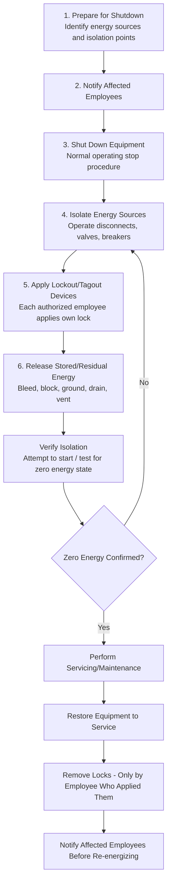

## Lockout Tagout Procedures

### Overview and Purpose

Lockout/Tagout (LOTO) is the control of hazardous energy program designed to prevent the unexpected energization, start-up, or release of stored energy from machines and equipment during servicing and maintenance activities. LOTO protects workers from injuries caused by mechanical, electrical, hydraulic, pneumatic, chemical, thermal, and gravitational energy sources.

**Key Points**

- LOTO is governed in the U.S. by 29 CFR 1910.147 (general industry) and is a foundational element of both general workplace safety and Process Safety Management safe work practices under 1910.119(f)(4)
- The core principle is that only the person who applies a lock can remove it — this personal accountability is the backbone of the entire system
- LOTO applies to servicing and maintenance where the unexpected energization or release of energy could cause injury, not to normal production operations
- "Tagout" alone (without a physical lock) is permitted only when the equipment is not capable of being locked out, and requires additional protective measures

### Regulatory Basis

- **OSHA 29 CFR 1910.147** — The Control of Hazardous Energy (Lockout/Tagout); general industry standard.
- **OSHA 29 CFR 1910.333** — Electrical safety-related work practices (interfaces with LOTO for electrical energy).
- **OSHA 29 CFR 1910.119(f)(4)** — Requires safe work practices, including energy isolation, for PSM-covered processes.
- **ANSI/ASSP Z244.1** — Control of Hazardous Energy — Lockout/Tagout and Alternative Methods (voluntary consensus standard, often referenced for program design detail beyond OSHA's minimums).
- **NFPA 70E** — Electrical safety in the workplace, referenced for electrically induced hazardous energy control.

[Inference] Many state-plan OSHA jurisdictions and international regulators (e.g., Canada's CSA Z460, UK equivalents) maintain parallel but not identical LOTO requirements; multinational operators should verify local statutory text rather than assume 1910.147 applies directly outside U.S. federal jurisdiction.

### Types of Hazardous Energy

| Energy Type | Examples | Isolation Method |
| --- | --- | --- |
| Electrical | Motors, control circuits, capacitors | Breaker/disconnect lockout, verify zero energy |
| Mechanical | Flywheels, springs, gravity-fed loads | Block, chain, pin, or wedge |
| Hydraulic | Pressurized fluid systems, rams | Bleed pressure, lock valves |
| Pneumatic | Compressed air systems | Bleed pressure, lock valves, vent |
| Chemical | Process fluids, reactive materials | Blind/blank, double block and bleed |
| Thermal | Steam, hot process fluids | Isolate, cool, drain |
| Gravitational/Stored | Suspended loads, elevated equipment | Block, crib, lower to rest |

### The Six-Step LOTO Sequence

### Roles and Responsibilities

- **Authorized Employee** — Person who performs the servicing/maintenance and applies/removes their own lockout device; has completed LOTO training for that equipment.
- **Affected Employee** — Person who operates or works near the equipment being locked out but does not perform the servicing; must be notified before lockout and before re-energization.
- **Other Employees** — Personnel whose work area is affected but who neither service the equipment nor operate it; also require notification.

Under 1910.147, only the authorized employee who applied a personal lock may remove it. If that employee is unavailable (e.g., left the site), a documented **group lockout removal procedure** must be followed, typically involving verification that the employee is not on-site, contact attempts, and supervisor authorization before removal — the returning employee must then be informed before resuming work.

### Group Lockout Procedures

When multiple crafts or crews work on the same equipment, a **group lockout** approach is used:

- A single primary authorized employee coordinates overall isolation
- A **lockout hasp** or **group lock box** allows multiple individual locks to be applied under one master isolation point
- Each worker applies their own personal lock to the hasp/box before starting work and removes it only when their portion of the work is complete
- The equipment cannot be re-energized until every individual lock is removed

**Example**

A pump overhaul requires mechanical, electrical, and instrumentation technicians to work simultaneously. The mechanical lead isolates and locks the primary breaker and valve isolation points, attaching a group lock box. Each of the three craft leads applies a personal padlock to the box. Only after all three locks are removed (each by the technician who applied it) can the primary isolation be released and the equipment restored.

### Verification of Isolation (Zero Energy State)

Verification is a distinct, mandatory step separate from simply applying the device. Common verification methods:

1. **Try-out** — Attempting to start the equipment using normal operating controls (then returning controls to neutral/off).
2. **Testing** — Using calibrated instruments to confirm absence of voltage (electrical), zero pressure (hydraulic/pneumatic/process), or zero flow.
3. **Visual confirmation** — Physical inspection of a blind/blank installation, open disconnect, or racked-out breaker.

$$P_{residual} \approx 0 \quad \text{and} \quad V_{residual} \approx 0$$

[Inference] This notation is a simplified conceptual representation of the verification goal (near-zero residual pressure and voltage), not a formal engineering equation with defined tolerance bands — actual acceptance criteria are equipment- and procedure-specific.

### Lockout Device Requirements

Per 1910.147, lockout devices must be:

- **Durable** — Capable of withstanding the environment for the duration of exposure
- **Standardized** — Uniform in color, shape, or size across the facility (with limited standardization for tags regarding print/format)
- **Substantial** — Sufficient to prevent removal without excessive force or unusual techniques (e.g., bolt cutters, other than by the authorized employee's key)
- **Identifiable** — Each lock indicates the identity of the employee who applied it

Tags, when used, must warn against hazardous conditions and include a legend such as "Do Not Start," "Do Not Open," "Do Not Close," "Do Not Energize," or "Do Not Operate." Tags alone provide a warning, not a physical restraint, so where equipment can accept a lock, a lock is required in addition to or instead of a tag under most program designs.

### Energy Control Procedures (Written Program Requirements)

Each piece of equipment (or family of similar equipment) requiring LOTO should have a written, equipment-specific energy control procedure that includes:

- Scope, purpose, and authorization for the procedure
- Specific steps for shutting down, isolating, blocking, and securing equipment
- Specific steps for placement, removal, and transfer of lockout/tagout devices, including responsibility assignment
- Requirements for testing to verify effectiveness of isolation

[Unverified] OSHA permits exceptions to written, equipment-specific procedures for simple, single-source, single-energy isolations meeting all criteria in 1910.147(c)(4)(i) (e.g., no stored/residual energy after shutdown, single energy source easily identified and isolated) — whether a given piece of equipment qualifies for this exception should be verified against the specific regulatory text and confirmed with a qualified EHS professional, as misapplication is a common audit finding.

### Periodic Inspection

OSHA requires an annual (at least once per year) inspection of each energy control procedure to ensure it is being followed correctly and remains effective. The inspection must:

- Be conducted by an authorized employee other than the one(s) using the procedure being inspected
- Include a review with each authorized employee of their responsibilities under the procedure
- Be documented, identifying the equipment, date, and employees involved

### Contractor and Interface Considerations

When contractors perform work requiring LOTO on host facility equipment:

- The host employer must inform the contractor of the facility's LOTO procedures and any hazards related to the process
- The contractor must inform the host of their own LOTO procedures
- Both parties must ensure their employees understand and comply with restrictions and prohibitions of the other's program
- This interface typically operates in conjunction with the facility's Permit to Work system, where the LOTO documentation is referenced within or attached to the work permit

### Common Failure Modes

- **Incomplete energy source identification** — Missing a secondary or stored energy source (e.g., a capacitor bank, a spring-loaded mechanism, or trapped pressure between two isolation valves).
- **Skipping verification (try-out/test)** — Assuming isolation is effective without confirming a zero-energy state.
- **Using tags without locks** where lockable hardware is available and required.
- **Group lockout box mismanagement** — Locks removed by someone other than the applying employee, or master isolation released before all personal locks are removed.
- **Inadequate periodic inspection** — Annual audits performed as a paperwork exercise rather than genuine procedure review with authorized employees.
- **Normalization of shortcuts** on equipment perceived as low-risk or during time-pressured outages.

[Inference] Investigations of LOTO-related fatalities compiled by OSHA and the Bureau of Labor Statistics have repeatedly identified failure to isolate all energy sources and failure to verify zero energy state as the two most frequent root causes, reinforcing why steps 4 through 6 of the six-step sequence (isolate, apply devices, release stored energy) are treated as non-negotiable in most facility programs.

### Integration with Other PSM Elements

- **Permit to Work Systems** — LOTO is frequently documented as a component of, or attachment to, hot work, confined space, and line-break permits.
- **Mechanical Integrity** — Equipment isolation for inspection, repair, or replacement under MI programs relies on LOTO to protect technicians.
- **Management of Change** — Adding, removing, or relocating isolation points (e.g., new valve, relocated breaker) requires MOC review to update the equipment-specific energy control procedure.
- **Training** — Authorized and affected employee training is a distinct, auditable OSHA requirement (1910.147(c)(7)), including retraining triggers such as procedure changes, new hazards, or observed deviations.

### Sample LOTO Isolation Point Diagram

<svg xmlns="http://www.w3.org/2000/svg" viewBox="0 0 640 280" width="100%" height="auto">
<text x="20" y="25" font-size="16" font-weight="bold">Pump Isolation Points for LOTO (svg_diagram)</text>

<rect x="40" y="60" width="100" height="60" fill="#cfe8ff" stroke="#333" />
<text x="55" y="95" font-size="12">Motor</text>

<rect x="40" y="140" width="100" height="30" fill="#fff3cd" stroke="#333" />
<text x="45" y="160" font-size="11">Disconnect (Lock)</text>
<line x1="90" y1="120" x2="90" y2="140" stroke="#333" stroke-width="2" />

<rect x="220" y="60" width="100" height="60" fill="#cfe8ff" stroke="#333" />
<text x="245" y="95" font-size="12">Pump</text>
<line x1="140" y1="90" x2="220" y2="90" stroke="#333" stroke-width="2" />

<rect x="330" y="75" width="70" height="30" fill="#fff3cd" stroke="#333" />
<text x="335" y="95" font-size="10">Suction Valve (Lock)</text>
<line x1="320" y1="90" x2="330" y2="90" stroke="#333" stroke-width="2" />

<rect x="80" y="10" width="80" height="30" fill="#fff3cd" stroke="#333" />
<text x="85" y="30" font-size="10">Discharge Valve (Lock)</text>
<line x1="90" y1="40" x2="90" y2="60" stroke="#333" stroke-width="2" />

<rect x="230" y="150" width="90" height="30" fill="#f4b6b6" stroke="#333" />
<text x="235" y="170" font-size="10">Bleed/Drain Valve</text>
<line x1="270" y1="120" x2="270" y2="150" stroke="#333" stroke-width="2" />

<text x="20" y="230" font-size="11" fill="#555">Isolation requires: electrical disconnect locked, suction and discharge valves locked closed,</text>

<text x="20" y="248" font-size="11" fill="#555">and residual pressure bled/drained before verification and start of work.</text>

</svg>

### Conclusion

Lockout/Tagout procedures provide the structured, verifiable control needed to prevent hazardous energy release during servicing and maintenance. Program effectiveness depends on complete energy source identification, personal-lock accountability, rigorous zero-energy verification, and disciplined periodic auditing — gaps in any of these areas are consistently linked to the most severe LOTO-related injuries and fatalities.

**Related Topics**

- Permit to Work Systems
- Confined Space Entry Procedures
- Mechanical Integrity Programs
- Management of Change (MOC)
- Electrical Safety and Arc Flash Protection (NFPA 70E)
- Contractor Safety Management
- Hazardous Energy Identification and Energy Isolation Diagrams
- Incident Investigation: LOTO-Related Case Studies
- Job Safety Analysis (JSA) / Job Hazard Analysis (JHA)