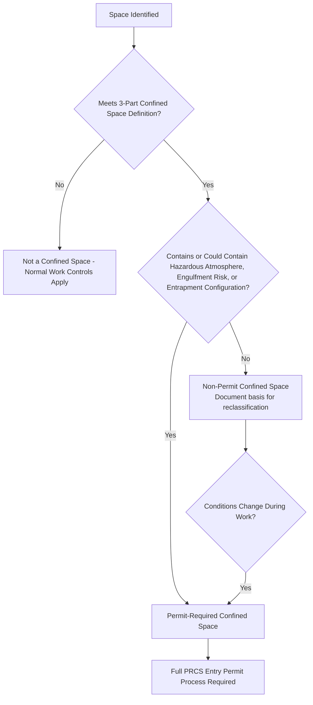

## Confined Space Entry

### Overview and Purpose

Confined Space Entry (CSE) procedures govern access into spaces that are large enough for a worker to enter and perform work, have limited or restricted means of entry or exit, and are not designed for continuous occupancy. These spaces present elevated risks from atmospheric hazards, engulfment, entrapment, and configuration hazards that are not typically encountered in open work areas.

**Key Points**

- Not all confined spaces are "permit-required" — classification determines the level of control needed
- The defining risks are atmospheric (toxic, flammable, oxygen-deficient/enriched), engulfment, and physical/configuration hazards
- Confined space fatalities disproportionately involve would-be rescuers who enter without proper precautions
- CSE procedures typically operate as a specialized permit type within the broader Permit to Work system

### Regulatory Basis

- **OSHA 29 CFR 1910.146** — Permit-Required Confined Spaces (general industry); the primary federal standard.
- **OSHA 29 CFR 1926 Subpart AA** — Confined Spaces in Construction.
- **OSHA 29 CFR 1910.119(f)(4)** — References confined space entry among the safe work practices required under PSM.
- **ANSI/ASSP Z117.1** — Safety Requirements for Confined Spaces (voluntary consensus standard providing additional technical detail).
- **NIOSH Publication 87-113** — A Guide to Safety in Confined Spaces (widely referenced for atmospheric testing guidance).

[Inference] Requirements outside U.S. federal OSHA jurisdiction (state-plan states, other countries) may impose additional or differing atmospheric thresholds, rescue provisions, or classification criteria; local regulatory text should be verified directly.

### Defining a Confined Space

Per 1910.146, a space is a "confined space" if it meets all three criteria:

1. Large enough for an employee to bodily enter and perform work
2. Has limited or restricted means of entry or exit (e.g., tanks, vessels, silos, pits, manholes, pipelines)
3. Is not designed for continuous employee occupancy

### Permit-Required vs. Non-Permit Confined Space

A confined space becomes **permit-required (PRCS)** if it contains or has the potential to contain any of the following:

- A hazardous atmosphere (flammable, toxic, oxygen-deficient, or oxygen-enriched)
- Material with the potential to engulf an entrant (e.g., grain, sand, liquid)
- An internal configuration that could trap or asphyxiate an entrant (inwardly converging walls, sloped floors tapering to a smaller cross-section)
- Any other recognized serious safety or health hazard

If none of these apply, and the space can be reclassified through testing and documentation, it may be treated as a **non-permit confined space**, though conditions must be re-verified if circumstances change.

### Atmospheric Hazard Categories

| Hazard | Typical Threshold (General Guidance) | Consequence |
| --- | --- | --- |
| Oxygen Deficiency | Below 19.5% O2 | Impaired judgment, unconsciousness, death |
| Oxygen Enrichment | Above 23.5% O2 | Increased fire/explosion risk |
| Flammable Atmosphere | Above 10% of Lower Explosive Limit (LEL) as an action level | Fire, explosion |
| Toxic Gas (e.g., H2S) | Facility/regulatory-specific permissible exposure limits (PELs) | Poisoning, asphyxiation, death |
| Carbon Monoxide | Facility/regulatory-specific PELs | Asphyxiation |

[Inference] Specific numeric action levels (such as the commonly cited 10% LEL threshold for suspending entry) are widely used industry practice values rather than a single universal OSHA-mandated number in all cases; facility procedures should reference their applicable regulatory PELs and internal risk tolerance when setting action levels.

### Atmospheric Testing Sequence

Testing must be performed in a specific order because gas density and behavior affect where hazards concentrate:

1. **Oxygen** — tested first, since combustible gas meters may not read accurately in oxygen-deficient atmospheres
2. **Combustibility (LEL)**
3. **Toxic gases** (e.g., H2S, CO, and any process-specific contaminants)

Testing should be conducted at multiple levels within the space (top, middle, bottom) since gases of different densities stratify — heavier-than-air gases (e.g., H2S, propane) settle low; lighter-than-air gases (e.g., methane) rise.

$$\text{LEL\%} = \frac{C_{gas}}{C_{LEL}} \times 100$$

Where $C_{gas}$ is the measured concentration of the flammable gas and $C_{LEL}$ is the concentration at which that gas becomes flammable in air.

### Roles and Responsibilities

- **Entrant** — The authorized worker who physically enters the confined space; responsible for using assigned PPE, communicating with the attendant, and exiting immediately when ordered or when warning signs of hazard exposure occur.
- **Attendant** — Remains outside the space at all times, continuously monitors entrants, maintains communication, keeps an accurate count/log of entrants, and initiates emergency procedures if needed. The attendant must never enter the space to attempt rescue.
- **Entry Supervisor** — Authorizes entry, verifies that all pre-entry conditions are met, oversees operations, and has authority to terminate entry and cancel the permit.
- **Rescue Team** — Either an on-site dedicated rescue team or an arranged off-site emergency service capable of responding within an appropriate timeframe for the space's specific hazard profile.

### The Entry Permit Process

**Example**

A technician must enter a horizontal storage tank to perform internal inspection.

1. Entry supervisor confirms the tank is isolated (blinded/blanked, drained, and purged of process material).
2. Continuous mechanical ventilation is established prior to and during entry.
3. Atmosphere is tested in sequence (O2, LEL, H2S, CO) and readings are logged with timestamps on the permit.
4. Attendant is posted at the entry point with a means of communication (radio) and a non-entry retrieval system (harness and tripod/winch) where feasible.
5. Rescue plan and contact procedure are confirmed and documented on the permit.
6. Entry supervisor signs the permit, authorizing entry for a defined time window.
7. Entrant dons PPE, signs the entry log, and enters.
8. Atmosphere is continuously or periodically monitored throughout the work; if levels exceed action limits, entrants evacuate immediately.
9. Upon task completion or permit expiry, entrant exits, tools/materials are accounted for, and the permit is formally closed.

### Rescue and Emergency Response

- **Non-entry rescue** is the preferred method wherever feasible — using a retrieval line and mechanical device (tripod, davit, winch) to extract an incapacitated entrant without requiring a rescuer to enter the space.
- **Entry rescue** (rescuer physically entering) is used only when non-entry rescue is not feasible, and requires the rescue team to be trained, equipped, and practiced specifically for confined space rescue, including their own atmospheric monitoring and respiratory protection.
- Facilities must evaluate whether to maintain an in-house rescue team or rely on outside resources (e.g., local fire department), and must verify that outside responders have the specific equipment and training for the facility's confined space configurations — a general fire response capability does not automatically equate to confined space rescue competency.

[Inference] A substantial proportion of confined space fatalities documented by OSHA and NIOSH involve untrained would-be rescuers (often coworkers) entering to assist a downed entrant without atmospheric testing or proper equipment, which is the basis for the strong regulatory and industry emphasis on non-entry rescue methods and attendant discipline against entering.

### Permit Suspension and Cancellation

An entry permit must be cancelled or entry suspended when:

- The scheduled entry period expires
- A condition not allowed under the permit arises (e.g., atmospheric reading exceeds action level)
- An order to evacuate is given by the attendant or entry supervisor
- An unauthorized entrant is detected in the space

If conditions change and entry is to resume, the space must be re-tested and, in most programs, a new or re-validated permit issued before entry continues.

### Special Cases

- **Alternate Entry Procedures (1910.146(c)(5))** — Permit-required spaces where the only hazard is atmospheric, and that hazard can be eliminated through continuous forced-air ventilation, may qualify for a reduced-control alternate procedure rather than the full permit process. [Unverified] Applicability requires meeting specific regulatory criteria exactly; misapplication of this provision to spaces with non-atmospheric hazards (engulfment, entrapment configuration) is a common compliance error and should be verified against 1910.146(c)(5) directly with a qualified safety professional.
- **Reclassification (1910.146(c)(7))** — A permit space may be reclassified as non-permit if all hazards are eliminated (not merely controlled), with documentation supporting the determination.
- **Hot Work in Confined Spaces** — Requires combined confined space and hot work permit controls, including continuous atmospheric monitoring during welding/cutting due to fume and combustion byproduct generation.

### Common Failure Modes

- **Inadequate or skipped atmospheric testing**, particularly failing to test at multiple levels within the space
- **Attendant abandoning post** or being assigned other duties that divert attention from monitoring
- **Untrained rescue attempts** by coworkers, resulting in multiple fatalities from a single incident
- **Incomplete isolation** — Failing to fully blind/blank process connections, relying on closed valves alone
- **Ventilation failure or interruption** not detected in time
- **Permit not re-validated** after breaks, shift changes, or changed conditions

### Integration with Other PSM Elements

- **Permit to Work Systems** — Confined space entry is typically issued as a distinct permit type or as an attachment integrated into the broader PTW system.
- **Lockout/Tagout** — Isolation of mechanical, electrical, and process energy sources is a prerequisite for safe confined space entry.
- **Emergency Planning and Response** — Rescue capability evaluation is a required component of facility emergency response planning.
- **Contractor Management** — Host employers must inform contractors of known space hazards and any history of prior entry operations in that specific space.
- **Training** — Entrant, attendant, and entry supervisor roles each require distinct, documented, and periodically refreshed training.

### Conclusion

Confined Space Entry procedures address one of the highest-consequence categories of hazard in process facilities, where atmospheric conditions can change rapidly and rescue options are inherently constrained by the space's physical configuration. Rigorous atmospheric testing discipline, strict adherence to non-entry rescue principles, and uncompromising attendant vigilance are the controls most consistently linked to preventing multiple-fatality incidents.

**Related Topics**

- Permit to Work Systems
- Lockout Tagout Procedures
- Atmospheric Monitoring and Gas Detection Equipment
- Emergency Response and Rescue Planning
- Hot Work Permits and Fire Prevention
- Contractor Safety Management
- Respiratory Protection Programs
- Job Safety Analysis (JSA) / Job Hazard Analysis (JHA)
- Incident Investigation: Confined Space Case Studies