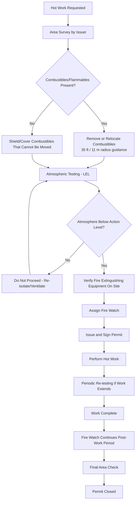

## Hot Work and Fire Prevention Permits

### Overview and Purpose

Hot Work Permits authorize and control operations that produce open flame, sparks, or sufficient heat to act as an ignition source — such as welding, cutting, grinding, brazing, and soldering — in areas where flammable or combustible materials may be present. The permit system ensures fire prevention measures are in place before, during, and after the work, addressing one of the most common ignition sources in process facility fires and explosions.

**Key Points**

- Hot work is a leading cause of industrial fires when performed without adequate atmospheric testing or combustible material control
- The permit requires verification that the atmosphere is non-flammable, combustibles are removed or shielded, and fire watch/extinguishing equipment is in place before work begins
- A fire watch is required not only during the work but for a defined period after work completion, since smoldering conditions can ignite later
- Hot work permits are typically time-limited to a single shift and must be renewed if conditions change or work extends

### Regulatory and Standards Basis

- **OSHA 29 CFR 1910.252** — Welding, Cutting, and Brazing — General Requirements (fire prevention and protection).
- **OSHA 29 CFR 1910.253 / .254** — Oxygen-fuel gas welding and cutting; arc welding and cutting equipment requirements.
- **OSHA 29 CFR 1910.119(f)(4)** — Requires safe work practices for hot work as part of PSM safe work practices.
- **NFPA 51B** — Standard for Fire Prevention During Welding, Cutting, and Other Hot Work; the primary consensus standard referenced for permit content and fire watch requirements.
- **API RP 2009** — Safe Welding, Cutting, and Hot Work Practices in the Petroleum and Petrochemical Industries.
- **API RP 2201** — Safe Hot Tapping Practices (specific to hot tapping on in-service piping/equipment).

[Inference] Facility-specific hot work permit forms and the exact fire watch duration (commonly cited as 30 minutes to an hour post-work under NFPA 51B guidance) may vary by local fire code adoption and facility risk assessment; the specific applicable duration should be confirmed against the facility's adopted standard.

### Categories of Hot Work

| Category | Examples | Typical Ignition Mechanism |
| --- | --- | --- |
| Welding | Arc welding, MIG, TIG, stick welding | Arc, spatter, high heat |
| Cutting | Oxy-fuel cutting, plasma cutting | Sparks, slag, flame |
| Grinding | Abrasive wheel grinding, wire brushing | Friction sparks |
| Brazing/Soldering | Torch brazing, sweating pipe joints | Open flame |
| Hot Tapping | Welding on in-service, pressurized piping | Arc/heat near flammable contents |
| Non-flame heat sources | Heat guns, some electrical equipment | Surface temperature ignition |

### Fixed vs. Non-Fixed (Designated) Hot Work Areas

- **Designated/Fixed Hot Work Area** — A location engineered and maintained specifically for hot work (e.g., a maintenance shop with fire-resistant construction, no nearby flammables, adequate ventilation). Work in a properly maintained designated area may not require an individual permit for each job, depending on facility policy, since the area itself is pre-controlled.
- **Non-Designated Area** — Any other location, including process units, tank farms, and piperacks, where hot work requires a specific, job-by-job permit due to the presence of flammable materials, process equipment, or uncontrolled hazards.

### The Hot Work Permit Process

### Pre-Work Fire Prevention Measures

1. **Combustible material removal** — Movable combustibles should be relocated a minimum safe distance from the hot work location (commonly referenced as approximately 35 feet / 11 meters under NFPA 51B guidance, though facility procedures set the applicable distance).
2. **Shielding** — Non-movable combustibles are protected using fire-resistant blankets, curtains, or metal shields.
3. **Floor and opening protection** — Combustible floors are wetted down or covered; floor openings, wall/duct penetrations, and cracks are sealed to prevent sparks from passing to adjacent areas or lower levels.
4. **Atmospheric testing** — For hot work near or on process equipment, the atmosphere is tested for flammable vapor concentration (LEL) before and, where conditions could change, during the work.
5. **Equipment isolation** — For hot work on or near piping/vessels, isolation (draining, purging, blinding) is verified consistent with line-break and confined space procedures where applicable.
6. **Ventilation** — Adequate ventilation is confirmed, particularly in enclosed or semi-enclosed spaces, to prevent accumulation of welding fumes and flammable vapors.

### Fire Watch Requirements

A dedicated fire watch is required whenever hot work is performed outside a fully fire-safe designated area, or when:

- Combustible materials are within the defined safe distance and cannot be relocated
- Combustible materials are more than 35 ft (11 m) away but could still be ignited by radiant heat, sparks, or slag travel
- Openings in walls or floors could allow sparks to enter adjacent areas containing combustibles
- Work is performed on walls, ceilings, or partitions with concealed combustible construction

**Fire watch responsibilities:**

- Continuous observation during the hot work operation
- Immediate access to and knowledge of use for appropriate fire extinguishing equipment
- Authority to stop work if unsafe conditions develop
- Continued monitoring for a defined period after work completion (facility/standard-specific, commonly 30–60 minutes) to detect smoldering ignition

[Inference] The specific post-work fire watch duration is drawn from common NFPA 51B-based industry practice; some facilities extend this significantly longer for high-consequence areas (e.g., inside tanks, near insulation that can smolder for extended periods), so the applicable duration should be confirmed against the facility's own procedure.

### Example: Hot Work on a Pipe Rack Near a Process Unit

**Example**

A contractor needs to weld a support bracket on a pipe rack adjacent to an operating process unit.

1. Issuer surveys the area and identifies nearby insulated piping and a cable tray within the combustible clearance zone.
2. Cable tray is covered with a fire-resistant blanket; insulation on adjacent piping is inspected for oil saturation and covered as a precaution.
3. Atmosphere is tested at the work location and logged: LEL reading confirmed below the facility action level.
4. A fire extinguisher (appropriate class) and, depending on facility policy, a charged hose line are staged at the work location.
5. A fire watch is assigned, briefed on the work scope, and equipped with communication to summon help.
6. Permit is signed by the issuer and the welding contractor's supervisor, valid for the current shift only.
7. Welding is performed; the fire watch maintains continuous observation throughout.
8. Upon completion, the area is inspected for smoldering material, slag, or hot metal.
9. Fire watch continues observation for the facility-specified post-work period before standing down.
10. Permit is closed and filed.

### Hot Tapping — A Specialized High-Risk Case

Hot tapping (welding a connection onto in-service, pressurized piping or equipment) combines hot work risk with process safety risk, since the weld is made directly on or near a wall containing flammable or hazardous process fluid.

**Additional controls typically required per API RP 2201:**

- Engineering review of pipe/vessel wall thickness and metallurgy to ensure sufficient remaining wall for safe welding
- Confirmation of adequate flow/circulation inside the line during welding to act as a heat sink and prevent burn-through
- Specialized hot tap fitting and cutting equipment rated for the service
- Coordination between welding personnel, process operations, and engineering before, during, and after the tap

[Unverified] Specific technical acceptance criteria for hot tapping (minimum wall thickness, flow velocity requirements) are project- and code-specific engineering determinations; general guidance should not substitute for a qualified engineering assessment on a case-by-case basis.

### Common Failure Modes

- **Inadequate combustible removal/shielding**, particularly overlooking materials outside the immediate visual work area (e.g., material below grating, behind panels)
- **Skipping or inadequate atmospheric testing**, especially assuming an area is "always safe" based on past experience
- **Fire watch distraction or reassignment** to other tasks during the hot work operation
- **Insufficient post-work monitoring**, allowing smoldering material to ignite after the fire watch has left
- **Permit not re-validated** when work extends beyond the original shift or when area conditions change (e.g., a process upset introduces flammable vapor)
- **Hot work conducted concurrently with confined space entry or other incompatible activity** without a SIMOPS review

[Inference] Historical major incident investigations, including several documented by the U.S. Chemical Safety Board (e.g., refinery and petrochemical hot work incidents), have repeatedly identified inadequate atmospheric testing and undetected flammable vapor migration into the hot work area as root or contributing causes, underscoring why testing before and during work — not just at permit issuance — is emphasized in current guidance.

### Integration with Other PSM Elements

- **Permit to Work Systems** — Hot work permits are one of the most common and highest-frequency permit types within the broader PTW framework.
- **Confined Space Entry** — Hot work inside a confined space requires combined permit controls and continuous atmospheric monitoring.
- **Lockout/Tagout and Line Breaking** — Hot work on piping/equipment often requires prior isolation and, for hot tapping, careful coordination rather than full isolation.
- **Management of Change** — Establishing a new designated hot work area, or changing fire watch requirements, may warrant MOC review.
- **Mechanical Integrity** — Hot tapping and welded repairs on pressure equipment interface directly with inspection and integrity programs to confirm suitability for welding.

### Conclusion

Hot Work and Fire Prevention Permits provide structured control over one of the most frequent ignition sources in process facilities. Their effectiveness rests on rigorous pre-work area preparation, disciplined atmospheric testing before and during work, and uncompromising fire watch coverage that extends well beyond the moment the torch or welder is switched off.

**Related Topics**

- Permit to Work Systems
- Confined Space Entry Procedures
- Lockout Tagout Procedures
- Atmospheric Monitoring and Gas Detection
- Mechanical Integrity and Hot Tapping Engineering Review
- Fire Protection and Suppression Systems
- Simultaneous Operations (SIMOPS) Management
- Contractor Safety Management
- Incident Investigation: Hot Work Case Studies