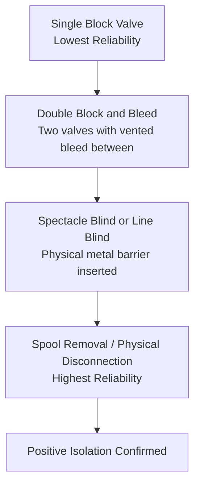
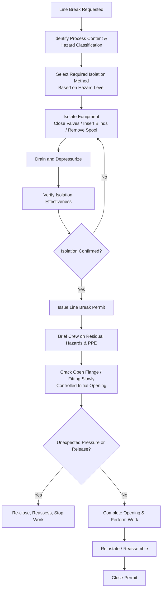

## Line Breaking and Opening Process Equipment

### Overview and Purpose

Line Breaking (also called line opening) refers to the intentional disconnection, opening, or penetration of piping, vessels, or equipment that contains or has contained a hazardous process material. This procedure is explicitly named in OSHA's PSM safe work practice requirements because it directly exposes workers to residual process fluids, vapors, and pressure — a leading cause of chemical exposure and fire/explosion incidents during maintenance activity.

**Key Points**

- Line breaking is distinct from, but closely related to, LOTO and confined space entry — it specifically addresses the hazard of the material previously or currently contained within the equipment being opened
- Residual hazards persist even after a line is "isolated" — trapped pressure, drainage, vapor, and pyrophoric scale can remain hazardous
- The controlling principle is verified isolation, not assumed isolation — closed valves alone are not considered adequate for high-hazard service
- Line breaking procedures typically operate as a specific permit type or as a required attachment within the facility's Permit to Work system

### Regulatory and Standards Basis

- **OSHA 29 CFR 1910.119(f)(4)** — Explicitly lists "opening process equipment or piping" as a safe work practice requiring written procedures under PSM.
- **OSHA 29 CFR 1910.147** — Lockout/Tagout, applicable where mechanical or electrical energy isolation accompanies the line break.
- **OSHA 29 CFR 1910.146** — Permit-Required Confined Spaces, applicable when line breaking is a prerequisite to vessel entry.
- **API RP 2201** — Safe Hot Tapping Practices (relevant when the line break involves a hot tap rather than full isolation).
- **CCPS Guidelines for Opening Process Equipment for Maintenance** — A commonly referenced industry guidance document providing detailed technical practice for isolation verification, draining, and depressurization.

[Inference] Unlike LOTO and confined space entry, OSHA does not maintain a single, standalone numbered regulation devoted entirely to line breaking; the requirement is embedded within the general PSM safe work practices provision, which is why industry practice leans heavily on CCPS and API guidance to fill in technical detail.

### Hazard Basis for Line Breaking

| Residual Hazard | Description |
| --- | --- |
| Trapped Pressure | Pressure remaining between isolation points even after upstream/downstream valves are closed |
| Residual Liquid/Vapor | Process fluid remaining in the line or vessel after draining, including vapor off-gassing |
| Pyrophoric Scale | Iron sulfide deposits (common in sour service) that can self-ignite on exposure to air |
| Toxic/Corrosive Exposure | Direct contact or inhalation exposure when the line is opened |
| Temperature | Residual heat from process fluid causing thermal burns |
| Gravity/Drainage | Unexpected liquid drainage from connected higher-elevation piping once the line is opened |

[Inference] Pyrophoric iron sulfide ignition upon air exposure is a well-documented hazard specific to sour (H2S-containing) hydrocarbon service; its relevance to a given line-break job depends on the process stream composition and should be confirmed against the specific service history rather than assumed present or absent by default.

### Isolation Hierarchy for Line Breaking

Isolation reliability increases with the method used, and higher-hazard services generally require the more robust methods:

- **Single valve closure** — Relies on valve seat integrity alone; subject to leak-through, seat wear, or debris preventing full closure. Generally considered insufficient as sole isolation for hazardous or high-pressure service.
- **Double block and bleed (DBB)** — Two valves in series with a vented or monitored bleed point between them; a leak past the first valve is detected/relieved at the bleed rather than reaching the work area.
- **Spectacle blind / line blind** — A solid metal disc inserted into the flange, providing a positive physical barrier; the "open" side of the spectacle (figure-8 blind) allows verification of blind position without disassembly.
- **Spool removal / physical disconnection** — Complete removal of a pipe section, providing the highest confidence isolation, typically used for the highest-hazard or longest-duration work.

$$\text{Isolation Reliability} \propto \text{Number of Independent Physical Barriers}$$

[Inference] This relationship is a conceptual illustration of isolation hierarchy principles, not a quantified engineering formula; actual isolation adequacy for a specific job is determined by hazard classification, service history, and facility isolation standards, not a numeric proportionality calculation.

### The Line Breaking Permit Process

### Pre-Break Isolation Verification

Verification must confirm the isolation is actually effective, not merely applied:

1. **Valve position confirmation** — Physical (not remote/assumed) verification that isolation valves are fully closed and, where required, locked.
2. **Bleed/vent confirmation** — For double block and bleed, confirming the bleed point shows no pressure and no continued flow, indicating the upstream block is holding.
3. **Blind verification** — Visual confirmation that a spectacle blind is in the "blind" (closed) position, often via a tag or indicator showing orientation, since installing it backward provides no isolation.
4. **Draining and depressurization** — Confirming the line/vessel is drained of liquid and depressurized to atmospheric (or a defined safe pressure) before opening.
5. **Purging (where applicable)** — Displacing residual flammable or toxic vapor with inert gas or air, particularly before hot work or when entry will follow.

### Example: Breaking a Flange on a Sour Hydrocarbon Line

**Example**

Maintenance needs to remove a control valve on a line carrying sour (H2S-containing) hydrocarbon service.

1. Operations confirms the line is a candidate for double block and bleed isolation per facility isolation standards for sour service.
2. Upstream and downstream block valves are closed and locked out; the bleed valve between them is opened and monitored to confirm no pressure buildup.
3. The line section is drained to a closed drain system; residual pressure is confirmed at zero via a pressure gauge or bleed point.
4. The line break permit is issued, specifying required PPE: H2S monitor, appropriate respiratory protection standby, chemical-resistant gloves, face shield.
5. The crew is briefed on the possibility of pyrophoric scale and the requirement to keep the exposed surface wetted down if pyrophoric material is suspected.
6. Flange bolts are loosened gradually, "cracking" the joint slowly rather than fully removing all bolts at once, to detect any residual pressure or trapped fluid before full separation.
7. No unexpected release is observed; work proceeds to remove and replace the control valve.
8. Upon completion, the flange is reassembled per bolt torque specification, and the isolation is verified before removing locks and returning the line to service.
9. Permit is closed and isolation records filed.

### The "Crack the Joint" Technique

A standard practice for initial flange opening: bolts are loosened but not fully removed, and the flange faces are separated slightly (cracked) to allow any trapped residual pressure or fluid to vent or weep in a controlled manner before full disassembly. Workers position themselves away from the direct line of the gap and use tools that keep hands clear of the opening. This technique provides a final field check on isolation effectiveness even after formal verification steps.

### Coordination with Confined Space and Hot Work

Line breaking frequently precedes or accompanies other permitted activities:

- **Confined space entry** — Line breaking to disconnect all process connections is typically a prerequisite for classifying a vessel safe for entry.
- **Hot work** — Welding or cutting on piping requires that the line-break isolation and purging be complete and verified before hot work begins, and re-verified if the hot work is delayed.
- **Lockout/Tagout** — Any powered valves, pumps, or actuators associated with the isolated line require electrical/mechanical LOTO in addition to the piping isolation itself.

### Common Failure Modes

- **Reliance on a single valve** for high-hazard service isolation, where the valve later proves to be leaking or not fully seated
- **Backward-installed spectacle blinds**, providing the appearance of isolation without actual barrier function
- **Skipping the "crack the joint" step**, proceeding directly to full flange removal and encountering unexpected trapped pressure or liquid
- **Failure to account for gravity drainage** from connected elevated piping after the line is opened
- **Not addressing pyrophoric scale** in sour service, leading to spontaneous ignition upon air exposure
- **Isolation list not updated** after temporary changes (e.g., a bypass installed during a prior outage) leading to an incomplete or incorrect isolation boundary

[Inference] Incident investigations across the refining and chemical sectors (including several documented by the U.S. Chemical Safety Board) have repeatedly identified inadequate isolation verification — particularly single-valve isolation on hazardous service and failure to detect trapped pressure — as a recurring root cause in line-break-related releases, which underpins the industry shift toward mandatory double block and bleed or physical isolation for higher-hazard streams.

### Integration with Other PSM Elements

- **Permit to Work Systems** — Line breaking is one of the named safe work practices under PSM and is typically documented via a dedicated permit or as an integrated section of a broader work permit.
- **Lockout/Tagout** — Provides the energy isolation component when powered equipment is part of the isolation boundary.
- **Confined Space Entry** — Line break completion and verification is often a direct prerequisite for space reclassification.
- **Mechanical Integrity** — Isolation point reliability (valve condition, blind rating) is informed by inspection and testing data from the MI program.
- **Management of Change** — Any change to standard isolation points, isolation philosophy, or addition/removal of blind flanges on a system should be evaluated through MOC.
- **Process Hazard Analysis** — PHAs for a unit often identify which lines require double block and bleed or blind isolation as standard practice based on the hazard classification of the contained material.

### Conclusion

Line Breaking and Opening Process Equipment procedures address the direct interface between maintenance work and residual process hazards. Reliable execution depends on selecting an isolation method proportionate to the hazard, physically verifying that isolation before work begins, and using controlled techniques such as joint-cracking to catch any isolation failure before full exposure occurs.

**Related Topics**

- Permit to Work Systems
- Lockout Tagout Procedures
- Confined Space Entry Procedures
- Hot Work and Fire Prevention Permits
- Mechanical Integrity Programs
- Management of Change (MOC)
- Process Hazard Analysis Methodologies
- Pyrophoric Material Handling in Sour Service
- Incident Investigation: Line Break Case Studies