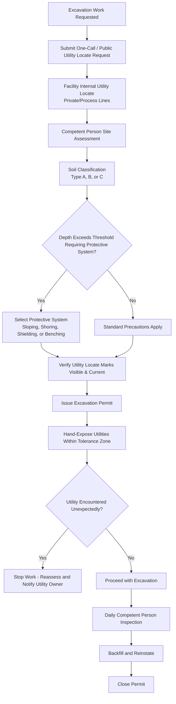

## Excavation and Ground Disturbance Permits

### Overview and Purpose

Excavation and Ground Disturbance Permits authorize and control any activity that breaks ground — digging, trenching, boring, driving stakes/posts, or otherwise penetrating below the surface — within a facility. These permits exist to prevent two distinct categories of hazard: engineering hazards associated with the excavation itself (cave-in, collapse) and the risk of striking buried utilities or process lines (underground piping, electrical cable, fiber optic, fuel lines).

**Key Points**

- Ground disturbance permits are required even for shallow digging, since buried utilities are not always at expected depths
- The two primary hazard domains are soil/trench stability (cave-in risk to workers inside the excavation) and underground utility strike (risk to third parties and process integrity)
- A completed utility locate (public and private/facility-specific) is a mandatory prerequisite before any ground disturbance
- Excavations of a defined depth (commonly 5 feet/1.5 m in general industry practice) require protective systems against cave-in unless specific soil conditions exempt them

### Regulatory and Standards Basis

- **OSHA 29 CFR 1926 Subpart P** — Excavations (the primary federal standard governing trenching and excavation safety in construction, widely applied by reference in industrial settings performing excavation work).
- **OSHA 29 CFR 1910.119(f)(4)** — References control over ground-disturbing and related non-routine activities as part of PSM safe work practices, particularly where excavation could impact buried process piping or supports.
- **Common Ground Alliance (CGA) Best Practices** — Industry consensus guidance for utility locating and damage prevention, widely referenced in facility ground disturbance procedures.
- **State/local "Call Before You Dig" / One-Call notification laws** — Statutory requirement in most U.S. jurisdictions to notify a one-call center before excavation, allowing public utility operators to mark buried lines.

[Inference] OSHA's excavation standard (1926 Subpart P) is codified under the construction standards, but general industry facilities performing excavation work commonly adopt it as their internal ground disturbance procedure basis since 1910 general industry standards do not contain an equivalent standalone excavation regulation; facility procedures should specify which standard governs their operations.

### Ground Disturbance Classification

| Category | Typical Trigger | Additional Controls |
| --- | --- | --- |
| Minor/Shallow Disturbance | Hand digging, fence post holes, shallow landscaping (below a facility-defined minimal depth) | Locate verification, hand-digging near marked utilities |
| Excavation/Trenching | Mechanical excavation, trenches, pits | Full permit, protective system evaluation, utility locate, competent person involvement |
| Boring/Directional Drilling | Underground utility installation without open trenching | Locate verification, specialized boring risk assessment |
| Excavation Near Known Hazards | Digging near process piping, electrical duct banks, or PSM-covered underground assets | Enhanced controls, hand exposure of lines, possible hot work/LOTO coordination |

### The Excavation Permit Process

### Utility Locating

**Public utilities** — Located through the applicable one-call/notification center, which dispatches utility owners (electric, gas, water, telecom) to mark their buried assets using standardized color codes.

**Standard Utility Locate Color Code (APWA Uniform Color Code):**

| Color | Utility Type |
| --- | --- |
| Red | Electric power lines, cables, conduit |
| Yellow | Gas, oil, steam, petroleum, or gaseous materials |
| Orange | Communication, alarm, or signal lines |
| Blue | Potable water |
| Purple | Reclaimed water, irrigation |
| Green | Sewers and drain lines |
| Pink | Temporary survey markings |
| White | Proposed excavation area |

**Private/facility utilities** — Since one-call systems typically only cover utilities up to the meter or facility boundary, internal process piping, electrical duct banks, instrument cable, and other facility-owned buried assets require a separate internal locate process, often using facility drawings, ground-penetrating radar, or physical verification, since as-built records may be incomplete or outdated.

[Inference] The reliability of internal facility utility records varies significantly by site age and documentation practices; older facilities in particular may have undocumented or inaccurately mapped buried lines, which is why hand exposure within a defined tolerance zone around marked utilities is standard practice rather than relying on markings alone.

### Soil Classification and Protective Systems

OSHA 1926 Subpart P requires soil to be classified by a competent person to determine the appropriate protective system:

- **Type A Soil** — Most stable (e.g., clay); steepest allowable slope.
- **Type B Soil** — Moderately stable (e.g., silt, sandy loam).
- **Type C Soil** — Least stable (e.g., granular soil, submerged soil); requires the least steep slope or most robust protective system.

**Protective system options:**

1. **Sloping** — Cutting back the trench wall at an angle appropriate to the soil type to prevent collapse.
2. **Benching** — Stepping the excavation wall in horizontal levels (not permitted in Type C soil).
3. **Shoring** — Installing supports (hydraulic, timber, or other engineered systems) to prevent soil movement.
4. **Shielding (trench boxes)** — Using a manufactured or engineered protective structure that the workers stay within, protecting against collapse without altering the trench walls.

[Inference] Specific numeric slope ratios and depth thresholds (e.g., the commonly cited 5-foot depth trigger for requiring a protective system) are defined precisely within OSHA 1926 Subpart P; exact figures should be verified against the current regulatory text and applied by a qualified competent person rather than approximated, since misclassification is a frequent source of citations and cave-in fatalities.

### Competent Person Responsibilities

A designated competent person (trained and authorized to identify existing and predictable hazards) must:

- Classify soil type
- Select and inspect the protective system
- Inspect the excavation daily and after any event that could increase hazards (rainfall, vibration, nearby heavy equipment operation)
- Have authority to halt work and require workers to exit if hazardous conditions are observed

### Example: Trench Excavation Near a Buried Process Line

**Example**

A contractor is tasked with excavating a trench to repair a buried water line approximately 4 feet deep, in an area with a marked process line nearby.

1. One-call notification is submitted, and public utilities are marked per the standard color code.
2. Facility internal locate confirms an underground process line runs parallel to the planned trench, approximately 3 feet from the excavation edge.
3. Competent person classifies the soil as Type B based on site conditions.
4. Given the depth and soil type, sloping is selected as the protective system for the open trench.
5. The excavation permit is issued, noting the proximity to the process line and requiring hand-digging (not mechanical excavation) within the tolerance zone around the marked utility.
6. Excavation proceeds mechanically until reaching the tolerance zone, then shifts to hand tools to safely expose the process line without contact.
7. Daily competent person inspections continue throughout the multi-day job, with re-inspection after an overnight rain event.
8. Upon completion, the trench is properly backfilled and compacted, and the area is reinstated.
9. Permit is closed and utility locate records filed for future reference.

### Access, Egress, and Additional Trench Hazards

- **Ladders/ramps** — Required for trenches 4 feet (1.2 m) or deeper, positioned so no worker must travel more than a defined lateral distance to reach an exit.
- **Spoil pile placement** — Excavated material must be kept a minimum distance from the trench edge (commonly cited as at least 2 feet / 0.6 m) to prevent surcharge loading and collapse.
- **Water accumulation** — Trenches with water intrusion require additional precautions (dewatering, monitoring) due to increased collapse risk and drowning hazard.
- **Atmospheric hazards** — Deep excavations, particularly in contaminated soil or near process areas, may require atmospheric testing similar to confined space precautions.
- **Vehicle/mobile equipment proximity** — Vibration and loading from nearby vehicle traffic can destabilize trench walls.

### Common Failure Modes

- **Incomplete or skipped utility locate**, particularly for private/facility lines not covered by the public one-call system
- **Mechanical excavation within the utility tolerance zone** instead of transitioning to hand digging
- **Inadequate or absent protective system** for the actual soil conditions and depth
- **Failure to re-inspect after weather events** that change soil stability
- **Spoil pile placed too close to the trench edge**, adding surcharge load that triggers collapse
- **Permit not reflecting changed scope** when a trench is extended or deepened beyond the originally assessed area

[Inference] Trench collapse remains one of the most frequently fatal excavation hazards documented in OSHA enforcement data, and a substantial share of documented incidents involve trenches without any protective system in place, which is consistent with why competent-person soil classification and mandatory protective systems above the depth threshold are treated as non-negotiable program elements.

### Integration with Other PSM Elements

- **Permit to Work Systems** — Excavation permits function as a specialized permit type within the broader PTW framework, particularly for work within or near PSM-covered process areas.
- **Line Breaking and Opening Process Equipment** — If excavation exposes and requires disconnection of buried process piping, line-break procedures apply in addition to excavation controls.
- **Lockout/Tagout** — Applicable if excavation work involves exposing or working near buried electrical duct banks requiring de-energization.
- **Management of Change** — Discovery of an undocumented buried utility, or permanent alteration of underground infrastructure, may trigger an MOC review to update facility drawings and records.
- **Contractor Management** — Excavation is frequently performed by third-party contractors, making utility locate coordination and competent person qualification verification a key contractor management interface.

### Conclusion

Excavation and Ground Disturbance Permits manage two distinct but equally consequential risks: trench collapse endangering workers inside the excavation, and utility strikes endangering both workers and process integrity. Reliable execution depends on complete utility locating (public and private), accurate soil classification, an appropriately selected protective system, and disciplined daily competent-person oversight throughout the excavation's duration.

**Related Topics**

- Permit to Work Systems
- Line Breaking and Opening Process Equipment
- Lockout Tagout Procedures
- Contractor Safety Management
- Underground Utility Mapping and Records Management
- Management of Change (MOC)
- Emergency Response and Rescue Planning
- Job Safety Analysis (JSA) / Job Hazard Analysis (JHA)
- Incident Investigation: Excavation Case Studies