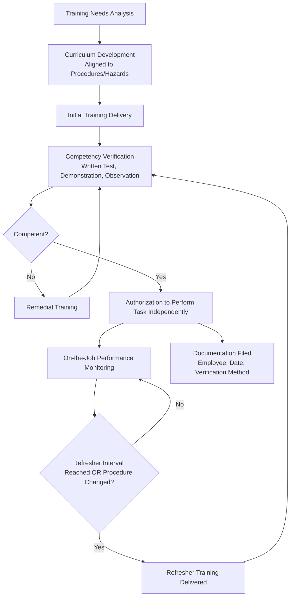
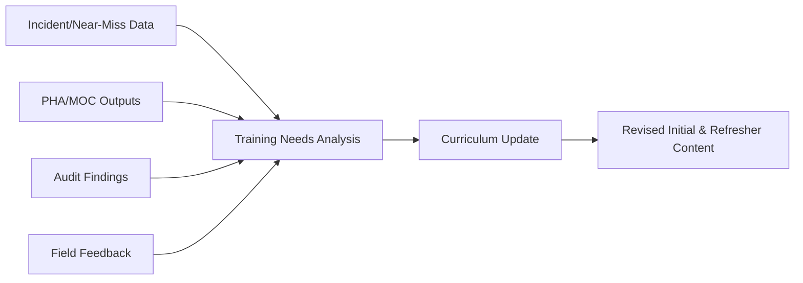

## Initial and Refresher Training Programs

### Overview and Purpose

Initial and Refresher Training Programs establish the systematic process by which employees, contractors, and supervisors acquire and maintain the knowledge and skills needed to safely operate, maintain, and work within a process facility. Training is a foundational PSM element because even well-designed procedures, permits, and engineering controls fail if the people executing them do not understand the hazards or the required response.

**Key Points**

- Initial training establishes baseline competency before an employee is permitted to work independently on a covered process
- Refresher training maintains and verifies competency over time, addressing knowledge decay, procedure changes, and skill atrophy
- OSHA PSM explicitly distinguishes between operator training (1910.119(g)) and general safe work practice/procedure training, though both feed into overall competency assurance
- Training effectiveness is measured by demonstrated competency, not merely attendance or hours completed

### Regulatory and Standards Basis

- **OSHA 29 CFR 1910.119(g)** — Training: requires initial training for employees operating a process, refresher training at least every three years, and training documentation (employee identity, date, means used to verify understanding).
- **OSHA 29 CFR 1910.119(f)(4)** — Requires training on safe work practices for non-routine activities such as LOTO, confined space, hot work, and line breaking.
- **OSHA 29 CFR 1910.119(h)(2)(iv)** — Contractor employer responsibility to ensure contract employees are trained in job-specific hazards.
- **OSHA 29 CFR 1910.147(c)(7)** — LOTO-specific training requirements for authorized and affected employees.
- **OSHA 29 CFR 1910.146(g)** — Confined space entry-specific training requirements.
- **CCPS Guidelines for Defining and Developing Effective Process Safety Culture / Risk Based Process Safety** — References training and competency assurance as a distinct RBPS pillar, distinguishing training (knowledge transfer) from competency assurance (verified capability).

[Inference] The specific three-year refresher interval under 1910.119(g)(3) is an explicit regulatory maximum; many facilities adopt shorter refresher cycles for higher-risk tasks (e.g., annual LOTO or confined space refreshers) based on internal risk assessment rather than relying on the PSM regulatory minimum as the default for all training categories.

### Training Categories

| Category | Applies To | Typical Trigger |
| --- | --- | --- |
| Initial/New Hire Training | All new employees before independent work | Hiring, job reassignment |
| Job/Task-Specific Training | Operators, maintenance, specific crafts | Assignment to a covered process or task |
| Refresher Training | All trained personnel | Fixed interval (e.g., annual, biennial, triennial) |
| Procedure Change Training | Affected personnel | Whenever an operating procedure changes significantly |
| Contractor Orientation | Contract employees | Before work begins on-site |
| Emergency Response Training | Designated responders, all employees (basic level) | Initial assignment, annual refresher |
| Permit-Specific Training | Permit issuers, receivers, attendants | Assignment to relevant permit role |

### The Training Lifecycle

### Initial Training Design Principles

1. **Hazard-based content** — Training content should map directly to the specific hazards of the process, equipment, or task the employee will encounter, not generic industry content alone.
2. **Procedure alignment** — Training must be consistent with and reference the facility's actual written operating procedures (per 1910.119(f)) and safe work practices, so employees are trained to the same standard they will be expected to follow.
3. **Layered delivery** — Typically combines classroom/computer-based instruction (knowledge), hands-on simulation or field walkthrough (skill), and supervised on-the-job practice (application) before independent authorization.
4. **Competency verification** — OSHA requires that the employer "ascertain that the employee has received and understood the training" — commonly implemented through written or oral testing, skills demonstration, or a combination.

### Refresher Training Requirements

Refresher training under 1910.119(g)(3) must occur at least every three years, or more frequently if:

- Determined necessary by the employer's own assessment of task complexity, incident history, or audit findings
- A procedure has changed in a way that materially affects how the employee performs the task
- An incident or near-miss investigation identifies a knowledge or skill gap
- Performance observation reveals a competency drift (e.g., skipped verification steps, shortcuts)

**Refresher content** should not simply repeat initial training verbatim; effective refreshers typically:

- Review recent incidents, near-misses, or audit findings relevant to the role
- Reinforce procedure changes since the last training
- Include a competency re-verification component, not passive review only

[Inference] While OSHA sets a three-year floor for process operator refresher training, best practice guidance from CCPS and similar bodies generally recommends more frequent refreshers for high-consequence, low-frequency tasks (e.g., emergency shutdown actions, confined space rescue) precisely because skills used rarely are more prone to decay; specific refresher intervals for such tasks should be set based on facility risk assessment rather than defaulting to the PSM regulatory minimum.

### Competency Verification Methods

| Method | Best Suited For | Limitation |
| --- | --- | --- |
| Written/Computer-Based Test | Knowledge recall, regulatory concepts | Does not verify hands-on skill |
| Skills Demonstration | Physical tasks (LOTO application, PPE donning, permit completion) | Resource-intensive, requires qualified evaluator |
| Field Observation/Coaching | Real-world procedure adherence | Time-intensive, requires trained observers |
| Simulation/Scenario-Based Assessment | Emergency response, abnormal situation handling | Requires simulation infrastructure or tabletop design |
| Oral Q&A / Toolbox Discussion | Reinforcement, informal verification | Least rigorous; not sufficient alone for high-risk competencies |

**Example**

A new process operator completes initial training on startup procedures for a distillation unit.

1. Classroom instruction covers the unit's process chemistry, key hazards, and the written startup procedure step-by-step.
2. Computer-based training includes a knowledge check quiz requiring a passing score (e.g., 80%) before proceeding.
3. The operator observes an experienced operator perform an actual startup, followed by a debrief discussion.
4. Under direct supervision, the trainee performs a supervised startup, with the qualified trainer verifying each critical step is executed correctly.
5. A formal competency checklist is signed off by the trainer, documenting specific steps verified (e.g., correct valve sequencing, interlock verification, communication with control room).
6. The operator is authorized to perform startups independently, with documentation filed noting name, date, procedure version, and verification method used.
7. A refresher is scheduled per facility policy (e.g., annually for this critical task, ahead of the three-year regulatory floor) or triggered earlier if the startup procedure is revised.

### Contractor Training Interface

Per 1910.119(h), host employers must:

- Inform contract employers of known hazards related to the contractor's work and the process
- Explain the applicable provisions of the emergency action plan
- Verify (though not necessarily directly train) that contract employees have received training appropriate to their job, often via contractor orientation combined with documented verification of the contractor's own training records

Contract employers, in turn, must ensure their employees are trained in the work practices necessary to perform their job safely, and must inform the host of any unique hazards their work presents.

### Documentation Requirements

OSHA 1910.119(g)(3) requires the employer to prepare a record containing:

- The identity of the employee
- The date of training
- The means used to verify that the employee understood the training

This documentation is a common PSM audit focus area; incomplete records (missing verification method, undocumented refresher dates) are a frequently cited compliance gap.

### Training Needs Analysis and Gap Identification

Effective programs periodically reassess training content and frequency based on:

- **Incident and near-miss trends** — Recurring root causes pointing to knowledge or skill gaps
- **PHA/MOC outputs** — New or changed hazards identified through process hazard analysis or management of change that require updated training
- **Audit and inspection findings** — PSM compliance audits often surface training gaps as findings
- **Employee/supervisor feedback** — Field-level input on where written procedures and actual training diverge

### Common Failure Modes

- **Attendance-based rather than competency-based verification** — Treating course completion or a signature as equivalent to demonstrated understanding
- **Generic, non-facility-specific content** — Training that does not reflect the actual written procedures, equipment configuration, or hazards present at the specific site
- **Refresher training as passive repetition** — Repeating identical initial content without incorporating incident learnings or procedure changes
- **Inadequate documentation** — Missing or incomplete records of verification method, a common PSM audit citation
- **Contractor training gaps** — Assuming contractor employees are adequately trained without verification, or failing to communicate facility-specific hazards
- **Training not updated after MOC** — Procedure or equipment changes implemented without corresponding training updates for affected personnel

[Inference] PSM compliance audit findings across the industry frequently cite training documentation gaps (missing verification method or incomplete refresher records) as a recurring deficiency category, which is consistent with why explicit, itemized documentation practices are emphasized in program design guidance beyond the bare regulatory text.

### Integration with Other PSM Elements

- **Operating Procedures** — Training content is directly derived from and must remain synchronized with current written procedures.
- **Permit to Work Systems** — Permit issuer, receiver, and attendant roles require specific, verifiable training before authorization to perform those roles.
- **Management of Change** — Any change affecting how a task is performed should trigger a training impact assessment and, where needed, targeted retraining before the change is implemented operationally.
- **Incident Investigation** — Root cause findings frequently feed back into training content revisions and may trigger targeted refresher training for affected roles.
- **Mechanical Integrity** — Inspection, testing, and maintenance personnel require task-specific training aligned with MI procedures and equipment-specific requirements.
- **Contractor Management** — Training verification is a core component of the contractor pre-qualification and on-site orientation process.

### Conclusion

Initial and Refresher Training Programs convert written procedures and hazard knowledge into demonstrated, verifiable competency across the workforce. Their reliability depends on hazard-specific and procedure-aligned content, rigorous competency verification beyond passive attendance, and a refresher cycle informed by actual task risk and incident learning rather than treated as a regulatory minimum to be met and no more.

**Related Topics**

- Operating Procedures Development and Maintenance
- Permit to Work Systems
- Management of Change (MOC)
- Contractor Safety Management
- Incident Investigation and Root Cause Analysis
- Process Hazard Analysis Methodologies
- Emergency Response Training and Drills
- Competency Assessment and Skills Verification Frameworks
- Process Safety Culture and Leading Indicators