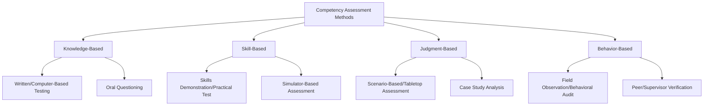
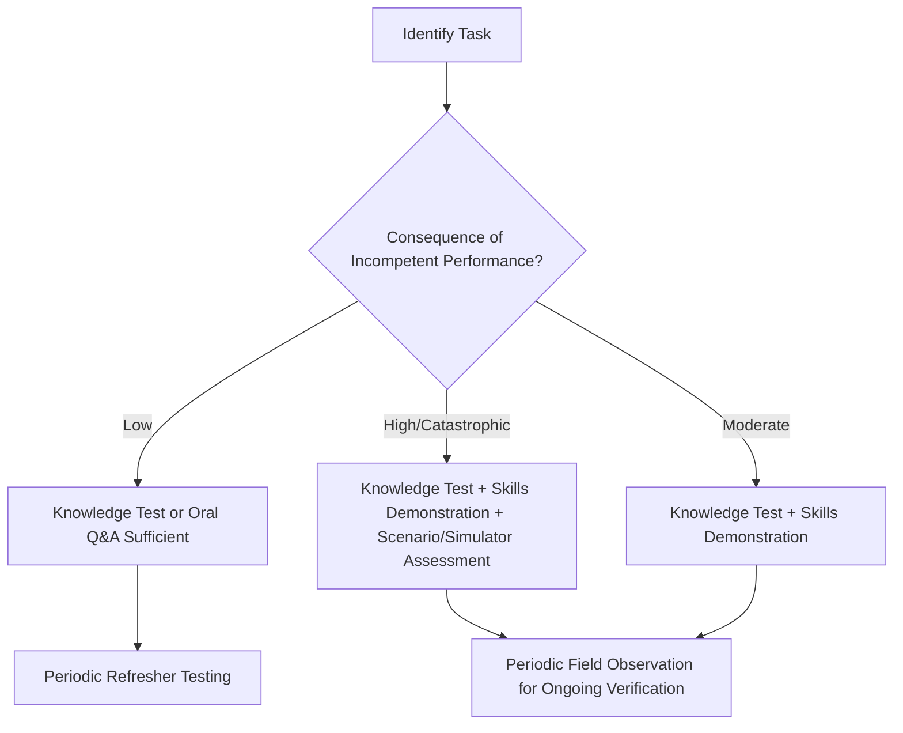

## Competency Assessment Methods

### Overview and Purpose

Competency Assessment Methods are the structured techniques used to verify that an individual can reliably and safely perform a job task, as distinct from merely having attended training on that task. Where training programs focus on knowledge and skill transfer, competency assessment focuses on demonstrated, verifiable capability — closing the gap between "was taught" and "can do."

**Key Points**

- Competency is defined by demonstrated performance under realistic conditions, not by course attendance or time-in-role alone
- Different assessment methods verify different competency domains: knowledge, physical skill, judgment/decision-making, and behavior under pressure
- A robust competency assurance system typically combines multiple assessment methods rather than relying on a single method for high-consequence tasks
- Competency assessment is a recurring process (periodic reassessment), not a one-time gate at hiring

### Regulatory and Standards Basis

- **OSHA 29 CFR 1910.119(g)(2)** — Requires the employer to "ascertain that the employee has received and understood" training, which in practice necessitates some form of competency verification beyond attendance.
- **OSHA 29 CFR 1910.147(c)(7)** — LOTO training requires demonstrated understanding of the purpose and function of the energy control program and the skills required for safe application.
- **CCPS Risk Based Process Safety (RBPS)** — Explicitly separates "Training and Performance Assurance" as a distinct pillar, emphasizing competency verification as a management system activity rather than an HR administrative task.
- **API RP 2200 / API RP 750 (historical)** and various API training-related guidance documents — Referenced in industry practice for verifying operator competency in petroleum operations.

[Inference] OSHA's PSM standard does not prescribe a specific competency assessment methodology, only the outcome (verified understanding); the specific assessment techniques described below reflect common industry practice derived from CCPS guidance and general training/competency literature rather than a single mandated regulatory method.

### Competency Domains

| Domain | Description | Example |
| --- | --- | --- |
| Knowledge | Understanding of facts, procedures, regulations, hazards | Knowing the LEL threshold requiring entry suspension |
| Skill | Physical or technical ability to execute a task correctly | Correctly applying a lockout device and verifying zero energy |
| Judgment | Ability to apply knowledge/skill appropriately under varying or ambiguous conditions | Recognizing when a permit should be suspended due to changed conditions |
| Behavior | Consistent application of safe practices under normal and pressured conditions | Following procedure steps in sequence even under time pressure |

Assessment methods vary in how well they capture each domain; a written test verifies knowledge effectively but poorly captures judgment or behavior under pressure, which typically require observation-based or scenario-based methods.

### Overview of Assessment Methods

### Written and Computer-Based Testing

**Application** — Verifying knowledge of facts, regulatory requirements, procedural steps, and hazard recognition.

**Design principles:**

- Questions should map directly to specific, identified competency requirements (not generic industry trivia)
- A defined passing threshold (e.g., 80%) should be established and consistently applied
- Question banks should be periodically refreshed to prevent rote memorization of specific answer patterns
- Should be paired with skill or observation-based methods for tasks involving physical execution, since a written test alone cannot verify hands-on capability

**Limitation** — A worker can pass a written test on LOTO principles while still applying a lock incorrectly in the field; written testing alone is insufficient for high-consequence physical tasks.

### Skills Demonstration / Practical Testing

**Application** — Verifying the ability to physically and correctly execute a defined task, such as applying LOTO devices, donning PPE, performing atmospheric testing, or completing a permit correctly.

**Typical structure:**

1. A qualified evaluator observes the individual perform the task under realistic (often actual or near-actual) conditions
2. A structured checklist identifies specific critical steps that must be performed correctly (not merely "completed a task" but specific sub-steps verified individually)
3. Pass/fail (or competency levels) is determined based on correct performance of critical steps, with remediation for any missed or incorrectly performed step

**Example**

A maintenance technician's LOTO competency is assessed via practical demonstration:

1. Evaluator presents a specific piece of equipment requiring isolation.
2. Technician is observed identifying all energy sources (electrical, mechanical, stored) without prompting.
3. Technician isolates each source, applies personal lock and tag, and performs try-out/verification.
4. Evaluator checks each step against a structured checklist: correct energy source identification, correct device application, correct verification method used, correct sequence followed.
5. Any missed step (e.g., failure to identify a secondary stored-energy source) results in a "not yet competent" determination and targeted remediation before reassessment.

### Simulator-Based Assessment

**Application** — Particularly valuable for control room operators, where realistic hands-on assessment on the live process is not feasible or safe, and for emergency response scenarios that cannot be practiced live.

**Typical structure:**

- A dynamic process simulator replicates the actual unit's control system and process behavior
- Scenarios include normal startup/shutdown, abnormal situations (equipment failure, alarm floods), and emergency conditions (loss of containment, runaway reaction indicators)
- Assessors evaluate both correct actions taken and time-to-recognition/response for critical scenarios
- Provides a controlled, repeatable environment for assessing judgment and behavior under realistic pressure without process risk

[Inference] The fidelity and availability of dynamic process simulators varies considerably by facility investment level and process complexity; smaller or older facilities may rely more heavily on tabletop or paper-based scenario assessment rather than full dynamic simulation, so the specific simulator capability available should be confirmed against actual facility infrastructure rather than assumed.

### Scenario-Based / Tabletop Assessment

**Application** — Assessing judgment and decision-making for situations that are infrequent, high-consequence, or impractical to simulate physically (e.g., emergency shutdown decision-making, incident command activation).

**Typical structure:**

- A facilitator presents an evolving scenario verbally or via written injects
- The individual or team describes the actions they would take at each decision point
- Facilitator evaluates the quality, sequencing, and appropriateness of decisions against expected/correct responses
- Often used for emergency response teams, shift supervisors, and incident commanders

### Field Observation / Behavioral Assessment

**Application** — Verifying that competency demonstrated in a controlled assessment setting translates into consistent behavior during actual day-to-day work, capturing behavior under normal (not staged) conditions.

**Typical structure:**

- Trained observers (supervisors, peer observers, or dedicated behavioral safety program personnel) periodically observe workers performing routine tasks
- Observations focus on adherence to procedures, correct use of PPE, and appropriate hazard recognition/response
- Data is often aggregated across the workforce to identify systemic competency gaps or drift, feeding back into training needs analysis

[Inference] Field observation programs (sometimes implemented as formal Behavior-Based Safety, or BBS, programs) vary widely in design maturity across organizations; their effectiveness as a competency assessment tool depends heavily on observer training quality and a non-punitive program culture, both of which are facility-specific factors rather than guaranteed outcomes of implementing an observation program.

### Peer and Supervisor Verification

**Application** — A supplementary or interim method where an experienced, qualified peer or supervisor formally attests to an individual's demonstrated competency based on direct working experience, often used to support formal assessment findings or bridge periods between formal assessments.

**Limitation** — Subject to inconsistency between evaluators and potential for informal standards drift; generally used to complement, not replace, structured formal assessment for high-consequence competencies.

### Selecting Assessment Methods by Task Criticality

As a general design principle: the higher the consequence of incompetent performance, the more assessment methods should be layered, and the more frequently competency should be reverified.

### Documentation and Recordkeeping

Effective competency assessment programs document, at minimum:

- Individual identity and role/task assessed
- Assessment method(s) used
- Date of assessment and assessor identity
- Specific pass/fail criteria and outcome, including any critical steps missed
- Remediation actions taken and date of successful reassessment (if applicable)
- Scheduled date for next reassessment

This documentation supports both regulatory compliance (1910.119(g)(2) understanding verification) and internal audit/incident investigation needs, since competency records are frequently reviewed following an incident to determine whether inadequate competency assurance was a contributing factor.

### Common Failure Modes

- **Over-reliance on written testing** for tasks that fundamentally require physical skill or judgment verification
- **Pass/fail thresholds not tied to critical steps** — allowing a technician to "pass" despite missing a safety-critical sub-step because the overall score exceeded the threshold
- **Assessment as a one-time hiring gate** rather than a recurring process, allowing skill decay to go undetected over time
- **Inconsistent evaluator standards**, particularly in peer/supervisor verification without structured checklists
- **Assessment content not updated** after procedure changes, equipment modifications, or incident learnings, leaving workers "competent" against an outdated standard
- **No link between assessment and authorization** — individuals working on tasks without formal confirmation that assessment was completed and passed

[Inference] Incident investigations that identify "inadequate training" as a contributing factor frequently reveal, on closer examination, that formal training had occurred but competency was never adequately verified through skills demonstration or observation — suggesting that the assessment gap, rather than the training delivery itself, is often the more precise root cause in such findings.

### Integration with Other PSM Elements

- **Initial and Refresher Training Programs** — Assessment is the verification mechanism that closes the loop on training delivery; training without assessment cannot confirm understanding was achieved.
- **Permit to Work Systems** — Permit issuer, receiver, and attendant authorization should be gated by documented competency assessment for those specific roles.
- **Operating Procedures** — Assessment content and pass criteria should be directly derived from current written procedures to ensure alignment.
- **Incident Investigation** — Competency records are commonly reviewed during investigations to determine whether a competency gap contributed to the event, and findings often drive assessment program revisions.
- **Management of Change** — Significant process or procedure changes should trigger a review of whether existing competency assessments remain valid or require updating.
- **Mechanical Integrity** — Inspection and testing personnel competency (e.g., NDT technician certification) often involves third-party or industry-recognized certification bodies in addition to internal assessment.

### Conclusion

Competency Assessment Methods provide the evidence that training has translated into reliable, safe job performance. Because no single method adequately captures knowledge, skill, judgment, and behavior simultaneously, robust programs layer multiple methods proportional to task consequence, document outcomes rigorously, and treat assessment as a recurring verification process rather than a one-time credentialing event.

**Related Topics**

- Initial and Refresher Training Programs
- Permit to Work Systems
- Operating Procedures Development and Maintenance
- Incident Investigation and Root Cause Analysis
- Behavior-Based Safety Programs
- Emergency Response Training and Drills
- Management of Change (MOC)
- Process Safety Culture and Leading Indicators
- Contractor Safety Management