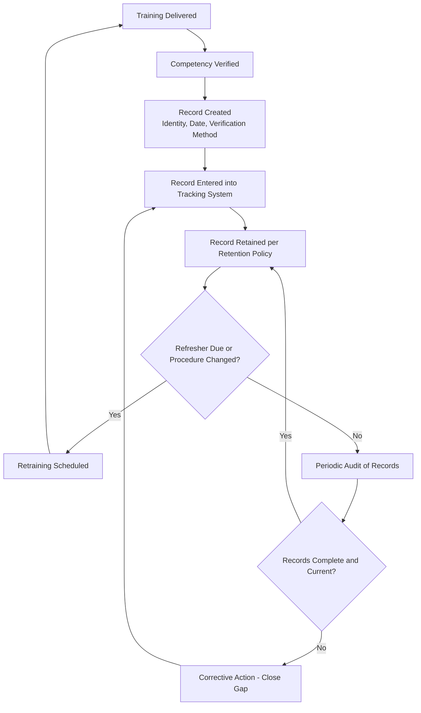
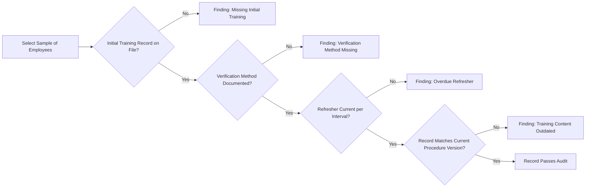

## Training Documentation and Recordkeeping

### Overview and Purpose

Training Documentation and Recordkeeping is the systematic capture, retention, and management of records evidencing that employees and contractors received required training and demonstrated understanding. These records serve as the primary evidence base for regulatory compliance, internal audits, incident investigations, and ongoing competency management — without adequate documentation, even well-delivered training cannot be verified or defended.

**Key Points**

- OSHA PSM explicitly requires documented evidence of training, not merely that training occurred
- Records must capture three specific elements: employee identity, date of training, and the means used to verify understanding
- Documentation gaps are among the most frequently cited findings in PSM compliance audits and OSHA inspections
- Records must be retained, retrievable, and organized in a way that supports both routine compliance verification and post-incident investigation

### Regulatory and Standards Basis

- **OSHA 29 CFR 1910.119(g)(3)** — Requires the employer to prepare a record containing the identity of the employee, the date of training, and the means used to verify that the employee understood the training.
- **OSHA 29 CFR 1910.147(c)(7)(ii)** — LOTO certification requirement, including employee identity and dates of training.
- **OSHA 29 CFR 1910.146(g)(4)** — Confined space entry training certification requirements, including employee name(s), signature/initials of trainer, and dates of training.
- **OSHA 29 CFR 1910.1020** — Access to Employee Exposure and Medical Records (relevant where training intersects with exposure monitoring or medical surveillance documentation retention).
- **OSHA 29 CFR 1910.119(h)** — Contractor-related documentation, including host employer verification of contractor training status.

[Inference] While OSHA specifies the minimum content required in training records (identity, date, verification method), it generally does not prescribe a specific record format, storage medium, or retention period beyond what is tied to the overall PSM recordkeeping requirements; facilities typically establish internal retention policies that meet or exceed the regulatory floor, and specific retention periods should be confirmed against applicable federal, state, and facility policy requirements.

### Required Record Elements

| Element | Description | Regulatory Basis |
| --- | --- | --- |
| Employee Identity | Full name and unique identifier (employee ID) | 1910.119(g)(3) |
| Training Date | Specific date(s) training was conducted | 1910.119(g)(3) |
| Verification Method | How understanding was confirmed (test score, demonstration checklist, etc.) | 1910.119(g)(3) |
| Training Content/Version | Which procedure version or curriculum version was covered | Best practice, not explicit regulatory text |
| Trainer/Evaluator Identity | Who delivered or verified the training | Common program requirement |
| Pass/Fail Result | Outcome of any competency verification | Best practice |
| Next Due Date | When refresher/reassessment is required | Best practice, supports tracking systems |

[Inference] Elements beyond the three explicitly named in 1910.119(g)(3) — such as content version, trainer identity, and next-due-date tracking — are widely adopted as best practice for defensible recordkeeping and effective tracking systems, but are not verbatim regulatory text requirements; they should be understood as program design enhancements rather than direct citations from the standard.

### Training Record Lifecycle

### Record Formats and Systems

**Paper-based records** — Signed training rosters, individual training cards, or completed assessment checklists filed in personnel or training files.

- Advantages: Simple, no technology dependency, direct signature evidence
- Limitations: Difficult to search/aggregate, vulnerable to loss/damage, harder to track upcoming due dates across a large workforce

**Electronic Learning Management Systems (LMS)** — Digital platforms that track course assignment, completion, test scores, and due dates automatically.

- Advantages: Automated due-date tracking and notifications, searchable/reportable, supports audit trail with timestamps, can integrate with HR systems for role-based assignment
- Limitations: Requires system validation for regulatory defensibility, dependent on data entry accuracy, may not natively capture hands-on skills demonstration without supplementary documentation

**Hybrid approach** — Many facilities combine an LMS for knowledge-based training tracking with paper or digital checklists for skills demonstration and field-verified competency, since practical/hands-on verification often occurs outside a pure e-learning environment.

[Unverified] Specific LMS platform capabilities, integration options, and validation requirements vary significantly by vendor and version; organizations selecting or auditing an LMS for PSM training recordkeeping should verify current features directly against their specific compliance and audit requirements rather than assuming standard functionality across all platforms.

### Documentation for Specific Training Types

**Example**

A facility's documentation package for a confined space entrant's training includes:

1. Enrollment record showing assignment to the "Confined Space Entrant" course, with due date
2. Completion record from the LMS showing date completed and knowledge test score (e.g., 92%)
3. A signed skills demonstration checklist from the field evaluator, itemizing specific steps verified (atmospheric testing procedure, use of retrieval equipment, communication protocol with attendant)
4. Trainer/evaluator name and signature on the skills checklist
5. Record of the specific confined space entry procedure version the training was based on
6. Calculated "next due" date based on the facility's refresher interval policy for this role
7. All records cross-referenced to the employee's unique ID and filed in both the LMS and, where a physical signature was required, a physical or scanned document repository

### Contractor Training Documentation

Per 1910.119(h)(2), host employers must maintain a contract employee injury and illness log related to the contractor's work in the process area, and must obtain evidence — though not necessarily conduct the training themselves — that contract employees have been trained appropriately. Documentation typically includes:

- Contractor's own training records or certificates for job-specific competencies (e.g., confined space, LOTO, hot work)
- Host facility's site-specific orientation completion record (covering facility hazards, emergency procedures, and site-specific rules)
- A pre-qualification or verification record showing the host reviewed and accepted the contractor's training documentation as adequate for the scope of work

### Retention Requirements and Practices

While OSHA does not specify a single blanket retention period for all training records under 1910.119(g), common practice and related regulatory drivers include:

- Retaining training records for the duration of employment plus a defined period after separation (facility policy-dependent)
- Retaining records related to specific regulated exposures (e.g., respiratory protection, hazardous materials) per applicable exposure/medical recordkeeping rules, which may carry longer retention periods (e.g., duration of employment plus 30 years under 1910.1020 for certain exposure records)
- Retaining the two most recent refresher training records at minimum to demonstrate an unbroken compliance history, though many facilities retain the full training history for the employee's tenure

[Inference] Retention period specifics differ depending on which regulatory driver applies (general PSM training vs. exposure-related training under 1910.1020) and by state/local requirements; a facility's document retention schedule should be confirmed against legal/EHS counsel guidance rather than assumed uniform across all training record types.

### Auditing Training Records

Training documentation is a standard focus area in both internal compliance audits and external PSM/OSHA inspections. Common audit checks include:

Auditors typically cross-reference a sample of employee records against the current authorized personnel list for specific tasks (e.g., confined space attendants, permit issuers) to confirm that everyone performing a role has current, documented, and verifiable training on file.

### Common Failure Modes

- **Missing verification method** — Records showing attendance or completion but no documented method confirming understanding (test score, checklist, sign-off)
- **Overdue refreshers not flagged** — Manual or poorly configured tracking systems failing to surface upcoming or overdue refresher deadlines
- **Records not linked to procedure version** — Inability to demonstrate which version of a procedure an employee was trained on, complicating post-MOC or post-incident review
- **Contractor documentation gaps** — Host facility unable to produce evidence that contractor training was verified before work began
- **Fragmented recordkeeping** — Skills demonstration checklists stored separately (or not at all) from LMS completion records, making it difficult to produce a complete competency picture during audit or investigation
- **Records lost during personnel or system transitions** — Data not migrated correctly during an LMS platform change or HR system transition

[Inference] Training documentation gaps — particularly missing verification-of-understanding evidence and overdue refresher tracking — are consistently among the most frequently cited findings in PSM compliance audits across the process industries, which is broadly consistent with why explicit, itemized recordkeeping requirements are emphasized as a distinct program element rather than treated as an administrative afterthought to training delivery.

### Integration with Other PSM Elements

- **Initial and Refresher Training Programs** — Documentation is the evidentiary record that training delivery and refresher cycles are actually occurring as designed.
- **Competency Assessment Methods** — Assessment outcomes (test scores, skills checklists, scenario evaluation results) are the core content that training records must capture.
- **Permit to Work Systems** — Permit issuer, receiver, and attendant authorizations should be traceable to a documented, current training record for that specific role.
- **Management of Change** — Procedure or equipment changes that trigger retraining requirements should generate a documented linkage between the MOC record and the affected employees' updated training records.
- **Incident Investigation** — Training records are routinely pulled during investigations to determine whether a competency or training gap contributed to the event; incomplete records can significantly complicate root cause determination and regulatory response.
- **Contractor Management** — Contractor training documentation verification is a core, auditable component of the contractor pre-qualification and site access process.

### Conclusion

Training Documentation and Recordkeeping transforms training activity into defensible, auditable evidence of workforce competency. Reliable systems capture not just that training occurred but how understanding was verified, link records to the specific procedure version taught, and maintain accurate, accessible tracking of refresher due dates — gaps in any of these areas are among the most common findings when PSM programs are audited or scrutinized following an incident.

**Related Topics**

- Initial and Refresher Training Programs
- Competency Assessment Methods
- Permit to Work Systems
- Contractor Safety Management
- Management of Change (MOC)
- Incident Investigation and Root Cause Analysis
- PSM Compliance Auditing
- Process Safety Culture and Leading Indicators
- Recordkeeping Requirements Under OSHA 1910.119