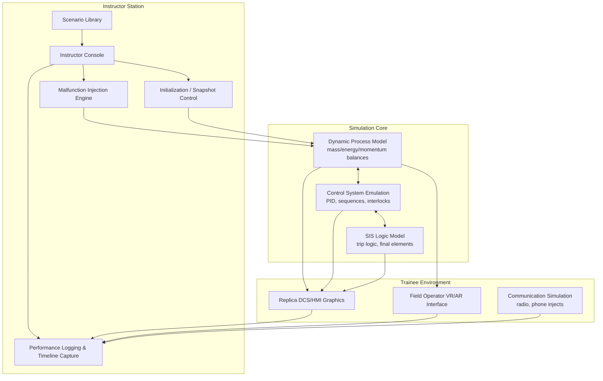

## Simulation and Scenario-Based Training

### Overview

Simulation and scenario-based training (SBT) is a competency assurance method in which personnel practice recognizing, diagnosing, and responding to process conditions — including abnormal and emergency situations — in an environment that replicates real plant behavior without exposing personnel, equipment, or the public to actual risk. Within Process Safety Management (PSM), SBT is the primary mechanism for closing the gap between declarative knowledge ("what the procedure says") and procedural/tacit competency ("what an operator actually does under time pressure, incomplete information, and cognitive load").

SBT spans a spectrum of fidelity:

- **Full-scope dynamic process simulators** — high-fidelity, first-principles or hybrid models of an entire unit, replicating control room DCS/HMI graphics, alarm behavior, and process dynamics in real time or faster-than-real-time.
- **Part-task trainers** — lower-fidelity simulators focused on a single subsystem (e.g., a compressor surge control loop, a relief system).
- **Tabletop/desktop scenario exercises** — facilitator-led walkthroughs of emergency response, incident command, or shutdown decision sequences without a running dynamic model.
- **Field/mockup drills** — physical simulation using training rigs, mock-ups, or de-energized equipment (e.g., confined space rescue, LOTO practice, SCBA donning under stress).
- **Virtual reality (VR) / augmented reality (AR) simulation** — immersive 3D environments for field operator walkdowns, valve lineups, and hazard recognition.

### Regulatory and Standards Basis

- **OSHA PSM (29 CFR 1910.119(g))** — requires initial training to ensure employees understand and can safely operate the process, and refresher training at least every three years, or more often if necessary. While OSHA does not mandate simulation specifically, "operating the process" competency is interpreted by enforcement and industry consensus to require more than classroom instruction for high-hazard, low-frequency scenarios.
- **API RP 770** (Guidelines for Process Hazards Analysis and Risk-Based Process Safety) and **API RP 750/754** — support competency assurance programs including simulation for high-consequence tasks.
- **CCPS Risk Based Process Safety (RBPS)** — lists "Training and Performance Assurance" as one of the 20 RBPS elements; CCPS guidance explicitly identifies dynamic simulation as a best practice for abnormal situation management (ASM) training.
- **ASM Consortium** guidance — much of the empirical basis for simulator-based abnormal-situation training comes from ASM Consortium research on operator response to upsets.
- **IEC 61511 / ISA 84** — competency requirements for personnel involved in SIS design, maintenance, and operation reference training including simulation of failure scenarios.
- **Seveso III Directive (EU)** — requires demonstrable competence for safety-critical roles, commonly implemented through simulator-based assessment for major hazard sites.

### Why Classroom Training Alone Is Insufficient

**Key Points**

- Declarative knowledge (facts, procedures) does not reliably transfer to procedural skill (timely, correct action) under stress.
- Low-frequency, high-consequence events (e.g., loss of containment, runaway reaction, compressor surge) are — by definition — rarely experienced on the job, so the plant itself cannot serve as the training ground.
- Cognitive skills specific to abnormal situation management — situation awareness, diagnosis under uncertainty, prioritization amid alarm floods — are not exercised by routine operation.
- Post-incident investigations (e.g., Texas City 2005, Buncefield 2005, Macondo 2010) repeatedly identify inadequate recognition of abnormal conditions and delayed/incorrect operator response as causal or contributing factors, which simulation-based training is specifically designed to address.

### Simulator Fidelity Classification

| Level | Description | Typical Use |
| --- | --- | --- |
| Level 1 — Conceptual/Tabletop | No dynamic model; facilitator narrates scenario evolution | Emergency response planning, ICS training, PHA scenario review |
| Level 2 — Part-Task Trainer | Simplified dynamic model of one system/loop | New operator skill building, specific procedure practice |
| Level 3 — Generic Full-Scope | Representative but not unit-specific DCS graphics/dynamics | Basic DCS navigation, alarm response fundamentals |
| Level 4 — Unit-Specific High-Fidelity | First-principles dynamic model matched to as-built P&IDs, control logic, and actual DCS graphics | Console operator qualification, ASM training, shutdown/startup rehearsal |
| Level 5 — Immersive/VR Field | 3D virtual environment with haptic/spatial interaction | Field operator walkdowns, hazard recognition, confined space/rescue drills |

### Core Components of a High-Fidelity Process Simulator

1. **Process model** — dynamic, first-principles (mass/energy/momentum balances) or hybrid empirical model representing unit thermodynamics, reaction kinetics, and hydraulics.
2. **Control system emulation** — replicates the actual DCS logic (or a faithful copy of the configuration), including PID tuning, interlocks, sequences, and alarm rationalization settings.
3. **Operator interface** — the actual (or replica) HMI graphics used in the control room, so muscle memory and graphic navigation transfer directly.
4. **Instructor Station** — allows a trainer to:
   - Initialize the simulation at a defined plant state (steady-state, startup, shutdown, or degraded condition).
   - Inject malfunctions (e.g., valve stuck, sensor drift/failure, pump trip, external upset such as feed composition change).
   - Freeze, fast-forward, or reset the simulation.
   - Monitor trainee actions in real time and log a timeline for debrief.
5. **Safety Instrumented System (SIS) model** — simulates SIS logic solvers, trip logic, and final elements so trainees experience correct (and incorrect) SIS response.
6. **Scenario library** — pre-built and custom malfunction scenarios mapped to the site's Layer of Protection Analysis (LOPA) and PHA findings.

### Scenario Design Methodology

**Key Points**

- Scenarios should be derived from documented risk sources, not invented ad hoc, to ensure training addresses actual credible hazards.
- Primary sources for scenario content:
  - Process Hazard Analysis (PHA/HAZOP) deviation nodes and identified causes
  - Layer of Protection Analysis (LOPA) initiating events
  - Incident investigation findings (site-specific and industry near-miss/incident databases, e.g., CSB reports)
  - Management of Change (MOC) records for recently modified systems
  - Safety Instrumented Function (SIF) proof-test and demand history

**Scenario Design Elements**

- **Initiating event** — the deviation or equipment failure that starts the scenario (e.g., cooling water pump trip, control valve fails closed, instrument air loss).
- **Propagation path** — how the process responds absent intervention (rate of temperature rise, pressure buildup, level trend).
- **Available cues** — alarms, trends, and field indications the trainee should use to diagnose the condition (deliberately calibrated to be realistic, including nuisance alarms or masking conditions).
- **Time-to-consequence window** — the realistic time available before the event reaches an unsafe/loss-of-containment state, used to assess trainee response timeliness.
- **Expected correct response** — the procedure-consistent action sequence (may include emergency shutdown, isolation, or the decision to NOT intervene and let a protection layer function).
- **Distractors** — secondary alarms or non-critical anomalies injected to test prioritization under alarm flood conditions, consistent with ASM/EEMUA 191 alarm management principles.

### Example Scenario: Exothermic Reactor Runaway

**Example**

*Initiating event:* Agitator motor overload trip on a batch exothermic reactor mid-addition.

*Propagation:* Loss of mixing causes local hot-spotting; reaction heat accumulates faster than the jacket can remove it; temperature trend begins to deviate from the normal cooling curve.

*Cues provided:* Agitator amp reading drops to zero; reactor temperature trend inflects upward; jacket ΔT alarm; (distractor) unrelated low-priority alarm on a parallel unit's cooling tower fan.

*Expected response sequence:*

1. Recognize agitator trip and correlate to loss of mixing (not a simple sensor fault).
2. Stop reagent addition immediately per procedure.
3. Verify/initiate emergency cooling (jacket cooling max, or emergency quench addition per SOP).
4. Monitor for approach to the Safety Instrumented Function (SIF) high-high temperature trip setpoint; do not defeat or bypass the SIS.
5. If temperature continues to rise toward the trip point, allow the SIF to actuate and confirm effective action (e.g., quench dump valve opens).
6. Notify shift supervisor and log per site upset-reporting procedure.

*Instructor evaluation criteria:* time from alarm to reagent-addition stop, correct sequencing of manual vs. automatic protection layers, whether the trainee attempted to silence/bypass the SIF (a critical failure), and communication/escalation behavior.

### Delivery Formats

**Individual Console Training**

- Single trainee operates the simulated DCS console for procedure practice (startup, shutdown, grade change) and single-fault malfunction response.

**Team/Crew Simulation**

- Full shift crew (console operator, outside/field operator, shift supervisor) trained together, exercising communication protocols, field verification, and command structure — critical because many incidents involve coordination failures, not just individual error.

**Emergency Response Tabletop Exercises**

- Incident Command System (ICS) roles exercise decision-making for evacuation, mutual aid activation, and public notification using scripted scenario injects without a running process model.

**Full-Scale/Functional Drills**

- Physical enactment of emergency response (fire brigade deployment, rescue, spill containment) integrated with simulated or real (de-energized) equipment.

**VR/AR Field Scenarios**

- Field operators practice hazard recognition (e.g., identifying an improperly aligned valve, missing PPE compliance in a simulated confined space entry) in an immersive environment before first real-world exposure.

### Instructional Design Principles

**Key Points**

- **Progressive complexity** — begin with single-fault scenarios in normal operating envelopes; advance to multiple-fault, degraded-protection-layer scenarios only after baseline competency is demonstrated.
- **Realistic pacing** — simulations should run in real time (or a justified compressed timescale) so trainees experience authentic decision-window pressure; over-compression undermines transfer of timing-critical skills.
- **Debrief structure** — after-action review comparing trainee actions against a timeline log, focusing on situation awareness (what did you know, when did you know it), decision rationale, and procedure adherence — not just outcome.
- **Psychological safety** — scenarios (especially failure scenarios) must be run in a blame-free learning environment to encourage honest reporting of near-misses and knowledge gaps during debrief.
- **Spaced repetition** — low-frequency/high-consequence scenarios should be revisited periodically (not one-time), since skill decay for rarely-used procedures is well documented.

### Competency Assessment Integration

- Simulator performance can feed into a formal **Training and Competency Matrix**, documenting pass/fail or proficiency ratings per scenario type per individual, supporting PSM §1910.119(g) documentation requirements.
- Objective performance metrics captured by the instructor station typically include:
  - Time to alarm acknowledgment
  - Time to correct diagnostic conclusion
  - Time to initiate correct corrective action
  - Number of incorrect/unnecessary actions
  - Whether safety-critical protection layers were bypassed or defeated
- Assessment should distinguish **procedural compliance** (did the trainee follow the SOP) from **outcome success** (did the scenario resolve safely), since a correct decision can still lead to a poor outcome due to scripted equipment failure, and vice versa — outcome alone is [Inference] considered a less reliable competency indicator by ASM Consortium research than process-of-response evaluation.

### Malfunction Injection Categories

| Category | Examples |
| --- | --- |
| Instrument faults | Sensor drift, frozen/stuck reading, transmitter failure high/low |
| Final element faults | Valve stuck (open/closed), actuator failure, positioner fault |
| Equipment failures | Pump trip, compressor surge, heat exchanger fouling, agitator failure |
| Utility upsets | Loss of instrument air, loss of cooling water, power dip/loss |
| Process disturbances | Feed composition change, feed rate upset, catalyst deactivation |
| SIS/protection layer faults | SIF fails to actuate on demand, spurious trip, sensor common-cause failure |
| Human factors stressors | Alarm flood, communication breakdown injects, simultaneous multi-unit upsets |

### Simulator Architecture (Conceptual)



### Data Flow: Scenario Lifecycle (svg_diagram)

<svg xmlns="http://www.w3.org/2000/svg" viewBox="0 0 900 260" font-family="sans-serif">
<text x="450" y="20" font-size="15" font-weight="bold" text-anchor="middle">Scenario Lifecycle (svg_diagram)</text>
<g font-size="12">
<rect x="10" y="60" width="140" height="60" rx="6" fill="#e8f0fe" stroke="#4472c4" />
<text x="80" y="85" text-anchor="middle">PHA / LOPA /</text>
<text x="80" y="100" text-anchor="middle">Incident Data</text>



```
<rect x="185" y="60" width="140" height="60" rx="6" fill="#e8f0fe" stroke="#4472c4" />
<text x="255" y="85" text-anchor="middle">Scenario</text>
<text x="255" y="100" text-anchor="middle">Design &amp; Build</text>

<rect x="360" y="60" width="140" height="60" rx="6" fill="#e8f0fe" stroke="#4472c4" />
<text x="430" y="85" text-anchor="middle">Simulator</text>
<text x="430" y="100" text-anchor="middle">Validation Run</text>

<rect x="535" y="60" width="140" height="60" rx="6" fill="#fff2cc" stroke="#bf8f00" />
<text x="605" y="85" text-anchor="middle">Trainee</text>
<text x="605" y="100" text-anchor="middle">Execution</text>

<rect x="710" y="60" width="150" height="60" rx="6" fill="#e2efda" stroke="#548235" />
<text x="785" y="85" text-anchor="middle">Debrief &amp;</text>
<text x="785" y="100" text-anchor="middle">Assessment Record</text>

<line x1="150" y1="90" x2="183" y2="90" stroke="#333" stroke-width="1.5" marker-end="url(#arrow)" />
<line x1="325" y1="90" x2="358" y2="90" stroke="#333" stroke-width="1.5" marker-end="url(#arrow)" />
<line x1="500" y1="90" x2="533" y2="90" stroke="#333" stroke-width="1.5" marker-end="url(#arrow)" />
<line x1="675" y1="90" x2="708" y2="90" stroke="#333" stroke-width="1.5" marker-end="url(#arrow)" />

<path d="M785,120 C785,170 255,170 255,122" fill="none" stroke="#c00000" stroke-width="1.3" stroke-dasharray="5,3" marker-end="url(#arrow)" />
<text x="520" y="185" text-anchor="middle" fill="#c00000">Debrief findings feed scenario library refinement</text>
```

</g>
</svg>

### Common Implementation Pitfalls

- **Simulator drift** — the dynamic model or DCS graphics are not kept synchronized with as-built plant changes (MOC updates not reflected), causing negative training (trainees learn incorrect plant behavior). Simulator configuration should itself be under Management of Change control.
- **Scenario staleness** — reusing the same small scenario set repeatedly, allowing trainees to memorize sequences rather than develop diagnostic skill.
- **Over-reliance on outcome pass/fail** — grading only whether the scenario "ended safely" rather than evaluating the decision process, which can reward correct outcomes reached by unsafe reasoning.
- **Insufficient team integration** — training console operators in isolation when most real events require console/field/supervisor coordination.
- **Fidelity mismatch** — using a generic (non-unit-specific) simulator for qualification decisions where unit-specific dynamics and graphics materially matter (e.g., ASM Consortium research indicates operator recognition performance is sensitive to graphic familiarity). [Inference — magnitude of the effect is unit- and population-dependent and should be validated against site-specific data rather than assumed.]

### Related Topics

- Alarm Management and Rationalization (EEMUA 191, ISA 18.2)
- Abnormal Situation Management (ASM) Principles
- Layer of Protection Analysis (LOPA) as a Scenario Source
- Safety Instrumented Systems (SIS) Proof Testing and Competency
- Emergency Response Planning and Incident Command System (ICS) Training
- Training and Competency Matrix Development
- Human Factors in Control Room Design
- Management of Change (MOC) for Training Systems and Simulators
- Operator Fundamentals and DCS Qualification Programs
- Near-Miss and Incident Investigation as Training Input