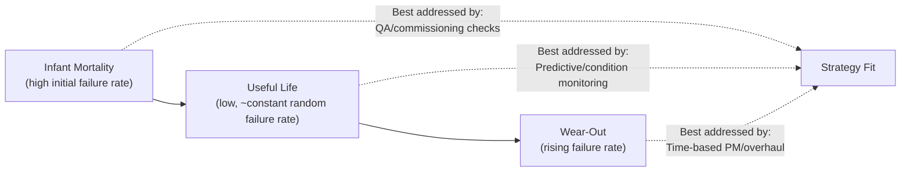

## Preventive and Predictive Maintenance

### Overview

Preventive Maintenance (PM) and Predictive Maintenance (PdM) are complementary maintenance strategies within Mechanical Integrity (MI) programs that intervene before equipment failure occurs, in contrast to reactive (run-to-failure) maintenance. Within Process Safety Management, PM and PdM are the operational mechanisms that translate inspection frequencies and RBI-derived risk rankings into actual maintenance work, keeping safety-critical equipment within its fitness-for-service envelope and reducing the probability of loss-of-containment events caused by undetected degradation.

- **Preventive Maintenance (PM):** Time-based or usage-based scheduled maintenance performed at fixed intervals regardless of current equipment condition (e.g., replace a pump seal every 3 years, lubricate a bearing every 90 days).
- **Predictive Maintenance (PdM):** Condition-based maintenance triggered by measured equipment condition data (vibration, temperature, oil analysis, thickness) trending toward a failure threshold, rather than a fixed calendar interval.

### Regulatory and Standards Context

**Key Points**

- OSHA PSM 1910.119(j) does not separately mandate "PM" or "PdM" by name; it requires written procedures for maintaining ongoing mechanical integrity (j)(2) and training of maintenance personnel (j)(3), with inspection/testing frequency requirements under (j)(4) — PM and PdM programs are the practical implementation mechanism for meeting these requirements on non-code-inspected equipment (e.g., rotating equipment, instrumentation) as well as for supporting code-based inspection findings.
- API 691 (Risk-Based Machinery Management) extends RBI-style risk ranking specifically to rotating equipment (pumps, compressors, turbines), guiding PM/PdM strategy selection by criticality.
- ISO 14224 provides a standardized taxonomy for reliability and maintenance data collection, supporting failure-mode analysis that informs PM/PdM task selection.
- CCPS Risk Based Process Safety identifies "Asset Integrity and Reliability" as an RBPS element encompassing both inspection-driven programs (API-code equipment) and PM/PdM programs (broader equipment population).

### Maintenance Strategy Spectrum

| Strategy | Trigger | Basis | Typical Equipment |
| --- | --- | --- | --- |
| Reactive (Run-to-Failure) | Equipment failure occurs | No planned intervention | Truly non-critical equipment where failure has no safety/environmental consequence |
| Preventive (Time/Usage-Based) | Fixed calendar or run-hour interval | OEM recommendation, historical failure data (MTBF) | Equipment with well-characterized, relatively constant failure-rate-with-time behavior |
| Predictive (Condition-Based) | Measured condition trend crosses threshold | Real-time or periodic condition monitoring data | Rotating equipment, equipment with detectable degradation precursors |
| Reliability-Centered Maintenance (RCM) | Failure Mode and Effects Analysis (FMEA)-derived task selection | Systematic analysis of failure modes, consequences, and detectability | Complex/critical systems where task-to-failure-mode matching materially reduces risk |

### Preventive Maintenance Program Elements

**Key Points**

- **Task derivation:** PM task lists and frequencies are typically derived from OEM manuals, industry MTBF (Mean Time Between Failure) data, and site-specific failure history — consistent with 1910.119(j)(4)(ii)'s requirement to consult manufacturer recommendations and adjust based on operating experience.
- **Common PM task types:**
  - Lubrication (grease/oil replenishment or replacement)
  - Filter and strainer cleaning/replacement
  - Belt/coupling alignment checks
  - Seal and gasket replacement on a fixed cycle
  - Calibration of instrumentation on a fixed schedule
  - Fixed-interval overhauls (e.g., pump rebuild at defined run-hours)
- **Limitations:** PM performed too infrequently risks undetected degradation between intervals; PM performed too frequently ("over-maintenance") can itself introduce failure modes — a well-documented phenomenon where unnecessary disassembly/reassembly (e.g., opening a pump seal that was performing acceptably) introduces new defects, sometimes called the "infant mortality" or "bathtub curve" effect of maintenance-induced failure.

### The Bathtub Curve and PM Interval Rationale

Equipment failure rate over time is often modeled with the bathtub curve — high initial failure rate (infant mortality, often from installation/manufacturing defects), a low, roughly constant failure rate during useful life (dominated by random failures poorly addressed by fixed-interval PM), and a rising failure rate as wear-out mechanisms dominate (where time-based PM is most effective).

This is why a purely time-based PM strategy is poorly matched to failure modes dominated by random events during the useful-life phase — PdM/condition monitoring is specifically effective there, since it detects the onset of an actual degradation trend rather than assuming a fixed wear-out timeline.

### Predictive Maintenance Technologies

**Key Points**

**Vibration Analysis**

- Monitors rotating equipment (pumps, compressors, turbines, motors) for bearing wear, misalignment, imbalance, and looseness via accelerometer-based frequency-domain analysis.
- Characteristic fault frequencies (bearing defect frequencies, blade-pass frequency, running speed harmonics) allow root-cause-specific diagnosis, not just "something is wrong."
- Can be continuous (online, permanently mounted sensors with real-time alarming) or route-based (portable data collector on a periodic walk-around).

**Thermography (Infrared Imaging)**

- Detects abnormal heat signatures from electrical connections (loose/high-resistance), bearing overheating, insulation degradation (refractory hot spots on fired equipment), and steam trap failure.

**Oil Analysis**

- Wear-metal analysis (spectrographic) identifies specific component wear (e.g., elevated iron indicating gear wear, elevated copper indicating bearing/bushing wear).
- Viscosity, water content, and particle counting assess lubricant degradation and contamination.

**Ultrasonic Testing (Online/Periodic)**

- Wall-thickness monitoring for corrosion/erosion trending (feeding the corrosion-rate calculations used in RBI and code-based inspection interval setting).
- Airborne/structure-borne ultrasonic detection of compressed air/gas leaks and early-stage bearing defects (before they appear in vibration spectra).

**Corrosion Monitoring Probes / Coupons**

- Electrical resistance (ER) and linear polarization resistance (LPR) probes provide near-real-time corrosion rate trending in-line, supplementing periodic UT inspection.

**Motor Current Signature Analysis (MCSA)**

- Detects rotor bar defects, mechanical unbalance, and coupling issues via analysis of the electric motor's current draw signature, useful where direct vibration sensor access is impractical.

**Acoustic Emission (AE)**

- Detects crack growth and active leakage in real time, useful for structural integrity monitoring and pressure boundary leak detection.

### PM/PdM Decision Framework: Reliability-Centered Maintenance (RCM)

**Key Points**

- RCM is a structured methodology (per SAE JA1011/JA1012) for selecting the most effective maintenance strategy per failure mode, rather than applying PM or PdM uniformly.
- RCM logic sequence for each identified failure mode:
  1. Is the failure mode safety- or environmentally-significant? → Maintenance task must reduce risk to an acceptable level, or a design change is required if no effective task exists.
  2. Is a condition-based (predictive) task technically feasible and cost-effective? → Prefer PdM if a measurable degradation precursor exists.
  3. If not, is a scheduled restoration/discard (time-based PM) task effective? → Use PM if failure is reasonably age-related.
  4. If no effective PM or PdM task exists → Run-to-failure may be acceptable only if the failure mode has no safety/environmental consequence.
- RCM explicitly prevents the common failure of applying blanket time-based PM to equipment whose failure modes are actually random (useful-life phase), where PM provides little risk reduction and may introduce maintenance-induced failures.

### Maintenance Strategy Selection Logic (svg_diagram)

<svg xmlns="http://www.w3.org/2000/svg" viewBox="0 0 900 320" font-family="sans-serif" font-size="12">
<text x="450" y="20" font-size="15" font-weight="bold" text-anchor="middle">RCM-Based Strategy Selection (svg_diagram)</text>
<rect x="350" y="45" width="200" height="45" rx="6" fill="#e8f0fe" stroke="#4472c4" />
<text x="450" y="72" text-anchor="middle">Identify Failure Mode</text>
<line x1="450" y1="90" x2="450" y2="120" stroke="#333" stroke-width="1.3" marker-end="url(#arrP)" />
<rect x="320" y="120" width="260" height="45" rx="6" fill="#fff2cc" stroke="#bf8f00" />
<text x="450" y="147" text-anchor="middle">Safety/Environmental Consequence?</text>
<line x1="450" y1="165" x2="200" y2="200" stroke="#333" stroke-width="1.3" marker-end="url(#arrP)" />
<text x="290" y="185" text-anchor="middle" font-size="10">Yes — must mitigate</text>
<line x1="450" y1="165" x2="700" y2="200" stroke="#333" stroke-width="1.3" marker-end="url(#arrP)" />
<text x="610" y="185" text-anchor="middle" font-size="10">No</text>
<rect x="60" y="200" width="280" height="45" rx="6" fill="#e2efda" stroke="#548235" />
<text x="200" y="220" text-anchor="middle">Detectable degradation precursor?</text>
<text x="200" y="236" text-anchor="middle" font-size="10">→ Predictive (condition-based) task</text>
<rect x="560" y="200" width="280" height="45" rx="6" fill="#deebf7" stroke="#2e74b5" />
<text x="700" y="220" text-anchor="middle">Age-related failure pattern?</text>
<text x="700" y="236" text-anchor="middle" font-size="10">→ Time-based PM if yes</text>
<line x1="200" y1="245" x2="200" y2="280" stroke="#333" stroke-width="1.3" marker-end="url(#arrP)" />
<rect x="60" y="280" width="280" height="35" rx="6" fill="#fce4d6" stroke="#c55a11" />
<text x="200" y="302" text-anchor="middle">No effective task → Design change</text>
<line x1="700" y1="245" x2="700" y2="280" stroke="#333" stroke-width="1.3" marker-end="url(#arrP)" />
<rect x="560" y="280" width="280" height="35" rx="6" fill="#fce4d6" stroke="#c55a11" />
<text x="700" y="302" text-anchor="middle">No consequence → Run-to-failure acceptable</text>
</svg>

### Integration with Mechanical Integrity and RBI

**Key Points**

- PM/PdM programs and RBI/API-code inspection programs are complementary, not redundant: RBI/API codes govern pressure-boundary integrity (thinning, cracking) on vessels/piping, while PM/PdM typically governs rotating equipment, instrumentation, and non-pressure-boundary components — though overlap exists (e.g., online UT thickness monitoring feeds both PdM trending and RBI corrosion-rate calculations).
- PdM data (vibration trends, oil analysis results) should feed into the site's risk ranking process for rotating equipment (e.g., under API 691 methodology), analogous to how inspection data feeds RBI for fixed equipment.
- Findings from PM/PdM activities that reveal a mechanical integrity deficiency (e.g., vibration analysis revealing an imminent seal failure that could release an HHC) must be managed through the same deficiency-correction process required under 1910.119(j)(5), including timely correction consistent with the identified risk.

**Example**

A centrifugal pump in flammable liquid service is monitored by continuous online vibration sensors. A gradual increase in a characteristic bearing-defect frequency amplitude is trended over several weeks, crossing an established alarm threshold well before audible or visible symptoms would appear. This triggers a planned work order to replace the bearing during the next available maintenance window — avoiding both an unplanned failure (which could compromise the mechanical seal and release process fluid) and unnecessary early replacement of a bearing that was still functioning within acceptable limits (avoiding over-maintenance).

### CMMS/EAM Integration

- PM task schedules (frequency-based work orders) and PdM alert thresholds are typically managed through a Computerized Maintenance Management System (CMMS) or Enterprise Asset Management (EAM) platform, linked to the equipment's asset record shared with the MI/RBI program.
- Failure history captured in the CMMS (failure codes, root cause, time-to-repair) is the primary data source for refining PM intervals and validating/adjusting PdM alarm thresholds over time.
- Work order closure documentation (as-found condition, parts replaced, root cause) should be structured to support both reliability engineering analysis and PSM audit traceability.

### Common Implementation Pitfalls

- **Static PM intervals never revalidated against actual failure history** — perpetuating an OEM-default interval regardless of site-specific operating conditions or accumulated failure data.
- **PdM alarm threshold fatigue** — setting thresholds too conservatively, generating frequent low-value alerts that lead personnel to discount genuine warnings (analogous to alarm flooding in process control).
- **Treating PdM data in isolation from MI/RBI** — failing to route significant PdM findings on safety-critical equipment through formal deficiency-management and risk-prioritization processes.
- **Maintenance-induced failure from unnecessary PM** — disassembling/reassembling equipment on a fixed schedule when condition monitoring shows no degradation, introducing new defects (gasket/seal reinstallation errors, contamination during rebuild).
- **Siloed rotating equipment vs. fixed equipment programs** — running PM/PdM and RBI as entirely separate organizational functions with no shared risk ranking or data exchange, missing opportunities to prioritize consistently across the full covered-equipment population.

### Related Topics

- Reliability-Centered Maintenance (RCM) Methodology (SAE JA1011/JA1012)
- Risk-Based Inspection (RBI) per API 580/581
- API 691 Risk-Based Machinery Management
- Vibration Analysis Fundamentals for Rotating Equipment
- Deficiency Correction and Timely Repair (1910.119(j)(5))
- CMMS/EAM Data Structuring for Reliability Engineering
- Mechanical Seal Reliability and Fugitive Emissions
- Failure Mode and Effects Analysis (FMEA)
- Quality Assurance for Replacement Parts and Equipment (1910.119(j)(3))
- Corrosion Monitoring Technologies (ER/LPR Probes, Online UT)