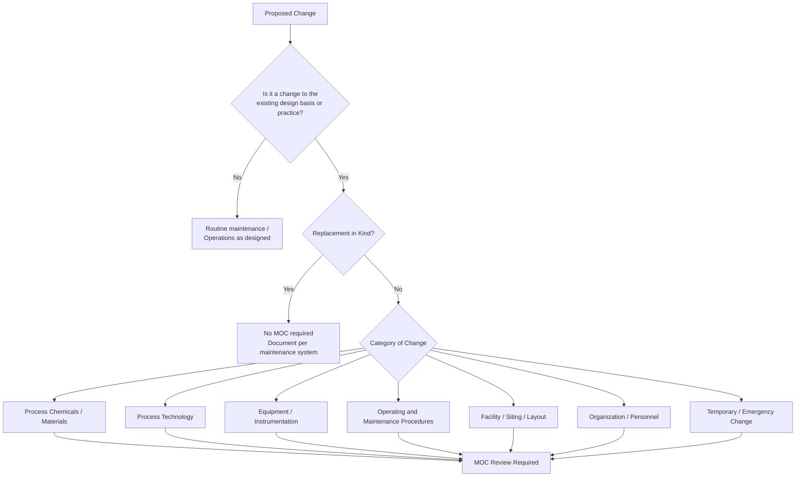

## Types of Change Requiring Review

### Purpose and Regulatory Context

Management of Change (MOC) is a formal, documented system for evaluating and approving modifications to a process **before** they are implemented. The central premise is that most serious process incidents trace back to changes that were made without adequate hazard evaluation. Knowing *which* changes trigger review is the entry point to the entire MOC system: if a change is not recognized as reviewable, none of the downstream safeguards (hazard analysis, approvals, training, documentation updates) occur.

The principal regulatory and consensus references are:

- **OSHA 29 CFR 1910.119(l)** (U.S. Process Safety Management standard): requires written procedures to manage changes to process chemicals, technology, equipment, and procedures, and changes to facilities that affect a covered process. It explicitly excludes "replacements in kind."
- **EPA 40 CFR 68.75** (Risk Management Program, Management of Change): parallel requirements for RMP-covered facilities.
- **CCPS Risk Based Process Safety (RBPS)** element "Management of Change": broader guidance, including organizational and temporary changes.
- **UK HSE / COMAH, EU Seveso III Directive**: require management of modifications to installations and processes.
- **API RP 750 / API RP 75 / ISO 45001**: industry and management-system guidance on change control.

**Key Points**

- A change requires review when it can alter the hazards, safeguards, operating envelope, or human performance assumptions established in the existing Process Hazard Analysis (PHA) and Process Safety Information (PSI).
- The default posture is inclusive: when in doubt, route the change into MOC screening rather than assuming it is exempt.
- The screening decision (is this a change, or a replacement in kind?) must itself be made by a defined, competent role and be traceable.

### Fundamental Definitions

| Term | Definition |
| --- | --- |
| **Change** | Any modification to the process, equipment, materials, procedures, organization, or facility that departs from the existing documented design basis or operating practice |
| **Replacement in Kind (RIK)** | A replacement that satisfies the original design specification (same materials, ratings, and function); not subject to MOC but still subject to good engineering and maintenance practice |
| **Temporary Change** | A change intended to be in place for a limited, defined duration, with a defined end date and a return-to-original-state plan |
| **Permanent Change** | A change intended to become the new baseline design or operating practice |
| **Emergency Change** | A change that must be implemented immediately to prevent injury, environmental release, or serious asset loss; handled by an expedited but still documented process |
| **Design Basis** | The documented engineering intent, limits, and assumptions on which the process was built and hazard-analyzed |

### The Core Categories of Change Requiring Review

The OSHA PSM standard names four core categories: **chemicals, technology, equipment, and procedures**. Modern practice (CCPS RBPS, company MOC standards) extends this to include **facilities, organization, and personnel** changes. A useful mental model:

### 1. Changes to Process Chemicals and Materials

Any alteration in the identity, composition, concentration, source, or quality of materials handled in the process can change reaction behavior, toxicity, flammability, corrosivity, compatibility, and disposal requirements.

**Typical triggers**

- Introducing a new raw material, intermediate, catalyst, solvent, or additive
- Changing supplier or grade of an existing chemical where impurity profiles differ
- Changing concentration (e.g., dilute vs. concentrated acid, changed inhibitor levels)
- Changing utility fluids (heat-transfer fluid, refrigerant, cooling water treatment chemicals)
- Changing cleaning agents, passivation chemicals, or lubricants that contact process materials
- Modifying product specification that changes downstream handling
- Changing inhibitor, stabilizer, or antifoam dosing
- Introducing recycled, reclaimed, or off-spec material into the process

**Why it matters**

Impurities can act as catalysts for runaway reactions, contaminants can cause corrosion or material embrittlement, and concentration shifts can move a mixture into a flammable or explosive range.

**Example**

A plant switches from a virgin solvent supplier to a lower-cost reclaimed solvent. The reclaimed grade contains trace peroxides not present in the original specification. Although the solvent name is unchanged, the hazard profile is not, so the change requires review.

### 2. Changes to Process Technology

Process technology includes the chemistry, process flow, operating limits, and control philosophy that define how the process behaves.

**Typical triggers**

- Changes in operating conditions outside the established **safe operating limits** (temperature, pressure, flow, level, composition)
- Changes to production rate or throughput (debottlenecking, capacity increase)
- Changes to reaction chemistry, stoichiometry, catalyst system, or batch recipe
- Changes to process flow (adding bypasses, changing sequence of unit operations, adding recycle streams)
- Changes to control strategy, alarm setpoints, interlock logic, or safety instrumented function (SIF) parameters
- Changes to relief system basis (e.g., new scenario, changed relieving rate, changed discharge destination)
- Changes to heat and material balances
- Changes in process modes (e.g., new startup or shutdown methodology)

**Key Points**

- Any change that moves operation outside the range analyzed in the PHA and documented in the PSI **must** be reviewed.
- Even changes *within* the design envelope may require review if they alter safeguards' effectiveness or independence.

**Example**

Raising throughput by 15% by increasing reactor feed rate. The existing pressure relief valve was sized for the original maximum relieving case. The change requires re-evaluation of relief capacity, heat-removal margin, and downstream separation capacity.

### 3. Changes to Equipment and Instrumentation

Equipment changes cover modifications to physical assets, materials of construction, and the control and safety systems that protect them.

**Typical triggers**

- Installing new equipment or removing existing equipment
- Modifying vessels, piping, or supports (nozzle additions, wall-thickness changes, re-rating)
- Changing materials of construction (metallurgy, gasket type, seal materials, elastomers)
- Substituting equipment that does not meet the original specification (not an RIK)
- Changing pump, compressor, or seal types
- Changing piping specification, valve type, or line size
- Adding or removing instruments, sensors, transmitters, or final control elements
- Modifying or bypassing safety instrumented systems, alarms, interlocks, or trips
- Changes to relief devices, flare headers, or vent systems
- Changes to electrical classification, grounding, or power supply arrangements
- Modification of fire protection or gas detection systems
- Software and firmware changes to distributed control systems (DCS), programmable logic controllers (PLC), and safety PLCs

**Replacement in Kind versus Change**

| Scenario | Classification | Rationale |
| --- | --- | --- |
| Replacing a failed gasket with identical spec | RIK | Same material and rating |
| Replacing carbon steel gasket with PTFE-envelope type | Change | Different material and performance characteristics |
| Replacing a pressure transmitter with same model | RIK | Same range and function |
| Replacing transmitter with different range or output type | Change | Alters measurement basis |
| Replacing a valve with different fail-position | Change | Alters failure-mode behavior |

**Example**

A control valve fails closed on loss of instrument air in the original design. During a repair, a valve with a fail-open actuator is installed because it is on the shelf. Even though physically identical in size, the failure mode is reversed, which can lead to loss of containment or overpressure. This is a change and not an RIK.

### 4. Changes to Operating and Maintenance Procedures

Procedures define how people interact with the process. Altering them changes human-system interaction risk.

**Typical triggers**

- Modifying standard operating procedures (SOPs), including startup, shutdown, normal, and emergency operations
- Changing operating limits or consequences-of-deviation guidance
- Modifying maintenance procedures, such as lockout/tagout, line breaking, hot work, or confined space entry
- Changes to safe work permit systems or work-authorization practices
- Changing inspection, testing, and preventive maintenance intervals or methods (mechanical integrity program)
- Changing emergency response procedures and shutdown philosophy
- Changing sampling, analysis, or laboratory methods that affect operating decisions
- Alteration of batch sequencing, charge order, or hold times

**Example**

A plant shortens the proof-test interval of a safety instrumented function from 12 months to 24 months because of a production schedule conflict. This affects the assumed probability of failure on demand and therefore the risk reduction claimed in the PHA, so it must be reviewed.

### 5. Changes to Facilities, Layout, and Siting

Facility changes alter the physical environment and the consequences of a release.

**Typical triggers**

- New buildings, occupied structures, control rooms, or temporary trailers near process units
- Changes to spacing, layout, or plot plan
- Changes to drainage, diking, or secondary containment
- Changes to ventilation, HVAC, or air intakes serving occupied areas
- Changes to fire water supply, deluge, or foam systems
- Changes affecting access and egress, emergency escape routes, or muster points
- Modification of hazardous-area classification boundaries

**Key Points**

- Facility siting changes should trigger a review of **occupied building risk** (for example, per API RP 752 / 753 guidance) because the consequence assessment for fire, explosion, and toxic release depends on the location of people.
- Temporary structures such as portable trailers and turnaround offices have historically been implicated in major incidents and should be treated as reviewable changes.

### 6. Organizational and Personnel Changes

This category is frequently overlooked but is explicitly recognized in RBPS and many company standards.

**Typical triggers**

- Restructuring of operations, maintenance, engineering, or safety roles
- Reductions in staffing levels, minimum crew, or shift coverage
- Changes to reporting lines affecting process safety accountability
- Outsourcing or contractor transitions
- Loss or reassignment of key competent personnel (e.g., unit engineer, process safety engineer)
- Changes to overtime, shift patterns, or fatigue-risk arrangements
- Merging or splitting operating units

**Rationale**

Process safety depends on human barriers: operators responding to alarms, supervisors authorizing work, engineers reviewing changes. If organizational changes reduce the capacity, competency, or independence of those barriers, the risk profile changes even though the physical plant is untouched.

**Example**

A site reduces night-shift control room staffing from three to two operators. Alarm response and simultaneous task workloads must be reassessed for credible upset scenarios.

### 7. Temporary Changes

Temporary changes are a common source of incidents because they can be implemented informally and then become de facto permanent.

**Typical triggers**

- Temporary hoses or jumpers replacing hard piping
- Bypassing an alarm, interlock, or instrument for a defined period
- Operating with a piece of equipment out of service (e.g., running a unit with a spare pump unavailable)
- Temporary process rate or composition changes for trials
- Temporary procedures for turnaround or commissioning
- Temporary relief or isolation arrangements

**Controls for temporary changes**

- Defined **start date and expiry date**
- Named owner accountable for restoration
- Documented compensating measures for any safeguard removed
- Automatic escalation if the time limit is exceeded
- Formal closeout, including verification that the process has returned to its original configuration

**Key Points**

- A temporary change is **not** exempt from MOC merely because it is temporary.
- Extensions of temporary changes should be re-reviewed, not silently renewed.

### 8. Emergency Changes

Some situations require rapid action to protect people or prevent a release. Systems should provide an expedited pathway rather than forcing personnel to bypass MOC entirely.

**Characteristics of a well-designed emergency MOC process**

- Clear criteria defining what qualifies as an emergency
- Authorization by a designated senior person (often the operations manager or on-call authority)
- Minimum required hazard review conducted immediately, even if abbreviated
- Full documentation and formal review completed retrospectively within a defined timeframe
- Communication to affected personnel before restart

### 9. Changes That Are Commonly Missed

The following are frequently not recognized as MOC triggers but have contributed to incidents:

- Software and firmware patches to control systems and safety systems
- Alarm rationalization or setpoint changes made in the DCS
- Changes in feedstock quality driven by purchasing decisions
- Substituting a "similar" spare part from the warehouse
- Adding equipment to a common header, flare system, or utility that was not evaluated for combined load
- Changes in inspection or repair methods (for example, adopting a different weld procedure)
- Cybersecurity-related modifications, such as network segmentation or remote access, that affect control-system availability
- Minor operating-window drift accepted through "normalization of deviance"

### Exclusions: Replacement in Kind

A replacement in kind is defined as replacing an item with one that satisfies the original design specification. It is **not** subject to formal MOC, but the following cautions apply:

- The person making the RIK decision must have access to the original design specification.
- Obsolescence, supplier substitution, and "equivalent" parts frequently drift from the original specification.
- Cumulative RIKs can add up to a de facto change over time (for example, repeated substitution of slightly different components).
- Many organizations require an **MOC screening checklist** even for RIK decisions so the determination is documented.

### Screening Questions (Practical Checklist)

A screening tool asks a short set of questions. If any answer is "yes" or "uncertain," the change proceeds to formal MOC.

1. Does the change alter the chemical, its concentration, or its source?
2. Does it move operation outside established safe operating limits?
3. Does it alter equipment specification, materials, function, or failure mode?
4. Does it change relief, venting, flare, or containment arrangements?
5. Does it modify, bypass, defeat, or change any safeguard (alarm, interlock, SIS, trip)?
6. Does it change an operating or maintenance procedure?
7. Does it affect the location, occupancy, or protection of people or structures?
8. Does it reduce staffing, training, or competency arrangements?
9. Is it temporary, and does it involve any of the above?
10. Would the change invalidate any assumption in the current PHA or PSI?

### Information Flow: What a Reviewable Change Triggers

### Illustration

<svg xmlns="http://www.w3.org/2000/svg" viewBox="0 0 720 360" width="720" height="360" role="img" aria-label="Types of change requiring review">
<title>Types of Change Requiring Review (svg_diagram)</title>
<rect x="0" y="0" width="720" height="360" fill="#f7f9fb" stroke="#c5ced8" />
<text x="360" y="28" text-anchor="middle" font-family="Arial, sans-serif" font-size="16" font-weight="bold" fill="#1f2d3d">Types of Change Requiring Review (svg_diagram)</text>
<rect x="270" y="150" width="180" height="60" rx="10" fill="#1f5f99" stroke="#123b61" />
<text x="360" y="176" text-anchor="middle" font-family="Arial, sans-serif" font-size="14" fill="#ffffff">MOC Review</text>
<text x="360" y="196" text-anchor="middle" font-family="Arial, sans-serif" font-size="12" fill="#ffffff">Trigger Decision</text>
<rect x="30" y="60" width="150" height="44" rx="8" fill="#e8f1fa" stroke="#1f5f99" />
<text x="105" y="87" text-anchor="middle" font-family="Arial, sans-serif" font-size="13" fill="#1f2d3d">Chemicals / Materials</text>
<rect x="285" y="50" width="150" height="44" rx="8" fill="#e8f1fa" stroke="#1f5f99" />
<text x="360" y="77" text-anchor="middle" font-family="Arial, sans-serif" font-size="13" fill="#1f2d3d">Process Technology</text>
<rect x="540" y="60" width="150" height="44" rx="8" fill="#e8f1fa" stroke="#1f5f99" />
<text x="615" y="87" text-anchor="middle" font-family="Arial, sans-serif" font-size="13" fill="#1f2d3d">Equipment / Instruments</text>
<rect x="30" y="160" width="150" height="44" rx="8" fill="#e8f1fa" stroke="#1f5f99" />
<text x="105" y="187" text-anchor="middle" font-family="Arial, sans-serif" font-size="13" fill="#1f2d3d">Procedures</text>
<rect x="540" y="160" width="150" height="44" rx="8" fill="#e8f1fa" stroke="#1f5f99" />
<text x="615" y="187" text-anchor="middle" font-family="Arial, sans-serif" font-size="13" fill="#1f2d3d">Facilities / Siting</text>
<rect x="30" y="260" width="150" height="44" rx="8" fill="#e8f1fa" stroke="#1f5f99" />
<text x="105" y="287" text-anchor="middle" font-family="Arial, sans-serif" font-size="13" fill="#1f2d3d">Organization / Staffing</text>
<rect x="285" y="270" width="150" height="44" rx="8" fill="#fff4e0" stroke="#c77700" />
<text x="360" y="297" text-anchor="middle" font-family="Arial, sans-serif" font-size="13" fill="#1f2d3d">Temporary Changes</text>
<rect x="540" y="260" width="150" height="44" rx="8" fill="#fdeaea" stroke="#b32d2d" />
<text x="615" y="287" text-anchor="middle" font-family="Arial, sans-serif" font-size="13" fill="#1f2d3d">Emergency Changes</text>
<line x1="180" y1="90" x2="290" y2="155" stroke="#1f5f99" stroke-width="1.5" />
<line x1="360" y1="94" x2="360" y2="150" stroke="#1f5f99" stroke-width="1.5" />
<line x1="540" y1="90" x2="430" y2="155" stroke="#1f5f99" stroke-width="1.5" />
<line x1="180" y1="182" x2="270" y2="182" stroke="#1f5f99" stroke-width="1.5" />
<line x1="540" y1="182" x2="450" y2="182" stroke="#1f5f99" stroke-width="1.5" />
<line x1="180" y1="282" x2="290" y2="205" stroke="#1f5f99" stroke-width="1.5" />
<line x1="360" y1="270" x2="360" y2="210" stroke="#c77700" stroke-width="1.5" />
<line x1="540" y1="282" x2="430" y2="205" stroke="#b32d2d" stroke-width="1.5" />
</svg>

### Worked Scenario: Applying the Screening Logic

**Scenario**

An operations team proposes the following bundle of actions during a single work order at a distillation unit:

1. Replace a failed level transmitter with the identical model and range.
2. Raise the high-level alarm setpoint by 5% to reduce nuisance alarms.
3. Install a temporary trailer 30 m from the unit for contractor supervision.
4. Change the reboiler heat-transfer fluid to a different brand of similar-grade oil.

**Analysis**

| Action | Classification | Reasoning |
| --- | --- | --- |
| 1. Replace transmitter (identical) | RIK, no MOC | Matches original specification |
| 2. Alarm setpoint change | Change, MOC required | Alters a safeguard's trigger point; may reduce operator response time |
| 3. Temporary trailer | Change, MOC required (facility siting) | Adds occupied structure within potential consequence zone |
| 4. Heat-transfer fluid substitution | Change, MOC required | Differing flash point, thermal stability, or compatibility must be verified |

**Conclusion**

Bundling multiple items into one work order does not merge their classification. Each element must be independently screened, and the presence of one RIK item must not be used to justify skipping review of the others.

### Common Failure Modes in Change Identification

- **Normalization**: small deviations are accepted repeatedly until the baseline effectively shifts.
- **Misclassifying as maintenance**: changes labeled as repairs bypass MOC.
- **Project-level blind spots**: capital projects manage the main scope but overlook peripheral changes (temporary utilities, control logic edits).
- **Ambiguous ownership**: no one is clearly authorized to declare a change reviewable.
- **Threshold arguments**: debate over whether a change is "big enough" delays or prevents review.
- **Contractor changes**: contractors alter methods or materials without the operator's MOC awareness.
- **Software changes handled by IT**: patches or updates managed outside the process safety system.

### Documentation Expectations for the Trigger Decision

For each proposed change, the screening record should capture:

- Description of the change and its purpose
- Category (or categories) of change
- Determination: MOC required, RIK, or exempt, with justification
- Name and role of the person making the determination
- Date and reference number
- Link to the affected PHA, P&IDs, and PSI
- Whether the change is temporary and, if so, its expiry date

**Conclusion**

Effective MOC begins with reliable recognition of what constitutes a change. The core categories (chemicals, technology, equipment, procedures) are extended in mature programs to include facilities, organization, personnel, temporary, and emergency changes. Because behavior of a specific site's MOC system depends on its governing regulations, company standards, and risk criteria, the exact thresholds and screening logic should be confirmed against the applicable jurisdictional requirements and the facility's own MOC procedure.

### Related Topics

- Replacement in Kind: Criteria and Documentation
- MOC Screening Tools and Checklists
- Technical Basis for Change
- Hazard Evaluation of Proposed Changes (HAZOP, What-If, Checklist)
- Temporary Change Controls and Expiry Management
- Emergency Change Procedures
- Organizational Change Assessment
- Pre-Startup Safety Review and MOC Closeout
- Updating Process Safety Information After Change
- Training and Communication of Changes to Affected Personnel
- MOC Software and Auditing of MOC Effectiveness
- Case Studies: Flixborough (1974) and Other Change-Related Incidents