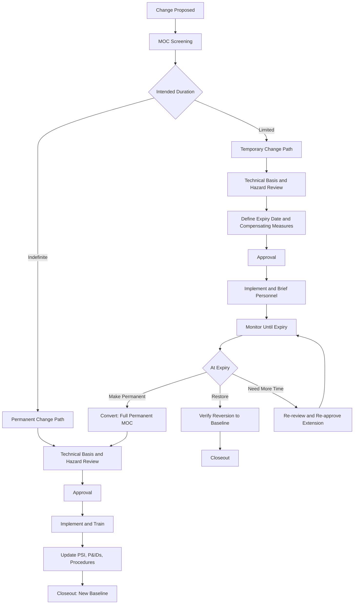
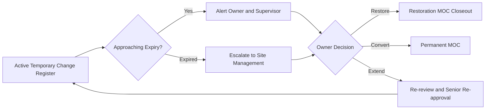

## Temporary versus Permanent Changes

### Purpose and Regulatory Context

Management of Change (MOC) applies to **every** modification of a covered process that is not a replacement in kind, regardless of how long the modification is expected to last. The distinction between temporary and permanent changes does not decide *whether* MOC applies; it decides *how the change is controlled over time*. Permanent changes must be absorbed into the facility's baseline documentation. Temporary changes must be time-bounded, monitored, and either removed or converted into permanent changes through a formal decision.

The principal references are:

- **OSHA 29 CFR 1910.119(l)**: requires written procedures to manage changes to process chemicals, technology, equipment, and procedures, and to facilities affecting a covered process. The standard requires that the **necessary time period for the change** be addressed in the MOC documentation, which is the regulatory hook for temporary changes.
- **EPA 40 CFR 68.75**: parallel Risk Management Program requirement, including the same time-period consideration.
- **CCPS Risk Based Process Safety (RBPS)**: recognizes temporary, emergency, and permanent changes as distinct categories with different control needs.
- **UK HSE guidance (HSG 254 and COMAH-related guidance)** and **EU Seveso III**: expect modifications, including temporary ones, to be assessed and controlled.

**Key Points**

- "Temporary" describes intended duration, not risk. A temporary change can be as hazardous as a permanent one, and often more so because it typically receives less engineering rigor and fewer permanent safeguards.
- Temporary changes are a recurring causal factor in major incidents because they can drift into de facto permanence without ever being formally reviewed as permanent.
- Regulatory interpretations and thresholds vary by jurisdiction and by company standard; the specific time limits and approval levels described below are typical industry practice, not universal requirements.

### Fundamental Definitions

| Term | Definition |
| --- | --- |
| **Permanent Change** | A change intended to become the new design basis or standard operating practice with no planned reversion |
| **Temporary Change** | A change implemented for a defined, limited duration, after which the original condition is restored or the change is formally made permanent |
| **Emergency Change** | A change implemented immediately to prevent harm; may be temporary or permanent in nature, but follows an expedited pathway |
| **Trial or Pilot Change** | A time-limited change intended to gather data on a possible permanent change (for example, a catalyst trial) |
| **Baseline** | The documented, approved configuration of the process (PSI, P&IDs, procedures, PHA) against which changes are measured |
| **Reversion (Restoration)** | Returning the process to the baseline configuration at the end of a temporary change |
| **Conversion** | Formal reclassification of a temporary change into a permanent one, with full review |
| **Compensating Measure** | An interim safeguard or administrative control that offsets the risk introduced by a temporary change |
| **Expiry Date** | The date by which a temporary change must be removed, converted, or formally re-approved |

### Comparing Temporary and Permanent Changes

| Attribute | Permanent Change | Temporary Change |
| --- | --- | --- |
| Intent | Becomes new baseline | Deviates from baseline for a limited period |
| Duration | Indefinite | Defined start and end date |
| MOC required | Yes | Yes |
| Hazard review depth | Full, matched to risk | Full, matched to risk (not reduced because it is temporary) |
| Documentation updates | PSI, P&IDs, procedures, PHA revalidation inputs updated | Marked-up drawings and interim procedures; baseline documents not overwritten |
| Training | Full training and competency verification | Targeted briefing on the temporary configuration and its limits |
| Pre-startup safety review | Required when the change is significant enough to alter PSI | Required or equivalent verification before startup with the temporary configuration |
| Closeout | Baseline documents finalized | Restoration verified or conversion approved |
| Typical failure mode | Incomplete document updates | Expiry ignored, forgotten restoration, silent renewal |
| Ownership | Change owner through project closeout | Named owner accountable through restoration |

### Lifecycle Comparison

### Permanent Changes

A permanent change alters the process baseline. The core obligation is that after implementation, every document and competency that depends on the baseline reflects the new reality.

**Typical examples**

- Increasing design throughput and re-rating relief devices accordingly
- Replacing carbon steel piping with a different alloy in a corrosive service
- Adding a new safety instrumented function
- Revising a startup procedure permanently
- Relocating a control room
- Changing a catalyst system as the standard recipe

**Required outputs of a permanent change**

- Updated process safety information (PSI), including equipment specifications, safe operating limits, and relief basis
- Updated piping and instrumentation diagrams (P&IDs), process flow diagrams, cause-and-effect matrices, and electrical classification drawings
- Revised operating and maintenance procedures
- Training of all affected operators, maintenance personnel, and contractors
- Input to the next **Process Hazard Analysis (PHA) revalidation**, or an immediate PHA update if the change is significant
- Updated mechanical integrity inspection plans and test intervals where applicable
- Updated emergency response information where the hazard profile changes

**Key Points**

- Documentation update is not administrative housekeeping. An outdated P&ID is a latent hazard because it is the basis for future PHAs, isolations, and maintenance planning.
- A "permanent" change that is implemented but never reflected in the PSI effectively creates an undocumented process.

### Temporary Changes

Temporary changes carry a distinctive set of risks because they are often improvised, executed under time pressure, and lack the engineering permanence of a designed modification.

**Typical examples**

- A temporary hose or jumper bypassing a piping section during repair
- A bypassed or jumpered alarm or interlock while an instrument is repaired
- Operating a unit with one train or spare pump out of service
- A trial run at a higher or lower rate to gather data
- Temporary scaffolding, platforms, or structures affecting access or relief paths
- Use of a rented or substitute piece of equipment (compressor, heater, pump) with different specifications
- A temporary procedure for a turnaround, commissioning, or decommissioning activity
- A temporary trailer or occupied structure in a process area
- Use of nitrogen or air supply from an alternate source

**Mandatory elements of a temporary change record**

- Description of the change and its purpose
- **Start date and expiry date** (or a defined completion condition)
- Named owner accountable for restoration
- Hazard review commensurate with the risk
- **Compensating measures** for any safeguard defeated or degraded
- Interim operating instructions and limits
- Notification and briefing of affected personnel
- Restoration or conversion plan
- Escalation rule if the expiry date is reached

### Duration Thresholds and Classification

Organizations often define duration thresholds to classify changes. These vary widely, so the values below are **illustrative examples, not standard requirements**. [Inference] Many facilities set an expiry limit of a few weeks to a few months for temporary changes, with mandatory re-review beyond that.

| Duration Band (Illustrative) | Typical Treatment |
| --- | --- |
| Hours to days | Expedited MOC with tight compensating controls; shift-level tracking |
| Weeks | Standard temporary MOC; owner review at midpoint |
| Months | Temporary MOC with formal senior review at defined intervals |
| Beyond a defined maximum | Must be converted to permanent or removed; cannot simply be renewed |

**Why duration limits matter**

The longer a temporary condition persists, the more it becomes part of normal operation. Personnel adapt, procedures reference it informally, and the original compensating measures may lapse. A defined maximum forces an explicit decision rather than passive continuation.

### The Drift from Temporary to Permanent

The most significant risk in this topic is **unmanaged conversion**: a temporary change that quietly becomes permanent.

**Common mechanisms**

- **Silent renewal**: the expiry date passes and the change is extended without new review.
- **Loss of ownership**: the original owner transfers or leaves and no one holds the restoration obligation.
- **Operational dependence**: production comes to depend on the temporary arrangement, creating resistance to removal.
- **Documentation gap**: the temporary status is recorded only in the MOC system, not on the plant or drawings, so field personnel do not see it.
- **Project deferral**: a permanent fix is repeatedly postponed for budget or schedule reasons.
- **Normalization of deviance**: because no incident has occurred, the deviation is accepted as normal.

**Controls that counter drift**

- Automated expiry alerts and escalation in the MOC tracking system
- Field tagging or labeling of temporary installations
- A registry of all active temporary changes reviewed at regular management meetings
- Requiring re-approval, not simple extension, once an expiry date passes
- Capping the number of extensions allowed
- Including temporary changes in routine plant audits and walkdowns

### Conversion of a Temporary Change to Permanent

When a temporary condition proves necessary or beneficial, it must be converted through a **new, full permanent MOC**, not by simply relabeling.

**Conversion steps**

1. Recognize that the temporary change will not be removed by its expiry.
2. Open a permanent MOC referencing the temporary change record.
3. Perform a hazard evaluation as if the change were new, including review of long-term effects such as corrosion, fatigue, cumulative wear, and maintenance access.
4. Design permanent safeguards to replace any compensating measures that were only interim.
5. Update PSI, P&IDs, procedures, and training.
6. Close the temporary record and cross-reference the permanent one.

**Example**

A temporary flexible hose was installed to bypass a corroded pipe section, with a planned six-week duration. The permanent replacement was delayed by materials lead time. At week ten, the operating team wants to keep the hose until the next turnaround. Because the hose is not rated for long-term service and the flexible connection has no inspection plan, the correct action is to re-review the change, define new compensating measures (such as a hose inspection interval and restraint), and set a hard end date tied to the turnaround, or to approve a permanent engineered solution.

### Restoration (Reversion) of a Temporary Change

Ending a temporary change is itself a change event and needs control.

**Restoration checklist**

- Physically remove temporary equipment, jumpers, bypasses, or structures
- Return safety devices, alarms, and interlocks to full service and **verify function** by test
- Confirm process equipment is returned to the baseline configuration
- Restore procedures to the baseline versions
- Verify that drawings and PSI still match the restored state
- Communicate the end of the temporary condition to affected personnel
- Document closeout with signature and date

**Key Points**

- Restoration errors, such as leaving a bypass in place or reconnecting equipment incorrectly, have caused incidents. Restoration deserves the same verification rigor as installation.
- Return-to-service of a bypassed protective function should require independent verification, not only the word of the person who removed the bypass.

### Special Case: Bypassed or Defeated Safeguards

Temporarily defeating an alarm, interlock, trip, or safety instrumented function is one of the highest-risk forms of temporary change.

**Minimum controls typically expected**

- A documented risk assessment identifying the hazardous scenarios that the safeguard normally protects against
- Compensating measures, such as additional operator monitoring, manual response procedures, restricted operating modes, or added personnel
- Senior-level authorization proportional to the risk
- A defined and short maximum duration
- Visual indication (tag or display flag) of the bypass status in the control room
- Shift handover communication of active bypasses
- Verification of function before the safeguard is returned to service

**Example**

A high-high level trip on a storage vessel is bypassed because of a faulty transmitter. Compensating measures include continuous operator observation of a local gauge, a stop on further filling above a set level, and a repair deadline within 48 hours. The bypass is displayed on the control room summary and reviewed each shift. Once the transmitter is replaced, the trip is tested before the bypass is removed.

### Special Case: Trials and Pilot Changes

Trials are a legitimate reason for temporary change, but they invite risk because they explore conditions outside established experience.

- The trial protocol should define the limits of the trial, abort criteria, monitoring requirements, and the person authorized to stop it.
- Hazard review should specifically consider **unknowns**, since the purpose of the trial is to learn something not yet known.
- The trial should be tied to a defined decision point: adopt permanently (through full MOC), revert, or modify.

### Special Case: Turnaround, Commissioning, and Decommissioning

Large-scale activities generate many short-lived changes simultaneously.

- Temporary changes cluster during turnarounds (temporary blinds, isolations, lifting equipment, temporary power, temporary vents).
- A consolidated turnaround MOC or a structured screening process is commonly used, but each element with distinct hazards still needs individual consideration.
- Restoration at the end of a turnaround is a critical control point and typically forms part of the pre-startup safety review.

### Relationship to Pre-Startup Safety Review (PSSR)

A PSSR is required for modified facilities when the modification is significant enough to require a change in PSI (per OSHA 1910.119(i)). Applicability differs between temporary and permanent changes:

- **Permanent changes** that alter PSI typically trigger a PSSR.
- **Temporary changes** may or may not formally trigger a PSSR depending on scope and company policy, but many organizations require an equivalent pre-implementation verification because the risk is not lower simply because the change is temporary.
- Restoration after a significant temporary change should also be verified before restart.

### Documentation Approach: Baseline versus Overlay

A practical way to manage documentation differences:

| Document | Permanent Change | Temporary Change |
| --- | --- | --- |
| P&IDs | Revised and reissued | Marked-up copy or overlay; baseline unchanged; overlay withdrawn on restoration |
| Operating procedures | Revised procedure released | Temporary procedure or supplement with expiry |
| PSI | Updated | Annotated with temporary status, not overwritten |
| Training records | Full training records | Briefing records for the temporary period |
| Alarm/trip lists | Revised list | Bypass register entry |

**Key Points**

- Overlays and marked-ups must be visible to the people who use the drawings, not filed away in the MOC system only.
- Overwriting baseline documents with temporary information risks permanently corrupting the baseline.

### Metrics and Auditing

Monitoring temporary change performance helps detect drift.

**Common indicators**

- Number of active temporary changes at any point
- Number of temporary changes past their expiry date
- Average age of active temporary changes
- Number of extensions granted per change
- Percentage of temporary changes converted versus restored
- Number of temporary changes with missing compensating measures at audit
- Time from expiry to closeout

### Illustration

<svg xmlns="http://www.w3.org/2000/svg" viewBox="0 0 760 340" width="760" height="340" role="img" aria-label="Temporary versus permanent change timeline">
<title>Temporary versus Permanent Change Timeline (svg_diagram)</title>
<rect x="0" y="0" width="760" height="340" fill="#f7f9fb" stroke="#c5ced8" />
<text x="380" y="28" text-anchor="middle" font-family="Arial, sans-serif" font-size="16" font-weight="bold" fill="#1f2d3d">Temporary versus Permanent Change Timeline (svg_diagram)</text>
<text x="40" y="80" font-family="Arial, sans-serif" font-size="13" fill="#1f2d3d">Baseline</text>
<line x1="110" y1="76" x2="720" y2="76" stroke="#1f5f99" stroke-width="3" />
<text x="40" y="160" font-family="Arial, sans-serif" font-size="13" fill="#1f2d3d">Temporary</text>
<line x1="110" y1="156" x2="240" y2="156" stroke="#1f5f99" stroke-width="3" />
<line x1="240" y1="156" x2="240" y2="136" stroke="#c77700" stroke-width="2" />
<line x1="240" y1="136" x2="420" y2="136" stroke="#c77700" stroke-width="3" />
<line x1="420" y1="136" x2="420" y2="156" stroke="#c77700" stroke-width="2" />
<line x1="420" y1="156" x2="720" y2="156" stroke="#1f5f99" stroke-width="3" />
<text x="330" y="126" text-anchor="middle" font-family="Arial, sans-serif" font-size="12" fill="#c77700">Deviation window (expiry date defined)</text>
<text x="240" y="178" text-anchor="middle" font-family="Arial, sans-serif" font-size="11" fill="#1f2d3d">MOC approval</text>
<text x="420" y="178" text-anchor="middle" font-family="Arial, sans-serif" font-size="11" fill="#1f2d3d">Verified restoration</text>
<text x="40" y="250" font-family="Arial, sans-serif" font-size="13" fill="#1f2d3d">Permanent</text>
<line x1="110" y1="246" x2="300" y2="246" stroke="#1f5f99" stroke-width="3" />
<line x1="300" y1="246" x2="300" y2="226" stroke="#2e7d32" stroke-width="2" />
<line x1="300" y1="226" x2="720" y2="226" stroke="#2e7d32" stroke-width="3" />
<text x="300" y="268" text-anchor="middle" font-family="Arial, sans-serif" font-size="11" fill="#1f2d3d">MOC approval and documents updated</text>
<text x="510" y="216" text-anchor="middle" font-family="Arial, sans-serif" font-size="12" fill="#2e7d32">New baseline</text>
<text x="380" y="316" text-anchor="middle" font-family="Arial, sans-serif" font-size="12" fill="#b32d2d">Failure mode: temporary deviation continues past expiry without review</text>
</svg>

### Worked Scenario: Classification and Control Decisions

**Scenario**

During a planned outage at a solvent recovery unit, the following actions are proposed:

1. Install a rented pump with a different seal type to keep production running while the main pump is repaired (expected six weeks).
2. Raise the setpoint of a high-pressure alarm permanently after a study shows the original setpoint was overly conservative.
3. Bypass a low-flow trip on the reflux pump for one shift during instrument calibration.
4. Place a portable office trailer near the unit for the duration of a three-month project.

**Analysis**

| Action | Type | Key Controls |
| --- | --- | --- |
| 1. Rented pump | Temporary | Verify seal compatibility and pressure rating; hazard review of different failure modes; set expiry at six weeks; compensating monitoring; restoration verification |
| 2. Alarm setpoint change | Permanent | Full technical basis; PHA input; alarm rationalization update; operator training; update alarm documentation |
| 3. Low-flow trip bypass | Temporary (short-duration, safeguard defeated) | Risk assessment; manual monitoring by a dedicated person; senior authorization; control room bypass indication; function test before return |
| 4. Trailer | Temporary (facility siting) | Occupied-building risk evaluation; siting away from consequence zones or protection measures; training on emergency procedures; hard removal date |

**Conclusion**

Each action requires MOC, and none is exempt because of short duration. The distinction between temporary and permanent determines the control structure: expiry management and restoration for temporary changes, and baseline document revision and training for permanent ones.

### Common Failure Modes

- **Treating "temporary" as "low risk"**: reduced rigor of hazard review for temporary changes.
- **No defined end**: change recorded as temporary without a date or completion condition.
- **Expiry without action**: reaching the expiry date has no automatic consequence.
- **Restoration not verified**: assuming the removal was done correctly without checking.
- **Overwritten baseline**: temporary information incorporated into permanent documents.
- **Invisible temporary changes**: no field marking or control room indication.
- **Compensating measures lapse**: initial mitigations fade as attention declines.
- **Serial temporaries**: a chain of overlapping temporary changes that collectively amount to an unreviewed permanent change.
- **Contractor-installed temporary items**: installations made by contractors without operator MOC awareness.
- **Poor shift handover**: incoming crews unaware of active temporary conditions.

### Illustrative Historical Context

Temporary and interim arrangements figure prominently in the process safety literature. The 1974 Flixborough disaster involved a temporary bypass assembly installed to replace a cracked reactor; the assembly was not designed to the standard of the piping it replaced and was fabricated without a formal engineering review. The general lesson, widely cited in MOC training, is that temporary modifications require the same engineering discipline as permanent ones. Details of individual incidents should be verified against the official investigation reports.

### Practical Guidance for Program Design

- Define in the MOC procedure what qualifies as temporary and what the maximum duration is before conversion or re-review.
- Require a **named owner** and an **expiry date** for every temporary change.
- Maintain a visible **register** of active temporary changes and review it at defined intervals.
- Require compensating measures to be documented and verified, not assumed.
- Treat restoration as a controlled activity with verification and closeout.
- Ensure field marking and shift handover communication for active temporary changes.
- Audit temporary change performance regularly and track expiry compliance as a leading indicator.

**Conclusion**

Temporary and permanent changes both require MOC, and the difference lies in the control mechanism over time. Permanent changes demand thorough baseline documentation and training so the new configuration is fully absorbed. Temporary changes demand rigorous time-bounding, compensating measures, visibility, and verified restoration, together with a firm rule against silent extension. Specific duration limits, approval authorities, and PSSR triggers depend on the applicable regulations and each facility's own MOC procedure and should be confirmed against those documents.

### Related Topics

- Emergency Change Procedures and Retrospective Review
- Bypass and Override Management for Safety Systems
- Technical Basis for Change
- Hazard Evaluation of Temporary Changes
- Pre-Startup Safety Review for Modified Facilities
- Updating Process Safety Information and P&IDs
- Temporary Change Registers and Expiry Tracking
- Turnaround and Shutdown Change Management
- Organizational Change Assessment
- Audit and Performance Metrics for MOC
- Case Studies: Flixborough (1974) and Other Change-Related Incidents