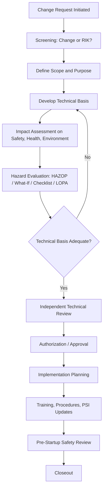
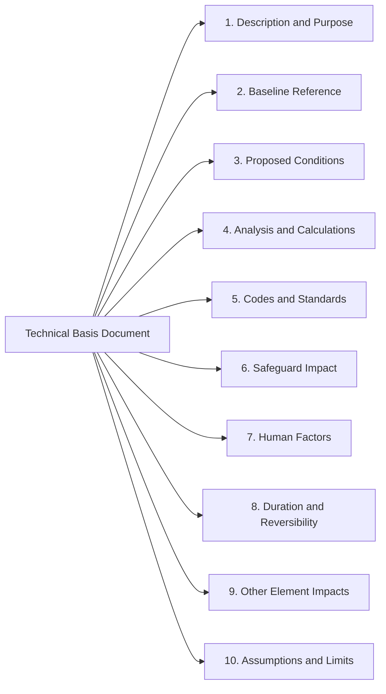

## Technical Basis for Change Evaluation

### Purpose and Regulatory Context

The **technical basis for change** is the documented engineering justification that explains what is being changed, why, how it will perform, and what it does to the hazards of the process. It is the analytical core of Management of Change (MOC). Screening decides *whether* a change needs review; the technical basis provides the substance that reviewers, approvers, and future auditors rely on to judge whether the change is safe to make.

The principal references are:

- **OSHA 29 CFR 1910.119(l)(2)**: requires that written MOC procedures ensure the following are addressed prior to any change: the **technical basis for the proposed change**, the **impact of the change on safety and health**, modifications to operating procedures, the **necessary time period for the change**, and **authorization requirements** for the proposed change.
- **EPA 40 CFR 68.75(b)**: the parallel Risk Management Program requirement, with the same five elements.
- **CCPS Risk Based Process Safety (RBPS)**, *Management of Change* element: expands on the content and rigor of change evaluation.
- **CCPS guidelines on MOC and Pre-Startup Safety Review**: practical guidance on documentation depth.
- **Consensus engineering codes and standards** (for example ASME pressure vessel and piping codes, API standards, NFPA codes, IEC 61511 for safety instrumented systems): define the design rules against which a technical basis is demonstrated.

**Key Points**

- The technical basis is a *document of reasoning*, not a form field. A sentence such as "improves throughput" is a purpose, not a technical basis.
- Its depth must be proportional to the risk and complexity of the change, but the *elements* that are considered do not change.
- The technical basis must be written so that a competent reviewer who was not involved in developing the change can verify the conclusion independently.
- Specific documentation requirements, sign-off levels, and depth criteria depend on jurisdiction and company standards and should be confirmed against the governing MOC procedure.

### Fundamental Definitions

| Term | Definition |
| --- | --- |
| **Technical Basis** | The documented engineering rationale, data, calculations, and assumptions that justify a proposed change and demonstrate it can be made safely |
| **Design Basis** | The original documented intent, limits, codes, and assumptions on which the process or equipment was designed |
| **Design Envelope** | The range of conditions (pressures, temperatures, flows, compositions) for which equipment and safeguards are designed to perform |
| **Safe Operating Limits (SOL)** | Limits within which the process is intended to operate, with defined consequences of deviation |
| **Process Safety Information (PSI)** | Written information on chemical hazards, process technology, and process equipment used as the reference for hazard analysis and change evaluation |
| **Impact Assessment** | Evaluation of how the change affects hazards, safeguards, human performance, and other parts of the facility |
| **Basis of Safety** | The set of safeguards and assumptions that keep identified hazard scenarios at tolerable risk |
| **Management System Element Impact** | The effect of a change on other elements such as mechanical integrity, training, emergency response, and PHA |
| **Independent Reviewer** | A competent person who did not originate the change and evaluates the technical basis objectively |

### Position of the Technical Basis in the MOC Workflow

### Core Components of a Technical Basis

A complete technical basis addresses a consistent set of elements. Not every element applies to every change, but each should be considered and the reason for excluding any element recorded.

#### 1. Description and Purpose of the Change

- A precise description of what is changing, including boundaries of the affected system
- The reason for the change (production, quality, cost, reliability, regulatory compliance, safety improvement, obsolescence)
- The alternatives considered, including the option of not making the change
- The relationship to any related or concurrent changes

#### 2. Baseline Reference (Design Basis and PSI)

- Identification of the governing PSI, P&IDs, process flow diagrams, equipment datasheets, and relief system basis
- Statement of the current design basis and safe operating limits
- Confirmation that the baseline documents are current and accurate, since a change evaluated against outdated documents inherits their errors

#### 3. Proposed Design or Operating Conditions

- New process conditions, materials, equipment specifications, control logic, or procedures
- Comparison to the baseline in a side-by-side format highlighting every difference
- Identification of whether the change stays within or exceeds the existing design envelope

#### 4. Engineering Analysis and Calculations

Analytical content depends on the type of change. Typical elements include:

- **Material and energy balances**: confirming equipment capacity and heat removal under new conditions
- **Hydraulic calculations**: line sizing, pressure drop, pump and compressor capacity
- **Relief and venting analysis**: relieving scenarios, required relief capacity, discharge handling, and flare or scrubber loading
- **Mechanical design verification**: pressure and temperature ratings, wall thickness, stress, supports, and fatigue considerations
- **Materials compatibility and corrosion assessment**: material selection for new chemicals, temperatures, or concentrations
- **Thermal stability and reactivity assessment**: for changes to chemistry, temperature, or composition
- **Electrical and hazardous-area classification review**: for changes to equipment or flammable materials
- **Control system and safety instrumented function analysis**: logic changes, alarm setpoints, response times, and reliability targets
- **Consequence modeling**: fire, explosion, and toxic release impact where the change affects release potential or siting

#### 5. Codes, Standards, and Good Engineering Practice

- Identification of the applicable codes and standards (recognized and generally accepted good engineering practice, RAGAGEP)
- Demonstration that the change conforms, or documentation and approval of any deviation with justification

#### 6. Impact on Safeguards and Layers of Protection

- Which existing safeguards are affected (relief devices, alarms, interlocks, SIFs, dikes, fire protection)
- Whether the effectiveness, independence, or reliability of any safeguard changes
- Whether new safeguards are introduced and how they are validated

#### 7. Human Factors and Operability

- Effect on operator workload, alarm load, and required response times
- Changes in task sequence, ergonomics, labeling, and the human-machine interface
- Training and competency demands
- Effect on maintenance access and safe isolation

#### 8. Time Period and Reversibility

- Whether the change is permanent or temporary, with the expiry date and restoration plan for temporary changes
- The implementation window and any sequencing constraints

#### 9. Effects on Other Management System Elements

- Mechanical integrity: new inspection, testing, and maintenance requirements
- Operating procedures and safe work practices
- Training and contractor management
- Emergency planning and response
- Process hazard analysis and revalidation schedule
- Environmental permits and regulatory notifications

#### 10. Assumptions, Limitations, and Uncertainty

- All assumptions explicitly stated, especially those the conclusion depends on
- Known data gaps and how they will be resolved before implementation
- Verification actions required after implementation, such as commissioning tests

### Matching Analytical Depth to Change Type

| Change Type | Typical Technical Basis Emphasis |
| --- | --- |
| Chemical or material change | Hazard properties, reactivity and compatibility, impurity effects, storage and handling, disposal |
| Throughput or condition change | Heat and material balance, relief capacity, equipment ratings, control margins, downstream capacity |
| Equipment modification | Mechanical design, materials, applicable codes, fabrication and inspection, failure mode changes |
| Instrumentation and control change | Logic verification, failure modes, response time, SIL considerations, alarm management, testing |
| Procedure change | Task analysis, consequences of deviation, human error potential, verification of sequence |
| Facility or siting change | Consequence modeling, occupied building risk, escape routes, emergency response access |
| Organizational change | Task and competency mapping, staffing analysis, alarm response workload, coverage of safety-critical roles |
| Temporary change | Same engineering rigor as permanent, plus compensating measures, expiry, and restoration plan |

### Scaling Rigor to Risk

Not every change warrants a multi-week engineering study, and treating every change identically wastes effort and encourages shortcuts. A common approach is to **tier** the depth of the technical basis.

| Tier (Illustrative) | Characteristics | Typical Technical Basis |
| --- | --- | --- |
| Low | Minor, well-understood, no change to safeguards or hazards beyond baseline | Short written rationale; checklist-based review |
| Moderate | Affects process conditions or equipment within familiar bounds | Documented calculations for affected parameters; structured What-If or checklist review |
| High | Significant change to hazards, safeguards, or design envelope | Full engineering package; formal hazard study such as HAZOP; independent technical review |
| Major | Substantial modification, new technology, or potential for severe consequences | Comprehensive design package; HAZOP and possibly LOPA or quantitative risk assessment; multidisciplinary review; senior authorization |

[Inference] The specific tier names, criteria, and required reviews vary between organizations; the table above is an illustrative structure rather than a regulatory requirement.

**Key Points**

- The tier should be assigned using explicit criteria, not the preference of the originator.
- Reclassification upward must be allowed at any point if new information reveals greater risk.
- Lower rigor does not mean omitting elements; it means addressing them briefly and documenting the reasoning.

### Relationship to Hazard Evaluation

The technical basis and the hazard evaluation are related but distinct.

| Aspect | Technical Basis | Hazard Evaluation |
| --- | --- | --- |
| Question answered | Will the change work as intended and meet design requirements? | What new or altered hazards does the change introduce, and are they adequately controlled? |
| Primary content | Design rationale, calculations, specifications | Scenario identification, causes, consequences, safeguards, recommendations |
| Typical methods | Engineering calculations, code compliance, simulation | HAZOP, What-If, checklist, FMEA, LOPA |
| Output | Justified design and documented assumptions | Risk ranking and action items |
| Interdependence | Supplies the data the hazard evaluation examines | Tests the assumptions the technical basis relies on |

The two are iterative. A hazard evaluation may reveal that an assumption in the technical basis is invalid, requiring the design to be revised and the basis updated.

### Data Quality and Verification

A technical basis is only as reliable as its inputs.

**Sources of data**

- Original design documents and vendor datasheets
- Process simulation and laboratory or pilot data
- Operating history and historian data
- Inspection and corrosion monitoring records
- Safety data sheets and published reactivity or thermochemical data
- Incident and near-miss records related to the equipment or process

**Verification practices**

- Confirm that documents are the **as-built, current** versions, verified by field walkdown where the change affects existing equipment.
- Confirm calculation inputs against measured or documented data rather than assumed values.
- Have calculations checked by a competent person other than the originator.
- Document software tools and versions used for simulations and analyses.
- Record data limitations, such as extrapolation beyond validated ranges.

### Independent Review and Authorization

**Independent technical review** provides a check against bias, blind spots, and errors.

- The reviewer should be competent in the relevant discipline and independent of the change's origination.
- Review scope should cover whether the basis is complete, the analysis is sound, the assumptions are reasonable, and the conclusions follow from the evidence.
- Multidisciplinary review (process, mechanical, electrical, instrumentation, operations, maintenance, safety) is typical for significant changes because interactions between disciplines are a frequent source of missed hazards.

**Authorization** requires that an appropriately empowered person approves the change based on the documented technical basis. Approval level typically scales with risk. Authorization should be given only when the technical basis is judged adequate, and it should be revocable if new information emerges.

### Documenting the Technical Basis

A consistent structure improves review quality and auditability.

**Documentation quality criteria**

- Traceable: each conclusion links to the data or calculation supporting it
- Retrievable: stored where operations, maintenance, auditors, and future projects can access it
- Versioned: revisions tracked, with the approved version identifiable
- Complete: attachments for calculations, datasheets, and analysis outputs included or referenced
- Understandable: written so a competent non-originator can follow it

### Illustration

<svg xmlns="http://www.w3.org/2000/svg" viewBox="0 0 760 360" width="760" height="360" role="img" aria-label="Technical basis inputs, analysis, and outputs">
<title>Technical Basis Inputs and Outputs (svg_diagram)</title>
<rect x="0" y="0" width="760" height="360" fill="#f7f9fb" stroke="#c5ced8" />
<text x="380" y="28" text-anchor="middle" font-family="Arial, sans-serif" font-size="16" font-weight="bold" fill="#1f2d3d">Technical Basis Inputs and Outputs (svg_diagram)</text>
<text x="120" y="62" text-anchor="middle" font-family="Arial, sans-serif" font-size="13" font-weight="bold" fill="#1f5f99">Inputs</text>
<rect x="30" y="76" width="180" height="40" rx="8" fill="#e8f1fa" stroke="#1f5f99" />
<text x="120" y="101" text-anchor="middle" font-family="Arial, sans-serif" font-size="12" fill="#1f2d3d">Design Basis and PSI</text>
<rect x="30" y="130" width="180" height="40" rx="8" fill="#e8f1fa" stroke="#1f5f99" />
<text x="120" y="155" text-anchor="middle" font-family="Arial, sans-serif" font-size="12" fill="#1f2d3d">Proposed Change Description</text>
<rect x="30" y="184" width="180" height="40" rx="8" fill="#e8f1fa" stroke="#1f5f99" />
<text x="120" y="209" text-anchor="middle" font-family="Arial, sans-serif" font-size="12" fill="#1f2d3d">Operating and Test Data</text>
<rect x="30" y="238" width="180" height="40" rx="8" fill="#e8f1fa" stroke="#1f5f99" />
<text x="120" y="263" text-anchor="middle" font-family="Arial, sans-serif" font-size="12" fill="#1f2d3d">Codes and Standards</text>
<rect x="290" y="120" width="180" height="120" rx="12" fill="#1f5f99" stroke="#123b61" />
<text x="380" y="168" text-anchor="middle" font-family="Arial, sans-serif" font-size="14" fill="#ffffff">Engineering Analysis</text>
<text x="380" y="190" text-anchor="middle" font-family="Arial, sans-serif" font-size="12" fill="#ffffff">Calculations, Relief, Materials,</text>
<text x="380" y="208" text-anchor="middle" font-family="Arial, sans-serif" font-size="12" fill="#ffffff">Controls, Human Factors</text>
<text x="640" y="62" text-anchor="middle" font-family="Arial, sans-serif" font-size="13" font-weight="bold" fill="#2e7d32">Outputs</text>
<rect x="550" y="76" width="180" height="40" rx="8" fill="#e9f5ea" stroke="#2e7d32" />
<text x="640" y="101" text-anchor="middle" font-family="Arial, sans-serif" font-size="12" fill="#1f2d3d">Justified Design and Limits</text>
<rect x="550" y="130" width="180" height="40" rx="8" fill="#e9f5ea" stroke="#2e7d32" />
<text x="640" y="155" text-anchor="middle" font-family="Arial, sans-serif" font-size="12" fill="#1f2d3d">Safeguard Impact Statement</text>
<rect x="550" y="184" width="180" height="40" rx="8" fill="#e9f5ea" stroke="#2e7d32" />
<text x="640" y="209" text-anchor="middle" font-family="Arial, sans-serif" font-size="12" fill="#1f2d3d">Assumptions and Verification</text>
<rect x="550" y="238" width="180" height="40" rx="8" fill="#e9f5ea" stroke="#2e7d32" />
<text x="640" y="263" text-anchor="middle" font-family="Arial, sans-serif" font-size="12" fill="#1f2d3d">Input to Hazard Evaluation</text>
<line x1="210" y1="96" x2="290" y2="150" stroke="#1f5f99" stroke-width="1.5" />
<line x1="210" y1="150" x2="290" y2="170" stroke="#1f5f99" stroke-width="1.5" />
<line x1="210" y1="204" x2="290" y2="195" stroke="#1f5f99" stroke-width="1.5" />
<line x1="210" y1="258" x2="290" y2="220" stroke="#1f5f99" stroke-width="1.5" />
<line x1="470" y1="150" x2="550" y2="96" stroke="#2e7d32" stroke-width="1.5" />
<line x1="470" y1="170" x2="550" y2="150" stroke="#2e7d32" stroke-width="1.5" />
<line x1="470" y1="195" x2="550" y2="204" stroke="#2e7d32" stroke-width="1.5" />
<line x1="470" y1="220" x2="550" y2="258" stroke="#2e7d32" stroke-width="1.5" />
<text x="380" y="330" text-anchor="middle" font-family="Arial, sans-serif" font-size="12" fill="#b32d2d">Failure mode: analysis performed against outdated or unverified baseline documents</text>
</svg>

### Worked Example: Throughput Increase on a Reactor System

**Scenario**

A plant proposes increasing the feed rate to an exothermic batch-fed reactor system by 15% to meet demand. No new equipment is to be installed.

**Technical basis development**

1. **Description and purpose**: Increase reactor feed rate from the current design rate to 115% for higher production. Alternatives considered: adding a second train (rejected on cost and lead time) and maintaining the current rate.
2. **Baseline reference**: Current PSI, reactor datasheet, relief valve sizing basis, cooling-water design duty, and existing PHA. A walkdown confirms that the installed relief valve and cooling coil match the documents.
3. **Proposed conditions**: Feed rate at 115%; all other parameters unchanged in the proposal.
4. **Analysis**
   The heat generated scales with feed rate. If the design heat-removal duty is $Q_{max}$ and the current heat generation is $Q_{gen}$, the heat-removal margin is:

   $$M = \frac{Q_{max} - Q_{gen}}{Q_{max}} \times 100\%$$

   For the proposed rate, $Q_{gen}' = 1.15\,Q_{gen}$. The analysis must confirm that $Q_{gen}' \le Q_{max}$ with acceptable margin under worst-case cooling-water temperature. If the current margin were, for example, 10%, then $1.15\,Q_{gen}$ would exceed $Q_{max}$ (since $1.15 \times 0.90 = 1.035$ of design duty), showing that the change as proposed exceeds heat-removal capacity. [Inference] The 10% margin here is a hypothetical value chosen only to illustrate the calculation.
   Additional analyses: relief valve capacity under the higher-rate runaway scenario; reactor residence time and conversion; downstream separation and storage capacity; cooling-water supply adequacy; agitator and pump capacity.
5. **Codes and standards**: Verify relief sizing against the applicable relief design standards and the vessel's pressure code rating.
6. **Safeguard impact**: Higher heat generation shortens the time from loss of cooling to a hazardous temperature, which reduces operator response time. The high-temperature alarm and trip may need setpoint and response-time review.
7. **Human factors**: Reduced operator response time and increased alarm activity are evaluated.
8. **Duration**: Permanent change; PSI and procedures to be updated.
9. **Other element impacts**: Mechanical integrity inspection frequency for the cooling coil; updated operating procedures and training; PHA revalidation input.
10. **Assumptions and limits**: Cooling-water temperature assumed at design maximum; feed composition assumed unchanged; verification by controlled ramp-up with monitoring.

**Conclusion of the example**

The analysis may show the proposal cannot be approved as written. Outcomes could include limiting the increase to a lower percentage, upgrading the cooling system or relief device, or adding a faster-acting trip. The technical basis is what makes this determination visible and defensible.

### Common Deficiencies in Technical Basis Documents

- **Purpose masquerading as basis**: stating the business reason without engineering justification
- **Outdated baseline**: evaluating against drawings or datasheets that do not match the field
- **Unstated assumptions**: conclusions depending on conditions never written down
- **Selective analysis**: analyzing only the parameter the originator focused on, missing knock-on effects
- **No consideration of upset or failure conditions**: showing normal operation works but not abnormal cases
- **Missing safeguard impact**: not examining how the change affects alarms, trips, and relief
- **Originator-only review**: no independent check
- **Copy-forward documents**: reusing a previous technical basis with minor edits without re-verifying applicability
- **Ignoring cumulative change**: not considering earlier modifications that erode margins
- **Vendor assertion accepted uncritically**: relying on supplier claims without verifying against process conditions
- **No verification plan**: no defined post-implementation checks to confirm predicted performance

### Post-Implementation Verification

The technical basis makes predictions; verification confirms them.

- Define **acceptance criteria** before implementation, such as temperature profiles, pressure drops, response times, and alarm functionality.
- Perform commissioning tests and staged start-up, especially for changes to conditions or throughput.
- Compare actual performance against predicted values and investigate deviations.
- Update the technical basis and PSI if actual behavior differs from the assumptions.
- Feed lessons into the PHA revalidation and into the MOC program improvement process.

### Governance and Program Considerations

- Define in the MOC procedure the **minimum content** of a technical basis and the criteria for tiering.
- Define **roles and competencies** for originators, reviewers, and approvers.
- Provide templates that prompt consideration of every element, while permitting brief responses for non-applicable items.
- Retain technical basis documents for the life of the facility or as required by applicable regulations, since they document the design rationale for future changes.
- Audit a sample of completed MOCs periodically for the quality of the technical basis, not only for the presence of signatures.

**Conclusion**

The technical basis is the engineering foundation of Management of Change. It converts a proposed modification from an intention into a justified, reviewable, and verifiable design decision by anchoring it to the design basis, demonstrating conformance with codes and good practice, quantifying the effects on process conditions and safeguards, and stating every assumption. Its rigor should scale with the risk of the change, its inputs should be verified against the as-built facility, and its conclusions should be independently reviewed and later confirmed through post-implementation verification. The exact content requirements, depth criteria, and approval levels depend on the applicable regulations and each facility's own MOC procedure and should be confirmed against those documents.

### Related Topics

- Impact Assessment on Safety, Health, and Environment
- Hazard Evaluation of Proposed Changes (HAZOP, What-If, LOPA)
- Process Safety Information and Design Basis Management
- Relief System Design Basis Verification
- Safety Instrumented Function Changes and SIL Verification
- Independent Technical Review and Multidisciplinary Teams
- Authorization and Approval Levels in MOC
- Updating PSI, P&IDs, and Operating Procedures After Change
- Pre-Startup Safety Review and Post-Implementation Verification
- MOC Documentation, Records, and Audit
- Case Studies: Change Evaluations That Failed to Identify Hazards